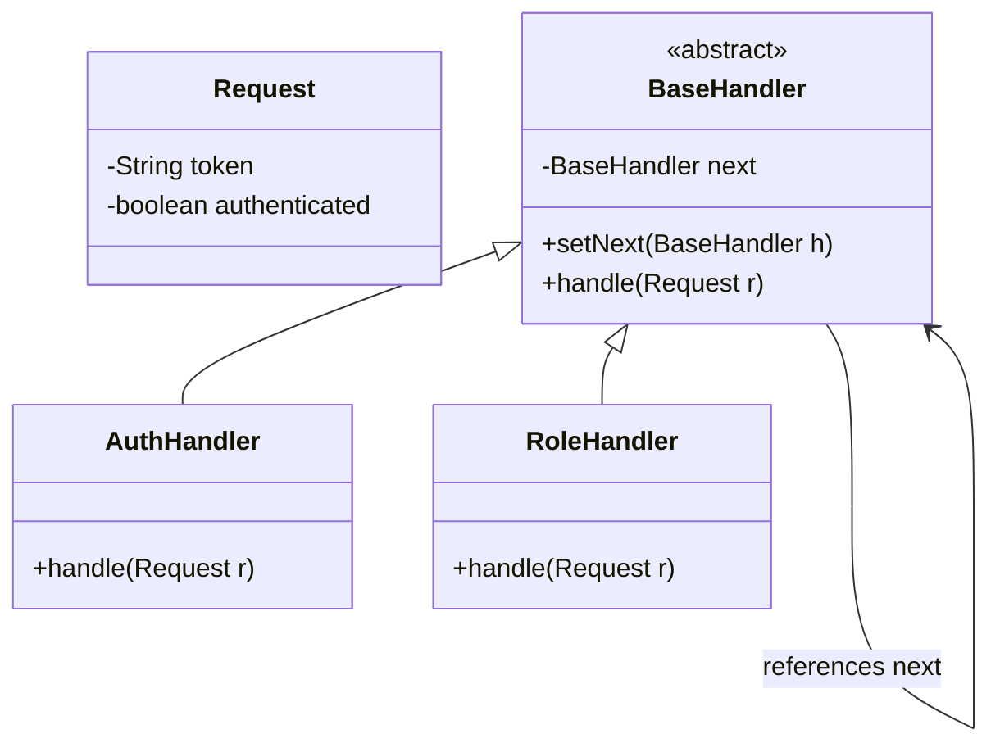
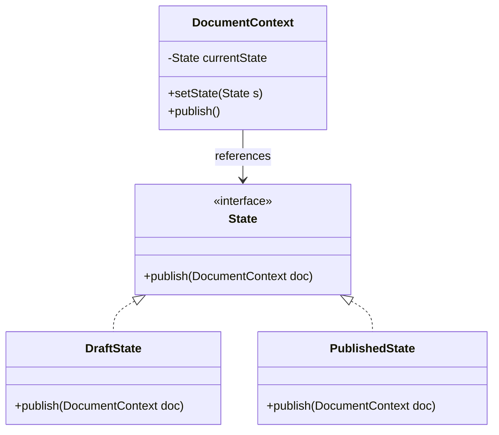
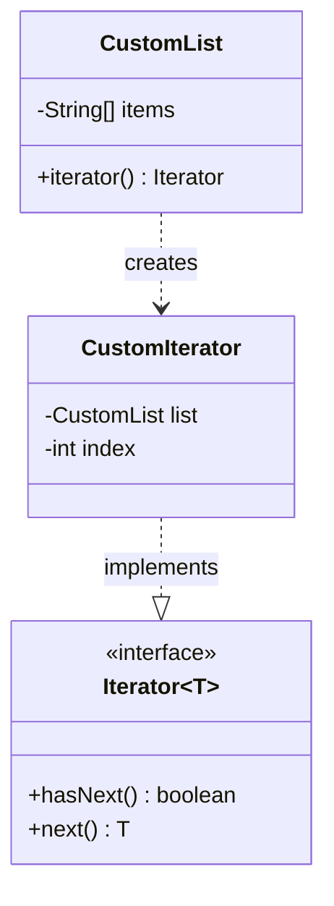

# Module 05: Behavioral Patterns (Part 2)

This module continues the analysis of behavioral delegation and traversal patterns. It explores the Chain of Responsibility, State, and Iterator patterns, focusing on building decoupled processing pipelines, context-dependent state transitions, and clean collection traversal abstractions.

---

## 1. Chain of Responsibility Pattern

### Academic Context (Professor's Lecture)
In software systems, a request often requires multiple verification and transformation steps before it reaches its final execution handler (e.g. checking authentication, validating rate limits, sanitizing payloads, and checking permissions). 
If you write all these checks sequentially inside a single class, you create a bloated, monolithic structure that is hard to maintain or modify.

The Chain of Responsibility pattern solves this by **allowing you to pass requests along a chain of handlers. Upon receiving a request, each handler decides either to process the request or to pass it to the next handler in the chain**.

### Why Use
* **Single Responsibility Principle**: Each handler class focuses on a single check or operation.
* **Open/Closed Principle**: You can insert, reorder, or remove handlers in the chain at runtime without modifying client execution logic.

### How to Use (Java Demo Code)

#### Mermaid Class Diagram


#### Production-Grade Java 21 Implementation
This implementation uses record classes to pass request metadata along a processing pipeline.

```java
package com.masterclass.designpatterns.behavioral.chainofresponsibility;

public record HttpRequest(String route, String token, String userRole) {}
```

```java
package com.masterclass.designpatterns.behavioral.chainofresponsibility;

/**
 * Base Handler abstract class.
 */
public abstract class RequestHandler {
    private RequestHandler nextHandler;

    public final RequestHandler setNext(RequestHandler nextHandler) {
        this.nextHandler = nextHandler;
        return nextHandler; // Enables builder chaining
    }

    public void handle(HttpRequest request) {
        if (nextHandler != null) {
            nextHandler.handle(request);
        }
    }
}
```

```java
package com.masterclass.designpatterns.behavioral.chainofresponsibility;

public final class AuthenticationHandler extends RequestHandler {
    @Override
    public void handle(HttpRequest request) {
        System.out.println("Chain: Verifying authentication token...");
        if (request.token() == null || !request.token().equals("VALID_JWT_TOKEN")) {
            throw new SecurityException("Authentication Failed: Invalid token.");
        }
        // Proceed to next handler in the chain
        super.handle(request);
    }
}

public final class AuthorizationHandler extends RequestHandler {
    @Override
    public void handle(HttpRequest request) {
        System.out.println("Chain: Verifying user role permissions...");
        if (!"ADMIN".equals(request.userRole())) {
            throw new SecurityException("Authorization Failed: Insufficient privileges.");
        }
        super.handle(request);
    }
}
```

### When to Use
* A request must undergo multiple sequential checks or modifications before processing.
* You need to configure the order of execution checks dynamically at runtime.

---

## 2. State Pattern

### Academic Context (Professor's Lecture)
In workflow engines (like order checkouts or ticket lifecycles), an object changes behavior based on its internal state. 
For example, a `Document` behaves differently in `Draft`, `Moderation`, or `Published` states. If you write this logic using conditional `switch` statements inside the main class, adding a new state or modifying a transition requires rewriting the entire class.

The State pattern solves this by **allowing an object to alter its behavior when its internal state changes. The object will appear to change its class**.

### Why Use
* **Eliminate State Conditionals**: Replaces complex `switch(state)` structures with clean polymorphism.
* **Encapsulate State Rules**: Moves state-specific behavior and transition logic into dedicated state classes.

### How to Use (Java Demo Code)

#### Mermaid Class Diagram


#### Production-Grade Java 21 Implementation
```java
package com.masterclass.designpatterns.behavioral.state;

public interface DocumentState {
    void handlePublish(DocumentContext context);
    void handleRollback(DocumentContext context);
}
```

```java
package com.masterclass.designpatterns.behavioral.state;

/**
 * State Context managing the active state reference.
 */
public final class DocumentContext {
    private DocumentState state;

    public DocumentContext() {
        // Initial state default
        this.state = new DraftState();
    }

    public void setState(DocumentState state) {
        this.state = state;
    }

    public void publish() {
        state.handlePublish(this);
    }

    public void rollback() {
        state.handleRollback(this);
    }
}
```

```java
package com.masterclass.designpatterns.behavioral.state;

public final class DraftState implements DocumentState {
    @Override
    public void handlePublish(DocumentContext context) {
        System.out.println("Draft: Submitting document to moderation queue.");
        context.setState(new ModerationState());
    }

    @Override
    public void handleRollback(DocumentContext context) {
        System.out.println("Draft: Document is already a draft. Cannot rollback.");
    }
}

public final class ModerationState implements DocumentState {
    @Override
    public void handlePublish(DocumentContext context) {
        System.out.println("Moderation: Document approved! Moving to Published state.");
        context.setState(new PublishedState());
    }

    @Override
    public void handleRollback(DocumentContext context) {
        System.out.println("Moderation: Document rejected. Rolling back to Draft.");
        context.setState(new DraftState());
    }
}

public final class PublishedState implements DocumentState {
    @Override
    public void handlePublish(DocumentContext context) {
        System.out.println("Published: Document is already published. No action.");
    }

    @Override
    public void handleRollback(DocumentContext context) {
        System.out.println("Published: Archiving document. Moving back to Draft.");
        context.setState(new DraftState());
    }
}
```

### When to Use
* An object's behavior depends on its state, and its state changes dynamically at runtime.
* You need to manage complex state transition rules and prevent invalid transitions.

---

## 3. Iterator Pattern

### Academic Context (Professor's Lecture)
Collections (lists, trees, graphs) store elements differently. If client code needs to traverse these elements directly, it must know the internal storage structure of the collection. This couples the client to the collection, making it difficult to change the underlying storage (e.g. switching from a list to a binary tree).

The Iterator pattern solves this by **providing a way to access the elements of an aggregate object sequentially without exposing its underlying representation**.

### Why Use
* **Encapsulation**: Hides collection storage details (arrays, lists, trees) from client traversal code.
* **Support Multiple Traversals**: Allows running multiple independent traversals on the same collection concurrently.

### How to Use (Java Demo Code)

#### Mermaid Class Diagram


#### Production-Grade Java 21 Implementation
This implementation uses Java's built-in `java.util.Iterator` interface to support modern **for-each loops**.

```java
package com.masterclass.designpatterns.behavioral.iterator;

import java.util.Iterator;
import java.util.NoSuchElementException;

/**
 * Custom Iterable Collection storing values in a fixed-size array.
 */
public final class ProductCatalog implements Iterable<String> {
    private final String[] products = new String[3];
    private int size = 0;

    public void addProduct(String name) {
        if (size < products.length) {
            products[size++] = name;
        }
    }

    @Override
    public Iterator<String> iterator() {
        return new ProductIterator();
    }

    /**
     * Inner Class Iterator has direct access to the private catalog array.
     */
    private class ProductIterator implements Iterator<String> {
        private int currentIndex = 0;

        @Override
        public boolean hasNext() {
            return currentIndex < size;
        }

        @Override
        public String next() {
            if (!hasNext()) {
                throw new NoSuchElementException();
            }
            return products[currentIndex++];
        }
    }
}
```

### When to Use
* You need to traverse elements inside custom collection structures (trees, hash graphs) uniformly.
* You want to provide multiple traversal strategies (e.g. depth-first vs breadth-first tree traversals).

---

## 4. Hands-on Mini-Challenge: Transaction Ingestion pipeline

### Scenario
You are building the transaction processing gateway for a bank. The gateway receives batches of transactions. 
To process a batch, the system must:
1. Iterate over the transactions in a custom queue using the **Iterator** pattern.
2. Route each transaction through validation checks (Fraud check, Account Check) using the **Chain of Responsibility** pattern.
3. Manage the batch state (Initialized, Processing, Completed) using the **State** pattern.

### Step 1: Implement Chain of Responsibility Handlers
```java
package com.masterclass.designpatterns.miniproject.pipeline;

public record Transaction(String id, double amount, boolean flagged) {}
```

```java
package com.masterclass.designpatterns.miniproject.pipeline;

public abstract class TxHandler {
    private TxHandler next;

    public final TxHandler setNext(TxHandler next) {
        this.next = next;
        return next;
    }

    public void process(Transaction tx) {
        if (next != null) {
            next.process(tx);
        }
    }
}

public final class FraudCheckHandler extends TxHandler {
    @Override
    public void process(Transaction tx) {
        System.out.println("Processing: Running anti-fraud check on " + tx.id());
        if (tx.flagged()) {
            throw new IllegalArgumentException("Transaction rejected: Suspicious activity flagged.");
        }
        super.process(tx);
    }
}

public final class BalanceVerifyHandler extends TxHandler {
    @Override
    public void process(Transaction tx) {
        System.out.println("Processing: Running balance verification checks on " + tx.id());
        if (tx.amount() <= 0) {
            throw new IllegalArgumentException("Transaction rejected: Amount must be positive.");
        }
        super.process(tx);
    }
}
```

### Step 2: Implement Batch State Machine (State)
```java
package com.masterclass.designpatterns.miniproject.pipeline;

public interface BatchState {
    void handleProcess(BatchContext context, ListTxCollection collection, TxHandler handler);
}
```

```java
package com.masterclass.designpatterns.miniproject.pipeline;

public final class BatchContext {
    private BatchState state;

    public BatchContext() {
        this.state = new PendingState();
    }

    public void setState(BatchState state) {
        this.state = state;
    }

    public void execute(ListTxCollection collection, TxHandler handler) {
        state.handleProcess(this, collection, handler);
    }
}
```

```java
package com.masterclass.designpatterns.miniproject.pipeline;

import java.util.Iterator;

public final class PendingState implements BatchState {
    @Override
    public void handleProcess(BatchContext context, ListTxCollection collection, TxHandler handler) {
        System.out.println("State: Processing initialized. Routing transaction collection.");
        context.setState(new ProcessingState());
        context.execute(collection, handler);
    }
}

public final class ProcessingState implements BatchState {
    @Override
    public void handleProcess(BatchContext context, ListTxCollection collection, TxHandler handler) {
        Iterator<Transaction> iterator = collection.iterator();
        while (iterator.hasNext()) {
            Transaction tx = iterator.next();
            try {
                handler.process(tx);
            } catch (Exception e) {
                System.err.println("Fatal Batch Error: " + e.getMessage());
                context.setState(new FailedState());
                return;
            }
        }
        context.setState(new CompletedState());
    }
}

class FailedState implements BatchState {
    @Override public void handleProcess(BatchContext context, ListTxCollection col, TxHandler h) {
        System.out.println("State Status: Failed.");
    }
}
class CompletedState implements BatchState {
    @Override public void handleProcess(BatchContext context, ListTxCollection col, TxHandler h) {
        System.out.println("State Status: Successfully Completed.");
    }
}
```

### Step 3: Implement Collection (Iterator)
```java
package com.masterclass.designpatterns.miniproject.pipeline;

import java.util.Iterator;
import java.util.List;

public final class ListTxCollection implements Iterable<Transaction> {
    private final List<Transaction> transactions;

    public ListTxCollection(List<Transaction> transactions) {
        this.transactions = transactions;
    }

    @Override
    public Iterator<Transaction> iterator() {
        return transactions.iterator();
    }
}
```

### Step 4: Verify the Pipeline execution
```java
package com.masterclass.designpatterns.miniproject;

import com.masterclass.designpatterns.miniproject.pipeline.*;
import java.util.List;

public class BehavioralPart2Main {
    public static void main(String[] args) {
        // 1. Build Verification Chain
        TxHandler chain = new FraudCheckHandler();
        chain.setNext(new BalanceVerifyHandler());

        // 2. Build Transaction Collection (Iterator target)
        ListTxCollection batch = new ListTxCollection(List.of(
                new Transaction("tx-1", 1500.00, false),
                new Transaction("tx-2", 20.50, false)
        ));

        // 3. Process Batch through State Machine
        BatchContext context = new BatchContext();
        context.execute(batch, chain);

        // Test failure trigger
        System.out.println("\nExecuting failing batch test...");
        ListTxCollection failingBatch = new ListTxCollection(List.of(
                new Transaction("tx-3", -50.00, false)
        ));
        BatchContext context2 = new BatchContext();
        context2.execute(failingBatch, chain);
    }
}
```
This challenge demonstrates how Chain of Responsibility, State, and Iterator patterns coordinate processing and state transitions.
