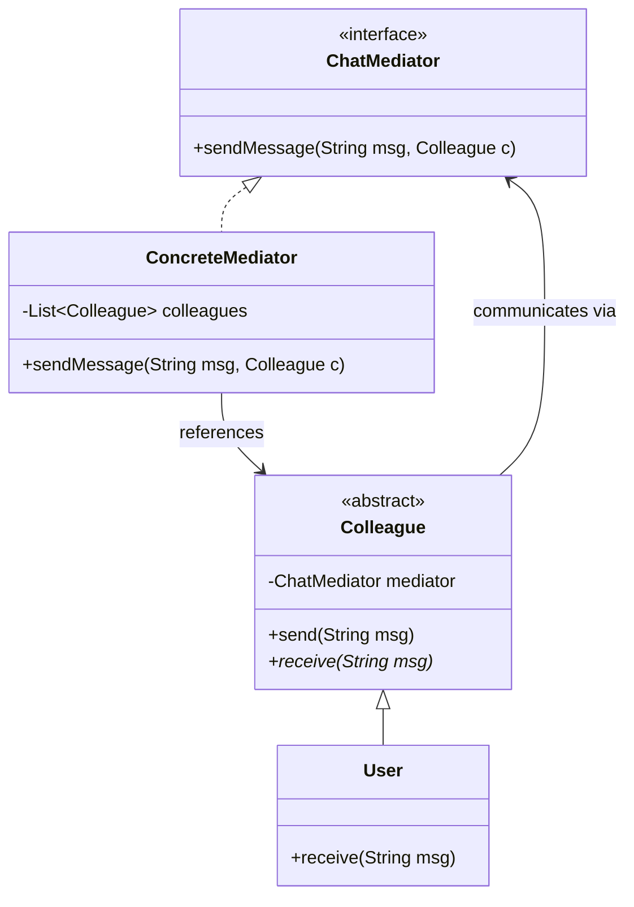
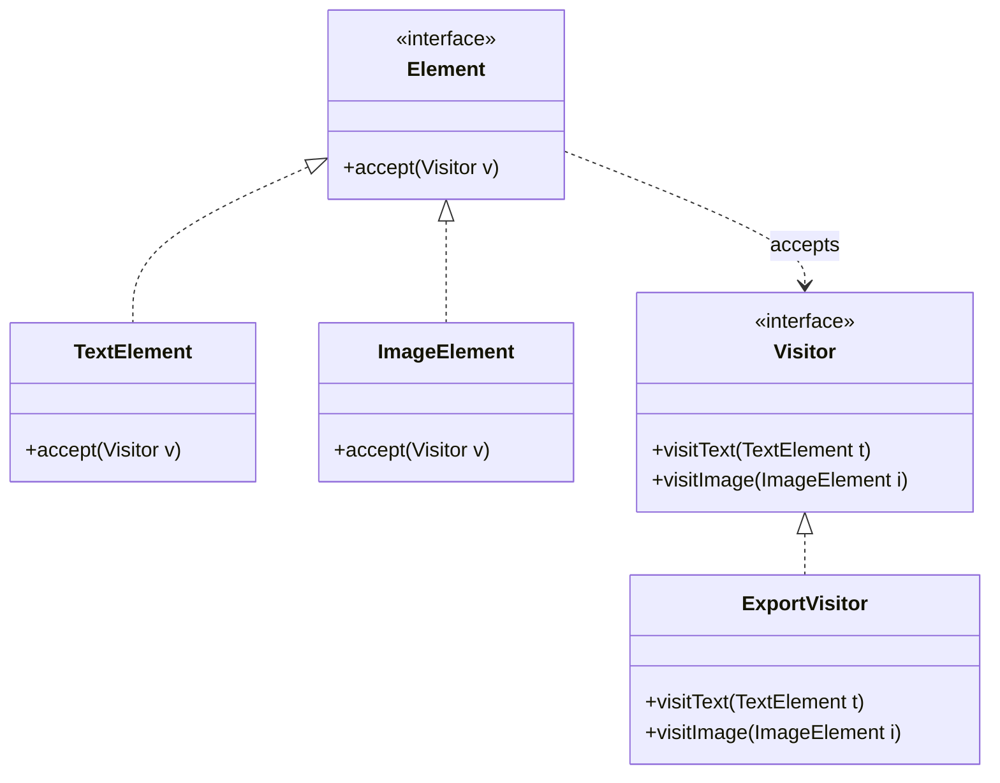
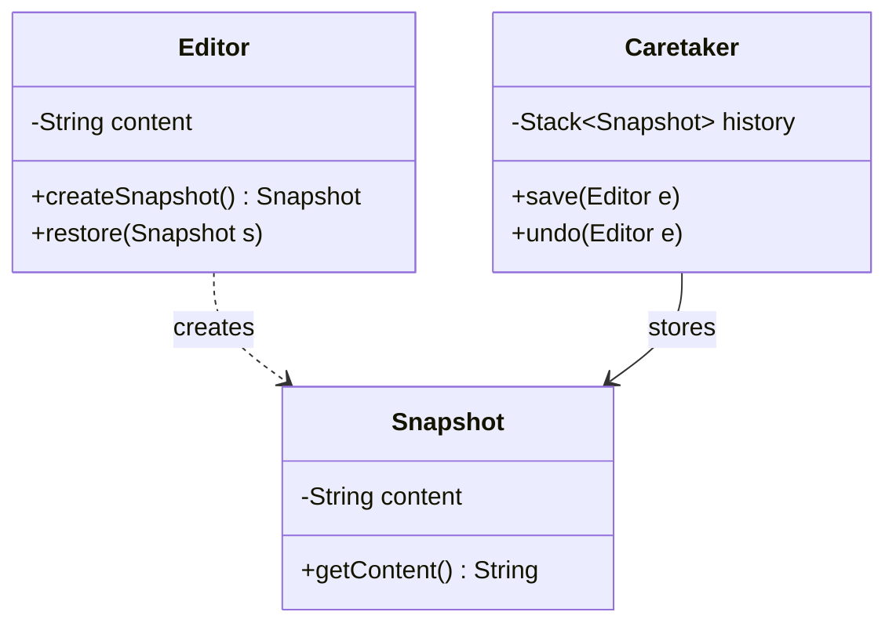

# Module 06: Behavioral Patterns (Part 3)

This module completes the analysis of behavioral design patterns. It covers the Mediator, Visitor, and Memento patterns, focusing on centralizing communication between coupled components, implementing double-dispatch operations, and capturing restore points without exposing object encapsulation.

---

## 1. Mediator Pattern

### Academic Context (Professor's Lecture)
In complex systems, objects often interact with many other objects. If every object maintains direct references to its collaborators, the system becomes a tightly coupled web. 
Modifying one class can trigger a cascade of changes across the entire system.

The Mediator pattern solves this by **defining an object that encapsulates how a set of objects interact, promoting loose coupling by keeping objects from referring to each other explicitly, and letting you vary their interaction independently**.

### Why Use
* **Decoupling**: Replaces $N \times N$ direct connections between components with a clean $N \to 1$ hub structure.
* **Centralization**: Simplifies system control flows by managing interaction logic in a single coordinator class.

### How to Use (Java Demo Code)

#### Mermaid Class Diagram


#### Production-Grade Java 21 Implementation
This implementation models a chat room where users send messages through a central mediator instead of referencing each other directly.

```java
package com.masterclass.designpatterns.behavioral.mediator;

public interface ChatMediator {
    void registerUser(User user);
    void sendMessage(String message, User sender);
}
```

```java
package com.masterclass.designpatterns.behavioral.mediator;

public abstract class User {
    protected final ChatMediator mediator;
    protected final String name;

    protected User(ChatMediator mediator, String name) {
        this.mediator = mediator;
        this.name = name;
    }

    public abstract void send(String message);
    public abstract void receive(String message, String senderName);
}
```

```java
package com.masterclass.designpatterns.behavioral.mediator;

import java.util.ArrayList;
import java.util.List;

/**
 * Concrete Mediator orchestrates routing.
 */
public final class ChatRoom implements ChatMediator {
    private final List<User> users = new ArrayList<>();

    @Override
    public void registerUser(User user) {
        users.add(user);
    }

    @Override
    public void sendMessage(String message, User sender) {
        for (User user : users) {
            // Do not send the message back to the sender
            if (user != sender) {
                user.receive(message, sender.name);
            }
        }
    }
}
```

```java
package com.masterclass.designpatterns.behavioral.mediator;

public final class ChatUser extends User {

    public ChatUser(ChatMediator mediator, String name) {
        super(mediator, name);
    }

    @Override
    public void send(String message) {
        System.out.println(name + " sends: " + message);
        mediator.sendMessage(message, this);
    }

    @Override
    public void receive(String message, String senderName) {
        System.out.println(name + " receives from " + senderName + ": " + message);
    }
}
```

### When to Use
* A set of objects communicate in complex, well-defined but unstructured ways.
* You want to customize behavior that is distributed across multiple classes without subclassing each one.

---

## 2. Visitor Pattern

### Academic Context (Professor's Lecture)
Suppose you have a complex object structure (e.g. an abstract syntax tree or a document containing text, images, and tables). You need to add operations to this structure, like exporting it to HTML or checking spelling. 
If you write these methods directly inside the element classes, you violate the **Single Responsibility Principle** and bloat your domain model with display logic.

The Visitor pattern solves this by **representing an operation to be performed on the elements of an object structure, letting you define a new operation without changing the classes of the elements on which it operates**.

### Why Use
* **Double Dispatch**: Resolves polymorphic operations across two class hierarchies at runtime.
* **Separation of Concerns**: Separates clean data structures from dynamic algorithms and behaviors.

### How to Use (Java Demo Code)

#### Mermaid Class Diagram


#### Production-Grade Java 21 Implementation
This implementation uses Java **Pattern Matching for switch** (introduced in Java 21) to implement the Visitor pattern cleanly, bypassing double-dispatch boilerplate if desired. 

```java
package com.masterclass.designpatterns.behavioral.visitor;

// Sealed interface enforces compilation checks on elements
public sealed interface DocumentElement permits TextElement, ImageElement {
    void accept(ElementVisitor visitor);
}
```

```java
package com.masterclass.designpatterns.behavioral.visitor;

public interface ElementVisitor {
    void visit(TextElement text);
    void visit(ImageElement image);
}
```

```java
package com.masterclass.designpatterns.behavioral.visitor;

public final class TextElement implements DocumentElement {
    private final String text;

    public TextElement(String text) { this.text = text; }
    public String getText() { return text; }

    @Override
    public void accept(ElementVisitor visitor) {
        visitor.visit(this);
    }
}

public final class ImageElement implements DocumentElement {
    private final String imagePath;

    public ImageElement(String imagePath) { this.imagePath = imagePath; }
    public String getImagePath() { return imagePath; }

    @Override
    public void accept(ElementVisitor visitor) {
        visitor.visit(this);
    }
}
```

```java
package com.masterclass.designpatterns.behavioral.visitor;

public final class HtmlExporterVisitor implements ElementVisitor {
    @Override
    public void visit(TextElement text) {
        System.out.println("<p>" + text.getText() + "</p>");
    }

    @Override
    public void visit(ImageElement image) {
        System.out.println("");
    }
}
```

### When to Use
* An object structure contains many classes with different interfaces, and you need to perform operations on them that depend on their concrete classes.
* You need to run unrelated operations across an object structure, and you want to avoid polluting the classes with these operations.

---

## 3. Memento Pattern

### Academic Context (Professor's Lecture)
Applications often need to support "undo" actions or roll back state to a previous savepoint. 
If the application captures and stores the object's internal properties directly, it violates the **Principle of Encapsulation**. The undo manager must understand the internal state structure of the object, which creates tight coupling.

The Memento pattern solves this by **capturing and externalizing an object's internal state without violating encapsulation, allowing the object to be restored to this state later**.

### Why Use
* **Encapsulation Safety**: Keeps state snapshot properties completely private to the object that created them.
* **Simplified Caretaker**: Simplifies the undo manager code; it only needs to store opaque memento tokens without understanding how to restore them.

### How to Use (Java Demo Code)

#### Mermaid Class Diagram


#### Production-Grade Java 21 Implementation
This implementation uses Java **records** to implement the Memento as an immutable data carrier.

```java
package com.masterclass.designpatterns.behavioral.memento;

/**
 * The Memento: An immutable record class that stores the state snapshot.
 * Package-private access protects encapsulation.
 */
record EditorMemento(String content) {}
```

```java
package com.masterclass.designpatterns.behavioral.memento;

/**
 * The Originator: The class whose state we want to capture and restore.
 */
public final class TextEditor {
    private String content = "";

    public void type(String text) {
        this.content += text;
    }

    public String getContent() {
        return content;
    }

    /**
     * Captures the current state in a Memento.
     */
    public EditorMemento save() {
        return new EditorMemento(content);
    }

    /**
     * Restores state from a Memento.
     */
    public void restore(Object memento) {
        if (memento instanceof EditorMemento state) {
            this.content = state.content();
        } else {
            throw new IllegalArgumentException("Invalid memento object.");
        }
    }
}
```

```java
package com.masterclass.designpatterns.behavioral.memento;

import java.util.Stack;

/**
 * The Caretaker: Manages the memento history stack.
 */
public final class HistoryManager {
    private final Stack<Object> undoStack = new Stack<>();

    public void saveState(TextEditor editor) {
        undoStack.push(editor.save());
    }

    public void rollback(TextEditor editor) {
        if (!undoStack.isEmpty()) {
            editor.restore(undoStack.pop());
        } else {
            System.out.println("No history states left to rollback.");
        }
    }
}
```

### When to Use
* Implementing undo/redo mechanics, transaction rollbacks, or checkpoint recovery systems.
* Capturing state snapshots where direct access to object properties would violate encapsulation.

---

## 4. Hands-on Mini-Challenge: Collaborative Rich Text Document Engine

### Scenario
You are building the core backend engine for a collaborative document editor. 
To support collaborative operations:
1. Orchestrate user join events, focus updates, and editing locks through a central coordinator using the **Mediator** pattern.
2. Track document changes, and support restoring previous edits using the **Memento** pattern.
3. Apply export operations (HTML and PDF) to document elements (text, tables) using the **Visitor** pattern.

### Step 1: Implement Visitor Exporters
```java
package com.masterclass.designpatterns.miniproject.editor;

public interface DocVisitor {
    void visitText(TextPart text);
    void visitTable(TablePart table);
}

public interface DocElement {
    void accept(DocVisitor visitor);
}

public final class TextPart implements DocElement {
    private final String text;
    public TextPart(String text) { this.text = text; }
    public String getText() { return text; }
    @Override public void accept(DocVisitor visitor) { visitor.visitText(this); }
}

public final class TablePart implements DocElement {
    private final int rows;
    public TablePart(int rows) { this.rows = rows; }
    public int getRows() { return rows; }
    @Override public void accept(DocVisitor visitor) { visitor.visitTable(this); }
}
```

### Step 2: Implement Memento Records
```java
package com.masterclass.designpatterns.miniproject.editor;

import java.util.ArrayList;
import java.util.List;

// Memento class
public record DocumentMemento(List<DocElement> elementsState) {}

// Originator
public final class DocumentModel {
    private List<DocElement> elements = new ArrayList<>();

    public void addElement(DocElement elem) { elements.add(elem); }
    public List<DocElement> getElements() { return elements; }

    public DocumentMemento save() {
        return new DocumentMemento(new ArrayList<>(elements));
    }

    public void restore(DocumentMemento memento) {
        this.elements = new ArrayList<>(memento.elementsState());
    }
}
```

### Step 3: Implement Collaborative Mediator
```java
package com.masterclass.designpatterns.miniproject.editor;

import java.util.ArrayList;
import java.util.List;

public final class CollaborationMediator {
    private final List<CollaboratorUser> users = new ArrayList<>();

    public void join(CollaboratorUser user) { users.add(user); }

    public void broadcastEdit(String changeMsg, CollaboratorUser editor) {
        for (CollaboratorUser user : users) {
            if (user != editor) {
                user.receiveNotice(changeMsg);
            }
        }
    }
}

public final class CollaboratorUser {
    private final CollaborationMediator mediator;
    private final String username;

    public CollaboratorUser(CollaborationMediator mediator, String username) {
        this.mediator = mediator;
        this.username = username;
        this.mediator.join(this);
    }

    public void makeEdit(String changeMsg) {
        System.out.println(username + " made edits: " + changeMsg);
        mediator.broadcastEdit(changeMsg, this);
    }

    public void receiveNotice(String changeMsg) {
        System.out.println(username + " notified of edit: " + changeMsg);
    }
}
```

### Step 4: Verify the Collaborative Engine
```java
package com.masterclass.designpatterns.miniproject;

import com.masterclass.designpatterns.miniproject.editor.*;
import java.util.Stack;

public class BehavioralPart3Main {
    public static void main(String[] args) {
        // 1. Setup collaborative workspace (Mediator)
        CollaborationMediator mediator = new CollaborationMediator();
        CollaboratorUser user1 = new CollaboratorUser(mediator, "Engineer-A");
        CollaboratorUser user2 = new CollaboratorUser(mediator, "Engineer-B");

        user1.makeEdit("Added paragraph header.");

        // 2. Setup document model and history tracking (Memento)
        DocumentModel doc = new DocumentModel();
        Stack<DocumentMemento> history = new Stack<>();

        doc.addElement(new TextPart("Hello World!"));
        history.push(doc.save()); // Save checkpoint 1

        doc.addElement(new TablePart(5));
        System.out.println("Elements Count: " + doc.getElements().size()); // 2

        doc.restore(history.pop()); // Rollback to checkpoint 1
        System.out.println("Elements Count after rollback (Expected: 1): " + doc.getElements().size());

        // 3. Export elements (Visitor)
        doc.getElements().forEach(element -> element.accept(new DocVisitor() {
            @Override
            public void visitText(TextPart text) {
                System.out.println("HTML Export: <p>" + text.getText() + "</p>");
            }
            @Override
            public void visitTable(TablePart table) {
                System.out.println("HTML Export: <table> with " + table.getRows() + " rows");
            }
        }));
    }
}
```
This challenge demonstrates how to combine Mediator, Visitor, and Memento patterns to build a collaborative document editor with undo support.
