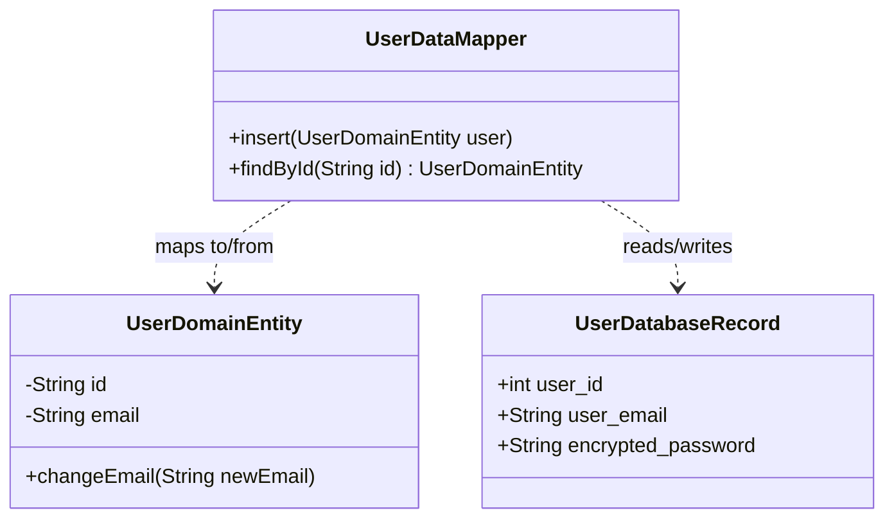
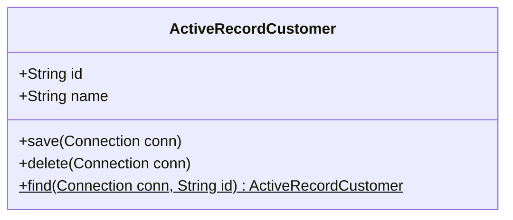
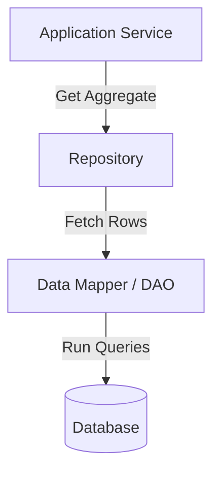
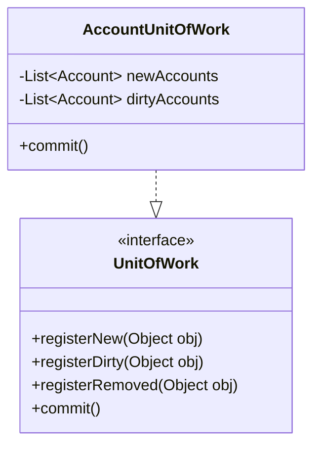

# Module 07: Enterprise Data Patterns

This module covers enterprise data persistence patterns. It analyzes the differences between active and passive data mapping architectures, compares the DAO and Repository patterns, and explains how to implement unit of work transactions in memory.

---

## 1. Data Mapper Pattern

### Academic Context (Professor's Lecture)
In complex enterprise applications, domain models contain rich business logic, while database schemas are optimized for relational storage. If domain entities are tightly coupled to the database schema, changing the database structure requires refactoring your business logic, violating the **Dependency Inversion Principle**.

The Data Mapper pattern solves this by **separating the database schema from the domain model, allowing the domain model to remain decoupled from persistence details**.

### Why Use
* **Decoupled Domain Logic**: Domain objects remain pure POJOs, completely unaware of how they are stored (Persistence Ignorance).
* **Flexible Database Mapping**: A single domain entity can be mapped to multiple database tables, or vice versa, without changing business code.

### How to Use (Java Demo Code)

#### Mermaid Class Diagram


#### Production-Grade Java 21 Implementation
This implementation uses Java **records** to represent database rows, and standard classes for domain entities.

```java
package com.masterclass.designpatterns.enterprise.datamapper;

/**
 * Clean Domain Entity containing business rules.
 * Completely decoupled from database schemas and persistence frameworks.
 */
public final class User {
    private final String id;
    private String email;

    public User(String id, String email) {
        this.id = id;
        this.email = email;
    }

    public String getId() { return id; }
    public String getEmail() { return email; }

    public void updateEmail(String newEmail) {
        if (newEmail == null || !newEmail.contains("@")) {
            throw new IllegalArgumentException("Invalid email format.");
        }
        this.email = newEmail;
    }
}
```

```java
package com.masterclass.designpatterns.enterprise.datamapper;

import java.sql.Connection;
import java.sql.PreparedStatement;
import java.sql.ResultSet;

/**
 * The Data Mapper: Coordinates transfers between the database and the domain.
 */
public final class UserDataMapper {

    private final Connection connection;

    public UserDataMapper(Connection connection) {
        this.connection = connection;
    }

    public void insert(User user) throws Exception {
        String sql = "INSERT INTO users (id, email) VALUES (?, ?)";
        try (PreparedStatement stmt = connection.prepareStatement(sql)) {
            stmt.setString(1, user.getId());
            stmt.setString(2, user.getEmail());
            stmt.executeUpdate();
        }
    }

    public User findById(String id) throws Exception {
        String sql = "SELECT * FROM users WHERE id = ?";
        try (PreparedStatement stmt = connection.prepareStatement(sql)) {
            stmt.setString(1, id);
            try (ResultSet rs = stmt.executeQuery()) {
                if (rs.next()) {
                    // Instantiate and return the clean domain entity
                    return new User(rs.getString("id"), rs.getString("email"));
                }
            }
        }
        return null;
    }
}
```

### When to Use
* Domain logic is complex and changes independently of the database schema.
* You need to isolate the domain model from database schemas or persistence APIs.

---

## 2. Active Record Pattern

### Academic Context (Professor's Lecture)
In simpler applications, mapping database rows to domain objects using separate mapper classes introduces unnecessary boilerplate. 
If your domain model is simple (e.g. basic CRUD properties with little business logic), you can combine the data and persistence logic into a single class.

The Active Record pattern solves this by **having the domain entity encapsulate both its data and its database access logic (save, update, delete)**.

### Why Use
* **Simplicity**: Reduces boilerplate code by eliminating separate mapper and repository classes.
* **Rapid Development**: Ideal for prototyping and CRUD-heavy applications.

### How to Use (Java Demo Code)

#### Mermaid Class Diagram


#### Production-Grade Java 21 Implementation
```java
package com.masterclass.designpatterns.enterprise.activerecord;

import java.sql.Connection;
import java.sql.PreparedStatement;
import java.sql.ResultSet;

/**
 * Active Record Entity encapsulates both data and database persistence logic.
 */
public final class CustomerActiveRecord {
    private String id;
    private String name;

    public CustomerActiveRecord() {}

    public CustomerActiveRecord(String id, String name) {
        this.id = id;
        this.name = name;
    }

    public String getId() { return id; }
    public String getName() { return name; }
    public void setName(String name) { this.name = name; }

    // Active Record database operations
    public void save(Connection conn) throws Exception {
        String sql = "INSERT INTO customers (id, name) VALUES (?, ?) ON CONFLICT (id) DO UPDATE SET name = ?";
        try (PreparedStatement stmt = conn.prepareStatement(sql)) {
            stmt.setString(1, id);
            stmt.setString(2, name);
            stmt.setString(3, name);
            stmt.executeUpdate();
            System.out.println("ActiveRecord: Committed save to database: " + id);
        }
    }

    public static CustomerActiveRecord find(Connection conn, String id) throws Exception {
        String sql = "SELECT * FROM customers WHERE id = ?";
        try (PreparedStatement stmt = conn.prepareStatement(sql)) {
            stmt.setString(1, id);
            try (ResultSet rs = stmt.executeQuery()) {
                if (rs.next()) {
                    return new CustomerActiveRecord(rs.getString("id"), rs.getString("name"));
                }
            }
        }
        return null;
    }
}
```

### When to Use
* CRUD-heavy applications with simple business logic.
* You want to keep the persistence architecture simple and avoid boilerplate code.

### Trade-offs & Design Pitfalls
* **Tight Coupling**: Domain entities are tightly coupled to the database schema, making it difficult to change persistence frameworks or mock database connections during testing.

---

## 3. Repository vs DAO Patterns

### Academic Context (Professor's Lecture)
Developers often confuse the **DAO (Data Access Object)** and **Repository** patterns because both abstract database access. 
* **DAO** is a low-level abstraction centered around a single database table, exposing CRUD operations (like `insert`, `update`, `delete`).
* **Repository** is a high-level abstraction modeled as an in-memory collection of **Domain Aggregates**. It sits on top of DAOs or Mappers, translating domain requests into database queries.



### Production-Grade Java 21 Implementation

#### DAO Interface (Table Centric)
```java
package com.masterclass.designpatterns.enterprise.persistence;

import java.util.Optional;

public interface UserDao {
    void save(UserRecord record);
    Optional<UserRecord> findById(String id);
    void delete(String id);
}
```

#### Repository Interface (Domain Collection Centric)
```java
package com.masterclass.designpatterns.enterprise.persistence;

import com.masterclass.designpatterns.enterprise.datamapper.User;
import java.util.Optional;

public interface UserRepository {
    void add(User user);
    Optional<User> get(String id);
    void remove(User user);
}
```

---

## 4. Unit of Work Pattern

### Academic Context (Professor's Lecture)
When an operation updates multiple objects in memory, writing each change to the database immediately leads to multiple network round-trips and makes it difficult to manage transactions. If one update fails mid-process, the database is left in a partially updated state.

The Unit of Work pattern solves this by **tracking all modifications to database-backed objects during a business transaction, and committing them in a single, unified database transaction**.

### Why Use
* **Reduced Database Round-Trips**: Batches multiple insertions, updates, and deletions into a single database commit.
* **Guaranteed Transactional Integrity**: Commits or rolls back all changes atomically, preventing partial updates.

### How to Use (Java Demo Code)

#### Mermaid Class Diagram


#### Production-Grade Java 21 Implementation
```java
package com.masterclass.designpatterns.enterprise.unitofwork;

import com.masterclass.designpatterns.enterprise.datamapper.User;
import java.sql.Connection;
import java.util.ArrayList;
import java.util.List;

public interface UnitOfWork {
    void registerNew(User user);
    void registerDirty(User user);
    void registerDeleted(User user);
    void commit() throws Exception;
}
```

```java
package com.masterclass.designpatterns.enterprise.unitofwork;

import com.masterclass.designpatterns.enterprise.datamapper.User;
import com.masterclass.designpatterns.enterprise.datamapper.UserDataMapper;
import java.sql.Connection;
import java.util.ArrayList;
import java.util.List;

/**
 * Database transaction Unit of Work.
 */
public final class UserUnitOfWork implements UnitOfWork {

    private final Connection connection;
    private final UserDataMapper mapper;

    private final List<User> newUsers = new ArrayList<>();
    private final List<User> dirtyUsers = new ArrayList<>();
    private final List<User> deletedUsers = new ArrayList<>();

    public UserUnitOfWork(Connection connection, UserDataMapper mapper) {
        this.connection = connection;
        this.mapper = mapper;
    }

    @Override
    public void registerNew(User user) {
        newUsers.add(user);
    }

    @Override
    public void registerDirty(User user) {
        if (!dirtyUsers.contains(user)) {
            dirtyUsers.add(user);
        }
    }

    @Override
    public void registerDeleted(User user) {
        deletedUsers.add(user);
    }

    /**
     * Commits all changes in a single database transaction.
     */
    @Override
    public void commit() throws Exception {
        // Disable auto-commit to begin transaction
        connection.setAutoCommit(false);
        try {
            // Process insertions
            for (User user : newUsers) {
                mapper.insert(user);
            }
            
            // In a real implementation, you would execute updates for dirtyUsers 
            // and deletes for deletedUsers here
            
            // Commit database transaction
            connection.commit();
            System.out.println("UnitOfWork: Transaction committed successfully.");
        } catch (Exception e) {
            connection.rollback();
            System.err.println("UnitOfWork: Transaction rolled back due to error: " + e.getMessage());
            throw e;
        } finally {
            connection.setAutoCommit(true);
            newUsers.clear();
            dirtyUsers.clear();
            deletedUsers.clear();
        }
    }
}
```

### When to Use
* You need to track and commit updates to multiple database-backed objects dynamically during a request.
* You want to reduce database round-trips by batching write operations.

---

## 5. Hands-on Mini-Challenge: Transactional Account Registry

### Scenario
You are building the account management system for a bank. The system processes customer registrations. 
To complete registration, the system must:
1. Define account structures as **Domain Entities** separated from persistence concerns using the **Data Mapper** pattern.
2. Abstract client access to account records using the **Repository** pattern.
3. Track and commit all database modifications atomically using the **Unit of Work** pattern.

### Step 1: Implement Domain Mappings & Data Mappers
```java
package com.masterclass.designpatterns.miniproject.accounts;

// Domain Entity
public final class Account {
    private final String id;
    private double balance;

    public Account(String id, double balance) {
        this.id = id;
        this.balance = balance;
    }

    public String getId() { return id; }
    public double getBalance() { return balance; }
    public void credit(double amount) { this.balance += amount; }
}
```

```java
package com.masterclass.designpatterns.miniproject.accounts;

import java.util.HashMap;
import java.util.Map;

// Simulated in-memory database table mapper
public final class AccountDataMapper {
    private final Map<String, Account> table = new HashMap<>();

    public void insert(Account account) {
        table.put(account.getId(), new Account(account.getId(), account.getBalance()));
        System.out.println("Mapper: Wrote Account " + account.getId() + " to table.");
    }

    public Account find(String id) {
        Account record = table.get(id);
        return record != null ? new Account(record.getId(), record.getBalance()) : null;
    }
}
```

### Step 2: Implement Unit of Work
```java
package com.masterclass.designpatterns.miniproject.accounts;

import java.util.ArrayList;
import java.util.List;

public final class AccountUnitOfWork {
    private final AccountDataMapper mapper;
    private final List<Account> newAccounts = new ArrayList<>();

    public AccountUnitOfWork(AccountDataMapper mapper) {
        this.mapper = mapper;
    }

    public void registerNew(Account account) { newAccounts.add(account); }

    public void commit() {
        System.out.println("UnitOfWork: Committing updates...");
        for (Account account : newAccounts) {
            mapper.insert(account);
        }
        newAccounts.clear();
    }
}
```

### Step 3: Implement Repository
```java
package com.masterclass.designpatterns.miniproject.accounts;

import java.util.Optional;

public final class AccountRepository {
    private final AccountDataMapper mapper;
    private final AccountUnitOfWork uow;

    public AccountRepository(AccountDataMapper mapper, AccountUnitOfWork uow) {
        this.mapper = mapper;
        this.uow = uow;
    }

    public void add(Account account) {
        uow.registerNew(account);
    }

    public Optional<Account> get(String id) {
        return Optional.ofNullable(mapper.find(id));
    }
}
```

### Step 4: Verify the Implementation
```java
package com.masterclass.designpatterns.miniproject;

import com.masterclass.designpatterns.miniproject.accounts.*;

public class EnterpriseDataMain {
    public static void main(String[] args) {
        AccountDataMapper mapper = new AccountDataMapper();
        AccountUnitOfWork uow = new AccountUnitOfWork(mapper);
        AccountRepository repo = new AccountRepository(mapper, uow);

        // Add accounts through repository
        repo.add(new Account("acc-1", 1000.00));
        repo.add(new Account("acc-2", 2500.00));

        // Changes are tracked in memory, database is not updated yet
        System.out.println("Checking DB before commit: " + repo.get("acc-1").isPresent()); // false

        // Commit Unit of Work
        uow.commit();

        // Verify database updates
        System.out.println("Checking DB after commit: " + repo.get("acc-1").isPresent()); // true
    }
}
```
This challenge demonstrates how data mapping (Data Mapper), transactional tracking (Unit of Work), and collections abstraction (Repository) collaborate to decouple business logic from database layers.
