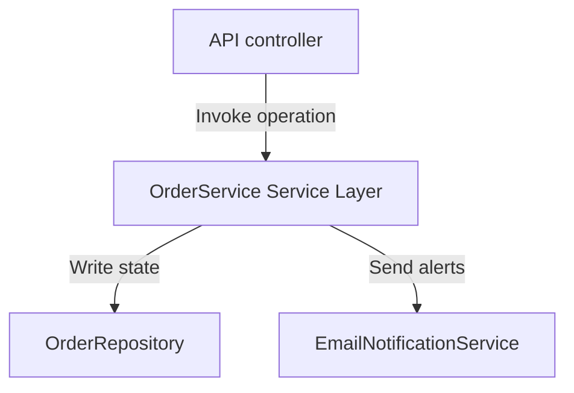
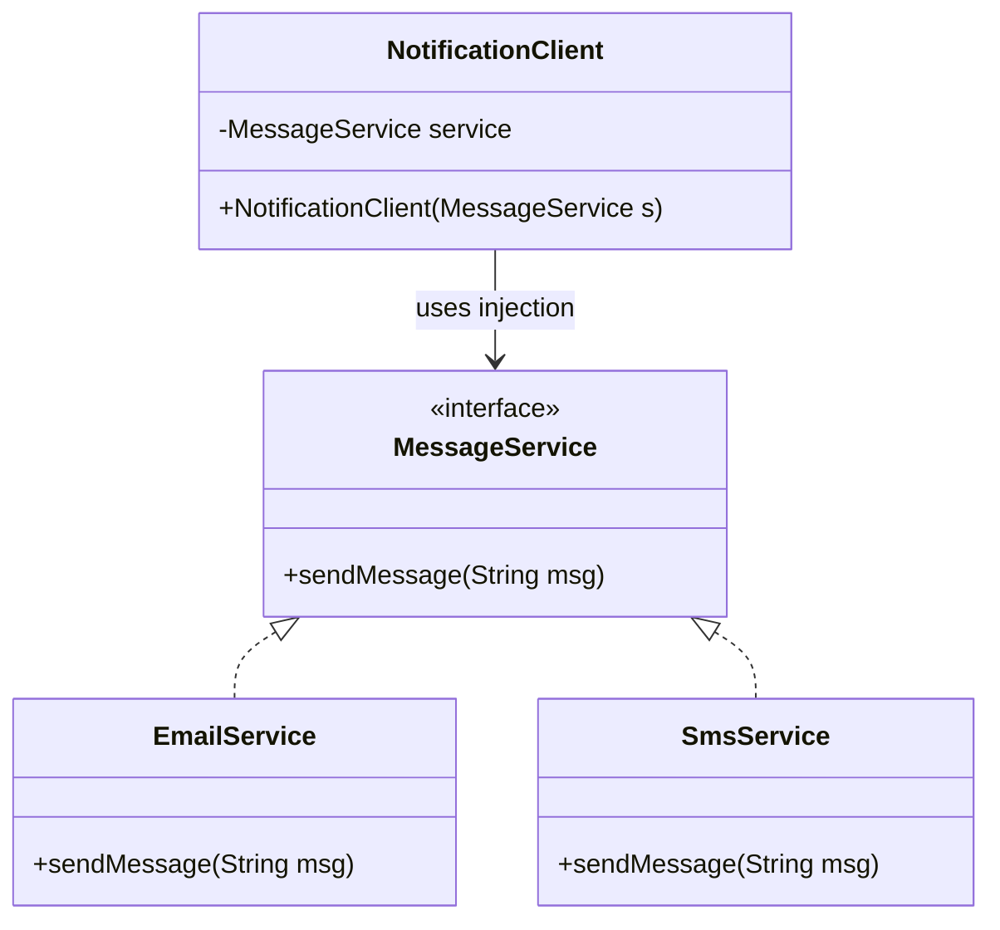

# Module 08: Enterprise Structural Patterns

This module covers structural layers in enterprise applications. It explores the design of the Service Layer boundary, data serialization using DTOs, and Dependency Injection frameworks.

---

## 1. Service Layer Pattern

### Academic Context (Professor's Lecture)
In enterprise systems, business operations require coordinating multiple components (repositories, external APIs, security checks, mail gateways). If you write this coordination logic directly inside your API controllers or database access layers, you end up with high coupling and duplicate code.

The Service Layer pattern solves this by **defining an application's boundary with a set of available operations and coordinating the application's response in each operation**.

### Why Use
* **Centralization**: Groups business logic and orchestration rules into a single, cohesive layer.
* **Transaction Boundaries**: Establishes transactional and security boundaries for application operations.

### How to Use (Java Demo Code)

#### Mermaid Class Diagram


#### Production-Grade Java 21 Implementation
```java
package com.masterclass.designpatterns.enterprise.servicelayer;

// Simulated repositories and mail services
interface ProductRepository {
    boolean checkStock(String productId, int qty);
    void deductStock(String productId, int qty);
}
interface MailService {
    void sendOrderConfirmation(String email, String orderId);
}
```

```java
package com.masterclass.designpatterns.enterprise.servicelayer;

import java.util.UUID;

/**
 * Service Layer: Coordinates checkout operations.
 */
public final class OrderService {
    private final ProductRepository productRepo;
    private final MailService mailService;

    // Dependencies are injected via the constructor
    public OrderService(ProductRepository productRepo, MailService mailService) {
        this.productRepo = productRepo;
        this.mailService = mailService;
    }

    /**
     * Orchestrates the checkout process.
     * Establishes the business transaction boundary.
     */
    public String placeOrder(String customerEmail, String productId, int quantity) {
        System.out.println("Service Layer: Initiating order placement...");
        
        if (!productRepo.checkStock(productId, quantity)) {
            throw new IllegalStateException("Insufficient inventory for product: " + productId);
        }

        productRepo.deductStock(productId, quantity);
        String orderId = UUID.randomUUID().toString();
        
        mailService.sendOrderConfirmation(customerEmail, orderId);
        System.out.println("Service Layer: Order successfully processed. ID: " + orderId);
        
        return orderId;
    }
}
```

### When to Use
* Orchestrating business processes that span multiple domain models or repositories.
* Defining clear transaction, security, or error logging boundaries.

---

## 2. DTO (Data Transfer Object) Pattern

### Academic Context (Professor's Lecture)
Domain entities contain rich business rules and internal state representations. If you return these entities directly over HTTP or remote network calls, you expose internal database schemas and waste network bandwidth by sending unnecessary fields.

The DTO pattern solves this by **creating objects that carry data between processes, containing no business logic, and designed solely to optimize network payloads**.

### Why Use
* **Data Encapsulation**: Hides internal database schemas and domain structures from client applications.
* **Network Optimization**: Combines data from multiple entities into a single, thin network payload, reducing round-trips.

### How to Use (Java Demo Code)

#### Production-Grade Java 21 Implementation
This implementation uses Java **records** (introduced in Java 16), which are ideal for DTOs because they are immutable by default and automatically generate constructors, getters, `equals()`, `hashCode()`, and `toString()`.

```java
package com.masterclass.designpatterns.enterprise.dto;

import java.io.Serializable;
import java.math.BigDecimal;

/**
 * Modern Java Record DTO represents an immutable data carrier.
 */
public record CustomerSummaryDto(
        String customerId,
        String fullName,
        String email,
        BigDecimal accountBalance
) implements Serializable {}
```

---

## 3. Dependency Injection (DI) Pattern

### Academic Context (Professor's Lecture)
If a class instantiates its own dependencies directly (e.g., `this.repo = new SqlDatabaseRepository()`), it becomes tightly coupled to those concrete classes. You cannot swap implementations (like using an in-memory database for testing) without modifying the class source code.

The Dependency Injection pattern solves this by **passing dependencies to a class rather than having the class instantiate them itself, shifting dependency resolution to an external assembler**.

### Why Use
* **Testability**: Allows mocking dependencies easily during unit testing.
* **Loose Coupling**: Decouples classes from concrete implementations, making it easy to swap dependencies.

### How to Use (Java Demo Code)

#### Mermaid Class Diagram


#### Production-Grade Java 21 Implementation
This example demonstrates **Constructor Injection**, which is preferred over Field Injection because it ensures dependencies are immutable (`final`) and prevents instantiating uninitialized objects.

```java
package com.masterclass.designpatterns.enterprise.dependencyinjection;

public interface PaymentGateway {
    void processDebit(double amount);
}
```

```java
package com.masterclass.designpatterns.enterprise.dependencyinjection;

public final class StripePaymentGateway implements PaymentGateway {
    @Override
    public void processDebit(double amount) {
        System.out.println("Processing payment via Stripe: $" + amount);
    }
}
```

```java
package com.masterclass.designpatterns.enterprise.dependencyinjection;

public final class OrderBillingEngine {
    private final PaymentGateway gateway; // Final guarantees immutability

    // Dependency is injected via the constructor
    public OrderBillingEngine(PaymentGateway gateway) {
        if (gateway == null) {
            throw new IllegalArgumentException("PaymentGateway dependency cannot be null.");
        }
        this.gateway = gateway;
    }

    public void chargeOrder(double amount) {
        gateway.processDebit(amount);
    }
}
```

---

## 4. Hands-on Mini-Challenge: Enterprise User Registration Pipeline

### Scenario
You are building the user registration system for a corporate application. 
The system must:
1. Accept requests using an immutable **DTO** record.
2. Wire dependencies (Database persistence layer, validation engine) using **Dependency Injection**.
3. Orchestrate registration checks and trigger confirmation emails inside a unified **Service Layer**.

### Step 1: Implement the Data Carrier DTO
```java
package com.masterclass.designpatterns.miniproject.registration;

public record RegistrationRequestDto(
        String username,
        String email,
        String password
) {}
```

### Step 2: Implement Dependency Interfaces
```java
package com.masterclass.designpatterns.miniproject.registration;

public interface UserStore {
    void saveUser(String username, String email);
}

public final class SqlUserStore implements UserStore {
    @Override
    public void saveUser(String username, String email) {
        System.out.println("Database: Inserted record for user: " + username);
    }
}
```

### Step 3: Implement Service Layer with Constructor Injection
```java
package com.masterclass.designpatterns.miniproject.registration;

public final class UserRegistrationService {
    private final UserStore store;

    // Inject dependency via constructor
    public UserRegistrationService(UserStore store) {
        this.store = store;
    }

    public void registerNewUser(RegistrationRequestDto request) {
        System.out.println("Service Layer: Processing registration request for: " + request.username());
        
        // Enforce business validation rules
        if (request.email() == null || !request.email().contains("@")) {
            throw new IllegalArgumentException("Registration aborted: Invalid email address.");
        }

        store.saveUser(request.username(), request.email());
        System.out.println("Service Layer: Registration complete.");
    }
}
```

### Step 4: Verify the Registration Flow
```java
package com.masterclass.designpatterns.miniproject;

import com.masterclass.designpatterns.miniproject.registration.*;

public class EnterpriseStructuralMain {
    public static void main(String[] args) {
        // Resolve dependencies (manually simulating an IoC container)
        UserStore store = new SqlUserStore();
        
        // Inject dependencies into Service Layer
        UserRegistrationService service = new UserRegistrationService(store);

        // Instantiate DTO
        RegistrationRequestDto dto = new RegistrationRequestDto("johndoe", "john@masterclass.com", "securePass123");

        // Execute registration flow
        service.registerNewUser(dto);
    }
}
```
This challenge demonstrates how data serialization DTO records, Dependency Injection, and the Service Layer coordinate to build a modular application architecture.
