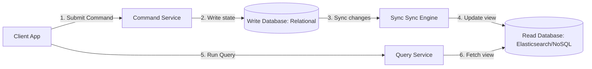
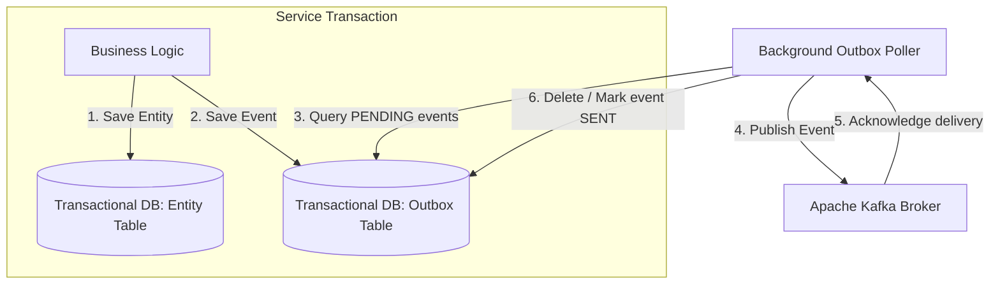

# Module 09: Distributed Consistency & Events

This module covers distributed consistency patterns in microservice architectures. It explores read-write model segregation (CQRS), state reconstruction via immutable events (Event Sourcing), and transactional event publishing using the Outbox pattern.

---

## 1. CQRS (Command Query Responsibility Segregation)

### Academic Context (Professor's Lecture)
In traditional architectures, the same database model is used for both writes (commands) and reads (queries). While this is simple, it can lead to performance issues at scale. Read queries often require complex joins and aggregations, while writes need fast, indexed updates. 
Using a single database model forces you to make trade-offs that compromise both read and write performance.

The CQRS pattern solves this by **segregating the data models and database operations for writes (Commands) from reads (Queries), optimizing each model independently**.



### Why Use
* **Optimized Performance**: Reads and writes use independent database models (e.g. using a normalized database for transactional writes, and a denormalized NoSQL database for fast reads).
* **Scaled Independently**: Read and write workloads can be scaled on separate infrastructure.

### How to Use (Java Demo Code)

```java
package com.masterclass.designpatterns.distributed.cqrs;

// The Write Model Command
public record CreateProductCommand(String id, String name, double price) {}
```

```java
package com.masterclass.designpatterns.distributed.cqrs;

import java.util.HashMap;
import java.util.Map;

/**
 * Command Service handles write operations.
 */
public final class ProductCommandService {
    private final Map<String, String> writeDatabase = new HashMap<>();
    private final ProductQueryService queryService; // Inject Query Service to sync state

    public ProductCommandService(ProductQueryService queryService) {
        this.queryService = queryService;
    }

    public void handle(CreateProductCommand command) {
        System.out.println("CQRS Command: Writing new product to transactional store...");
        writeDatabase.put(command.id(), command.name() + ":" + command.price());
        
        // Asynchronously sync change to the read model database view
        queryService.updateReadModel(new ProductView(command.id(), command.name(), command.price()));
    }
}
```

```java
package com.masterclass.designpatterns.distributed.cqrs;

import java.util.HashMap;
import java.util.Map;

public record ProductView(String id, String name, double price) {}

/**
 * Query Service handles read operations.
 */
public final class ProductQueryService {
    private final Map<String, ProductView> readDatabaseView = new HashMap<>();

    public ProductView getProductViewById(String id) {
        System.out.println("CQRS Query: Fetching read-optimized product view...");
        return readDatabaseView.get(id);
    }

    // Callback used by sync pipelines
    public void updateReadModel(ProductView view) {
        readDatabaseView.put(view.id(), view);
    }
}
```

### When to Use
* High-traffic applications where read performance must be optimized independently of write consistency.
* Applications with complex, ad-hoc reporting and dashboard filtering needs.

---

## 2. Event Sourcing Pattern

### Academic Context (Professor's Lecture)
In traditional CRUD databases, updates overwrite existing state. For example, if a user changes their address, the old address is overwritten. This makes it difficult to audit historical changes, perform point-in-time recovery, or understand *why* the data reached its current state.

The Event Sourcing pattern solves this by **storing the state of a business entity as a sequence of immutable, append-only lifecycle events. The entity's current state is reconstructed by replaying those events in order**.

### Why Use
* **Complete Audit Trail**: Provides an immutable history of every state change, which is ideal for financial and compliance audits.
* **Point-in-Time Recovery**: Allows reconstructing the entity's state at any specific point in history by replaying events up to that timestamp.

### How to Use (Java Demo Code)

```java
package com.masterclass.designpatterns.distributed.eventsourcing;

import java.io.Serializable;

public interface BankAccountEvent extends Serializable {
    String getAccountId();
}

public record AccountCreatedEvent(String accountId, String holder) implements BankAccountEvent {
    @Override public String getAccountId() { return accountId; }
}

public record MoneyDepositedEvent(String accountId, double amount) implements BankAccountEvent {
    @Override public String getAccountId() { return accountId; }
}
```

```java
package com.masterclass.designpatterns.distributed.eventsourcing;

import java.util.ArrayList;
import java.util.List;

/**
 * Domain Aggregate whose state is reconstructed by replaying events.
 */
public final class BankAccountAggregate {
    private String id;
    private double balance;
    private String holder;

    public BankAccountAggregate() {}

    /**
     * Reconstructs the aggregate state by replaying a sequence of events.
     */
    public static BankAccountAggregate replay(List<BankAccountEvent> events) {
        BankAccountAggregate aggregate = new BankAccountAggregate();
        for (BankAccountEvent event : events) {
            aggregate.apply(event);
        }
        return aggregate;
    }

    private void apply(BankAccountEvent event) {
        // Java 21 Pattern Matching for Switch
        switch (event) {
            case AccountCreatedEvent created -> {
                this.id = created.accountId();
                this.holder = created.holder();
                this.balance = 0.0;
            }
            case MoneyDepositedEvent deposited -> {
                this.balance += deposited.amount();
            }
            default -> throw new IllegalArgumentException("Unknown event type.");
        }
    }

    public String getId() { return id; }
    public double getBalance() { return balance; }
}
```

### When to Use
* Systems requiring complete audit histories (such as banking systems, medical charts, or order tracking platforms).
* Collaborative systems where users need to revert changes or review historical versions.

---

## 3. Outbox Pattern

### Academic Context (Professor's Lecture)
In microservices, a service often needs to update its database and notify other services by publishing events to a message broker (like Kafka). 
If you update the database and then call the broker, a network partition or broker failure mid-process will leave the system in an inconsistent state: the database update succeeded, but the event was never sent.

The Outbox pattern solves this by **writing the outbound event to an "outbox" table in the same database transaction as the business entity update. A separate background process then reads the outbox table and publishes the events to the broker, ensuring at-least-once delivery**.



### Why Use
* **Transactional Reliability**: Guarantees that database updates and outgoing events are executed atomically.
* **Resilience**: Outgoing events are persisted locally, protecting the system against message broker outages.

### How to Use (Java Demo Code)

```java
package com.masterclass.designpatterns.distributed.outbox;

import java.sql.Connection;
import java.sql.PreparedStatement;
import java.time.Instant;

/**
 * Service orchestrating writes to both the entity and outbox tables in the same transaction.
 */
public final class OrderProcessingService {

    private final Connection connection;

    public OrderProcessingService(Connection connection) {
        this.connection = connection;
    }

    public void createOrder(String orderId, String client, double total) throws Exception {
        // Disable auto-commit to begin database transaction
        connection.setAutoCommit(false);
        try {
            // Step 1: Save order entity
            String orderSql = "INSERT INTO orders (id, client, total) VALUES (?, ?, ?)";
            try (PreparedStatement stmt = connection.prepareStatement(orderSql)) {
                stmt.setString(1, orderId);
                stmt.setString(2, client);
                stmt.setDouble(3, total);
                stmt.executeUpdate();
            }

            // Step 2: Write event to Outbox table in the same transaction
            String outboxSql = "INSERT INTO outbox (id, aggregate_type, payload, status, created_at) VALUES (?, ?, ?, ?, ?)";
            try (PreparedStatement stmt = connection.prepareStatement(outboxSql)) {
                stmt.setString(1, java.util.UUID.randomUUID().toString());
                stmt.setString(2, "ORDER");
                stmt.setString(3, String.format("{\"orderId\":\"%s\",\"total\":%s}", orderId, total));
                stmt.setString(4, "PENDING");
                stmt.setObject(5, Instant.now());
                stmt.executeUpdate();
            }

            // Commit transaction atomically
            connection.commit();
            System.out.println("Outbox: Database updates committed successfully.");
        } catch (Exception e) {
            connection.rollback();
            System.err.println("Outbox: Transaction rolled back due to error: " + e.getMessage());
            throw e;
        } finally {
            connection.setAutoCommit(true);
        }
    }
}
```

---

## 4. Hands-on Mini-Challenge: Idempotent Event Log Engine

### Scenario
You are building the order intake engine for an e-commerce platform. 
The system must:
1. Accept orders, record data locally, and schedule events in the same database transaction using the **Outbox** pattern.
2. Reconstruct user history by replaying events using the **Event Sourcing** pattern.
3. Segregate data models for write orders and read-optimized order search databases using the **CQRS** pattern.

### Step 1: Implement Event Sourced Aggregate
```java
package com.masterclass.designpatterns.miniproject.events;

import java.util.List;

public interface OrderEvent { String getOrderId(); }
public record OrderCreated(String orderId, double price) implements OrderEvent {
    @Override public String getOrderId() { return orderId; }
}

public final class OrderAggregate {
    private String id;
    private double price;

    public void apply(OrderEvent event) {
        if (event instanceof OrderCreated created) {
            this.id = created.orderId();
            this.price = created.price();
        }
    }

    public static OrderAggregate rebuild(List<OrderEvent> events) {
        OrderAggregate aggregate = new OrderAggregate();
        events.forEach(aggregate::apply);
        return aggregate;
    }

    public double getPrice() { return price; }
}
```

### Step 2: Implement CQRS Services
```java
package com.masterclass.designpatterns.miniproject.events;

import java.util.HashMap;
import java.util.Map;

public record OrderReadModel(String id, double price, String status) {}

public final class OrderQueryModelService {
    private final Map<String, OrderReadModel> readStore = new HashMap<>();

    public void updateView(OrderReadModel view) { readStore.put(view.id(), view); }
    public OrderReadModel findView(String id) { return readStore.get(id); }
}
```

### Step 3: Implement Outbox Publisher Service
```java
package com.masterclass.designpatterns.miniproject.events;

import java.util.ArrayList;
import java.util.List;

public final class TransactionalOrderService {
    private final OrderQueryModelService queryService;
    private final List<String> outboxTable = new ArrayList<>(); // Simulated outbox table

    public TransactionalOrderService(OrderQueryModelService queryService) {
        this.queryService = queryService;
    }

    /**
     * Saves order and outbox events atomically.
     */
    public void placeOrder(String orderId, double amount) {
        System.out.println("Processing: Saving order and outbox records...");
        
        // Simulate atomic database transaction
        outboxTable.add(String.format("EVENT_ORDER_CREATED_%s", orderId));

        // Sync view model for CQRS reads
        queryService.updateView(new OrderReadModel(orderId, amount, "SUCCESS"));
    }

    public List<String> getOutboxTable() { return outboxTable; }
}
```

### Step 4: Verify the Pipeline
```java
package com.masterclass.designpatterns.miniproject;

import com.masterclass.designpatterns.miniproject.events.*;
import java.util.List;

public class DistributedEventsMain {
    public static void main(String[] args) {
        // Initialize CQRS query service
        OrderQueryModelService queryService = new OrderQueryModelService();
        
        // Initialize transactional writer
        TransactionalOrderService writer = new TransactionalOrderService(queryService);

        // 1. Process write transaction (Outbox & CQRS sync)
        writer.placeOrder("ord-2026", 1450.00);

        // 2. Read optimized view (CQRS read)
        OrderReadModel view = queryService.findView("ord-2026");
        System.out.println("CQRS Read Status: " + view.status() + ", Price: $" + view.price());

        // 3. Rebuild aggregate state (Event Sourcing)
        List<OrderEvent> history = List.of(new OrderCreated("ord-2026", 1450.00));
        OrderAggregate aggregate = OrderAggregate.rebuild(history);
        System.out.println("Event Sourced State: Rebuilt price: $" + aggregate.getPrice());

        // 4. Verify outbox contains pending event
        System.out.println("Outbox Pending Events Count: " + writer.getOutboxTable().size());
    }
}
```
This challenge demonstrates how CQRS, Event Sourcing, and the Outbox pattern coordinate to manage state changes and event delivery in distributed microservices.
