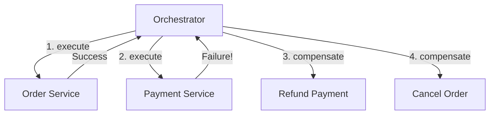
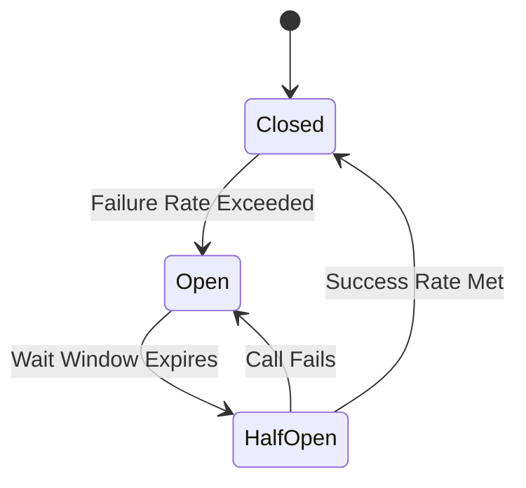

# Module 10: Distributed Reliability & Resilience

This module covers distributed reliability and resilience patterns. It explores Saga coordination to maintain eventual consistency, fault isolation using Circuit Breakers, transient recovery using Retries, and resource isolation using Bulkheads.

---

## 1. Saga Pattern

### Academic Context (Professor's Lecture)
In microservice architectures, business transactions often span multiple services. For example, checking out an order requires updating inventory in the Inventory Service, charging the customer in the Payment Service, and updating the order status in the Order Service. 
Because these services use separate databases, you cannot use database-level ACID transactions.

The Saga pattern solves this by **modeling a distributed transaction as a sequence of local transactions. Each service performs its transaction and publishes an event. If a step fails, the Saga orchestrator executes compensating transactions in reverse order to undo the changes, restoring eventual consistency**.



### Why Use
* **Eventual Consistency**: Coordinates multi-service transactions without locking databases or blocking threads.
* **Fault Isolation**: Allows rollbacks to occur asynchronously if one service fails during a transaction.

### How to Use (Java Demo Code)

```java
package com.masterclass.designpatterns.distributed.saga;

// Domain services interfaces
interface OrderClient {
    boolean reserveOrder(String id);
    void cancelOrder(String id);
}
interface PaymentClient {
    boolean processPayment(String id, double amount);
}
```

/**
 * Saga Orchestrator manages the execution flow and compensation logic.
 */
```java
package com.masterclass.designpatterns.distributed.saga;

public final class CheckoutSagaOrchestrator {
    private final OrderClient orderClient;
    private final PaymentClient paymentClient;

    public CheckoutSagaOrchestrator(OrderClient orderClient, PaymentClient paymentClient) {
        this.orderClient = orderClient;
        this.paymentClient = paymentClient;
    }

    public boolean executeCheckoutSaga(String orderId, double amount) {
        System.out.println("Saga: Initiating distributed checkout transaction...");
        
        // Step 1: Execute first local transaction (Reserve Order)
        if (!orderClient.reserveOrder(orderId)) {
            System.err.println("Saga failed: Could not reserve order. Aborting.");
            return false;
        }

        // Step 2: Execute second local transaction (Process Payment)
        boolean paymentSuccess = paymentClient.processPayment(orderId, amount);
        
        if (!paymentSuccess) {
            System.err.println("Saga failed: Payment failed. Initiating compensating transactions...");
            // Trigger compensating transaction in reverse order
            orderClient.cancelOrder(orderId);
            return false;
        }

        System.out.println("Saga: Distributed transaction completed successfully.");
        return true;
    }
}
```

### When to Use
* Implementing distributed transactions that span multiple microservices.
* Coordinating workflows that require eventual consistency rather than strict ACID guarantees.

---

## 2. Circuit Breaker Pattern

### Academic Context (Professor's Lecture)
In distributed systems, services call other services over the network. If a downstream service becomes slow or crashes, calling it repeatedly can exhaust thread pools on the caller service, causing a cascading failure that takes down the entire application.

The Circuit Breaker pattern solves this by **monitoring calls to downstream services. If failure rates exceed a threshold, the breaker trips (opens), immediately returning fallback responses for subsequent calls without hitting the network, protecting downstream services from overload**.



### Why Use
* **Prevent Cascading Failures**: Isolates failures to specific services, keeping the rest of the application responsive.
* **Graceful Degradation**: Exposes fallback methods to return cached data or default values when downstream services are down.

### How to Use (Java Demo Code)

```java
package com.masterclass.designpatterns.distributed.circuitbreaker;

import java.util.function.Supplier;

/**
 * Simple Circuit Breaker implementation with CLOSED, OPEN, and HALF-OPEN states.
 */
public final class CircuitBreaker {

    public enum State { CLOSED, OPEN, HALF_OPEN }

    private State state = State.CLOSED;
    private int failureCount = 0;
    private final int failureThreshold = 3;
    private long lastStateChangeTime = System.currentTimeMillis();
    private final long retryTimeoutMs = 5000; // 5 seconds wait window

    public synchronized <T> T execute(Supplier<T> operation, Supplier<T> fallback) {
        checkStateTransition();

        if (state == State.OPEN) {
            System.out.println("CircuitBreaker: Circuit is OPEN. Returning fallback response.");
            return fallback.get();
        }

        try {
            T result = operation.get();
            onSuccess();
            return result;
        } catch (Exception e) {
            onFailure();
            return fallback.get();
        }
    }

    private void checkStateTransition() {
        if (state == State.OPEN && (System.currentTimeMillis() - lastStateChangeTime > retryTimeoutMs)) {
            state = State.HALF_OPEN;
            System.out.println("CircuitBreaker: Wait window expired. Transitioning to HALF-OPEN.");
        }
    }

    private void onSuccess() {
        failureCount = 0;
        if (state == State.HALF_OPEN) {
            state = State.CLOSED;
            System.out.println("CircuitBreaker: Test call succeeded. Resetting circuit to CLOSED.");
        }
    }

    private void onFailure() {
        failureCount++;
        System.err.println("CircuitBreaker: Call failed. Total failures: " + failureCount);
        if (state == State.HALF_OPEN || failureCount >= failureThreshold) {
            state = State.OPEN;
            lastStateChangeTime = System.currentTimeMillis();
            System.err.println("CircuitBreaker: Failure threshold exceeded. Tripping circuit to OPEN.");
        }
    }
}
```

### When to Use
* Wrapping integration endpoints that call external network APIs or databases.
* Protecting services from cascading failures during network outages.

---

## 3. Bulkhead Pattern

### Academic Context (Professor's Lecture)
In cargo ships, bulkheads are physical partitions that divide the ship's hull into watertight compartments. If one compartment is breached, the leak is isolated, preventing the ship from sinking. 
In software, if all requests share the same thread pool, a slow downstream service can consume all threads in the pool, blocking unrelated operations (e.g. slow email alerts blocking payment threads).

The Bulkhead pattern solves this by **partitioning resource pools (threads, connections) so that a failure in one pool does not affect others**.

### How to Use (Java Demo Code)

```java
package com.masterclass.designpatterns.distributed.bulkhead;

import java.util.concurrent.ExecutorService;
import java.util.concurrent.Executors;
import java.util.concurrent.Future;

/**
 * Bulkhead implementation isolating critical and non-critical thread pools.
 */
public final class PaymentSystemBulkhead {

    // Dedicated pool for critical payments (guarantees capacity)
    private final ExecutorService paymentPool = Executors.newFixedThreadPool(10);
    
    // Dedicated pool for non-critical marketing email alerts
    private final ExecutorService analyticsPool = Executors.newFixedThreadPool(2);

    public Future<String> submitPaymentTask(java.util.concurrent.Callable<String> task) {
        return paymentPool.submit(task);
    }

    public Future<String> submitAnalyticsTask(java.util.concurrent.Callable<String> task) {
        return analyticsPool.submit(task);
    }
}
```

---

## 4. Hands-on Mini-Challenge: Resilient Orders Pipeline

### Scenario
You are building the order checkout service for a retail platform. 
The system must:
1. Orchestrate inventory reservations and payment processing across services using the **Saga** pattern, executing compensating transactions on failures.
2. Protect the application from payment service outages using the **Circuit Breaker** pattern.
3. Automatically retry failed operations using the **Retry** pattern with exponential backoff.
4. Isolate thread pools for billing and search queries using the **Bulkhead** pattern.

### Step 1: Implement Retry Utility with Exponential Backoff
```java
package com.masterclass.designpatterns.miniproject.resilience;

import java.util.function.Supplier;

public final class RetryExecutor {
    public static <T> T executeWithRetry(Supplier<T> operation, int maxAttempts) {
        int attempt = 0;
        int delay = 500; // ms

        while (attempt < maxAttempts) {
            try {
                attempt++;
                return operation.get();
            } catch (Exception e) {
                System.out.println("Retry: Attempt " + attempt + " failed. Retrying...");
                if (attempt >= maxAttempts) {
                    throw e;
                }
                try {
                    Thread.sleep(delay);
                    delay *= 2; // Exponential backoff
                } catch (InterruptedException ie) {
                    Thread.currentThread().interrupt();
                    throw new RuntimeException(ie);
                }
            }
        }
        throw new IllegalStateException("Retry execution failed.");
    }
}
```

### Step 2: Implement Orchestrated Saga with Circuit Breakers
```java
package com.masterclass.designpatterns.miniproject.resilience;

import com.masterclass.designpatterns.distributed.circuitbreaker.CircuitBreaker;

public final class ResilientSagaOrchestrator {
    private final CircuitBreaker circuitBreaker = new CircuitBreaker();

    public boolean runOrderCheckout(String id, double amount) {
        System.out.println("Resilience Saga: Starting transaction for Order " + id);

        // Step 1: Reserve stock (always succeeds for demo)
        System.out.println("Resilience Saga: Stock reserved successfully.");

        // Step 2: Process payment wrapped in a Circuit Breaker and Retry loop
        String paymentResult = circuitBreaker.execute(
                () -> RetryExecutor.executeWithRetry(() -> {
                    // Simulate transient database connection timeout
                    if (Math.random() > 0.5) {
                        throw new RuntimeException("Network Timeout");
                    }
                    return "PAYMENT_SUCCESS";
                }, 3),
                () -> "FALLBACK_PAYMENT_REJECTED"
        );

        if ("FALLBACK_PAYMENT_REJECTED".equals(paymentResult)) {
            System.err.println("Resilience Saga failed: Executing stock release compensations.");
            return false;
        }

        System.out.println("Resilience Saga: Transaction completed successfully.");
        return true;
    }
}
```

### Step 3: Verify the Pipeline
```java
package com.masterclass.designpatterns.miniproject;

import com.masterclass.designpatterns.miniproject.resilience.ResilientSagaOrchestrator;

public class DistributedResilienceMain {
    public static void main(String[] args) {
        ResilientSagaOrchestrator orchestrator = new ResilientSagaOrchestrator();

        // Run transaction test
        System.out.println("Executing Saga transaction...");
        boolean success = orchestrator.runOrderCheckout("ord-9921", 250.00);
        System.out.println("Saga Result: " + (success ? "SUCCESS" : "FAILED"));
    }
}
```
This challenge demonstrates how Saga, Circuit Breaker, and Retry patterns coordinate to build resilient, fault-tolerant distributed systems.
