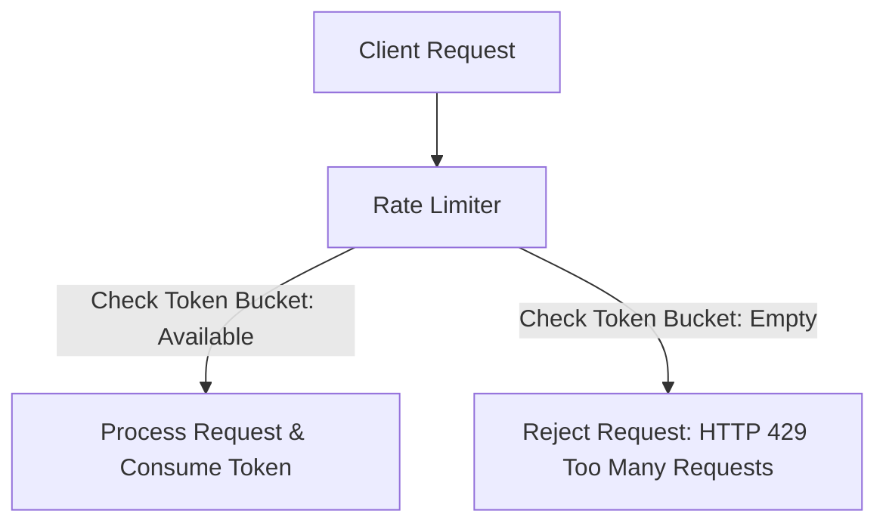
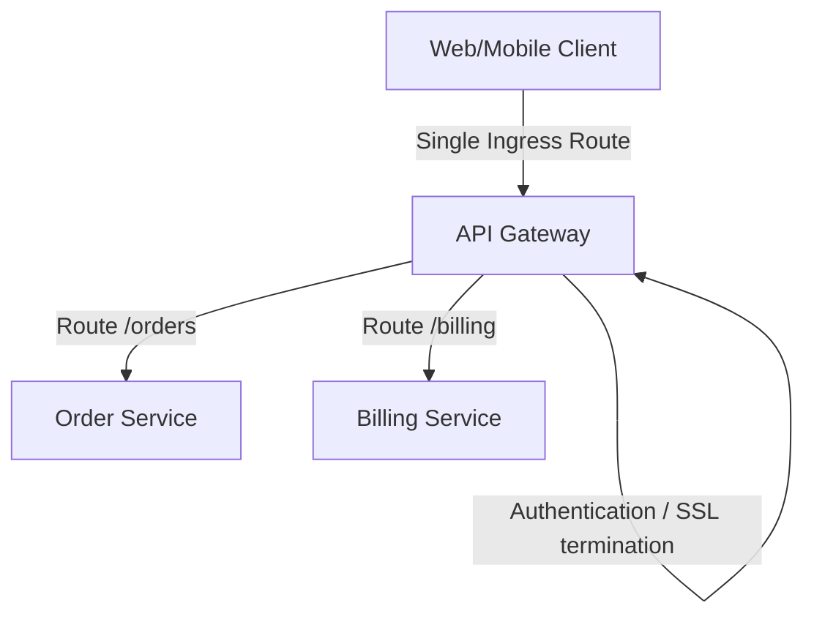

# Module 11: Cloud Infrastructure Integration

This module covers cloud-native and microservices infrastructure integration patterns. It explores request throttling (Rate Limiter), request routing (API Gateway), and legacy migration strategies (Strangler Fig).

---

## 1. Rate Limiter Pattern

### Academic Context (Professor's Lecture)
In high-scale cloud environments, APIs must protect themselves from malicious attacks (DDoS) and resource exhaustion caused by buggy client applications. If an API accepts all requests without limits, a spike in traffic can overload application threads and crash the database.

The Rate Limiter pattern solves this by **controlling the rate of requests sent or received by a network interface, enforcing limits (e.g. 100 requests per minute) and rejecting requests that exceed the limit**.



### Why Use
* **Resource Protection**: Prevents denial-of-service (DoS) attacks and keeps services responsive under load.
* **Cost Management**: Restricts usage to fit within backend resource limits, preventing cloud cost spikes.

### How to Use (Java Demo Code)
This implementation uses the **Token Bucket Algorithm**, which is widely used in high-scale API limiters.

```java
package com.masterclass.designpatterns.distributed.ratelimiter;

/**
 * Thread-safe Token Bucket Rate Limiter.
 */
public final class TokenBucketRateLimiter {
    private final long maxCapacity;
    private double currentTokens;
    private final double refillRatePerSecond;
    private long lastRefillTimestamp;

    public TokenBucketRateLimiter(long maxCapacity, double refillRatePerSecond) {
        this.maxCapacity = maxCapacity;
        this.refillRatePerSecond = refillRatePerSecond;
        this.currentTokens = maxCapacity;
        this.lastRefillTimestamp = System.currentTimeMillis();
    }

    /**
     * Attempts to consume a token. Returns true if accepted, false if rate-limited.
     */
    public synchronized boolean tryAcquire() {
        refillTokens();

        if (currentTokens >= 1.0) {
            currentTokens -= 1.0;
            return true; // Request allowed
        }

        return false; // Rate limited (too many requests)
    }

    private void refillTokens() {
        long now = System.currentTimeMillis();
        long elapsedMs = now - lastRefillTimestamp;
        
        if (elapsedMs > 0) {
            double tokensToAdd = (elapsedMs / 1000.0) * refillRatePerSecond;
            currentTokens = Math.min(maxCapacity, currentTokens + tokensToAdd);
            lastRefillTimestamp = now;
        }
    }
}
```

### When to Use
* Protecting public API endpoints from client abuse or DDoS attacks.
* Enforcing billing tiers for API access (e.g. free tier vs premium limits).

---

## 2. API Gateway Pattern

### Academic Context (Professor's Lecture)
In a microservices architecture, a single client request might require fetching data from multiple independent services (e.g., Order, Billing, and Customer services). 
If the client must connect to each microservice directly, it results in high network overhead, complex client-side routing, and security challenges, as every microservice must expose public endpoints.

The API Gateway pattern solves this by **providing a single entry point (reverse proxy) for all client requests, routing requests to the appropriate downstream microservices, and centralizing cross-cutting concerns like security, rate limiting, and logging**.



### Why Use
* **Reduced Client Complexity**: Client applications interact with a single ingress domain instead of managing multiple service URLs.
* **Centralized Security**: Enforces cross-cutting concerns (such as TLS termination, user authentication, and rate limiting) at the edge, before requests reach microservices.

### How to Use (Java Demo Code)

```java
package com.masterclass.designpatterns.distributed.apigateway;

import java.util.HashMap;
import java.util.Map;

/**
 * Basic API Gateway reverse proxy router.
 */
public final class ApiGatewayRouter {

    private final Map<String, String> routingTable = new HashMap<>();

    public ApiGatewayRouter() {
        // Map ingress paths to downstream microservices URLs
        routingTable.put("/orders", "http://internal-orders-service:8081");
        routingTable.put("/billing", "http://internal-billing-service:8082");
    }

    /**
     * Intercepts and routes client requests.
     */
    public String routeRequest(String path, String apiKey) {
        System.out.println("Gateway: Intercepted request for path: " + path);
        
        // 1. Enforce edge security checks
        if (apiKey == null || apiKey.isBlank()) {
            throw new SecurityException("Gateway Error: Missing API Authentication key.");
        }

        // 2. Resolve downstream destination path
        String destinationService = routingTable.keySet().stream()
                .filter(path::startsWith)
                .map(routingTable::get)
                .findFirst()
                .orElse(null);

        if (destinationService == null) {
            return "HTTP 404: Ingress route not found.";
        }

        // 3. Delegate request (simulated return route redirection)
        return String.format("Request routed successfully to: %s%s", destinationService, path);
    }
}
```

### When to Use
* Microservice architectures where multiple services must be exposed to clients behind a single domain.
* You need to centralize cross-cutting tasks (authentication, SSL termination) to prevent duplicating code across services.

---

## 3. Strangler Fig Pattern

### Academic Context (Professor's Lecture)
Migrating a legacy monolithic application to a microservices architecture is high-risk. Attempting a "big bang" rewrite (replacing the entire monolith at once) often leads to project delays, deployment failures, and downtime.

The Strangler Fig pattern solves this by **migrating the monolith to microservices gradually. You place an API routing layer in front of the application, and migrate features one-by-one. The router directs migrated traffic to the new microservice, while routing the rest to the legacy monolith. Over time, the new microservice "strangles" the monolith until it can be decommissioned**.

```mermaid
graph TD
    Client[Client App] --> Router[Strangler Router]
    Router -->|1. Route /user-v2 (Migrated)| NewService[New User Service]
    Router -->|2. Route /order-v1 (Legacy)| Monolith[(Legacy Monolith)]
```

### Why Use
* **Risk Reduction**: Features are migrated and deployed incrementally, reducing the impact of bugs.
* **Zero Downtime**: Allows legacy and new systems to run side-by-side during the migration.

### How to Use (Java Demo Code)

```java
package com.masterclass.designpatterns.distributed.strangler;

/**
 * Strangler Routing Filter intercepts traffic to route legacy or migrated APIs.
 */
public final class StranglerRoutingFilter {

    private final String legacyMonolithUrl;
    private final String newMicroserviceUrl;
    private boolean isBillingFeatureMigrated = false;

    public StranglerRoutingFilter(String legacyMonolithUrl, String newMicroserviceUrl) {
        this.legacyMonolithUrl = legacyMonolithUrl;
        this.newMicroserviceUrl = newMicroserviceUrl;
    }

    public void setBillingFeatureMigrated(boolean migrated) {
        this.isBillingFeatureMigrated = migrated;
    }

    /**
     * Intercepts and routes traffic dynamically during migration.
     */
    public String forwardRequest(String routePath) {
        if (routePath.startsWith("/billing")) {
            if (isBillingFeatureMigrated) {
                // Route to the new microservice
                return "Strangler: Routing Billing request to modern microservice at: " + newMicroserviceUrl;
            } else {
                // Route to the legacy monolith
                return "Strangler: Routing Billing request to legacy monolith at: " + legacyMonolithUrl;
            }
        }
        
        // Fallback for all other legacy routes
        return "Strangler: Routing request to legacy monolith at: " + legacyMonolithUrl;
    }
}
```

### When to Use
* Migrating a legacy monolith application to a modern microservices architecture gradually.
* Replacing a third-party legacy integration API without impacting client consumers.

---

## 4. Hands-on Mini-Challenge: Cloud Ingress Router

### Scenario
You are migrating the API gateway and routing layer of a legacy system. 
The system must:
1. Limit incoming request rates using the **Rate Limiter** pattern to protect downstream services.
2. Centralize access check filters and route requests to downstream microservices using the **API Gateway** pattern.
3. Migrate the order processing flow from the monolith to a new microservice gradually using the **Strangler Fig** pattern.

### Step 1: Implement Ingress Router (Gateway, Rate Limiter, Strangler Fig)
```java
package com.masterclass.designpatterns.miniproject.ingress;

import com.masterclass.designpatterns.distributed.ratelimiter.TokenBucketRateLimiter;

public final class CloudIngressRouter {

    private final TokenBucketRateLimiter rateLimiter = new TokenBucketRateLimiter(5, 2.0); // 5 capacity, refill 2/sec
    private boolean orderMigrated = false;

    public void setOrderMigrated(boolean orderMigrated) {
        this.orderMigrated = orderMigrated;
    }

    public String handleIngressRequest(String path) {
        // Step 1: Check rate limits
        if (!rateLimiter.tryAcquire()) {
            return "HTTP 429: Too Many Requests. Rate limit exceeded.";
        }

        // Step 2: Route request using the Strangler pattern
        if (path.startsWith("/orders")) {
            if (orderMigrated) {
                return "Ingress: Routing to [New Order Service] at http://order-svc:8081";
            } else {
                return "Ingress: Routing to [Legacy Monolith] at http://monolith:8080";
            }
        }

        // Step 3: Default route
        return "Ingress: Routing to [Legacy Monolith] at http://monolith:8080";
    }
}
```

### Step 2: Verify the Ingress pipeline
```java
package com.masterclass.designpatterns.miniproject;

import com.masterclass.designpatterns.miniproject.ingress.CloudIngressRouter;

public class CloudInfrastructureMain {
    public static void main(String[] args) throws InterruptedException {
        CloudIngressRouter router = new CloudIngressRouter();

        // Test Stage 1: Legacy Routing (Strangler disabled)
        System.out.println(router.handleIngressRequest("/orders/create")); // Monolith

        // Test Stage 2: Migrated Routing (Strangler enabled)
        router.setOrderMigrated(true);
        System.out.println(router.handleIngressRequest("/orders/create")); // New Order Service

        // Test Stage 3: Rate Limiting
        System.out.println("\nTesting Rate Limiting:");
        for (int i = 0; i < 7; i++) {
            System.out.println("Request " + (i + 1) + ": " + router.handleIngressRequest("/orders/status"));
        }

        // Sleep to let tokens refill
        Thread.sleep(1000);
        System.out.println("\nRequest after token refill: " + router.handleIngressRequest("/orders/status"));
    }
}
```
This challenge demonstrates how the Rate Limiter, API Gateway, and Strangler Fig patterns collaborate to manage API traffic and support gradual microservices migrations.
