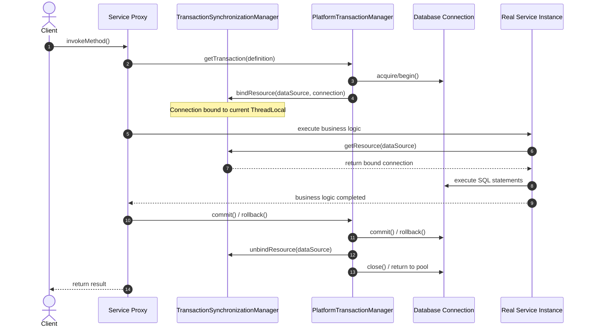

# Module 01: Java Transaction Fundamentals — Isolation, Propagation, and JTA/JPA Mechanics

Welcome back, students. Today we lay the bedrock of our distributed systems journey by mastering **local transactional semantics** and understanding how they map onto the Java runtime. 

Before we can coordinate databases across a network, we must build a flawless mental model of how a single database coordinates concurrent operations within the boundaries of a single Java Virtual Machine (JVM). We will analyze the Java Transaction API (JTA), dissect the inner workings of Spring's `@Transactional` proxy mechanics, explore transaction isolation and propagation anomalies, and inspect the thread-local state coordination that binds database connections to execution threads.

---

## 1. Academic Lecture: The Mechanics of State Boundaries

In database theory, a **transaction** is a logical unit of work that transition a system from one consistent state to another. To maintain consistency amidst concurrent executions and hardware faults, databases enforce the **ACID** properties (Atomicity, Consistency, Isolation, Durability).

When executing queries on a single relational database, we speak of **local transactions**. Local transactions are managed entirely by the database engine itself via the database connection socket. 

### From Local to Distributed Transactions

In a local transaction, database concurrency is governed by locking structures (such as page, row, or table locks) and transaction logs (Write-Ahead Logging - WAL) located on the same physical storage node. 

```
Local Transaction:
[ Java Application ] ---> JDBC Connection Socket ---> [ Single Database Instance (WAL, Row Locks) ]
```

However, when our application needs to update a relational database, send a message to a broker (e.g., Apache Kafka), and write to a document store (e.g., MongoDB) as a single atomic unit, local transactions fall short. The individual resource managers cannot coordinate with each other directly. This is where **Distributed Transactions** and the **Java Transaction API (JTA)** enter the picture. JTA abstracts the coordination of multiple resources using a **Transaction Manager** that orchestrates resource enlistment, commit protocols (like Two-Phase Commit), and crash recovery.

```
Distributed Transaction (JTA):
                      +-----------------------------+
                      |  JTA Transaction Manager    |
                      +--------------+--------------+
                                     |
             +-----------------------+-----------------------+
             | (Enlist / Prepare)    | (Enlist / Prepare)    | (Enlist / Prepare)
             v                       v                       v
      [ Database A ]          [ Kafka Broker ]        [ Database B ]
```

### The Transaction Manager's Role
At the center of any transactional Java application is the `TransactionManager` (specifically `jakarta.transaction.TransactionManager` in modern Jakarta EE or Spring's `PlatformTransactionManager`/`ReactiveTransactionManager` abstraction). The Transaction Manager is responsible for:
1. **Managing Transaction Contexts**: Associating a transaction instance with the executing thread.
2. **Resource Enlistment**: Registering transactional resources (connections, session objects) with the active transaction context.
3. **Transaction Lifecycle Coordination**: Initiating, committing, and rolling back transactions.
4. **Synchronization Callbacks**: Notifying registered listeners before and after transaction completion (e.g., to clean up caches or close files).

---

## 2. Theory vs. Production Trade-offs

When designing transaction systems, you must balance **isolation strength** (correctness) against **system throughput** (performance).

### Isolation Levels and Their Physical Realities

The SQL standard defines four transaction isolation levels. In Java, these map directly to the `java.sql.Connection` isolation constants or Spring's `Isolation` enum. Let us analyze the engineering trade-offs of each:

| Isolation Level | Dirty Reads | Non-Repeatable Reads | Phantom Reads | Database Mechanics | Performance Impact |
| :--- | :--- | :--- | :--- | :--- | :--- |
| **Read Uncommitted** | Allowed | Allowed | Allowed | Reads do not acquire shared locks; writes acquire exclusive locks. | Highest throughput; extreme risk of corrupt reads. |
| **Read Committed** | Prevented | Allowed | Allowed | Read locks are released as soon as the SQL statement completes. Writes hold locks until commit. | Medium throughput; default for PostgreSQL, SQL Server, and Oracle. |
| **Repeatable Read** | Prevented | Prevented | Allowed | Read locks and write locks are held until the transaction completes. | Lower throughput; default for MySQL (InnoDB uses MVCC). |
| **Serializable** | Prevented | Prevented | Prevented | Range locks or index-key range locks are held; or optimistic transaction validation detects write conflicts. | Lowest throughput; high lock contention and deadlock risk. |

### The Mechanics of Isolation Anomalies
*   **Dirty Read**: Transaction A updates a row but does not commit. Transaction B reads this row. Transaction A aborts. Transaction B has processed state that mathematically "never existed."
*   **Non-Repeatable Read**: Transaction A reads a row. Transaction B updates or deletes that row and commits. Transaction A reads the row again and finds different data.
*   **Phantom Read**: Transaction A queries a range of rows matching a predicate. Transaction B inserts a new row matching that predicate and commits. Transaction A re-executes the query and finds a "phantom" row that was not there before.

> [!IMPORTANT]
> **Production Reality (MVCC vs. Locking)**: 
> Modern databases rarely use raw lock-based isolation. They use **Multi-Version Concurrency Control (MVCC)**. In MVCC, when a record is updated, the database keeps the old version of the record. Read Committed and Repeatable Read isolation levels are achieved by letting readers access historical snapshots, eliminating read-write blocking. However, write-write conflicts still require row-level locking or optimistic retry strategies.

---

## 3. How to Use: Transaction Coordination in Java

Let us inspect how Spring's declarative `@Transactional` operates under the hood. Spring utilizes Aspect-Oriented Programming (AOP) proxies.

### The Transaction Interceptor Proxy Pattern

When a client calls a method annotated with `@Transactional`, the call is intercepted by a proxy object. This proxy retrieves the transaction context, enlists a connection from the connection pool, binds it to the current thread via a `ThreadLocal` structure, and invokes the target method.



### Programmatic vs. Declarative Transactions in Modern Java 21

To truly understand how this works, we will write a thread-safe simulation of Spring's transaction routing mechanism, followed by a programmatic JPA configuration using Java 21 virtual threads.

Here is the complete, self-contained implementation demonstrating Spring's transaction synchronization and execution using custom programmatic managers:

```java
package com.capstone.tx.fundamentals;

import java.sql.Connection;
import java.sql.SQLException;
import java.util.HashMap;
import java.util.Map;
import java.util.Objects;
import java.util.UUID;
import java.util.concurrent.Callable;

/**
 * Thread-safe simulation of Spring's TransactionSynchronizationManager.
 * Demonstrates how connection context is mapped to specific execution threads.
 */
public final class ThreadLocalTransactionManager {

    // Simulates the storage of active connections bound to the current thread
    private static final ThreadLocal<Map<Object, Connection>> resources = 
            ThreadLocal.withInitial(HashMap::new);

    private static final ThreadLocal<String> currentTransactionId = new ThreadLocal<>();
    private static final ThreadLocal<Boolean> transactionActive = ThreadLocal.withInitial(() -> false);

    private ThreadLocalTransactionManager() {}

    /**
     * Binds a JDBC Connection resource to the active thread context.
     */
    public static void bindResource(Object key, Connection connection) {
        Objects.requireNonNull(key, "Resource key cannot be null");
        Objects.requireNonNull(connection, "Connection cannot be null");
        resources.get().put(key, connection);
    }

    /**
     * Retrieves the JDBC Connection resource bound to the active thread context.
     */
    public static Connection getResource(Object key) {
        Objects.requireNonNull(key, "Resource key cannot be null");
        return resources.get().get(key);
    }

    /**
     * Unbinds and returns the JDBC Connection resource from the active thread context.
     */
    public static Connection unbindResource(Object key) {
        Objects.requireNonNull(key, "Resource key cannot be null");
        return resources.get().remove(key);
    }

    public static void startTransaction() {
        currentTransactionId.set(UUID.randomUUID().toString());
        transactionActive.set(true);
    }

    public static String getCurrentTransactionId() {
        return currentTransactionId.get();
    }

    public static boolean isTransactionActive() {
        return transactionActive.get();
    }

    public static void clear() {
        resources.get().clear();
        currentTransactionId.remove();
        transactionActive.set(false);
    }
}
```

Now, let us write a custom programmatic Transaction Template to simulate how exceptions and propagation rules are evaluated inside a transaction context.

```java
package com.capstone.tx.fundamentals;

import javax.sql.DataSource;
import java.sql.Connection;
import java.sql.SQLException;
import java.util.concurrent.Callable;
import java.util.logging.Level;
import java.util.logging.Logger;

/**
 * Custom Transaction Executor demonstrating manual resource enrollment,
 * rollback rules, and context cleanup.
 */
public class ProgrammaticTxTemplate {
    private static final Logger LOGGER = Logger.getLogger(ProgrammaticTxTemplate.class.getName());
    private final DataSource dataSource;

    public ProgrammaticTxTemplate(DataSource dataSource) {
        this.dataSource = Objects.requireNonNull(dataSource, "DataSource cannot be null");
    }

    /**
     * Executes the given callback inside a transaction boundary.
     * Rollback is triggered automatically for unchecked exceptions (RuntimeExceptions).
     */
    public <T> T execute(Callable<T> action, int isolationLevel) throws Exception {
        Connection connection = null;
        boolean isOuterTransaction = !ThreadLocalTransactionManager.isTransactionActive();

        try {
            if (isOuterTransaction) {
                LOGGER.info("Starting a new transaction transaction context...");
                connection = dataSource.getConnection();
                connection.setAutoCommit(false);
                connection.setTransactionIsolation(isolationLevel);

                ThreadLocalTransactionManager.startTransaction();
                ThreadLocalTransactionManager.bindResource(dataSource, connection);
            } else {
                LOGGER.info("Joining existing transaction: " + ThreadLocalTransactionManager.getCurrentTransactionId());
                connection = ThreadLocalTransactionManager.getResource(dataSource);
            }

            // Execute the actual business code
            T result = action.call();

            // Commit only if we are the root transaction context that initiated the connection
            if (isOuterTransaction && connection != null) {
                LOGGER.info("Committing transaction: " + ThreadLocalTransactionManager.getCurrentTransactionId());
                connection.commit();
            }
            return result;

        } catch (RuntimeException | Error e) {
            if (isOuterTransaction && connection != null) {
                LOGGER.log(Level.WARNING, "Unchecked exception detected. Rolling back transaction: " 
                        + ThreadLocalTransactionManager.getCurrentTransactionId(), e);
                try {
                    connection.rollback();
                } catch (SQLException rollbackEx) {
                    LOGGER.log(Level.SEVERE, "Failed to rollback transaction", rollbackEx);
                }
            }
            throw e;
        } catch (Exception e) {
            // Checked exception - by default, Spring and JPA commit transactions on checked exceptions!
            if (isOuterTransaction && connection != null) {
                LOGGER.info("Checked exception detected. Committing transaction per default Java rules: " 
                        + ThreadLocalTransactionManager.getCurrentTransactionId());
                connection.commit();
            }
            throw e;
        } finally {
            if (isOuterTransaction) {
                ThreadLocalTransactionManager.unbindResource(dataSource);
                ThreadLocalTransactionManager.clear();
                if (connection != null) {
                    try {
                        connection.setAutoCommit(true); // Restore defaults
                        connection.close();
                    } catch (SQLException closeEx) {
                        LOGGER.log(Level.SEVERE, "Failed to close database connection", closeEx);
                    }
                }
            }
        }
    }
}
```

Now, let us write a production service class using modern Spring Boot declarative transaction management to demonstrate the interaction between transaction propagation styles.

```java
package com.capstone.tx.fundamentals;

import org.springframework.beans.factory.annotation.Autowired;
import org.springframework.stereotype.Service;
import org.springframework.transaction.annotation.Isolation;
import org.springframework.transaction.annotation.Propagation;
import org.springframework.transaction.annotation.Transactional;

/**
 * Financial Account Processing service demonstrating Spring Transaction Propagation.
 */
@Service
public class AccountProcessingService {

    private final AccountRepository accountRepository;
    private final AuditLogService auditLogService;

    @Autowired
    public AccountProcessingService(AccountRepository accountRepository, AuditLogService auditLogService) {
        this.accountRepository = accountRepository;
        this.auditLogService = auditLogService;
    }

    /**
     * Updates an account balance and logs an audit record.
     * Propagation.REQUIRED is used: if a transaction exists, it joins it. If not, it creates one.
     */
    @Transactional(propagation = Propagation.REQUIRED, isolation = Isolation.READ_COMMITTED)
    public void processTransfer(String sourceAccountId, String targetAccountId, double amount) {
        // Step 1: Perform balance mutations
        accountRepository.decrementBalance(sourceAccountId, amount);
        accountRepository.incrementBalance(targetAccountId, amount);

        try {
            // Step 2: Write audit record.
            // We want the audit record to write even if the balance mutation fails or rolls back.
            auditLogService.writeLog(sourceAccountId, "Transferred " + amount + " to " + targetAccountId);
        } catch (Exception e) {
            // We catch the exception to prevent the audit failure from rolling back our transfer
            System.err.println("Audit logging failed, continuing transfer processing: " + e.getMessage());
        }
    }
}
```

```java
package com.capstone.tx.fundamentals;

import org.springframework.stereotype.Service;
import org.springframework.transaction.annotation.Propagation;
import org.springframework.transaction.annotation.Transactional;

@Service
public class AuditLogService {

    private final AuditRepository auditRepository;

    public AuditLogService(AuditRepository auditRepository) {
        this.auditRepository = auditRepository;
    }

    /**
     * Propagation.REQUIRES_NEW suspends the caller's transaction context and starts
     * an isolated transaction. If this audit log fails, it rolls back independently.
     * If the outer transaction rolls back, this log remains committed.
     */
    @Transactional(propagation = Propagation.REQUIRES_NEW)
    public void writeLog(String accountId, String action) {
        auditRepository.save(new AuditEntry(accountId, action));
    }
    
    /**
     * Propagation.MANDATORY requires that an existing transaction must be open.
     * If called without an active transaction, it throws TransactionRequiredException.
     */
    @Transactional(propagation = Propagation.MANDATORY)
    public void recordInternalState(String status) {
        auditRepository.save(new AuditEntry("SYSTEM", "State update: " + status));
    }
}
```

---

## 4. Common Errors & Pitfalls

Even senior developers routinely corrupt their data layers through simple structural mistakes in Spring's proxy mechanics. Let's analyze the most common production bugs.

### Pitfall 1: The Self-Invocation Gotcha (Proxy Bypass)

Since Spring's declarative transaction mechanism relies on AOP proxies, invoking a `@Transactional` method from *within* the same service class will bypass the proxy entirely. 

```java
@Service
public class OrderService {

    public void createOrder(Order order) {
        // Bypasses the proxy! The transaction is NOT started.
        saveOrder(order); 
    }

    @Transactional
    public void saveOrder(Order order) {
        // JPA saving logic
    }
}
```

#### Why it fails
When `createOrder` is called, the caller is calling the method on the proxy wrapper. The proxy delegates to the target `OrderService` instance. However, once execution is inside the target instance, any call to `saveOrder` is executed against the local `this` reference, completely skipping the AOP advice interceptor chain.
#### How to resolve
1. Extract `saveOrder` into a separate Spring component (`OrderRepository` or `OrderWriter`).
2. Programmatically execute the code inside a `TransactionTemplate`.
3. Self-inject the bean context via proxy reference (less clean):
   ```java
   @Autowired
   private OrderService self;
   ```

### Pitfall 2: Confusing Checked Exceptions and Rollbacks

By default, declarative transactions managed via `@Transactional` only roll back when an **unchecked exception** (`RuntimeException` or `Error`) propagates out of the proxy boundary. If a **checked exception** (`java.io.IOException`, `java.sql.SQLException`) is thrown, the transaction is committed anyway!

```java
@Transactional
public void registerUser(User user) throws IOException {
    userRepository.save(user);
    if (networkCheckFailed()) {
        throw new IOException("Remote connection timed out"); // Transaction STILL COMMITS!
    }
}
```

#### How to resolve
Explicitly configure rollback boundaries:
```java
@Transactional(rollbackFor = Exception.class) // Roll back for checked exceptions too
public void registerUser(User user) throws IOException { ... }
```

### Pitfall 3: Thread-local Bound connection Leaks in Multi-threaded context
Since transaction resources are bound using `ThreadLocal`, running operations inside custom spawned threads (or using Java 21 Virtual Threads) from within a `@Transactional` method will *not* inherit the parent's transaction boundary.

```java
@Transactional
public void processBatch(List<Task> tasks) {
    tasks.forEach(task -> {
        Thread.startVirtualThread(() -> {
            // Runs on a separate thread! 
            // It has NO access to the parent thread's connection or transactional lock context.
            taskService.execute(task); 
        });
    });
}
```
If the child threads try to reuse database resources, they will acquire *new* database connections, potentially causing connection pool starvation or deadlocks as the parent thread remains blocked waiting for child completions.

---

## 5. Socratic Review Questions

### Question 1
Suppose a method annotated with `@Transactional(propagation = Propagation.REQUIRES_NEW)` is executed inside an active transaction. The nested method throws a `RuntimeException`, but the caller catches the exception in a `try-catch` block and completes successfully. Will the parent transaction be marked as rollback-only? What if the nested transaction propagation was `REQUIRED` instead of `REQUIRES_NEW`?

#### Answer
If the nested transaction propagation is **`REQUIRES_NEW`**, it suspends the caller's transaction and creates a completely distinct physical transaction context (holding a second database connection). When the nested transaction throws a `RuntimeException`, that inner transaction is marked as rollback-only and rolls back. Since the parent transaction caught the exception, the parent context does not receive the exception directly. The parent transaction is free to commit its changes successfully.

If the nested transaction propagation is **`REQUIRED`**, it does *not* create a new transaction; it joins the caller's active transaction context. When the nested method throws a `RuntimeException`, even if it is caught by the caller, the underlying transaction synchronization mechanism (sharing a single database connection) marks the single shared transaction context as **rollback-only**. When the caller attempts to commit at the end of its execution block, the transaction manager detects the rollback-only flag and throws a `UnexpectedRollbackException`. The entire transaction is rolled back.

### Question 2
Why does the JDBC specification require connection auto-commit to be set to `false` in order to execute transactions programmatically? What physical commands are sent to PostgreSQL when this toggle is flipped?

#### Answer
By default, standard JDBC database connections operate in auto-commit mode, meaning each individual SQL statement is treated as an independent transaction and is committed immediately upon execution. To group multiple SQL statements into a single atomic transaction, auto-commit must be disabled (`setAutoCommit(false)`). 

When auto-commit is flipped to `false`, the JDBC driver sends a `BEGIN` (or equivalent start transaction statement depending on the database engine) to the database server. All subsequent queries sent over that connection socket are executed within the scope of this active database transaction context. The transaction remains open until the application explicitly sends a `commit()` (sending `COMMIT`) or `rollback()` (sending `ROLLBACK`) command over the socket, or the connection is terminated.

---

## 6. Hands-on Challenge: Fixing a Corrupted Transaction Boundary

### The Scenario
You are building an e-commerce payment flow. If an order placement fails, the database state must roll back. However, due to several bad engineering implementations, the application is suffering from two major bugs:
1. Orders are saved even when the downstream payment process throws a checked exception (`PaymentDeclinedException`).
2. Even when a payment fails, the system fails to write an audit trail record representing the failure, because the rollback of the transaction wipes out the audit records!

Your goal is to correct this service implementation so that:
- The order creation rolls back if a `PaymentDeclinedException` occurs.
- An audit entry is persisted in the database *even if* the order creation rolls back.

### Code to Fix

Save the following interfaces to simulate databases:

```java
package com.capstone.tx.fundamentals.challenge;

public interface OrderRepository {
    void save(String orderId, String item, double amount);
}

public interface AuditRepository {
    void log(String text);
    int getLogCount();
}

public class PaymentDeclinedException extends Exception {
    public PaymentDeclinedException(String message) {
        super(message);
    }
}
```

Implement your solution in the `OrderProcessorService` class below. You need to ensure proper transactional configuration so that the verification tests pass.

```java
package com.capstone.tx.fundamentals.challenge;

import org.springframework.transaction.annotation.Transactional;
import org.springframework.transaction.annotation.Propagation;

public class OrderProcessorService {

    private final OrderRepository orderRepository;
    private final AuditRepository auditRepository;
    private final OrderProcessorService selfReference; // Hint: Self-invocation fix

    public OrderProcessorService(OrderRepository orderRepository, AuditRepository auditRepository, OrderProcessorService selfReference) {
        this.orderRepository = orderRepository;
        this.auditRepository = auditRepository;
        this.selfReference = selfReference;
    }

    // TODO: Fix the transactional configuration here to ensure rollback occurs on PaymentDeclinedException
    public void processOrder(String orderId, String item, double amount) throws PaymentDeclinedException {
        // Save order
        orderRepository.save(orderId, item, amount);

        // Process payment
        try {
            chargeCard(amount);
        } catch (PaymentDeclinedException e) {
            // TODO: Log the transaction failure in the audit DB.
            // This audit log MUST persist even when the rest of the order transaction rolls back.
            // Ensure you do not suffer from the self-invocation gotcha!
            logAuditFailure("Payment declined for order: " + orderId);
            throw e;
        }
    }

    // TODO: Configure propagation to run in a separate transaction context
    public void logAuditFailure(String message) {
        auditRepository.log(message);
    }

    private void chargeCard(double amount) throws PaymentDeclinedException {
        if (amount > 1000.0) {
            throw new PaymentDeclinedException("Insufficient credit limit");
        }
    }
}
```

### Verification Suite

To verify your solution, the test cases must execute successfully without throwing assertion failures:

```java
package com.capstone.tx.fundamentals.challenge;

import java.util.HashMap;
import java.util.Map;

public class TransactionFundamentalsVerifier {

    private static class MockOrderRepository implements OrderRepository {
        final Map<String, Double> orders = new HashMap<>();

        @Override
        public void save(String orderId, String item, double amount) {
            orders.put(orderId, amount);
        }
    }

    private static class MockAuditRepository implements AuditRepository {
        int logCount = 0;

        @Override
        public void log(String text) {
            logCount++;
        }

        @Override
        public int getLogCount() {
            return logCount;
        }
    }

    public static void main(String[] args) {
        MockOrderRepository orderRepo = new MockOrderRepository();
        MockAuditRepository auditRepo = new MockAuditRepository();

        // Standard setup wrapper (Proxy simulation)
        OrderProcessorService service = null; 
        
        // TODO: Build your proxy wrapping testing mechanism or instantiate the class directly with self-inject simulation
        // service = new OrderProcessorService(orderRepo, auditRepo, serviceProxy);
        
        System.out.println("Running verification tests...");
    }
}
```

Verify that under rollback conditions, the database transaction successfully reverses the order mutation, but preserves the audit logs. Write your complete solution inside `modules/01-java-transaction-fundamentals.md`.
