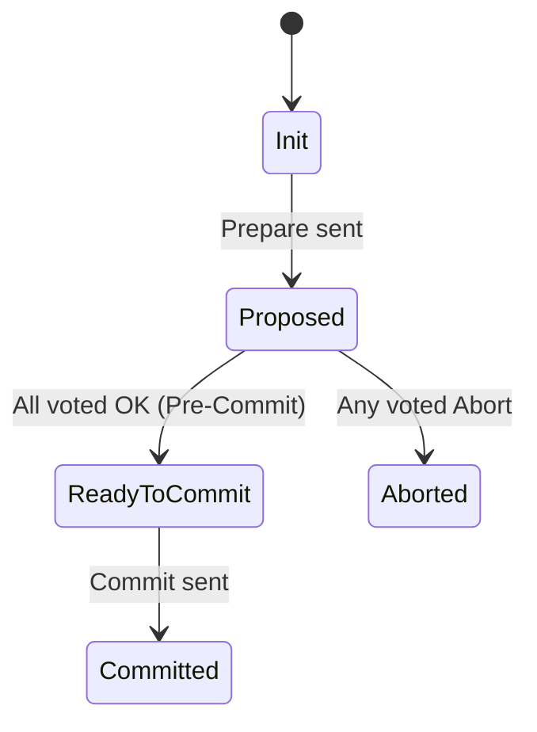
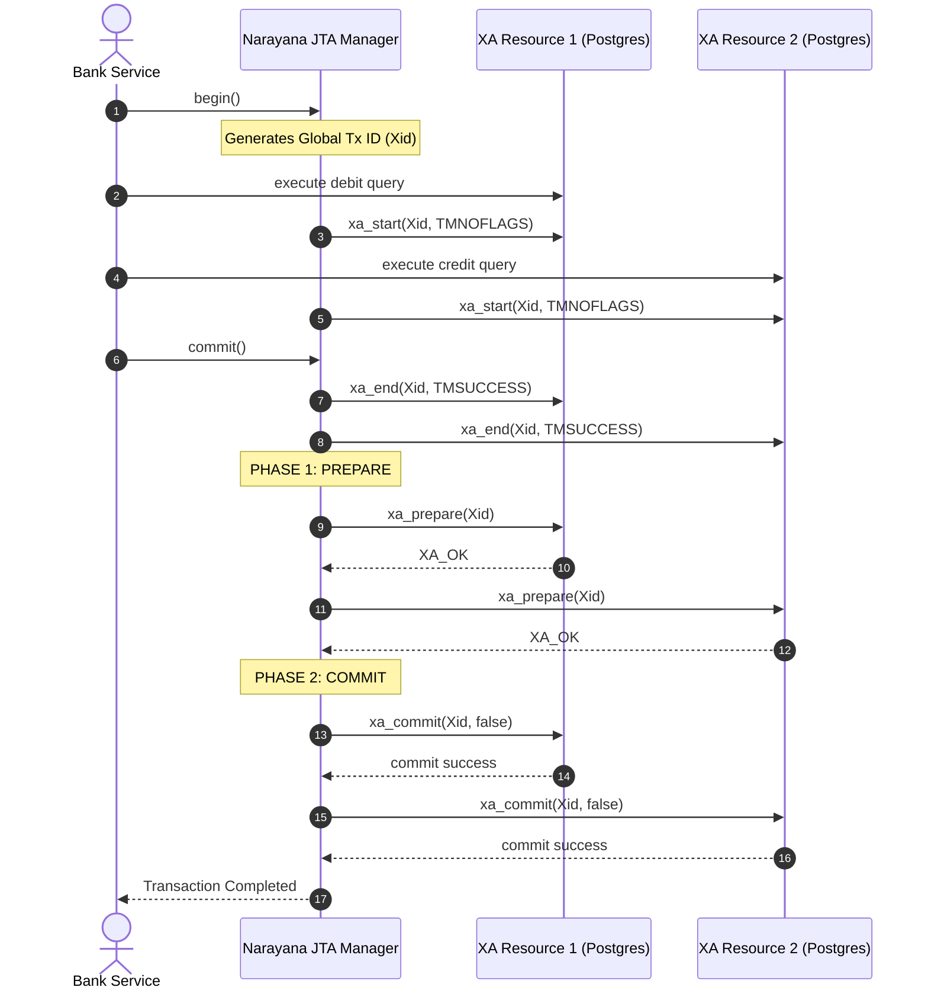

# Module 02: Two-Phase Commit (2PC) and XA Transactions

Welcome back to CS-509. Today, we step beyond the comfortable borders of a single database instance and enter the realm of multi-resource consistency. 

When your business logic mandates that updates to PostgreSQL and writes to an MQ broker must either succeed together or fail together, local database transactions are useless. We need a protocol that can coordinate multiple heterogeneous resources. In this lecture, we will study the **X/Open XA (eXtended Architecture)** standard, dissect the mechanics and severe limitations of the **Two-Phase Commit (2PC)** protocol, contrast it with the **Three-Phase Commit (3PC)** protocol, and build an XA coordinator in Java.

---

## 1. Academic Lecture: The Mechanics of 2PC and XA

The **X/Open Distributed Transaction Processing (DTP)** model defines three core components:
1.  **Application Program (AP)**: Defines the boundaries of the transaction and executes business logic.
2.  **Resource Manager (RM)**: Manages shared resources (e.g., PostgreSQL, Oracle, ActiveMQ).
3.  **Transaction Manager (TM)**: Orchestrates the transaction, assigning global IDs and coordinating RM commits.

The **XA interface** is a bidirectional contract between the TM and the RM. In Java, this is represented by the classes `jakarta.transaction.xa.XAResource` and `jakarta.transaction.xa.Xid`.

### The Two-Phase Commit Protocol (2PC)

2PC is a consensus-driven commit protocol that guarantees atomicity across multiple participants. It proceeds in two distinct phases:

```
                  [ Coordinator (TM) ]
                     /            \
    PHASE 1: PREPARE/              \ PHASE 1: PREPARE
                   v                v
          [ Participant A ]   [ Participant B ]
                   \                /
      PHASE 2: COMMIT\              / PHASE 2: COMMIT
                     v            v
                  [ Coordinator (TM) ]
```

#### Phase 1: Prepare (Voting Phase)
1.  The coordinator sends a `PREPARE` command to all registered participants.
2.  Each participant executes the transaction locally up to the point of committing. It writes its changes to a local undo/redo log and locks the affected database rows.
3.  If successful, the participant votes `VOTE_COMMIT` (returns `XA_OK`). If it fails (e.g., due to a constraint violation or lock conflict), it votes `VOTE_ABORT` (returns `XA_RB*`).

#### Phase 2: Commit / Abort (Execution Phase)
*   **Scenario A (All Vote Commit)**: The coordinator writes a commit record to its transaction log and sends a `COMMIT` command to all participants. The participants commit their local transactions, release their locks, and reply with an acknowledgement.
*   **Scenario B (Any Vote Abort / Timeout)**: The coordinator writes an abort record to its log and sends a `ROLLBACK` command to all participants. Participants rollback their local actions and release locks.

### 2PC Limitations and the Blocking Problem

The fundamental flaw of 2PC is that it is a **blocking protocol**. 

If the Coordinator crashes *after* a participant has voted `VOTE_COMMIT` but *before* the commit command is delivered, the participant is left in an **in-doubt** state. It cannot abort, because another participant might have received the commit command. It cannot commit, because the coordinator might have decided to abort. 

Consequently, the participant must hold all locks indefinitely until the coordinator recovers and delivers the final decision. This leads to cascade blocking across the entire system.

```
                  [ Coordinator ] (CRASHES after Prepare!)
                     x            x
                    /              \
    (Locks Held!)  v                v  (Locks Held!)
      [ Participant A ]          [ Participant B ]
      "Am I committing or aborting? I must wait forever..."
```

### Three-Phase Commit (3PC) as an Alternative

3PC is a non-blocking protocol designed to resolve coordinator failures by introducing a third phase: **Pre-Commit**.



1.  **Can-Commit**: Coordinator asks if participants can commit. Participants vote.
2.  **Pre-Commit**: If all vote OK, coordinator issues a `Pre-Commit` message. Participants transition to a "Ready-to-Commit" state but do not commit yet. If the coordinator or network fails now, participants can resolve the outcome via timeout rules: if they are in the Pre-Commit state, they assume the commit will occur and commit after a timeout.
3.  **Do-Commit**: Coordinator sends the final `Commit` command.

#### Why 3PC is rarely used in production
While 3PC is non-blocking under coordinator failures, it fails to guarantee consistency if a **network partition** occurs. If a partition divides the coordinator from some participants during the Pre-Commit phase, one group may timeout and abort while the other group commits. Since network partitions are common in modern cloud environments, engineering architectures prefer either strong consensus engines (Raft/Paxos) or eventually consistent designs (Sagas).

---

## 2. Theory vs. Production Trade-offs

Using 2PC/XA transactions introduces significant architectural overhead:

### 1. Latency and Lock Contention
During Phase 1, participants must lock all modified rows. These locks are held across multiple network round-trips while the coordinator polls other participants, writes its transaction log, and delivers the commit commands. 
*   **Local transaction lock duration**: Microseconds.
*   **XA transaction lock duration**: Tens to hundreds of milliseconds.
This drastically reduces maximum write throughput.

### 2. Heuristic Decisions
If a network partition isolates a database participant for an extended period, the database administrator or the database daemon may invoke a **heuristic decision** to manually force a commit or rollback of an in-doubt transaction to release blocking resources.
*   `HEURISTIC_COMMIT`: A participant manually committed because it ran out of locks, but the coordinator eventually decided to abort.
*   `HEURISTIC_ROLLBACK`: A participant manually rolled back, but the coordinator decided to commit.
*   `HEURISTIC_MIXED`: Parts of the transaction committed while other parts rolled back.
Heuristic exceptions require manual database auditing and reconciliation scripts.

---

## 3. How to Use: Coordinating XA in Java

In a production Spring Boot application, XA transactions are managed using a JTA Transaction Manager (such as **Narayana** or **Atomikos**). 

Here is the transactional flow sequence for a coordinate write across two PostgreSQL databases:



Let's implement a complete, compile-grade **Distributed Coordinator** in Java 21 using Jakarta's `XAResource` and `Xid` APIs to show exactly how 2PC operates programmatically.

First, we define a standard implementation of the `Xid` interface required by the Java XA API:

```java
package com.capstone.tx.xa;

import jakarta.transaction.xa.Xid;
import java.util.Arrays;

/**
 * Concrete implementation of the Xid interface for global transaction identifiers.
 */
public record CustomXid(
    int formatId,
    byte[] globalTransactionId,
    byte[] branchQualifier
) implements Xid {

    @Override
    public byte[] getGlobalTransactionId() {
        return globalTransactionId.clone();
    }

    @Override
    public byte[] getBranchQualifier() {
        return branchQualifier.clone();
    }

    @Override
    public String toString() {
        return "Xid[Format=" + formatId + 
               ", Global=" + javax.xml.bind.DatatypeConverter.printHexBinary(globalTransactionId) + 
               ", Branch=" + javax.xml.bind.DatatypeConverter.printHexBinary(branchQualifier) + "]";
    }
}
```

Now, let us write the custom transaction coordinator engine that manages the two-phase commit protocol across registered `XAResource` components.

```java
package com.capstone.tx.xa;

import jakarta.transaction.xa.XAResource;
import jakarta.transaction.xa.XAException;
import jakarta.transaction.xa.Xid;
import java.util.ArrayList;
import java.util.List;
import java.util.UUID;
import java.util.logging.Level;
import java.util.logging.Logger;

/**
 * A manual 2PC Coordinator demonstrating resource enlistment, voting, 
 * recovery, and rollback mechanisms.
 */
public class ManualXACoordinator {
    private static final Logger LOGGER = Logger.getLogger(ManualXACoordinator.class.getName());

    private final List<XAResource> participants = new ArrayList<>();
    private final int formatId = 0xCAFEE;

    public void enlistResource(XAResource resource) {
        this.participants.add(resource);
    }

    /**
     * Executes a distributed write across all enlisted resources.
     */
    public boolean executeDistributedTransaction(List<Runnable> businessLogicActions) {
        if (businessLogicActions.size() != participants.size()) {
            throw new IllegalArgumentException("Action count must match the participant count");
        }

        // Generate a Global Transaction ID
        byte[] globalTxId = UUID.randomUUID().toString().getBytes();
        List<Xid> branches = new ArrayList<>();

        // Phase 0: Start branches and run business logic
        try {
            for (int i = 0; i < participants.size(); i++) {
                XAResource rm = participants.get(i);
                byte[] branchQualifier = ("branch-" + i).getBytes();
                Xid branchXid = new CustomXid(formatId, globalTxId, branchQualifier);
                branches.add(branchXid);

                // Start work on this resource
                rm.start(branchXid, XAResource.TMNOFLAGS);
                
                // Execute database statements
                businessLogicActions.get(i).run();
                
                // End execution boundary on this resource
                rm.end(branchXid, XAResource.TMSUCCESS);
            }
        } catch (Exception e) {
            LOGGER.log(Level.SEVERE, "Exception during Phase 0 execution. Aborting transaction immediately.", e);
            rollbackAllBranches(branches);
            return false;
        }

        // Phase 1: Prepare Phase (Voting)
        boolean allPrepared = true;
        List<Xid> preparedBranches = new ArrayList<>();

        for (int i = 0; i < participants.size(); i++) {
            XAResource rm = participants.get(i);
            Xid branchXid = branches.get(i);
            try {
                LOGGER.info("Sending PREPARE to participant branch: " + branchXid);
                int vote = rm.prepare(branchXid);
                
                if (vote == XAResource.XA_OK) {
                    preparedBranches.add(branchXid);
                } else if (vote == XAResource.XA_RDONLY) {
                    // Read-only optimization: database committed silently because no updates were made.
                    LOGGER.info("Resource is read-only. No commit required: " + branchXid);
                }
            } catch (XAException e) {
                LOGGER.log(Level.WARNING, "Participant voted ABORT (XAException) on branch: " + branchXid, e);
                allPrepared = false;
                break;
            }
        }

        // Phase 2: Commit or Rollback
        if (allPrepared) {
            LOGGER.info("All resources voted COMMIT. Executing commits...");
            return commitAllBranches(preparedBranches);
        } else {
            LOGGER.warning("One or more resources voted ABORT. Executing rollbacks...");
            rollbackAllBranches(branches);
            return false;
        }
    }

    private boolean commitAllBranches(List<Xid> branches) {
        boolean overallSuccess = true;
        for (int i = 0; i < branches.size(); i++) {
            XAResource rm = participants.get(i);
            Xid branchXid = branches.get(i);
            try {
                // False means do not use one-phase optimization (commit phase 2)
                rm.commit(branchXid, false);
                LOGGER.info("Commit successful on branch: " + branchXid);
            } catch (XAException e) {
                LOGGER.log(Level.SEVERE, "CRITICAL: Heuristic Failure committing branch: " + branchXid, e);
                overallSuccess = false;
                // In production, log error for operators to reconcile DBs manually.
            }
        }
        return overallSuccess;
    }

    private void rollbackAllBranches(List<Xid> branches) {
        for (int i = 0; i < branches.size(); i++) {
            XAResource rm = participants.get(i);
            if (i >= branches.size()) break;
            Xid branchXid = branches.get(i);
            try {
                rm.rollback(branchXid);
                LOGGER.info("Rollback successful on branch: " + branchXid);
            } catch (XAException e) {
                LOGGER.log(Level.SEVERE, "Failed to rollback branch: " + branchXid, e);
            }
        }
    }
}
```

---

## 4. Common Errors & Pitfalls

### Pitfall 1: XA Connection Pool Starvation
Because XA transactions span multiple network hops and external systems, database connections remain open much longer than in local transactions. If your application handles a high volume of transactions, you will exhaust your HikariCP or connection pool sizes.
*   **Symptom**: Threads block waiting to acquire a connection from the pool, leading to timeout errors (`Connection is not available`).
*   **Mitigation**: Set connection timeouts reasonably low and configure the connection pool sizes dynamically based on target system capacity.

### Pitfall 2: Lost Transaction Log Directory
The JTA transaction coordinator writes its active transaction recovery logs to a physical file directory (e.g., Narayana's Object Store). If the coordinator node crashes and its container restarts with a **clean, ephemeral filesystem** (i.e., without persistent volumes), the transaction recovery logs are permanently lost.
*   **Symptom**: If any participant crashed during Phase 1 in an in-doubt state, it will hang indefinitely, keeping database rows locked because no coordinator exists to clean up the logs.
*   **Mitigation**: Always run the JTA coordinator logs folder on a persistent volume mount (`PV/PVC` in Kubernetes).

---

## 5. Socratic Review Questions

### Question 1
Explain the **One-Phase Commit (1PC) optimization** in XA. Under what architectural condition can a Transaction Manager bypass Phase 1 (Prepare) entirely?

#### Answer
The One-Phase Commit (1PC) optimization is an optimization used by the JTA Transaction Manager when there is only **one** write-capable participant registered in the distributed transaction. 
If the global transaction only involves a single XA resource (or one write resource alongside multiple read-only resources), it is redundant to execute the Prepare phase. The coordinator can bypass Phase 1 and directly issue `xa_commit(xid, true)` (where `true` represents the one-phase flag). The database commits immediately, releasing row locks and avoiding the latency of the two-phase round-trip.

### Question 2
What is a **Heuristic Hazard** in JTA, and how does it violate the ACID properties?

#### Answer
A Heuristic Hazard occurs when a participant in a distributed transaction makes a local decision to commit or rollback independently of the transaction coordinator, typically due to a network partition or a timeout. 
This violates the **Atomicity** property of ACID. For instance, if Participant A prepared successfully and is waiting in an in-doubt state, but a long-standing network partition occurs, it may decide heuristic rollback. Meanwhile, Participant B had already received the commit command from the coordinator and committed. The system is left in a partially-committed state, resulting in data inconsistency.

---

## 6. Hands-on Challenge: Building a Non-Blocking 2PC Simulator

### The Challenge
In this exercise, you must write the recovery engine logic for our custom `ManualXACoordinator`. 

If the coordinator fails during Phase 2 (Commit Phase), we want to write a recovery daemon that reads the coordinator's state log and reconciles the participants. If a participant throws a transaction timeout, your coordinator should rollback all other nodes to preserve atomicity.

Implement the `recoverAndReconcile` method in the coordinator stub below.

```java
package com.capstone.tx.xa.challenge;

import jakarta.transaction.xa.XAResource;
import jakarta.transaction.xa.XAException;
import jakarta.transaction.xa.Xid;
import java.util.List;

public class RecoveryCoordinator {

    public enum TxState {
        PREPARED, COMMITTED, ABORTED
    }

    public record TxLog(Xid xid, TxState state, List<XAResource> participants) {}

    /**
     * Recovery Daemon entry point.
     * Evaluates the recorded transaction state log and reconciles all participants.
     */
    public void recoverAndReconcile(TxLog log) {
        // TODO: Complete this implementation.
        // 1. If state is COMMITTED, ensure all participants have committed the given Xid.
        // 2. If state is ABORTED, ensure all participants have rolled back the given Xid.
        // 3. If state is PREPARED (meaning the coordinator crashed during commit decision),
        //    you must decide to rollback all participants to guarantee safety.
        // If a participant throws XAException with error code XAException.XAER_NOTA, 
        // it means that branch was already rolled back or committed. Handle it safely!
    }
}
```

Write your implementation and test it against various failure modes to confirm your recovery coordinator is robust. Save your notes in `modules/02-two-phase-commit-and-xa.md`.
