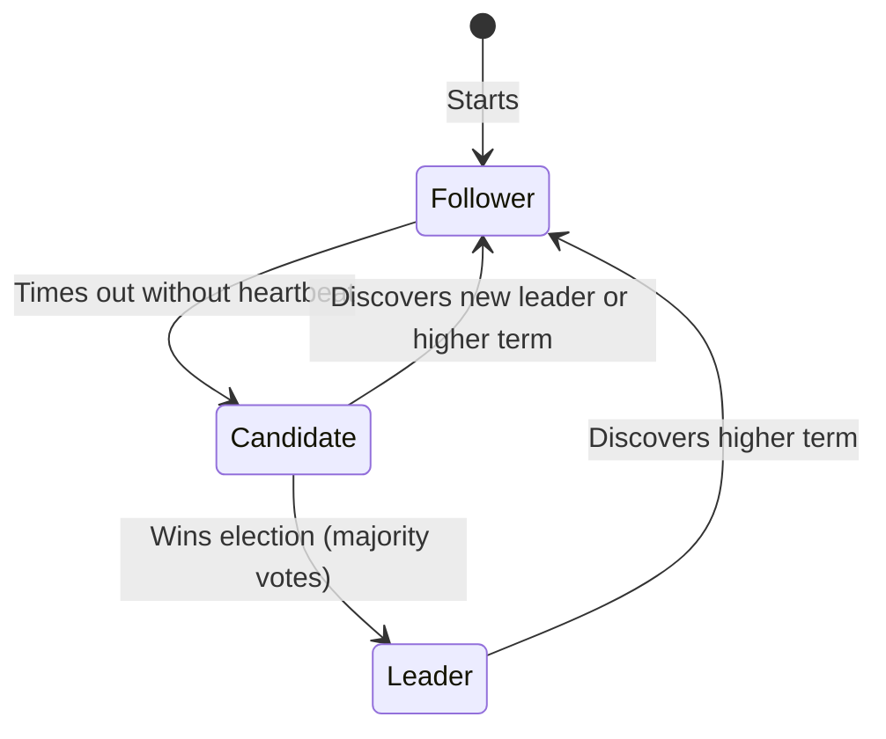
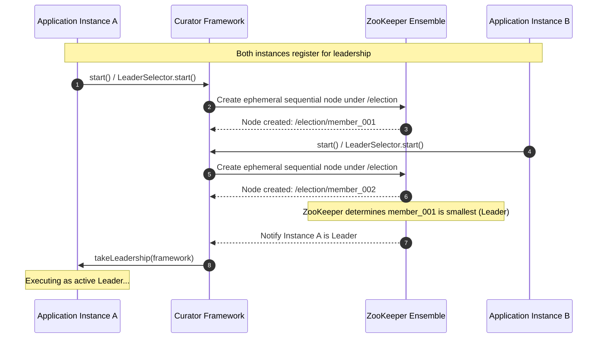

# Module 03: Distributed Consensus — Paxos, Raft, and ZooKeeper Leader Election

Welcome back, students. Today we tackle one of the most intellectually rewarding challenges in computer science: **Distributed Consensus**.

In single-node systems, we rely on a single CPU core or physical coordinator to declare the "ground truth." In distributed systems, where multiple nodes operate independently over an unreliable network, we must ensure all non-faulty nodes agree on a sequence of state transitions. We will study the classical **Paxos** protocol, analyze the **Raft** protocol, examine how **Quorums** protect against split-brain scenarios, and implement **ZooKeeper-based Leader Election** in Java using Apache Curator.

---

## 1. Academic Lecture: The Mechanics of Consensus

A consensus protocol allows a set of independent processes to agree on a single value or sequence of values. Formally, a consensus protocol must satisfy three core properties:
1.  **Agreement**: Every non-faulty process must agree on the same value.
2.  **Validity**: The agreed-upon value must have been proposed by at least one process.
3.  **Termination**: Every non-faulty process must eventually decide on a value.

### Paxos: The Foundation of Consensus

Formulated by Leslie Lamport, Paxos is the theoretical baseline for distributed consensus. It defines three distinct roles (though a single physical node can play all three roles):
*   **Proposers**: Advocate for specific values.
*   **Acceptors**: Act as the consensus voting body.
*   **Learners**: Receive the agreed-upon value.

```
Proposer                    Acceptor Pool                    Learner
   |                              |                             |
   |---- Phase 1a: Prepare(n) --->|                             |
   |<--- Phase 1b: Promise(n,v) --|                             |
   |                              |                             |
   |---- Phase 2a: Accept(n,v) -->|                             |
   |<--- Phase 2b: Accepted ------|                             |
   |                              |                             |
   |------------------------------+---------------------------->| (Decided!)
```

#### Paxos Execution Steps:
*   **Phase 1a (Prepare)**: A Proposer selects a unique proposal number $n$ and sends a `Prepare(n)` message to a majority of Acceptors.
*   **Phase 1b (Promise)**: If an Acceptor receives a `Prepare(n)` with $n$ greater than any proposal number it has seen, it returns a `Promise(n)` agreeing not to accept any proposals numbered less than $n$. It also sends back the highest-numbered proposal it has already accepted, if any.
*   **Phase 2a (Accept)**: Once the Proposer receives promises from a majority of Acceptors, it sends an `Accept(n, value)` message to those Acceptors. The `value` is set to the highest-numbered proposal returned in Phase 1b, or any value if no values were returned.
*   **Phase 2b (Accepted)**: If an Acceptor receives `Accept(n, value)`, it accepts the proposal unless it has already promised to ignore proposals numbered $n$. It notifies the Proposer and Learners of the acceptance.

### Raft: Consensus for the Modern Engineer

Paxos is notoriously difficult to understand and implement in practice. In 2014, Ongaro and Ousterhout introduced **Raft**, designed to be understandable and equivalent in safety to Paxos. 

Raft breaks down consensus into three subproblems: Leader Election, Log Replication, and Safety.

#### 1. Leader Election
At any time, a Raft node is in one of three states: **Leader**, **Follower**, or **Candidate**.



*   Followers expect periodic heartbeat messages (`AppendEntries` RPC) from the Leader.
*   If a Follower's randomized election timeout (typically 150ms-300ms) expires, it transitions to a **Candidate**, increments the election term, votes for itself, and sends `RequestVote` RPCs to other nodes.
*   If a Candidate receives votes from a majority of nodes, it becomes the **Leader**.

#### 2. Log Replication
Once elected, the Leader accepts client commands, writes them to its local log, and replicates them to the followers via `AppendEntries` RPCs. When a log entry is safely replicated to a majority of nodes, the Leader commits it and applies it to its local state machine.

#### 3. Safety: Leader Completeness
Raft guarantees that if a log entry is committed in a given term, that entry will be present in the logs of the leaders for all higher terms. A voter will deny a Candidate's vote request if the Candidate's log is less up-to-date than the voter's own log.

### Split-Brain Mitigation and Quorum Mathematics

In distributed networks, communication links can fail, partitioning nodes into isolated subgroups. If two subgroups attempt to elect a leader independently, a **split-brain** scenario occurs. Both leaders might write conflicting transactions, permanently corrupting the system state.

```
       Network Partition
[ Node A ] [ Node B ]  |  [ Node C ] [ Node D ] [ Node E ]
(Minority - Size 2)    |  (Majority - Size 3)
Cannot form Quorum     |  Can elect Leader
```

Consensus engines prevent split-brain using **Quorums**. A Quorum is the minimum number of active votes required to perform any transaction or elect a leader. 

For a system containing $N$ total nodes, the Quorum size $Q$ is mathematically defined as:
$$Q = \left\lfloor \frac{N}{2} \right\rfloor + 1$$

If $N = 5$, then $Q = 3$. If the network partitions into two groups of sizes $2$ and $3$, only the group with $3$ nodes can reach quorum. The other group will detect it cannot reach a majority, refuse to make updates, and prevent conflicting states.

---

## 2. Theory vs. Production Trade-offs

Consensus protocols offer strong consistency guarantees, but they come at a heavy cost.

### 1. Latency Overhead
Every write operation must be synchronously replicated across the network to a majority of nodes before it can be confirmed. This limits write performance to the latency of the round-trip times between the leader and the quorum.

### 2. The Network Boundary bottleneck
If the network is unstable, frequent leader elections will halt the cluster. During leader elections, the consensus cluster cannot accept client writes, leading to transient availability drops.

---

## 3. How to Use: ZooKeeper Leader Election in Java

Apache ZooKeeper is a distributed hierarchical key-value store that implements the **Zab (ZooKeeper Atomic Broadcast)** protocol, which is conceptually similar to Raft. 

In Java, rather than implementing ZAB or Raft from scratch, we use the production-grade library **Apache Curator** to coordinate leader election.



Let's write a complete, production-grade **Leader Election Coordination** class using Apache Curator and ZooKeeper. 

```java
package com.capstone.tx.consensus;

import org.apache.curator.framework.CuratorFramework;
import org.apache.curator.framework.CuratorFrameworkFactory;
import org.apache.curator.framework.recipes.leader.LeaderSelector;
import org.apache.curator.framework.recipes.leader.LeaderSelectorListenerAdapter;
import org.apache.curator.retry.ExponentialBackoffRetry;
import org.apache.curator.framework.state.ConnectionState;

import java.io.Closeable;
import java.io.IOException;
import java.util.concurrent.TimeUnit;
import java.util.concurrent.atomic.AtomicBoolean;
import java.util.logging.Logger;

/**
 * Production-ready wrapper for Curator LeaderSelector.
 * Coordinates leadership across multiple running JVM processes.
 */
public class ZooKeeperLeaderCoordinator extends LeaderSelectorListenerAdapter implements Closeable {
    private static final Logger LOGGER = Logger.getLogger(ZooKeeperLeaderCoordinator.class.getName());

    private final String nodeName;
    private final LeaderSelector leaderSelector;
    private final AtomicBoolean isLeader = new AtomicBoolean(false);

    public ZooKeeperLeaderCoordinator(String connectString, String electionPath, String nodeName) {
        this.nodeName = nodeName;

        // Establish the Curator connection framework
        CuratorFramework client = CuratorFrameworkFactory.builder()
                .connectString(connectString)
                .connectionTimeoutMs(5000)
                .sessionTimeoutMs(15000)
                .retryPolicy(new ExponentialBackoffRetry(1000, 3))
                .build();
        
        client.start();

        // Instantiate the LeaderSelector recipe
        this.leaderSelector = new LeaderSelector(client, electionPath, this);
        // Automatically re-queue for leadership if leadership is lost or relinquished
        this.leaderSelector.autoRequeue();
    }

    public void start() {
        LOGGER.info(nodeName + " starting leadership selection registration...");
        leaderSelector.start();
    }

    public boolean isLeader() {
        return isLeader.get();
    }

    /**
     * Callback invoked by Curator when leadership is acquired.
     * Note: This method must NOT return until leadership should be relinquished.
     */
    @Override
    public void takeLeadership(CuratorFramework client) throws Exception {
        isLeader.set(true);
        LOGGER.info(nodeName + " has successfully acquired leadership!");

        try {
            // Simulate the execution of a continuous background sync task (e.g., polling outbox events)
            while (isLeader.get() && !Thread.currentThread().isInterrupted()) {
                LOGGER.fine(nodeName + " executing primary operations as leader...");
                TimeUnit.SECONDS.sleep(2);
            }
        } catch (InterruptedException e) {
            LOGGER.warning(nodeName + " leadership thread was interrupted.");
            Thread.currentThread().interrupt();
        } finally {
            isLeader.set(false);
            LOGGER.info(nodeName + " has relinquished leadership.");
        }
    }

    /**
     * Intercept connection state changes to prevent split-brain when
     * communication with ZooKeeper is lost.
     */
    @Override
    public void stateChanged(CuratorFramework client, ConnectionState newState) {
        LOGGER.info(nodeName + " connection state changed to: " + newState);

        if (newState == ConnectionState.SUSPENDED || newState == ConnectionState.LOST) {
            // CRITICAL: We lost our lock check heartbeat! Immediately cease leader actions.
            if (isLeader.get()) {
                LOGGER.severe("ZooKeeper connection lost! Dropping leadership immediately to prevent split-brain.");
                isLeader.set(false);
                // In production, trigger interrupts or pause execution threads
            }
        }
    }

    @Override
    public void close() throws IOException {
        leaderSelector.close();
    }
}
```

---

## 4. Common Errors & Pitfalls

### Pitfall 1: False Failures caused by GC Pauses
In Java applications, a Stop-The-World (STW) Garbage Collection pause suspends all application threads, including the ZooKeeper client heartbeat thread.
*   **Symptom**: If the GC pause exceeds the ZooKeeper session timeout (e.g., 15 seconds), the ZooKeeper cluster assumes the node has died and deletes its ephemeral sequential election node. When the GC pause ends, the Java instance continues executing its "leader" work, unaware that another node has already been elected leader.
*   **Mitigation**: Always tune Java GC settings (e.g., using G1GC or ZGC with target pauses under 100ms) and ensure that your leader tasks check the `ConnectionState` or verify their lock node validity periodically.

### Pitfall 2: Neglecting the Connection loss Callback
Many developers implement `takeLeadership` but forget to override the `stateChanged` method or handle `SUSPENDED` connections.
*   **Symptom**: During short network hiccups, a node remains the leader locally, while ZooKeeper reassigns the ephemeral node to a backup leader. The two leaders execute concurrent tasks (e.g., scheduled ledger sweeps) simultaneously, creating a split-brain condition.
*   **Mitigation**: Implement a fast-kill fallback logic when connection state degrades to `SUSPENDED`.

---

## 5. Socratic Review Questions

### Question 1
In the Raft protocol, why must the election timeouts be randomized (e.g., between 150ms and 300ms) for each follower node?

#### Answer
If all follower nodes used the exact same election timeout, then upon the death or disconnection of the leader, all followers would timeout at the exact same millisecond. They would all transition to Candidates, increment the term, vote for themselves, and send `RequestVote` RPCs simultaneously. 
Consequently, votes would be split evenly across all candidates. No single node would be able to secure a majority quorum of votes, resulting in a split vote. The cluster would enter a deadlock loop of split elections, rendering the system unavailable for writes. Randomizing the election timeout ensures that one follower will timeout before the others, initiate the election, and collect the required quorum of votes before competing candidates timeout.

### Question 2
What is the difference between an **ephemeral** node and a **persistent** node in ZooKeeper, and why are ephemeral nodes mandatory for leader election?

#### Answer
A **persistent** node remains in ZooKeeper until it is explicitly deleted by a client request, regardless of the connection state of the client that created it.
An **ephemeral** node exists only as long as the client session that created it remains active. If the client disconnects or its session expires, ZooKeeper automatically deletes the ephemeral node.
Ephemeral nodes are mandatory for leader election because they act as liveness heartbeat monitors. If the active leader node crashes, its session times out, and ZooKeeper automatically deletes its ephemeral election node. This deletion triggers ZooKeeper's watch notification system, alerting other nodes in the queue to elect a new leader. If persistent nodes were used, a crashed leader's node would remain, permanently locking leadership and stalling the system.

---

## 6. Hands-on Challenge: Failsafe ZooKeeper Coordinator

### The Challenge
For this challenge, you will implement a failsafe scheduler coordinator wrapper class. 

The scheduler must run a recurring database clean-up task, but it must **only** execute if the current instance is the active leader. If ZooKeeper disconnects, the coordinator must immediately block any pending execution runs.

Complete the implementation below to ensure that the scheduler executes tasks safely:

```java
package com.capstone.tx.consensus.challenge;

import org.apache.curator.framework.CuratorFramework;
import org.apache.curator.framework.state.ConnectionState;
import java.util.concurrent.atomic.AtomicBoolean;

public class FailsafeSchedulerCoordinator {

    private final AtomicBoolean isLeader = new AtomicBoolean(false);
    private final AtomicBoolean networkPartitionActive = new AtomicBoolean(false);

    /**
     * Invoked by Curator when leadership is acquired.
     */
    public void onLeadershipAcquired() {
        isLeader.set(true);
        networkPartitionActive.set(false);
    }

    /**
     * Invoked by Curator when leadership is lost.
     */
    public void onLeadershipLost() {
        isLeader.set(false);
    }

    /**
     * Invoked when connection state shifts.
     */
    public void onConnectionStateChanged(ConnectionState state) {
        // TODO: Complete this implementation.
        // If state is SUSPENDED or LOST, mark networkPartitionActive as true.
        // If state is RECONNECTED, reset networkPartitionActive to false.
    }

    /**
     * Executes the task if the instance is the leader and is not partitioned.
     * Throws IllegalStateException if execution is attempted under unsafe conditions.
     */
    public void runSafeTask(Runnable task) {
        // TODO: Complete this validation logic.
        // 1. Verify if we are currently the leader.
        // 2. Verify that there is no active network partition.
        // 3. If valid, execute the task; otherwise, throw IllegalStateException.
    }
}
```

Write your code and verify the safety guarantees. Save your solution notes inside `modules/03-distributed-consensus-raft-paxos.md`.
