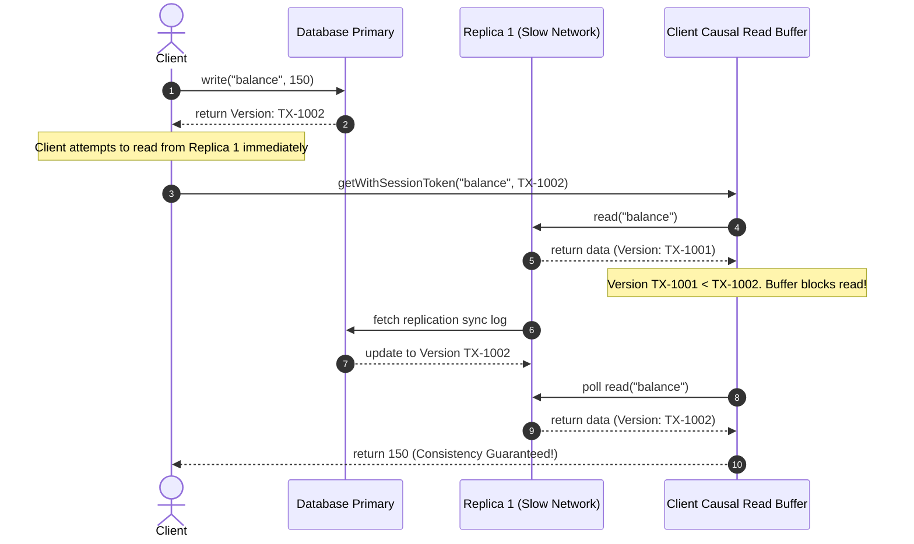

# Module 04: CAP and PACELC Theorems — Consistency Models and Trade-offs

Welcome back, students. Today we move into the structural laws that govern all distributed systems. 

Many developers believe that "scalability" is simply a matter of running more servers. However, the physical reality of data distribution imposes absolute, mathematical limits on what we can achieve. We will study the formal bounds of the **CAP Theorem**, analyze its modern refinement—the **PACELC Theorem**—and inspect the spectrum of **Consistency Models** from Strong Consistency to Eventual Consistency. Finally, we will write a Java-based Causal Consistency Read Buffer to show how client session tracking works.

---

## 1. Academic Lecture: CAP, PACELC, and Consistency Spectra

### The CAP Theorem

Formulated by Eric Brewer and formally proven by Gilbert and Lynch, the **CAP Theorem** states that a distributed data store can simultaneously provide at most two of the following three guarantees:
1.  **Consistency (C)**: Every read receives the most recent write or an error. (Equivalent to linearizability or strong consistency).
2.  **Availability (A)**: Every non-failing node returns a non-error response for every request (without a guarantee that it contains the most recent write).
3.  **Partition Tolerance (P)**: The system continues to operate despite an arbitrary number of messages being dropped or delayed by the network between nodes.

```
                  CAP Theorem Trilemma
                    /              \
     Consistency (C) -------------- Availability (A)
                    \              /
                  Partition Tolerance (P)
                  
    * Physical reality forces P. You must choose C or A during a partition.
```

#### The False Choice of CAP
A common error is believing you can choose "CA" (Consistency + Availability) and ignore Partition Tolerance. 

Physical networks are made of routers, fibers, and switches. They *will* drop packets, experience routing loops, or suffer physical cable cuts. Therefore, **Partition Tolerance (P) is a non-negotiable property of physical systems**. 

When a network partition occurs, you have exactly two choices:
*   **CP (Consistency / Partition Tolerance)**: Refuse writes or block reads on nodes that cannot communicate with the primary ensemble to avoid serving stale or split state. This sacrifices Availability.
*   **AP (Availability / Partition Tolerance)**: Allow nodes to accept writes and serve reads locally, even if they are isolated from the rest of the cluster. This sacrifices Consistency.

### The PACELC Theorem

In 2012, Daniel Abadi realized that CAP is too coarse. It only describes system behavior *during a partition*, which is hopefully rare. What happens during normal operations when the network is healthy?

**PACELC** expands CAP:
If there is a **P**artition, how does the system trade-off **A**vailability and **C**onsistency?
**E**lse (when the system is running normally), how does the system trade-off **L**atency and **C**onsistency?

```
                 +-----------------------+
                 |    PACELC Theorem     |
                 +-----------+-----------+
                             |
             +---------------+---------------+
             | (If Partition)                | (Else - Normal)
             v                               v
       [ A vs C ]                      [ L vs C ]
       Availability                    Latency
            vs                              vs
       Consistency                     Consistency
```

#### Database Classifications under PACELC:
*   **PC/EC (e.g., MongoDB, PostgreSQL replication)**: Under partitions, they choose Consistency (PC). During normal operations, they choose Consistency over Latency (EC) by executing writes via primary/quorum nodes and blocking client responses until writes are safely flushed.
*   **PA/EL (e.g., Apache Cassandra, Amazon DynamoDB)**: Under partitions, they choose Availability (PA). During normal operations, they choose low Latency (EL) by executing writes and reads against local replicas immediately and synchronizing state asynchronously.

### The Spectrum of Consistency Models

Consistency is not a binary choice. It is a spectrum of client-visible behaviors:

1.  **Strong Consistency (Linearizability)**: A write is visible immediately to all readers across the cluster. The system behaves as if there is only a single copy of the data.
2.  **Read-Your-Writes Consistency**: A specific client that writes value $X$ is guaranteed to see $X$ on all subsequent reads. Other clients may experience a propagation delay before seeing $X$.
3.  **Monotonic Reads**: If a client reads state version $V_1$, they will never subsequently read an older state version $V_0$. They only see progressive state.
4.  **Causal Consistency**: If operation B was triggered or influenced by operation A, then every node in the system must see A before they see B. Operations that are not causally related are considered concurrent.
5.  **Eventual Consistency**: Replicas asynchronously converge to the same value if no new writes occur. There are no ordering guarantees during convergence.

---

## 2. Theory vs. Production Trade-offs

Choosing a database configuration is a direct exercise in balancing performance against correctness:

### Write Concern vs. Read Concern
For example, in MongoDB (a PC/EC database), you can tune the consistency behavior on a per-query basis:
*   `WriteConcern.MAJORITY`: Blocks the client thread until a quorum of secondary nodes acknowledges the write. This prevents data loss during primary failover (choosing C).
*   `WriteConcern.W1`: Acknowledges the write as soon as it hits the primary's memory log. High throughput/low latency (choosing L), but if the primary crashes before replicating, the write is lost.
*   `ReadConcern.LINEARIZABLE`: Prevents stale reads by forcing the primary to contact a majority of secondaries *during the read* to verify it is still the leader. High latency.
*   `ReadConcern.LOCAL`: Reads from the local replica node. Low latency, but can return stale data or dirty data that will be rolled back.

---

## 3. How to Use: Causal Consistency Client Tracker in Java

To guarantee **Read-Your-Writes** or **Causal Consistency** on top of an eventually consistent database, clients pass a **session token** (representing a monotonically increasing version timestamp) along with their read requests. The receiving replica checks its local version. If the replica's version is older than the client's session token, the replica blocks the read until it applies the replication logs.

Here is the system flow for our causal consistency architecture:



Let's implement this Causal Read Buffer in Java 21 using virtual threads to block readers efficiently until replicas catch up.

First, we define our database record structure representing data versions:

```java
package com.capstone.tx.consistency;

/**
 * Immutable record representing versioned state in our replicated store.
 */
public record VersionedData<T>(T value, long version) {}
```

Now, let us write the `CausalReadBuffer` that wraps an eventually consistent database connection, forcing readers to wait if the connection's replica is lagging behind the client's version.

```java
package com.capstone.tx.consistency;

import java.util.concurrent.Callable;
import java.util.concurrent.TimeUnit;
import java.util.concurrent.atomic.AtomicLong;
import java.util.concurrent.locks.Condition;
import java.util.concurrent.locks.ReentrantLock;
import java.util.logging.Logger;

/**
 * Thread-safe read buffer ensuring Causal/Read-Your-Writes consistency.
 * If a replica contains stale data, the calling reader thread blocks
 * until replication updates the version to meet the client's session token.
 */
public class CausalReadBuffer<T> {
    private static final Logger LOGGER = Logger.getLogger(CausalReadBuffer.class.getName());

    private final ReentrantLock lock = new ReentrantLock();
    private final Condition versionReached = lock.newCondition();
    
    private T currentValue;
    private final AtomicLong currentVersion = new AtomicLong(0L);

    /**
     * Updates the replica's local state. This simulates the asynchronous replication path.
     */
    public void applyReplicationUpdate(T newValue, long newVersion) {
        lock.lock();
        try {
            if (newVersion > currentVersion.get()) {
                LOGGER.info("Replica synced to version " + newVersion + ". Value: " + newValue);
                this.currentValue = newValue;
                this.currentVersion.set(newVersion);
                versionReached.signalAll(); // Wake up any waiting reader threads
            }
        } finally {
            lock.unlock();
        }
    }

    /**
     * Reads the value from the replica. Blocks the caller if the replica's 
     * version is less than the requiredSessionVersion.
     */
    public T readConsistent(long requiredSessionVersion, long timeoutMs) throws InterruptedException {
        lock.lock();
        try {
            long startTime = System.currentTimeMillis();
            while (currentVersion.get() < requiredSessionVersion) {
                long elapsed = System.currentTimeMillis() - startTime;
                long remaining = timeoutMs - elapsed;
                
                if (remaining <= 0) {
                    throw new IllegalStateException("Causal read timeout. Replica version " 
                            + currentVersion.get() + " lags behind session version " + requiredSessionVersion);
                }

                LOGGER.warning("Replica stale (" + currentVersion.get() + " < " + requiredSessionVersion + "). Reader thread waiting...");
                versionReached.await(remaining, TimeUnit.MILLISECONDS);
            }
            return currentValue;
        } finally {
            lock.unlock();
        }
    }

    public long getCurrentVersion() {
        return currentVersion.get();
    }
}
```

---

## 4. Common Errors & Pitfalls

### Pitfall 1: Assuming MongoDB Primary is always Consistent
A common error is assuming MongoDB is CP and therefore reads from the primary are always strongly consistent under default configurations.
*   **Symptom**: Reads return stale data.
*   **Why**: If the primary is partitioned, it may not know it has been deposed by secondaries. Until its heartbeat timeout expires (typically 10 seconds), it will continue to accept reads.
*   **Mitigation**: Set read concern to `linearizable` or use majority write concerns to prevent isolated primaries from accepting unconfirmed mutations.

### Pitfall 2: Disregarding PACELC latency during health conditions
Many developers design systems assuming low latency because they ignore the "Else" part of PACELC.
*   **Why**: They implement strong consistency (EC) everywhere. During peak traffic, synchronous quorum network round trips create performance bottlenecks.
*   **Mitigation**: Use Eventual Consistency for non-critical assets (e.g., view counts, product recommendations) and reserve CP boundaries for financial ledgers or inventory limits.

---

## 5. Socratic Review Questions

### Question 1
In a cluster with 5 nodes, we write with a write consistency level of 2 (updates are sent to and acknowledged by at least 2 nodes) and read with a read consistency level of 3 (reads query 3 nodes and take the latest version). Does this setup guarantee strong consistency (linearizability)? What is the quorum write/read equation?

#### Answer
No, this setup does not guarantee strong consistency. 

For a system to guarantee strong consistency (such that a read always sees the latest write), the set of nodes written to and the set of nodes read from must overlap by at least one node. 

This is defined by the quorum overlap equation:
$$W + R > N$$

Where:
*   $W$ is the write consistency level (number of nodes acknowledging the write).
*   $R$ is the read consistency level (number of nodes queried during a read).
*   $N$ is the total number of nodes in the cluster.

In this scenario:
$$W = 2, \quad R = 3, \quad N = 5$$
$$2 + 3 > 5 \quad \text{is false (} 5 > 5 \text{ is false).}$$

Because $W + R = N$, it is mathematically possible for the write to go to Nodes 1 and 2, and the read to query Nodes 3, 4, and 5. The reader will query a set of replicas that contains zero updated nodes, returning stale data. To ensure strong consistency in a 5-node cluster, we must adjust the configurations such that $W + R \ge 6$ (e.g., $W=3, R=3$ or $W=2, R=4$).

### Question 2
Explain why Cassandra is classified as a **PA/EL** database under the PACELC theorem.

#### Answer
Cassandra is built on the Dynamo model, prioritizing availability and latency:
*   **PA (Partition/Availability)**: During a network partition, Cassandra allows any available node to accept writes and serve reads locally, even if nodes are partitioned from the rest of the cluster. It does not enforce a single leader partition check, thereby maintaining system availability at the expense of consistent values across partitions.
*   **EL (Else/Latency)**: During normal, non-partitioned operations, Cassandra is configured to complete operations with minimal latency. Writes are accepted by a local coordinator node and immediately acknowledged to the client, while replication updates propagate asynchronously to other replica nodes in the background. It chooses low latency over synchronous consistency.

---

## 6. Hands-on Challenge: Consistency Level Evaluator

### The Challenge
In this challenge, you will implement the validation logic for a consistency validator. Given a cluster configuration, write and read sizes, you must compute if the configuration guarantees Strong Consistency, and evaluate whether a specific client read will be stale based on the node overlap.

Complete the implementation below:

```java
package com.capstone.tx.consistency.challenge;

import java.util.Set;

public class ConsistencyLevelEvaluator {

    /**
     * Returns true if the overlap configuration guarantees strong consistency.
     */
    public boolean guaranteesStrongConsistency(int totalNodes, int writeQuorum, int readQuorum) {
        // TODO: Implement the quorum overlap equation
        return false;
    }

    /**
     * Determines if a reader will receive stale data.
     * @param nodesWritten the specific set of node IDs that successfully persisted the write
     * @param nodesRead the specific set of node IDs queried by the reader
     * @return true if the reader is guaranteed to see the write, false if it could receive stale data.
     */
    public boolean isReadStale(Set<Integer> nodesWritten, Set<Integer> nodesRead) {
        // TODO: Implement overlap check. 
        // If the reader's set of queried nodes does not share any node with the write set, the read could be stale.
        return false;
    }
}
```

Write your code and verify the correctness. Save your solution notes inside `modules/04-cap-pacelc-consistency-models.md`.
