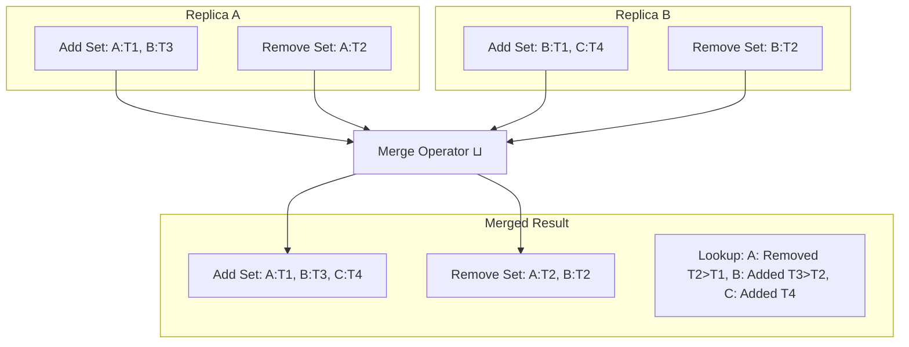

# Module 05: Eventual Consistency and CRDTs — Conflict Resolution and Vector Clocks

Welcome back, students. Today we explore the mathematics of systems that choose availability and latency over strong consistency. 

When you build a highly-available, globally-distributed application (such as a collaborative document editor, a shopping cart, or a chat system), you cannot block writes waiting for a global lock or quorum consensus. Multiple nodes must accept writes independently. This introduces the inevitability of **state conflicts**. We will study **Conflict-free Replicated Data Types (CRDTs)**, analyze the differences between **State-based (CvRDT)** and **Operation-based (CmRDT)** models, unpack the mathematics of **Vector Clocks**, and write a thread-safe **LWW-Element-Set** in Java.

---

## 1. Academic Lecture: CRDT Mathematics and Vector Ordering

In an eventually consistent system, replicas accept updates locally without coordination. Over time, these replicas exchange their states and must converge to the exact same value.

Historically, databases solved conflicts using coarse strategies like **Last-Write-Wins (LWW)** based on physical system clocks. However, physical clocks drift, leading to silent data loss (a later write being discarded because its physical timestamp was incorrectly marked as older). To resolve conflicts safely, computer scientists developed mathematically sound structures.

### Conflict-free Replicated Data Types (CRDTs)

A CRDT is a data structure that can be replicated across multiple nodes in a network, where replicas can be updated independently and concurrently without coordination, and are mathematically guaranteed to converge.

There are two primary styles of CRDTs:

#### 1. State-Based CRDTs (CvRDTs)
In a CvRDT, replicas send their **entire state** to other nodes. When a node receives another node's state, it merges it with its local state using a merge operator ($\sqcup$).

For a CvRDT to guarantee convergence, its states must form a **Bounded Join-Semilattice**. A join-semilattice is a partially ordered set that has a unique least upper bound (the join, denoted as $\sqcup$) for any pair of elements. The merge operator ($\sqcup$) must satisfy three algebraic properties:
*   **Commutativity**: $A \sqcup B = B \sqcup A$ (The order in which states are received does not matter).
*   **Associativity**: $(A \sqcup B) \sqcup C = A \sqcup (B \sqcup C)$ (Grouping of states does not matter).
*   **Idempotency**: $A \sqcup A = A$ (Receiving duplicate states does not change the result).

```
Replica A: [State X]  ----\            /---- Replica B: [State Y]
                           v          v
                       [ Merge: X ⊔ Y ]
                              |
                      Merged State Z (Guaranteed same outcome)
```

#### 2. Operation-Based CRDTs (CmRDTs)
In a CmRDT, replicas do not send their entire state. Instead, they broadcast **discrete mutation operations** (e.g., "Add 5 to counter") across the network. CmRDTs require that the underlying messaging layer guarantees that all operations are delivered to all replicas without loss, and in **causal order**.

### Vector Clocks: Tracking Causality

To detect if two operations are causally related or occurred concurrently, we use **Vector Clocks**.

A vector clock is an array of logical clocks, with one entry for each node in the system. Let $VC(a)$ represent the vector clock of node $a$.
1.  Before executing an event locally, node $i$ increments its own clock: $VC_i[i] = VC_i[i] + 1$.
2.  When sending a message $m$, node $i$ attaches its vector clock: $m.clock = VC_i$.
3.  When node $j$ receives message $m$, it updates its clock:
    $$VC_j[k] = \max(VC_j[k], m.clock[k]) \quad \forall k$$
    Then it increments its own entry: $VC_j[j] = VC_j[j] + 1$.

```
Node A: (1, 0, 0) -- Message --> Node B: receives, updates to (1, 1, 0)
```

#### Comparing Vector Clocks:
*   $VC_1$ **causally preceded** $VC_2$ ($VC_1 < VC_2$) if every element of $VC_1$ is less than or equal to the corresponding element in $VC_2$, and at least one element is strictly smaller:
    $$VC_1 \le VC_2 \iff (\forall k, VC_1[k] \le VC_2[k]) \land (\exists k, VC_1[k] < VC_2[k])$$
*   If neither $VC_1 \le VC_2$ nor $VC_2 \le VC_1$ is true, the operations are **concurrent** ($VC_1 \parallel VC_2$). Concurrent operations represent a conflict that must be resolved (e.g., via a CRDT merge).

---

## 2. Theory vs. Production Trade-offs

Building systems with eventual consistency introduces severe operational challenges:

### 1. Tombstone Bloat
In a standard set or map, deleting an element removes it from memory. In a CRDT, if you delete an element, you cannot simply remove it. If you did, when you merged with a replica that has not heard of the deletion, that replica would assume the element is new and add it back!
To prevent this, deleted elements are added to a **tombstone set**. 
*   **Production Problem**: The tombstone set grows indefinitely, consuming memory and storage even if the main dataset is empty. Replicas must run garbage-collection protocols (compacting tombstones after a safety lease time) which adds system complexity.

### 2. Clock Sync Vulnerability in LWW-Element-Set
LWW-Element-Sets resolve conflicts by checking physical system timestamps. 
*   **Production Problem**: If a server's clock drifts forward by several seconds, its writes will appear to have occurred in the future. Writes from other servers with correct clocks will be silently ignored during merges because their timestamps appear "older" than the drifted writes, causing silent data loss.

---

## 3. How to Use: LWW-Element-Set CvRDT in Java

The **LWW-Element-Set (Last-Write-Wins Element Set)** is a state-based CRDT consisting of an **Add Set** and a **Remove Set**. Each entry in both sets is paired with a timestamp.



*   **Add**: Element is added to the Add Set with the current timestamp.
*   **Remove**: Element is added to the Remove Set with the current timestamp.
*   **Lookup (Contains)**: An element is present in the CRDT if it is in the Add Set, and either it is not in the Remove Set, or it is in the Remove Set but its timestamp in the Add Set is strictly greater than its timestamp in the Remove Set.

Let's implement a thread-safe **LWW-Element-Set** in Java 21.

```java
package com.capstone.tx.crdt;

import java.time.Instant;
import java.util.*;
import java.util.concurrent.ConcurrentHashMap;
import java.util.concurrent.locks.ReentrantReadWriteLock;

/**
 * Thread-safe implementation of a Last-Write-Wins Element Set (LWW-Element-Set) CvRDT.
 */
public class LWWElementSet<E> {

    public record ElementRecord<E>(E element, Instant timestamp) {}

    private final Map<E, Instant> addSet = new ConcurrentHashMap<>();
    private final Map<E, Instant> removeSet = new ConcurrentHashMap<>();
    private final ReentrantReadWriteLock rwLock = new ReentrantReadWriteLock();

    /**
     * Adds an element to the set with the specified timestamp.
     */
    public void add(E element, Instant timestamp) {
        Objects.requireNonNull(element, "Element cannot be null");
        Objects.requireNonNull(timestamp, "Timestamp cannot be null");
        
        rwLock.writeLock().lock();
        try {
            addSet.merge(element, timestamp, (existing, incoming) -> 
                incoming.isAfter(existing) ? incoming : existing);
        } finally {
            rwLock.writeLock().unlock();
        }
    }

    public void add(E element) {
        add(element, Instant.now());
    }

    /**
     * Removes an element from the set by recording a tombstone timestamp.
     */
    public void remove(E element, Instant timestamp) {
        Objects.requireNonNull(element, "Element cannot be null");
        Objects.requireNonNull(timestamp, "Timestamp cannot be null");
        
        rwLock.writeLock().lock();
        try {
            removeSet.merge(element, timestamp, (existing, incoming) -> 
                incoming.isAfter(existing) ? incoming : existing);
        } finally {
            rwLock.writeLock().unlock();
        }
    }

    public void remove(E element) {
        remove(element, Instant.now());
    }

    /**
     * Query liveness. Element is present if it exists in the addSet, and either:
     * 1. Does not exist in the removeSet, OR
     * 2. Exists in the removeSet, but the add timestamp is strictly after the remove timestamp.
     */
    public boolean lookup(E element) {
        rwLock.readLock().lock();
        try {
            Instant addTime = addSet.get(element);
            if (addTime == null) {
                return false;
            }
            Instant removeTime = removeSet.get(element);
            if (removeTime == null) {
                return true;
            }
            return addTime.isAfter(removeTime);
        } finally {
            rwLock.readLock().unlock();
        }
    }

    /**
     * Merge this CvRDT state with an incoming CvRDT state.
     * Computes the join-semilattice least upper bound (LUB).
     */
    public void merge(LWWElementSet<E> incomingSet) {
        Objects.requireNonNull(incomingSet, "Incoming set cannot be null");
        
        rwLock.writeLock().lock();
        try {
            // Merge Add Sets
            incomingSet.addSet.forEach((elem, incomingTime) -> 
                this.addSet.merge(elem, incomingTime, (existingTime, newTime) -> 
                    newTime.isAfter(existingTime) ? newTime : existingTime)
            );

            // Merge Remove Sets (Tombstones)
            incomingSet.removeSet.forEach((elem, incomingTime) -> 
                this.removeSet.merge(elem, incomingTime, (existingTime, newTime) -> 
                    newTime.isAfter(existingTime) ? newTime : existingTime)
            );
        } finally {
            rwLock.writeLock().unlock();
        }
    }

    public Set<E> value() {
        rwLock.readLock().lock();
        try {
            Set<E> resultSet = new HashSet<>();
            addSet.keySet().forEach(elem -> {
                if (lookup(elem)) {
                    resultSet.add(elem);
                }
            });
            return resultSet;
        } finally {
            rwLock.readLock().unlock();
        }
    }
}
```

---

## 4. Common Errors & Pitfalls

### Pitfall 1: Garbage Collection of Tombstones
Replicating tombstone sets consumes massive amounts of bandwidth.
*   **Symptom**: Out-of-memory errors on nodes, or high network utilization.
*   **Mitigation**: Implement a garbage-collection policy where tombstone entries older than a specific threshold (e.g., 30 days) are pruned, provided that all replicas have acknowledged receiving the deletion.

### Pitfall 2: Confusing Concurrent Writes with Order
*   **Symptom**: Replicas diverging in state.
*   **Why**: Believing that local timestamps can safely sequence network events.
*   **Mitigation**: Use vector clocks or Lamport logical timestamps to establish causal relations, and fallback to CRDT rules *only* when vector clock analysis detects actual concurrency.

---

## 5. Socratic Review Questions

### Question 1
Prove that the `merge` operator of the `LWWElementSet` is commutative, associative, and idempotent.

#### Answer
The merge operator of the `LWWElementSet` operates by performing a pointwise maximum (`max` or `isAfter`) on the timestamps of keys across the internal maps (`addSet` and `removeSet`).
*   **Commutativity**: The operator must satisfy $A \sqcup B = B \sqcup A$. Because our merge operation evaluates $\max(T_A, T_B)$, and the $\max$ function on values is commutative ($\max(x, y) = \max(y, x)$), the merge result is identical regardless of the evaluation order.
*   **Associativity**: The operator must satisfy $(A \sqcup B) \sqcup C = A \sqcup (B \sqcup C)$. Pointwise maximum is associative ($\max(\max(x, y), z) = \max(x, \max(y, z))$), meaning grouping states has no effect on final timestamp values.
*   **Idempotency**: The operator must satisfy $A \sqcup A = A$. Pointwise maximum with the same value yields that value ($\max(x, x) = x$), so merging identical sets yields the original state.
Because all three algebraic properties hold, the LWW-Element-Set converges safely regardless of arrival order or message duplication.

### Question 2
Under what conditions will two vector clocks $VC_1$ and $VC_2$ be declared concurrent ($VC_1 \parallel VC_2$)? Provide a concrete example.

#### Answer
Two vector clocks are concurrent if neither clock causally precedes the other. This occurs when $VC_1$ has at least one node counter that is strictly greater than the corresponding counter in $VC_2$, and $VC_2$ has at least one node counter that is strictly greater than the corresponding counter in $VC_1$.
Consider a 3-node system ($Node_0, Node_1, Node_2$).
Let:
*   $VC_1 = (2, 1, 0)$
*   $VC_2 = (1, 2, 0)$

Comparing elements:
*   At index 0: $VC_1[0] = 2 > VC_2[0] = 1$. This implies $VC_2 \not\ge VC_1$.
*   At index 1: $VC_1[1] = 1 < VC_2[1] = 2$. This implies $VC_1 \not\ge VC_2$.
Because neither vector clock is element-wise greater than or equal to the other, the two states represent concurrent mutations. Both nodes made updates without knowledge of the other's actions.

---

## 6. Hands-on Challenge: Positive-Negative Counter (PN-Counter) CvRDT

### The Challenge
In this challenge, you will implement a **PN-Counter (Positive-Negative Counter)**. A PN-Counter allows both increments and decrements. It is implemented by combining two **G-Counters (Grow-Only Counters)**: one tracking increments (P-Counter) and one tracking decrements (N-Counter).

The value of the counter is calculated as:
$$\text{Value} = \sum P[i] - \sum N[i]$$

Complete the `merge` and `value` methods in the PN-Counter template below:

```java
package com.capstone.tx.crdt.challenge;

import java.util.HashMap;
import java.util.Map;
import java.util.Objects;
import java.util.concurrent.ConcurrentHashMap;

public class PNCounter {

    private final String nodeId;
    
    // G-Counter for Increments
    private final Map<String, Long> pMap = new ConcurrentHashMap<>();
    // G-Counter for Decrements
    private final Map<String, Long> nMap = new ConcurrentHashMap<>();

    public PNCounter(String nodeId) {
        this.nodeId = Objects.requireNonNull(nodeId, "NodeId cannot be null");
    }

    public void increment() {
        pMap.merge(nodeId, 1L, Long::sum);
    }

    public void decrement() {
        nMap.merge(nodeId, 1L, Long::sum);
    }

    /**
     * Returns the current resolved value of the counter.
     */
    public long value() {
        // TODO: Complete this implementation.
        // Sum all entries in pMap and subtract the sum of all entries in nMap.
        return 0L;
    }

    /**
     * Merges this counter's state with an incoming PN-Counter state.
     */
    public void merge(PNCounter incoming) {
        // TODO: Complete this implementation.
        // For both pMap and nMap, merge entries by taking the maximum value for each nodeId key.
    }
    
    public Map<String, Long> getPMap() {
        return new HashMap<>(pMap);
    }

    public Map<String, Long> getNMap() {
        return new HashMap<>(nMap);
    }
}
```

Implement the challenge, write a verification test verifying that incrementing on Node A, decrementing on Node B, and merging the counters yields the correct mathematical result, and save your notes in `modules/05-eventual-consistency-crdts-vectors.md`.
