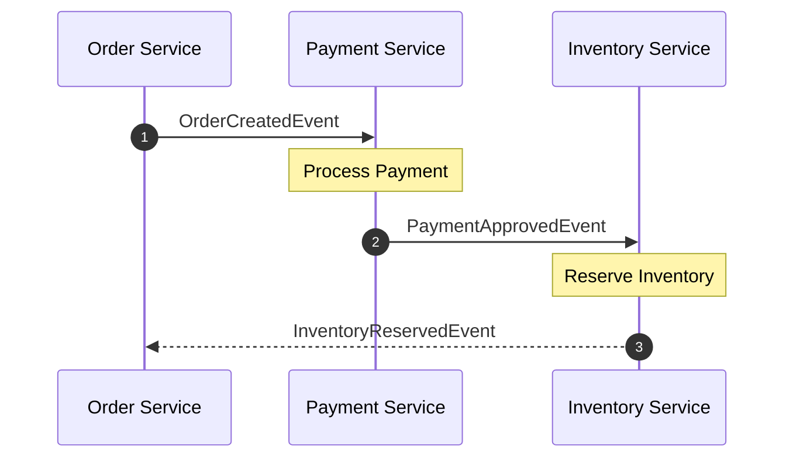
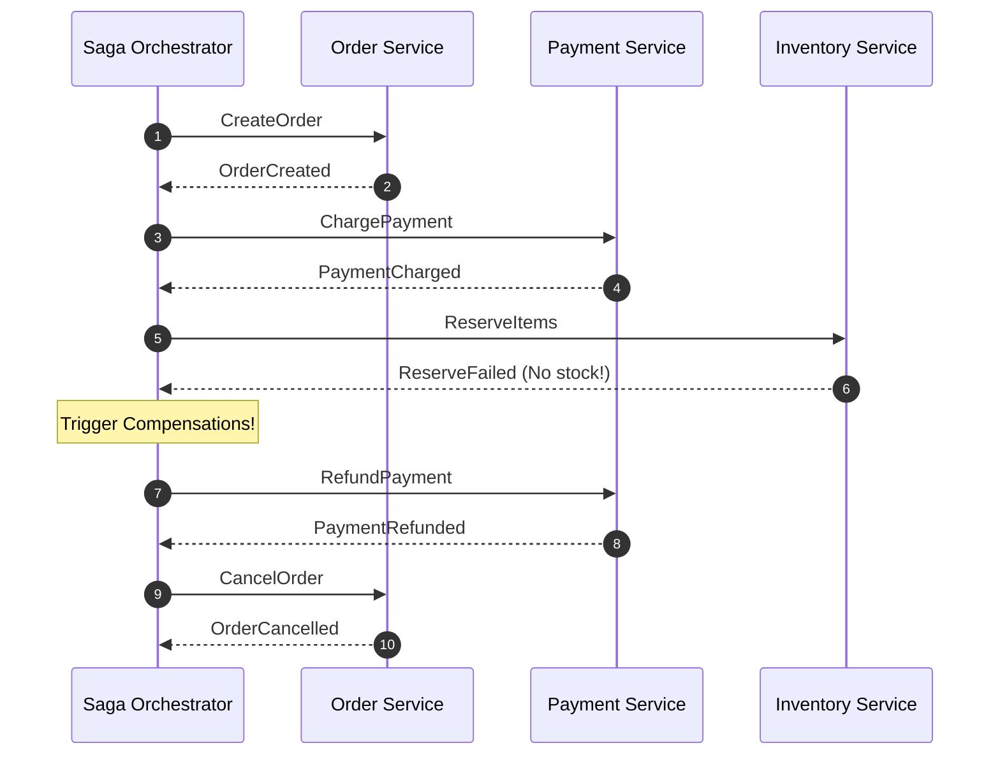

# Module 06: The Saga Pattern — Orchestration, Choreography, and Compensations

Welcome back, students. Today we analyze how modern high-scale systems manage distributed consistency without holding resource locks.

As we learned in Module 2, the Two-Phase Commit (2PC) protocol is blocking and degrades performance. To achieve high write-throughput, cloud-native architectures abandon 2PC in favor of **Sagas**. The Saga pattern trades immediate consistency for eventual consistency by executing a sequence of local transactions. We will study **Orchestration-based** and **Choreography-based** Sagas, discuss the severe challenges posed by the **lack of Isolation**, and build a complete **Saga Orchestrator** in Java.

---

## 1. Academic Lecture: The Mechanics of Sagas

A **Saga** is a design pattern that coordinates a distributed transaction as a series of independent, local transactions. Each local transaction updates the database of a single microservice and publishes an event or message. 

If all local transactions succeed, the Saga completes. If any local transaction fails (e.g., due to business logic violations, like an credit card decline or insufficient inventory), the Saga must execute **Compensating Transactions** in reverse order to undo the updates made by the preceding transactions.

```
Success Path:
[ Start Saga ] ---> [ Tx 1: Order Service ] ---> [ Tx 2: Payment Service ] ---> [ Tx 3: Inventory Service ] ---> [ Success ]

Compensating Path (If Tx 3 fails):
[ Start Saga ] ---> [ Tx 1: Order Service ] ---> [ Tx 2: Payment Service ] ---> [ Tx 3: Fails! ]
                                                               |
                       [ Comp 1: Cancel Order ] <--- [ Comp 2: Refund Payment ]
```

### Choreography vs. Orchestration

There are two primary patterns for coordinating Sagas:

#### 1. Choreography (Decentralized Coordination)
In choreography, there is no central controller. The microservices interact by listening to events published by other services and publishing their own outcomes.

*   **Pros**: Simple to set up for small flows; loose coupling.
*   **Cons**: Hard to trace or debug as the number of services grows; risk of cyclic event dependencies.



#### 2. Orchestration (Centralized Coordination)
In orchestration, a centralized component (the **Saga Orchestrator**) acts as the coordinator. It tells each participant what transaction to execute, parses the responses, and coordinates compensations if failures occur.

*   **Pros**: Easy to understand, debug, and monitor; centralized control of business state.
*   **Cons**: The orchestrator is a central business logic hub; slightly tighter coupling.



### Compensating Transactions

A compensating transaction is a **semantic rollback**. Because we cannot physically undo a committed transaction (as other clients may have already read the data), we must perform an action that corrects the state.
*   If the transaction was "Charge Card \$100", the compensation is "Refund Card \$100".
*   If the transaction was "Reserve Seat 12B", the compensation is "Release Seat 12B".

> [!IMPORTANT]
> **Idempotency is Mandatory**: Because networks retry messages, a compensating transaction (and all Saga actions) may be executed multiple times. Re-running a compensation must produce the same state. Refunds must only happen once, and cancel actions must be idempotent.

---

## 2. Theory vs. Production Trade-offs

The primary challenge of Sagas is the **lack of Isolation** (the 'I' in ACID).

In a JTA/XA transaction, row locks prevent other clients from seeing uncommitted changes. In a Saga, as soon as a local transaction commits (e.g., Step 1: Order Created), those changes are immediately visible to all clients, even if Step 2 (Payment) subsequently fails and rolls back the order.

### Saga Isolation Anomalies:
1.  **Lost Updates**: Saga A reads a record, Saga B modifies it, then Saga A overwrites it, losing Saga B's updates.
2.  **Dirty Reads**: A customer reads an item status as "Reserved" (by a Saga that eventually rolls back due to a card failure) and sees the item return to stock later.
3.  **Non-repeatable Reads**: A reader queries a balance twice during a Saga and gets different values.

### Countermeasures (Engineering Fixes)
To mitigate the lack of isolation, engineers use design patterns:
*   **Semantic Lock**: When creating an order, mark its status as `PENDING_PAYMENT`. Other transactions check this status and refuse to edit or process it until the Saga completes.
*   **Escrow Value**: Instead of deducting a balance immediately, transfer the funds to a temporary holding partition (`PENDING_RESERVED`). If the Saga fails, return the funds. If it succeeds, complete the transfer.

---

## 3. How to Use: Building a Saga Orchestrator in Java

Let's implement a complete, thread-safe **Saga Orchestrator** in Java 21. The orchestrator coordinates a checkout flow across Order, Payment, and Inventory components.

First, we define our Saga State and Step interfaces:

```java
package com.capstone.tx.saga;

import java.util.concurrent.Callable;

/**
 * Representation of a single step in a Saga.
 * Bundles the forward action and its corresponding compensating action.
 */
public record SagaStep(
    String name,
    Callable<Boolean> action,
    Runnable compensation
) {}
```

Now, let us write the central orchestration engine:

```java
package com.capstone.tx.saga;

import java.util.ArrayList;
import java.util.List;
import java.util.logging.Level;
import java.util.logging.Logger;

/**
 * Central orchestrator that executes steps sequentially.
 * If any step fails, it initiates automatic compensating transactions in reverse order.
 */
public class SagaOrchestrator {
    private static final Logger LOGGER = Logger.getLogger(SagaOrchestrator.class.getName());

    private final List<SagaStep> steps = new ArrayList<>();
    private final List<SagaStep> completedSteps = new ArrayList<>();

    public void addStep(SagaStep step) {
        this.steps.add(step);
    }

    /**
     * Executes the Saga sequence.
     * Returns true if all steps succeeded, false if any step failed and compensation executed.
     */
    public boolean execute() {
        LOGGER.info("Starting Saga execution...");
        completedSteps.clear();

        for (SagaStep step : steps) {
            LOGGER.info("Executing step: " + step.name());
            try {
                boolean success = step.action().call();
                if (success) {
                    completedSteps.add(step);
                    LOGGER.info("Step " + step.name() + " completed successfully.");
                } else {
                    LOGGER.warning("Step " + step.name() + " failed. Initiating rollback...");
                    compensate();
                    return false;
                }
            } catch (Exception e) {
                LOGGER.log(Level.SEVERE, "Exception executing step: " + step.name() + ". Initiating rollback...", e);
                compensate();
                return false;
            }
        }

        LOGGER.info("Saga executed successfully!");
        return true;
    }

    /**
     * Executes compensations in reverse order of completion.
     */
    private void compensate() {
        LOGGER.warning("Entering compensation flow...");
        for (int i = completedSteps.size() - 1; i >= 0; i--) {
            SagaStep step = completedSteps.get(i);
            LOGGER.info("Running compensation for step: " + step.name());
            try {
                step.compensation().run();
                LOGGER.info("Compensation for step " + step.name() + " finished.");
            } catch (Exception e) {
                // In production, we MUST retry compensations, log them to a dead-letter queue (DLQ),
                // or raise immediate alerts for operator intervention.
                LOGGER.log(Level.SEVERE, "CRITICAL: Compensation failed for step: " + step.name(), e);
            }
        }
        LOGGER.warning("Saga rollback complete.");
    }
}
```

Now let us write a concrete application utilizing our Orchestrator to run a Checkout Saga:

```java
package com.capstone.tx.saga;

import java.util.concurrent.atomic.AtomicBoolean;

public class CheckoutSagaDemo {

    // Simulating external services
    public static class OrderService {
        public boolean createOrder(String orderId) {
            System.out.println("[OrderService] Order created: " + orderId);
            return true;
        }
        public void cancelOrder(String orderId) {
            System.out.println("[OrderService] Order cancelled: " + orderId);
        }
    }

    public static class PaymentService {
        public boolean processPayment(String orderId, double amount) {
            if (amount > 500.0) {
                System.out.println("[PaymentService] Payment failed for order: " + orderId);
                return false; // Triggers rollback
            }
            System.out.println("[PaymentService] Charged card " + amount + " for order " + orderId);
            return true;
        }
        public void refundPayment(String orderId, double amount) {
            System.out.println("[PaymentService] Refunded " + amount + " for order " + orderId);
        }
    }

    public static class InventoryService {
        public boolean reserveInventory(String orderId, String item) {
            System.out.println("[InventoryService] Inventory reserved: " + item + " for order " + orderId);
            return true;
        }
        public void releaseInventory(String orderId, String item) {
            System.out.println("[InventoryService] Inventory released: " + item + " for order " + orderId);
        }
    }

    public static void main(String[] args) {
        OrderService orderService = new OrderService();
        PaymentService paymentService = new PaymentService();
        InventoryService inventoryService = new InventoryService();

        String orderId = "TX-9901";
        String item = "MacBook Pro";

        // Scenario 1: Successful Transaction
        System.out.println("--- Running Scenario 1 (Under budget) ---");
        SagaOrchestrator okSaga = new SagaOrchestrator();
        okSaga.addStep(new SagaStep("CreateOrder", () -> orderService.createOrder(orderId), () -> orderService.cancelOrder(orderId)));
        okSaga.addStep(new SagaStep("ProcessPayment", () -> paymentService.processPayment(orderId, 350.00), () -> paymentService.refundPayment(orderId, 350.00)));
        okSaga.addStep(new SagaStep("ReserveInventory", () -> inventoryService.reserveInventory(orderId, item), () -> inventoryService.releaseInventory(orderId, item)));
        okSaga.execute();

        // Scenario 2: Failed Transaction triggering compensations
        System.out.println("\n--- Running Scenario 2 (Over budget, triggers rollback) ---");
        SagaOrchestrator failSaga = new SagaOrchestrator();
        failSaga.addStep(new SagaStep("CreateOrder", () -> orderService.createOrder(orderId), () -> orderService.cancelOrder(orderId)));
        failSaga.addStep(new SagaStep("ProcessPayment", () -> paymentService.processPayment(orderId, 600.00), () -> paymentService.refundPayment(orderId, 600.00)));
        failSaga.addStep(new SagaStep("ReserveInventory", () -> inventoryService.reserveInventory(orderId, item), () -> inventoryService.releaseInventory(orderId, item)));
        failSaga.execute();
    }
}
```

---

## 4. Common Errors & Pitfalls

### Pitfall 1: Compensation loop Failures
What happens if a compensating transaction itself fails (e.g., the refund service is offline)?
*   **Symptom**: System state is left partially rolled back, violating atomicity.
*   **Mitigation**: Always implement a retry policy for compensations (e.g., using exponential backoff with a persistent scheduler) or push failing compensations to an execution queue for operator inspection.

### Pitfall 2: Double Refund (Lack of Idempotency)
If a payment provider times out during compensation, the orchestrator retries the refund call.
*   **Symptom**: The customer gets refunded multiple times.
*   **Mitigation**: Every compensation call must pass a unique transaction key (e.g., the global Saga ID) to the downstream API. The receiver must log this key to detect and ignore duplicate calls.

---

## 5. Socratic Review Questions

### Question 1
Explain the difference between a **backward recovery** and a **forward recovery** strategy in Sagas. When would you use one over the other?

#### Answer
*   **Backward Recovery**: In backward recovery, if a step in the Saga fails, the system executes compensating transactions to undo all completed steps in reverse order, returning the system to its initial state. This is typically used in consumer transactions (e.g., e-commerce checkouts) where a payment failure requires canceling the entire purchase.
*   **Forward Recovery**: In forward recovery, if a step fails, the system does not roll back. Instead, it retries the failing step or executes a fallback path to complete the Saga. This is only possible if the failing step is guaranteed to eventually succeed (e.g., asynchronous report generation or sending notification emails). Forward recovery is preferred when business requirements mandate completion over cancellation.

### Question 2
How does the **Outbox Pattern** guarantee that the events driving a Choreography-based Saga are safely published even if the database node crashes?

#### Answer
In a Choreography-based Saga, a service must update its local database and publish an event to a message broker (e.g., Kafka). Doing these two actions sequentially in code is unsafe: if the database write commits but the application crashes before publishing the event, the Saga stalls. 

The **Outbox Pattern** resolves this. Instead of writing directly to the message broker, the service writes the event record into a special `OUTBOX` database table inside the *same* local database transaction. Since they share a transaction boundary, the update and the outbox record are committed atomically. A background thread (or log tailing connector like Debezium) polls the `OUTBOX` table, publishes the events to Kafka, and deletes or marks them as sent. This guarantees **at-least-once** event publishing.

---

## 6. Hands-on Challenge: Building a Safe Saga Orchestrator

### The Challenge
In this exercise, you must extend the `SagaOrchestrator` to support an asynchronous status tracker database. 

If the orchestrator node crashes midway through a Saga, it must be able to restore its state from the database and resume processing from the last uncompleted step, or trigger the appropriate compensations.

Implement the `recoverAndResume` method in the recovery class below:

```java
package com.capstone.tx.saga.challenge;

import com.capstone.tx.saga.SagaStep;
import java.util.List;

public class SagaRecoveryManager {

    public enum StepState {
        NOT_STARTED, SUCCESS, FAILED
    }

    public record StepStatus(String stepName, StepState state) {}
    public record SagaStateLog(String sagaId, List<StepStatus> statuses) {}

    /**
     * Evaluates the saved Saga state log and determines the action.
     * 1. If any step is marked FAILED, trigger compensation for all steps marked SUCCESS in reverse order.
     * 2. If all steps are SUCCESS, mark the Saga completed.
     * 3. If a step is NOT_STARTED and no failures occurred, trigger execution of the remaining steps.
     */
    public void recoverAndResume(SagaStateLog log, List<SagaStep> registeredSteps) {
        // TODO: Complete this implementation.
    }
}
```

Write your implementation and test it against simulated checkpoint logs. Save your solution notes inside `modules/06-saga-orchestration-choreography.md`.
