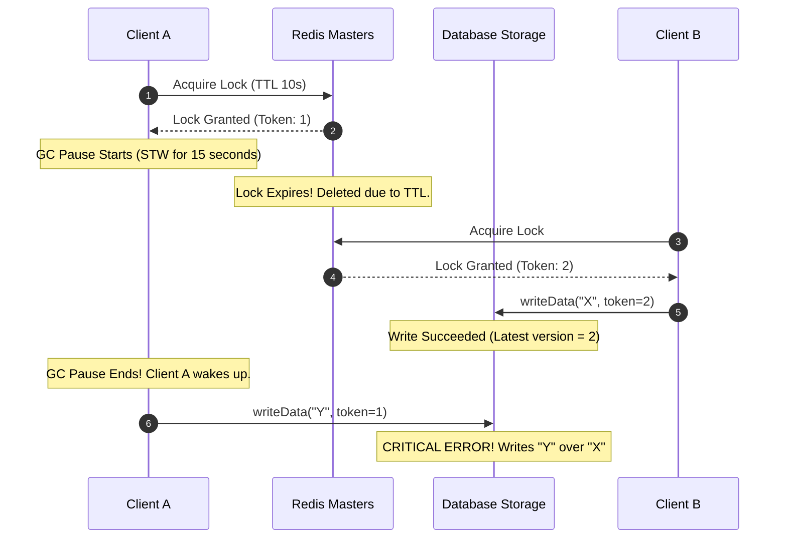

# Module 07: Distributed Locking — Redlock, ZooKeeper, and Fencing Tokens

Welcome back, students. Today we analyze the mechanics of restricting access to shared physical resources across a cluster.

In single-node Java programming, we synchronize access using `synchronized` blocks or standard locks (`ReentrantLock`). However, these structures operate entirely inside a single JVM's memory heap. If multiple independent instances of an application run in parallel, thread synchronization is useless. We must coordinate exclusive access over the network. We will study database locks, the Redis **Redlock** algorithm, ZooKeeper-based locks (`InterProcessMutex`), and the critical safety mechanism of **Fencing Tokens**.

---

## 1. Academic Lecture: The Mechanics of Distributed Locking

A distributed lock must satisfy three security properties:
1.  **Mutual Exclusion**: Only one client can hold the lock at any time.
2.  **Deadlock Free**: The system must eventually release the lock even if the holding client crashes or becomes partitioned.
3.  **Fault Tolerance**: As long as the majority of lock nodes are alive, clients must be able to acquire and release locks.

### Redis-based Locking and the Redlock Algorithm

To acquire a lock in a single Redis node, we write:
```
SET lock_key client_id NX PX 30000
```
This sets the key only if it does not exist (`NX`), with a Time-To-Live (TTL) of 30,000ms (`PX`). To release the lock, we must use a Lua script to verify the `client_id` matches, preventing a client from releasing another client's lock.

In multi-node Redis clusters, the **Redlock** algorithm is used:
1.  A client retrieves the current time in milliseconds.
2.  It attempts to acquire the lock in all $N$ (typically 5) independent Redis masters sequentially, using the same key name and a unique value. The timeout for acquisition is set small compared to the lock auto-release time (e.g., 50ms timeout for a 10s lease).
3.  If the client successfully acquires the lock from a majority of nodes (e.g., 3 out of 5), and the total time elapsed is less than the lock validity time, the lock is acquired.
4.  The lock validity time is recalculated: $\text{Lease Time} - \text{Elapsed Time}$.
5.  If it fails to acquire the majority, it sends a release Lua script to all nodes.

### ZooKeeper-based Locking (`InterProcessMutex`)

ZooKeeper manages locks using **ephemeral sequential nodes**. Let's examine this elegant, non-polling approach:

1.  A client creates an ephemeral sequential node under `/locks/lock_node_` (e.g., `/locks/lock_node_00000001`).
2.  The client queries the children of `/locks`.
3.  If the client's node has the smallest sequence number, it has acquired the lock!
4.  If its node is not the smallest, it registers a **watch** on the node with the sequence number immediately preceding its own.
5.  When the preceding node is deleted (releasing the lock or crashing), the client receives a notification and takes ownership.

```mermaid
graph TD
    subgraph ZooKeeper Lock Node "/locks"
        L1["lock_node_000001 (Active Holder)"]
        L2["lock_node_000002 (Watcher on ...01)"]
        L3["lock_node_000003 (Watcher on ...02)"]
    end
    
    L2 -->|Watches| L1
    L3 -->|Watches| L2
```

---

## 2. Theory vs. Production Trade-offs: The Redlock Controversy

In 2016, distributed systems researcher Martin Kleppmann published a detailed critique of the Redlock algorithm. He argued that Redlock is unsafe for systems where correctness is critical.

### The GC Pause and Clock Drift Hazard



If Client A acquires a Redlock lock with a 10s TTL, and then enters a 15-second Stop-The-World (STW) Garbage Collection pause, its lock expires in Redis. Client B then acquires the lock. When Client A wakes up, it believes it still holds the lock and writes to the shared database, overwriting Client B's changes.

### The Fencing Token Solution

To prevent this anomaly, we must use **Fencing Tokens**:
1.  Whenever a client acquires a lock, the lock manager returns a **monotonically increasing fencing token** (e.g., a number that increments on every lock lease).
2.  When the client sends a write request to the storage service, it includes this token.
3.  The storage service keeps track of the highest fencing token it has processed. If a client attempts a write with an older token, the database rejects the request.

---

## 3. How to Use: Distributed Locking in Java

Let's write a complete, compile-grade example demonstrating:
1.  ZooKeeper-based locking using Apache Curator (`InterProcessMutex`).
2.  A database writer that implements fencing-token validation to prevent concurrent data corruption.

First, let's write our Fenced Storage server mock:

```java
package com.capstone.tx.lock;

import java.util.concurrent.atomic.AtomicLong;
import java.util.logging.Logger;

/**
 * Thread-safe mock database client validating fencing tokens to prevent write collisions.
 */
public class FencedStorageService {
    private static final Logger LOGGER = Logger.getLogger(FencedStorageService.class.getName());

    private final AtomicLong lastActiveToken = new AtomicLong(0L);
    private String storedValue = "";

    /**
     * Attempts to write to storage. Rejects writes with stale fencing tokens.
     */
    public boolean write(String newValue, long fencingToken) {
        long currentMax = lastActiveToken.get();
        
        if (fencingToken < currentMax) {
            LOGGER.severe("WRITE REJECTED! Stale fencing token: " + fencingToken + ". Current max is: " + currentMax);
            return false;
        }

        // Atomically update the token and write the data
        synchronized (this) {
            if (fencingToken >= lastActiveToken.get()) {
                lastActiveToken.set(fencingToken);
                this.storedValue = newValue;
                LOGGER.info("Write accepted! Token: " + fencingToken + ". Value: " + newValue);
                return true;
            }
        }
        return false;
    }

    public synchronized String getStoredValue() {
        return storedValue;
    }
}
```

Now let us write the ZooKeeper Leader Execution client using Curator's `InterProcessMutex` recipe:

```java
package com.capstone.tx.lock;

import org.apache.curator.framework.CuratorFramework;
import org.apache.curator.framework.CuratorFrameworkFactory;
import org.apache.curator.framework.recipes.locks.InterProcessMutex;
import org.apache.curator.retry.ExponentialBackoffRetry;

import java.util.concurrent.TimeUnit;
import java.util.concurrent.atomic.AtomicLong;
import java.util.logging.Logger;

/**
 * Worker utilizing ZooKeeper InterProcessMutex and generating simulated fencing tokens.
 */
public class ZooKeeperLockWorker implements AutoCloseable {
    private static final Logger LOGGER = Logger.getLogger(ZooKeeperLockWorker.class.getName());

    private final CuratorFramework client;
    private final InterProcessMutex lock;
    private final String workerName;
    
    // Simulating a global fencing token counter
    private static final AtomicLong globalTokenGenerator = new AtomicLong(100L);

    public ZooKeeperLockWorker(String connectString, String lockPath, String workerName) {
        this.workerName = workerName;
        this.client = CuratorFrameworkFactory.newClient(connectString, new ExponentialBackoffRetry(1000, 3));
        this.client.start();
        this.lock = new InterProcessMutex(client, lockPath);
    }

    public void executeFencedWrite(FencedStorageService storage, String valueToWrite) throws Exception {
        LOGGER.info(workerName + " attempting to acquire distributed lock...");
        
        // Attempt lock acquisition with a timeout of 5 seconds
        if (lock.acquire(5, TimeUnit.SECONDS)) {
            // Generate our fencing token immediately upon lock acquisition
            long token = globalTokenGenerator.incrementAndGet();
            LOGGER.info(workerName + " acquired lock. Generated fencing token: " + token);
            
            try {
                // Simulate processing delay
                TimeUnit.MILLISECONDS.sleep(200);
                
                // Write to storage using our token
                storage.write(valueToWrite, token);
            } finally {
                LOGGER.info(workerName + " releasing lock...");
                lock.release();
            }
        } else {
            LOGGER.warning(workerName + " failed to acquire lock within timeout.");
        }
    }

    @Override
    public void close() {
        this.client.close();
    }
}
```

---

## 4. Common Errors & Pitfalls

### Pitfall 1: Clock Drift causing Redlock failure
If your local system clocks are out of sync, the Redis master TTL evaluations will diverge.
*   **Symptom**: Two clients successfully acquire the "exclusive" lock at the same time.
*   **Mitigation**: Run NTP (Network Time Protocol) synchronization on all servers, and enforce fencing tokens inside the write API.

### Pitfall 2: Locking at a high granularity
Creating a single global lock `/app/locks/global` to coordinate small records is an anti-pattern.
*   **Symptom**: System throughput collapses as all worker threads block on a single lock queue.
*   **Mitigation**: Design fine-grained locks using resource primary keys (e.g., `/app/locks/order_10029`).

---

## 5. Socratic Review Questions

### Question 1
Why does ZooKeeper's ephemeral sequential node strategy scale better and cause less network overhead than a standard loop-based polling lock (e.g., checking `SETNX` in Redis in a `while(true)` loop)?

#### Answer
A loop-based polling strategy (such as checking Redis `SETNX` with a thread sleep loop) creates constant network traffic. If 100 threads are waiting for a lock, they will continuously query the Redis cluster, consuming network bandwidth and CPU cycles (a problem known as the **thundering herd**).

ZooKeeper's ephemeral sequential strategy avoids this. When a client fails to acquire a lock, it does not poll. Instead, it creates its sequential node, finds the node immediately preceding its own, and registers a **Watch** *only* on that specific node. The client thread goes to sleep. ZooKeeper only sends a single network packet to wake up the waiting client *when* the preceding node is deleted. This results in $O(1)$ network complexity for lock handovers, rather than $O(N)$ continuous polling overhead.

### Question 2
Explain why a fencing token must be **monotonically increasing** to guarantee consistency in storage systems.

#### Answer
If fencing tokens were not monotonically increasing (e.g., random numbers or static keys), the storage service would have no mathematical way to distinguish between older, delayed write requests and newer write requests.

A monotonically increasing token ensures that every subsequent lock lease represents a state strictly later than the previous one ($T_{n+1} > T_n$). The storage service only needs to record the highest token it has successfully written. If a delayed write request with token $T_a$ arrives at the storage, and the storage has already completed a write with token $T_b$ (where $T_b > T_a$), the storage knows Client A's lock has expired and rejects the request.

---

## 6. Hands-on Challenge: Redisson Lock Simulator with Fencing

### The Challenge
In this challenge, you will implement the safety check of a Redisson-like locking facade. 

You must write a locking client that returns a fencing token object, and implement the write validator in the database storage simulator to ensure that client requests that suffer from simulated GC pauses are rejected.

Complete the database write logic below:

```java
package com.capstone.tx.lock.challenge;

import java.util.concurrent.atomic.AtomicLong;

public class FencedStorageSystem {

    private final AtomicLong highestToken = new AtomicLong(0L);
    private String data = "";

    /**
     * Persists the data if the write's fencing token is greater than
     * the highest token the database has seen so far.
     * 
     * @param value the data string
     * @param token the fencing token
     * @return true if write succeeded, false if rejected due to stale token
     */
    public boolean processSecureWrite(String value, long token) {
        // TODO: Complete this implementation.
        // Compare token against highestToken. 
        // Update both if valid. Keep it thread-safe.
        return false;
    }

    public long getHighestToken() {
        return highestToken.get();
    }

    public String getData() {
        return data;
    }
}
```

Write your code and verify the safety guarantees. Save your solution notes inside `modules/07-distributed-locking-redlock-zookeeper.md`.
