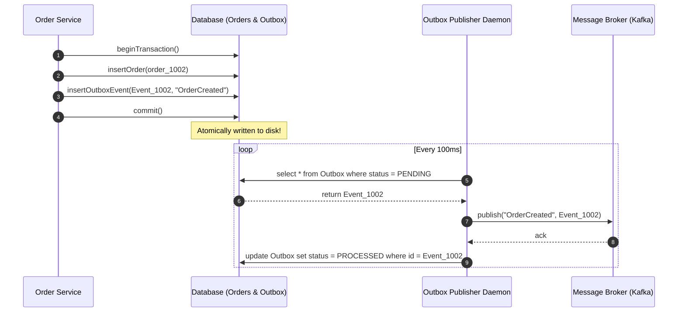

# Module 09: Asynchronous Messaging — Exactly-Once Semantics and the Outbox/Inbox Patterns

Welcome back, students. Today we analyze how to achieve reliability across asynchronous communication channels.

When microservices communicate via messages (using brokers like Apache Kafka or RabbitMQ), we must design for network failures. Messages will be dropped, delayed, or duplicated. We will study the three message delivery semantics, examine why **Exactly-Once Semantics (EOS)** requires cooperative coordination, master the **Transactional Outbox** and **Transactional Inbox** patterns, and implement an idempotent processing engine in Java.

---

## 1. Academic Lecture: Delivery Semantics and Design Patterns

### Message Delivery Semantics

Message brokers support three primary delivery guarantees:
1.  **At-Most-Once**: The message is sent at most once. If the network drops the message or the receiver crashes before processing, the message is permanently lost. (No retries).
2.  **At-Least-Once**: The message is retried until acknowledged. If the receiver processes the message but the acknowledgement is lost, the message will be delivered again, resulting in duplicates. (Default for most systems).
3.  **Exactly-Once**: The message is received and processed exactly once.

```
At-Least-Once Delivery with Duplicate:
[ Publisher ] -- (Send: msg_1) --> [ Consumer ] (Processes write)
[ Publisher ] <-- (Ack lost!) ---- [ Consumer ]
[ Publisher ] -- (Retry: msg_1) -> [ Consumer ] (CRITICAL: Processes write twice!)
```

### The Myth of Exactly-Once Delivery

In distributed systems theory, achieving physical exactly-once delivery over an unreliable channel is mathematically impossible (proven by the **Two Generals' Problem**). 

However, we can simulate exactly-once processing by combining **At-Least-Once Delivery** with **Idempotent Consumption** or **Transactional Broker Features**.

#### Kafka's Exactly-Once Semantics (EOS)
Apache Kafka implements EOS by combining:
*   **Idempotent Producers**: The broker assigns a unique sequence number to each producer. If a message retry is sent, the broker detects the duplicate sequence number and discards it.
*   **Transactional Coordinator**: Allows a producer to send messages to multiple topics and partitions, alongside committing consumer offsets, as a single atomic transaction.

### The Transactional Outbox Pattern

When a service changes its database state (e.g., inserts an order) and publishes an event (e.g., `OrderCreated`), execution is unsafe. If the database write commits but the publisher crashes before sending the event, the rest of the system remains unaware of the order.

The **Transactional Outbox Pattern** solves this. The service writes the event to a dedicated `OUTBOX` database table *within the same transaction* as the order.



### The Transactional Inbox Pattern

To protect the consumer from processing duplicate messages (since the outbox daemon guarantees at-least-once delivery, retrying if the broker acknowledges late), we implement the **Transactional Inbox Pattern**.

The consumer maintains an `INBOX` table. When a message arrives:
1.  Begin local transaction.
2.  Insert message UUID into the `INBOX` table. (This table has a unique constraint on message UUID).
3.  If the insert fails due to a key constraint violation, the message is a duplicate. Abort/discard.
4.  If it succeeds, execute the business mutation (e.g., update user balance) and commit the transaction.

---

## 2. Theory vs. Production Trade-offs

### 1. Kafka Transactions and Latency
Using Kafka transactions (`beginTransaction`, `commitTransaction`) degrades throughput.
*   **Why**: Kafka consumers configured with `read_committed` are blocked from reading any messages in a partition until the open transaction that wrote them is officially committed by the transaction coordinator. 
*   **Mitigation**: Restrict transactional broker features to financial ledgers, and use lightweight inbox deduplication for high-volume event processing.

---

## 3. How to Use: Outbox and Inbox Patterns in Java

Let's write a complete, compile-grade implementation of the **Transactional Outbox** and **Transactional Inbox** patterns in Java 21.

First, let's write our Event and DB message representation:

```java
package com.capstone.tx.messaging;

import java.util.UUID;

/**
 * Immutable message carrying a unique identifier to support deduplication.
 */
public record EventEnvelope(
    UUID eventId,
    String eventType,
    String payload
) {}
```

Now let us write the `TransactionalInbox` consumer that guarantees idempotent processing:

```java
package com.capstone.tx.messaging;

import java.util.HashSet;
import java.util.Objects;
import java.util.Set;
import java.util.concurrent.locks.ReentrantLock;
import java.util.logging.Logger;

/**
 * Thread-safe mock implementation of the Transactional Inbox pattern.
 * Uses a unique message ID set to simulate database unique constraints.
 */
public class TransactionalInboxConsumer {
    private static final Logger LOGGER = Logger.getLogger(TransactionalInboxConsumer.class.getName());

    private final Set<String> processedMessageIds = new HashSet<>();
    private final ReentrantLock dbLock = new ReentrantLock();
    
    private double totalBalance = 0.0;

    /**
     * Processes an incoming event idempotently.
     * Returns true if processed, false if skipped as a duplicate.
     */
    public boolean consumeIdempotent(EventEnvelope envelope) {
        Objects.requireNonNull(envelope, "Envelope cannot be null");
        String messageId = envelope.eventId().toString();

        dbLock.lock();
        try {
            // Step 1: Check unique constraint (Simulating DB Primary Key Index)
            if (processedMessageIds.contains(messageId)) {
                LOGGER.warning("DUPLICATE MESSAGE DETECTED. Skipping ID: " + messageId);
                return false;
            }

            // Step 2: Simulate business processing
            if ("DEPOSIT".equalsIgnoreCase(envelope.eventType())) {
                double amount = Double.parseDouble(envelope.payload());
                totalBalance += amount;
                LOGGER.info("Successfully processed deposit of " + amount + ". New balance: " + totalBalance);
            }

            // Step 3: Insert message ID into the Inbox register within the same transaction
            processedMessageIds.add(messageId);
            return true;

        } finally {
            dbLock.unlock();
        }
    }

    public double getTotalBalance() {
        dbLock.lock();
        try {
            return totalBalance;
        } finally {
            dbLock.unlock();
        }
    }
}
```

Now let's implement the `TransactionalOutbox` publishing loop:

```java
package com.capstone.tx.messaging;

import java.util.ArrayList;
import java.util.List;
import java.util.UUID;
import java.util.concurrent.locks.ReentrantLock;
import java.util.logging.Logger;

/**
 * Publisher managing an outbox queue and delivering messages to a consumer.
 */
public class TransactionalOutboxPublisher {
    private static final Logger LOGGER = Logger.getLogger(TransactionalOutboxPublisher.class.getName());

    public enum OutboxStatus { PENDING, PROCESSED }
    public record OutboxRecord(EventEnvelope event, OutboxStatus status) {}

    private final List<OutboxRecord> outboxTable = new ArrayList<>();
    private final ReentrantLock dbLock = new ReentrantLock();

    /**
     * Appends an event to the outbox table.
     * Part of the atomic business transaction.
     */
    public void saveToOutbox(EventEnvelope event) {
        dbLock.lock();
        try {
            outboxTable.add(new OutboxRecord(event, OutboxStatus.PENDING));
            LOGGER.info("Saved event to outbox table: " + event.eventId());
        } finally {
            dbLock.unlock();
        }
    }

    /**
     * Simulates the background daemon polling the outbox and sending messages to the consumer.
     */
    public void publishPendingEvents(TransactionalInboxConsumer consumer) {
        dbLock.lock();
        try {
            for (int i = 0; i < outboxTable.size(); i++) {
                OutboxRecord record = outboxTable.get(i);
                if (record.status() == OutboxStatus.PENDING) {
                    LOGGER.info("Publishing outbox message: " + record.event().eventId());
                    
                    // Simulate At-Least-Once Delivery (we might send twice if network retried)
                    boolean success = consumer.consumeIdempotent(record.event());
                    
                    if (success) {
                        // Mark processed
                        outboxTable.set(i, new OutboxRecord(record.event(), OutboxStatus.PROCESSED));
                    }
                }
            }
        } finally {
            dbLock.unlock();
        }
    }

    public int getPendingCount() {
        dbLock.lock();
        try {
            return (int) outboxTable.stream().filter(r -> r.status() == OutboxStatus.PENDING).count();
        } finally {
            dbLock.unlock();
        }
    }
}
```

---

## 4. Common Errors & Pitfalls

### Pitfall 1: Bypassing the Outbox table
Publishing messages directly to the broker inside a Spring `@Transactional` method, rather than writing to the outbox database table.
*   **Symptom**: If the database transaction commits but the network link to Kafka fails, the broker never receives the message. If the database rolls back but the message was already sent, other systems process data that does not exist.
*   **Mitigation**: Commit the event to the database's outbox table, allowing the database engine to guarantee atomic storage.

### Pitfall 2: Inbox Table Growth
*   **Symptom**: Over time, the inbox database table grows to billions of rows, slowing down write transactions due to unique index constraints.
*   **Mitigation**: Run a partition pruning job to delete message IDs older than 7 days, assuming that Kafka retention times are set lower (e.g., 3 days), ensuring no message older than 7 days can be retried.

---

## 5. Socratic Review Questions

### Question 1
Why is it impossible to guarantee exactly-once delivery over an unreliable network partition, and how does the Two Generals' Problem prove this?

#### Answer
The **Two Generals' Problem** proves that two generals commanding separate armies must agree on a time to attack over an unreliable communication valley where messengers can be captured. 

If General 1 sends a message "Attack at 9 AM", he cannot attack because he does not know if the messenger arrived. General 2 must send an acknowledgement: "Received, I agree". However, General 2 cannot attack because he does not know if his acknowledgement arrived. General 1 must send an acknowledgement of the acknowledgement. This results in an infinite sequence of confirmations.

In distributed networking, this means that over an unreliable channel, it is mathematically impossible to guarantee that both the sender and receiver have agreed on message delivery state without a final confirmation message, which itself is subject to loss. Thus, we must design for duplicate message arrivals (at-least-once delivery) and enforce idempotency at the receiver.

### Question 2
What is the difference between a **poll-based outbox runner** and a **transaction-log-tailing outbox runner (e.g., Debezium)**? What are the trade-offs?

#### Answer
*   **Poll-Based Outbox**: A background worker thread executes `SELECT * FROM outbox WHERE status = 'PENDING'` every 100ms.
    *   *Trade-offs*: Simple to implement in Java. However, it creates continuous polling database load and adds latency (up to the poll interval time).
*   **Transaction Log Tailing (Debezium)**: A daemon tails the database's write-ahead log (WAL) directly, intercepts raw inserts into the `OUTBOX` table, and publishes them to Kafka.
    *   *Trade-offs*: High performance, zero polling database query overhead, sub-millisecond propagation latency. However, it requires running additional infrastructure (Kafka Connect, Debezium engines) and binds the pipeline to the specific database storage format.

---

## 6. Hands-on Challenge: Building an Idempotent Transaction Service

### The Challenge
In this challenge, you will implement the transactional boundary of an Outbox processing engine. 

You must write a class that updates a user's account balance and creates an outbox notification event within a single thread-safe atomic transaction.

Complete the implementation below:

```java
package com.capstone.tx.messaging.challenge;

import com.capstone.tx.messaging.EventEnvelope;
import com.capstone.tx.messaging.TransactionalOutboxPublisher;
import java.util.UUID;
import java.util.concurrent.locks.ReentrantLock;

public class SecureTransactionProcessor {

    private final TransactionalOutboxPublisher outboxPublisher;
    private final ReentrantLock dbLock = new ReentrantLock();
    private double accountBalance = 1000.0;

    public SecureTransactionProcessor(TransactionalOutboxPublisher outboxPublisher) {
        this.outboxPublisher = outboxPublisher;
    }

    /**
     * Deducts funds from account balance and appends a withdraw notification
     * event to the outbox database table inside a single atomic operation.
     * 
     * @param amount the withdraw amount
     * @throws IllegalArgumentException if amount is negative or balance is insufficient
     */
    public void executeWithdraw(double amount) {
        dbLock.lock();
        try {
            // TODO: Complete this implementation.
            // 1. Validate balance constraints.
            // 2. Perform balance deduction.
            // 3. Construct EventEnvelope containing "WITHDRAW" event type.
            // 4. Save to outboxPublisher.
        } finally {
            dbLock.unlock();
        }
    }

    public double getAccountBalance() {
        return accountBalance;
    }
}
```

Write your code and verify the correctness. Save your solution notes inside `modules/09-asynchronous-messaging-exactly-once.md`.
