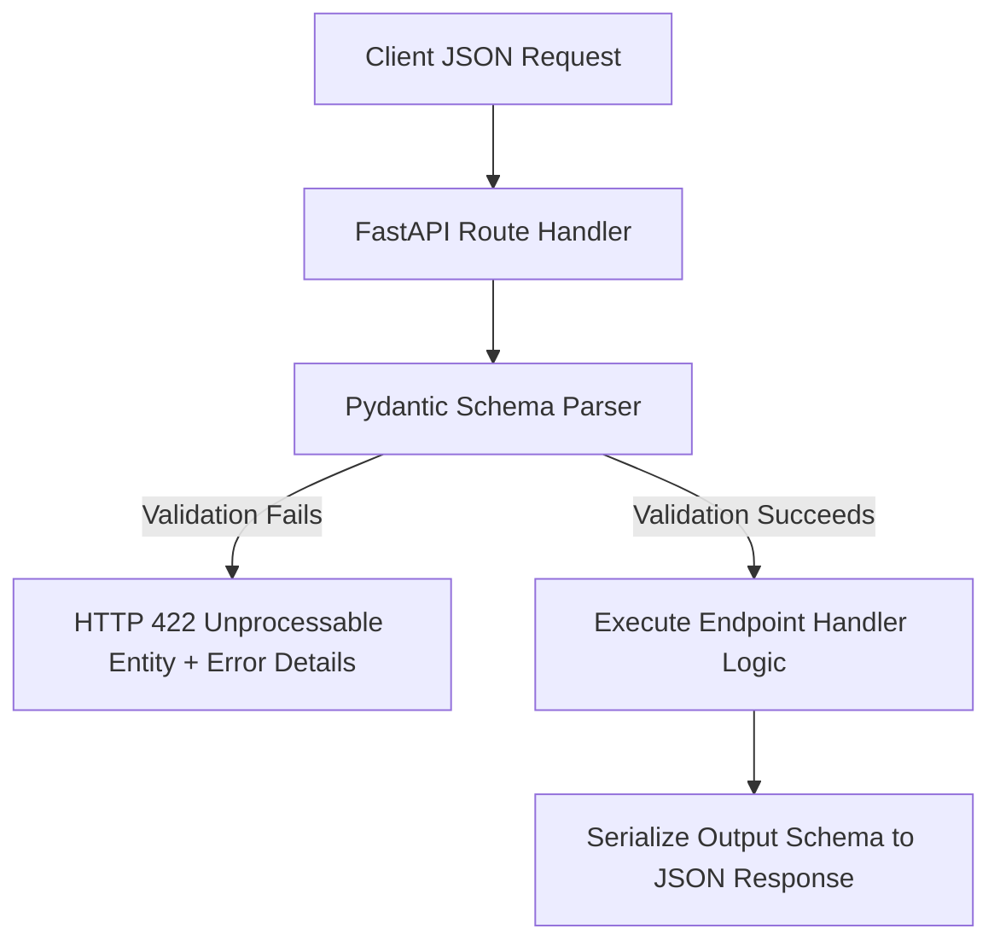

# Module 02: Routing & Pydantic Validation — Declaring Data Contracts

Welcome back, class. Today we analyze **Routing and Pydantic Validation (CS-521)**.

In web services development, input validation is your first line of defense. Accepting raw dictionaries or unvalidated JSON strings into your business logic layers opens the system to SQL injections, data corruption, and type-coercion errors. 

FastAPI integrates **Pydantic v2** to solve this. Pydantic leverages Python's standard type hints to perform data parsing, serialization, and runtime validation. Today, we will study path and query routing parameters, learn how to build robust validation schemas using Pydantic, and explore auto-generated OpenAPI documentation.

---

## 1. Academic Lecture: Declarative Data Contracts

Validation is not just about checking formats; it is about establishing a strict data contract between the client and the server.

### 1. Pydantic v2 Validation Schemas
A Pydantic schema is declared by inheriting from `pydantic.BaseModel`. Pydantic evaluates incoming JSON payloads against the schema's type hints at runtime:
*   If the input is valid, Pydantic parses it into a Python object with type safety.
*   If the input is invalid (e.g. a string passed to an integer field), Pydantic automatically rejects the request with an HTTP `422 Unprocessable Entity` status and returns a structured JSON error detailing the validation failures.

### 2. Path vs. Query Parameters
*   **Path Parameters**: Used to locate a specific resource (e.g., `GET /candidates/{candidate_id}`). The parameter is part of the URL path and is declared in the route signature.
*   **Query Parameters**: Used to filter, sort, or paginate resources (e.g., `GET /candidates?min_experience=3&limit=10`). Query parameters are not declared in the route path string, but are included in the function signature.



---

## 2. Theory vs. Production Trade-offs

### Direct Database Model Serialization vs. Separate Input/Output Schemas
*   **Direct Model Serialization (Shared Class)**:
    *   *Pro*: Faster development; less code duplication. You use the same class for database queries, updates, and API responses.
    *   *Con*: High risk of data leakage. If your database entity contains sensitive fields (like hashed passwords, reset tokens, or internal audit properties), they will be automatically serialized and leaked in public HTTP responses.
*   **Production Rule**: Always separate your **Input Schemas** (request payloads) from your **Output Schemas** (response payloads). This is the API equivalent of the DTO pattern in Spring.

---

## 3. How to Use: Creating Input and Output Schemas

Let us write a compile-grade FastAPI application showing how to implement input/output schema boundaries.

### A. The Exposed Data Leakage (Anti-Pattern)

Avoid returning raw database models or exposing sensitive fields to the API consumer:

```python
from fastapi import FastAPI
from pydantic import BaseModel

app = FastAPI()

class UserDatabaseRecord(BaseModel):
    id: int
    username: str
    email: str
    password_hash: str # DANGER: Sensitive field included in database record schema

@app.get("/users/{user_id}")
async def get_user(user_id: int):
    # DANGER: Returning the database record directly leaks password_hash
    record = UserDatabaseRecord(id=user_id, username="alice", email="alice@corp.com", password_hash="bcrypt$$...")
    return record
```

### B. The Hardened Input/Output Schema Separation (Production Pattern)

Here is the hardened pattern. We define separate schemas for creation requests (`UserCreate`) and API responses (`UserRead`), hiding internal fields:

```python
from fastapi import FastAPI, HTTPException, Query, Path
from pydantic import BaseModel, EmailStr, Field, field_validator
from typing import List

app = FastAPI()

# 1. Input Schema: Strict validation rules for data creation
class UserCreate(BaseModel):
    username: str = Field(..., min_length=3, max_length=20, pattern="^[a-zA-Z0-9_-]+$")
    email: EmailStr # Validates email formatting automatically
    age: int = Field(..., ge=18, le=100) # Enforces age >= 18 and <= 100

    @field_validator("username")
    @classmethod
    def validate_no_system_keywords(cls, value: str) -> str:
        # Custom validation decorator checking for banned words
        banned = ["admin", "root", "superuser"]
        if value.lower() in banned:
            raise ValueError("Username cannot be a system keyword.")
        return value

# 2. Output Schema: Defines exactly what fields are visible in the HTTP response
class UserRead(BaseModel):
    id: int
    username: str
    email: EmailStr

# Mock Database Store
MOCK_USERS = {}

@app.post("/users", response_model=UserRead, status_code=201)
async def create_user(payload: UserCreate):
    # Enforce input data parsing and mapping to output schema
    user_id = len(MOCK_USERS) + 1
    new_user = {
        "id": user_id,
        "username": payload.username,
        "email": payload.email,
        "password_hash": "secure_bcrypt_hash_here" # Hidden from output
    }
    MOCK_USERS[user_id] = new_user
    
    # FastAPI automatically serializes response dictionary to UserRead schema
    return new_user

@app.get("/users", response_model=List[UserRead])
async def list_users(
    # Validate query parameters bounds safely using Field limits or Query metadata
    limit: int = Query(default=10, ge=1, le=100),
    role: str = Query(default="user", pattern="^(user|recruiter|admin)$")
):
    users = list(MOCK_USERS.values())
    return users[:limit]
```

---

## 4. Common Errors & Pitfalls

### Pitfall 1: Mutating default mutable parameters in route signatures
Using mutable types (like lists or dictionaries) as default values in route function arguments.
```python
# DANGER: Python instantiates the list default parameter once.
# If you mutate search_tags inside the function, the change persists across subsequent HTTP requests!
@app.get("/search")
async def search(search_tags: list = []): 
```
*   **Mitigation**: Always use `None` as the default value for mutable parameters:
    ```python
    @app.get("/search")
    async def search(search_tags: list = None):
        tags = search_tags or []
    ```

---

## 5. Socratic Review Questions

### Question 1
Explain the difference between Pydantic's `BaseModel` parsing and raw type casting (e.g. `int("10")`).

#### Answer
*   `Type Casting`: Simply attempts to convert one data type to another. If it fails, it throws a low-level, unformatted exception (e.g. `ValueError`).
*   `Pydantic Parsing`: Performs deep validation against schemas. If a field contains the string `"10"`, and the schema expects an `int`, Pydantic co-erces it safely. If it encounters a malformed input, it does not crash; instead, it aggregates all validation failures and returns a structured validation error report showing the exact field and reason for failure.

### Question 2
What security benefit does setting `response_model` on a FastAPI route handler provide?

#### Answer
Setting `response_model` acts as a security filter. When the endpoint handler returns a dictionary or object, FastAPI parses the returned value against the specified `response_model` schema. 
Only the fields declared in the `response_model` schema are serialized into the outgoing JSON response. Any extra fields present in the database record (like passwords or reset tokens) are filtered out, preventing accidental data leaks.

---

## 6. Hands-on Challenge: Building a Smart Resume Filter Schema

### The Challenge
In this challenge, you will implement an input validation schema for a resume screening endpoint.

Your task:
1.  Define the Pydantic schema `ResumeMatchRequest`.
2.  Ensure `job_id` is a positive integer greater than zero.
3.  Ensure `similarity_threshold` is a float value between `0.0` and `1.0` inclusive.
4.  Ensure `candidate_email` is a valid email string.

Complete the schema implementation below:

```python
from fastapi import FastAPI
from pydantic import BaseModel, Field, EmailStr

app = FastAPI()

class ResumeMatchRequest(BaseModel):
    # TODO: Complete the validation fields.
    # 1. Declare job_id as an integer greater than 0.
    # 2. Declare similarity_threshold as a float between 0.0 and 1.0.
    # 3. Declare candidate_email as an EmailStr type.
    
    pass

@app.post("/filter-resumes")
async def filter_resumes(payload: ResumeMatchRequest):
    # If validation passes, return a confirmation payload
    return {"status": "validated", "job_id": payload.job_id}
```

Write the schema model fields. Save the completed file and explain how validation guards prevent database queries from executing on corrupt input structures inside `modules/02-routing-pydantic-validation.md`.
