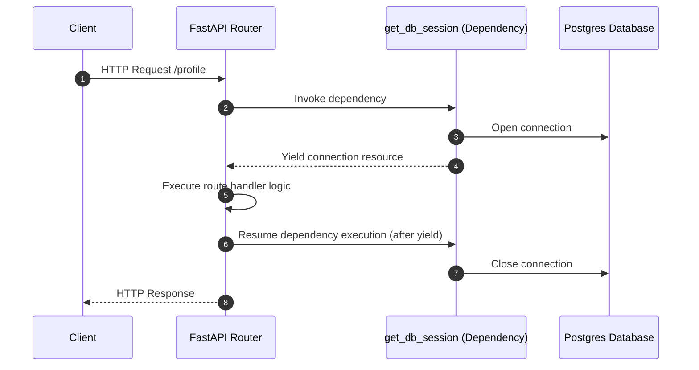

# Module 03: Dependency Injection — Resource Lifecycles & Dependencies

Welcome back, class. Today we analyze **FastAPI Dependency Injection (CS-521)**.

In enterprise architectures, managing resource lifecycles—such as database connections, external client sockets, and security sessions—is critical. If database connection pools do not release connections after request execution, the application will experience pool exhaustion and crash.

In Spring Boot, we manage resources using dependency injection beans (e.g. `@Autowired`). In FastAPI, we use a functional dependency injection framework called **Depends**. Today, we will study how to manage database sessions using generator yields, build hierarchical dependency trees, and override dependencies for testing.

---

## 1. Academic Lecture: The Depends Framework & Yield Generators

FastAPI's dependency injection is designed around function calls.

### 1. Functional Injection (`Depends`)
A dependency in FastAPI is a function that can be executed before your route handler runs. We declare dependencies in the route parameters:

```python
@app.get("/users")
async def list_users(db: Session = Depends(get_db_session)):
```

FastAPI automatically resolves `get_db_session`, executes it, injects the return value into the `db` parameter, and runs the route handler.

### 2. Lifecycles and the Yield Keyword
To manage resources that require cleanup (such as database sessions), Python uses **generators** containing the `yield` keyword.
*   **The Workflow**:
    1.  The code before the `yield` runs first (e.g., opening a database connection).
    2.  The value yielded is injected into the route handler parameter.
    3.  The route handler executes and completes.
    4.  The code after the `yield` runs (e.g., closing the connection).
    5.  **Exception Safety**: If the route handler throws an exception, FastAPI propagates it but still executes the cleanup block after the `yield`, ensuring database connections are never leaked.



---

## 2. Theory vs. Production Trade-offs

### Global Singleton Connections vs. Request-Scoped Connection Yields
*   **Global Singleton Client (e.g., opening one database client globally)**:
    *   *Pro*: Low connection overhead; database connections are reused across all concurrent requests.
    *   *Con*: Not suitable for transactions. If multiple concurrent requests share a single transaction session, they will corrupt each other's transactions (race conditions).
*   **Request-Scoped Session Yields (Depends)**:
    *   *Pro*: Safe transactional boundaries. Each request gets its own isolated session and transaction block, preventing concurrency conflicts.
    *   *Con*: Minor performance overhead from opening and closing connections on every request.
*   **Production Rule**: Use a **Global Connection Pool** (e.g. SQLAlchemy QueuePool), and use FastAPI's `Depends(get_db)` to yield a request-scoped **session** checked out from that pool, returning it to the pool in the cleanup block.

---

## 3. How to Use: Yield Sessions and Security Dependencies

Let us write a compile-grade FastAPI application demonstrating how to manage database sessions and authenticate users using hierarchical dependencies.

### A. The Leaked Database Session (Anti-Pattern)

Avoid opening database connections manually inside endpoints without guaranteed cleanup:

```python
from fastapi import FastAPI

app = FastAPI()

class DatabaseConnection:
    def execute(self, query: str):
        print(f"Executing: {query}")
    def close(self):
        print("Connection closed.")

@app.get("/data")
async def get_data():
    # DANGER: If database throws an error during execution, connection.close()
    # is bypassed, leaking the connection and exhausting the pool.
    conn = DatabaseConnection()
    conn.execute("SELECT * FROM users")
    conn.close()
    return {"status": "success"}
```

### B. The Hardened Dependency Yield (Production Pattern)

Here is the hardened code. It uses a generator function to open, yield, and close database connections safely inside a try-finally block.

First, implement the Database Connection Manager dependency:

```python
from fastapi import FastAPI, Depends, HTTPException, status
from typing import Generator

app = FastAPI()

class DatabaseSession:
    def __init__(self):
        self.is_open = True
    def query_user(self, user_id: int):
        if not self.is_open:
            raise RuntimeError("Session is closed.")
        return {"id": user_id, "username": f"user_{user_id}", "is_active": True}
    def close(self):
        self.is_open = False
        print("Database session closed successfully.")

# SECURE: Generator dependency managing connection lifecycle
def get_db_session() -> Generator[DatabaseSession, None, None]:
    session = DatabaseSession()
    try:
        # Yield the active session to the route handler
        yield session
    finally:
        # Enforce connection closure, even if the request throws an exception
        session.close()
```

Next, implement the Security Dependency:

```python
async def get_authenticated_user(
    token: str, 
    db: DatabaseSession = Depends(get_db_session) # Dependency depends on another dependency
) -> dict:
    if token != "valid-key":
        raise HTTPException(
            status_code=status.HTTP_401_UNAUTHORIZED,
            detail="Invalid authentication token."
        )
    # Query user details using the injected database session
    user = db.query_user(1)
    return user
```

Now, map the dependencies in the Route Endpoints:

```python
@app.get("/secure-data")
async def secure_endpoint(
    # Injects the authenticated user, resolving all nested dependencies automatically
    current_user: dict = Depends(get_authenticated_user)
):
    return {"message": f"Hello {current_user['username']}"}
```

---

## 4. Common Errors & Pitfalls

### Pitfall 1: Attempting to use yield inside async dependencies without returning
Using a `yield` inside an async dependency function that does not complete cleanly, or omitting the `try/finally` block.
*   **Why it fails**: If an error occurs in the endpoint, the code after the `yield` will not execute, leaving file descriptors or network sockets open.
*   **Mitigation**: Always wrap the `yield` inside a `try/finally` block:
    ```python
    async def get_resource():
        resource = open_resource()
        try:
            yield resource
        finally:
            resource.close()
    ```

---

## 5. Socratic Review Questions

### Question 1
Why does FastAPI's dependency injection make unit testing easier compared to frameworks that rely on static class imports?

#### Answer
Because FastAPI routes declare dependencies as function parameters inside route signatures, we can override them dynamically during testing using `app.dependency_overrides`. 
In our test suite, we map the real dependency function (e.g., `get_db_session`) to a mock dependency function (e.g., `get_mock_db`) without modifying our production code.

### Question 2
Explain the execution sequence when Route A depends on Dependency B, and Dependency B depends on Dependency C.

#### Answer
FastAPI resolves dependencies in a depth-first traversal:
1.  FastAPI executes Dependency C first, creating its returned object.
2.  It injects Dependency C's return value into Dependency B and executes Dependency B.
3.  It injects Dependency B's return value into Route A and executes the endpoint handler.
4.  Once Route A returns, it executes the cleanup codes (after the `yield`) in reverse order: cleaning up Dependency B first, and then Dependency C.

---

## 6. Hands-on Challenge: Implementing a Safe Client Connection Yield

### The Challenge
In this challenge, you will implement a dependency generator.

Your task is to write the dependency function `get_api_client`:
1.  Instantiate a mock API client `MockApiClient()`.
2.  Open the client connection using `client.open()`.
3.  Yield the client for route execution.
4.  Implement a `finally` block to guarantee `client.close()` is executed.

Complete the dependency implementation below:

```python
from fastapi import FastAPI, Depends

app = FastAPI()

class MockApiClient:
    def __init__(self):
        self.connected = False
    def open(self):
        self.connected = True
        print("Client connection opened.")
    def close(self):
        self.connected = False
        print("Client connection closed.")

# TODO: Implement the dependency generator
def get_api_client():
    client = MockApiClient()
    # 1. Open client connection.
    # 2. Implement try block and yield client.
    # 3. Implement finally block to close client.
    
    yield None

@app.get("/fetch-external")
async def fetch_external(client: MockApiClient = Depends(get_api_client)):
    return {"connected": client.connected}
```

Write the generator method. Save the completed file and explain the role of exception boundaries in resource cleanup inside `modules/03-dependency-injection.md`.
