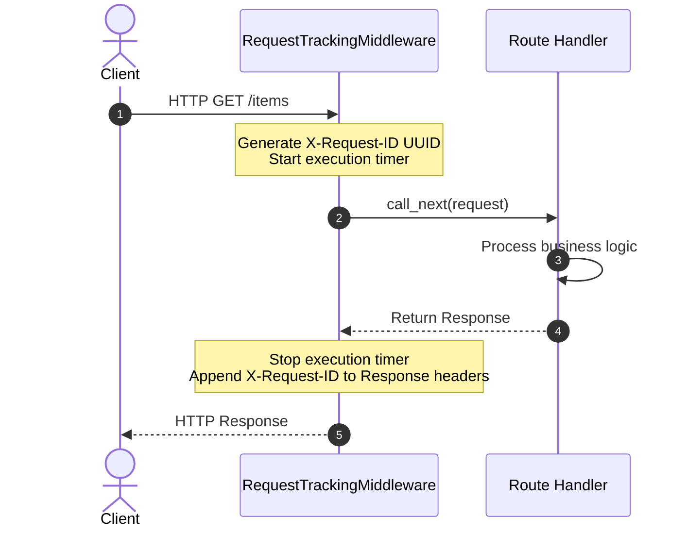

# Module 04: ASGI Middleware — Request/Response Lifecycles & Custom Interceptors

Welcome back, class. Today we analyze **FastAPI Middleware (CS-521)**.

When building enterprise APIs, there are cross-cutting concerns that apply to every endpoint: logging request paths, tracking execution latency, generating correlation IDs (`X-Request-ID`) for microservice tracing, enforcing CORS policies, and blocking host header attacks. If you write this logic inside individual endpoint handlers, you violate DRY (Don't Repeat Yourself) principles and create a maintenance nightmare.

FastAPI solves this using **ASGI Middleware**. Middleware is a function or class that runs before a request reaches your endpoint handler, and after your endpoint returns the response. Today, we will study the request-response lifecycle, write custom logging middleware, and configure security headers.

---

## 1. Academic Lecture: The ASGI Pipeline

Middleware sits as a boundary wrapper around your application.

### 1. The HTTP Middleware Lifecycle
FastAPI executes middleware in stack order:
1.  **Request Inbound**: The client sends a request. The middleware intercepts it.
2.  **Pre-processing**: The middleware inspects or modifies the request (e.g., reading headers, injecting tracking IDs).
3.  **Use Case Execution**: The middleware calls `call_next(request)`. This routes the request downstream to other middlewares and finally to your route handler.
4.  **Post-processing**: The route handler returns a `Response`. The middleware intercepts it and can inspect or modify it (e.g., adding headers, logging execution duration).
5.  **Response Outbound**: The response is sent back to the client.

```
                  ASGI Middleware Lifecycle
                  
  Client Request ---> [ Middleware Pre-process ] ---> Route Handler
                                                            |
  Client Response <-- [ Middleware Post-process ] <----------/
(Middleware measures execution duration and appends correlation headers)
```

### 2. Built-in Security Middlewares
*   **CORSMiddleware**: Prevents Cross-Origin Resource Sharing vulnerabilities by restricting allowed domains, headers, and HTTP methods.
*   **TrustedHostMiddleware**: Prevents **Host Header Injection** attacks by rejecting requests that do not match a whitelisted list of domains.



---

## 2. Theory vs. Production Trade-offs

### Middleware vs. Dependency Injection Guards
*   **ASGI Middleware**:
    *   *Pro*: Executes globally for **all** routes, including auto-generated schema files and static resources. Ideal for logging, tracing, and metric collection.
    *   *Con*: Runs before FastAPI performs route resolution, meaning you cannot easily access path parameters or check endpoint-specific role annotations.
*   **Dependency Injection (Depends)**:
    *   *Pro*: Executed at the route level. Has access to request context, validated Pydantic models, and database sessions. Ideal for authentication and role authorization checks.
*   **Production Rule**: Use **Middleware** for infrastructure-level concerns (CORS, tracing, rate-limiting, latency metrics). Use **Dependencies** for application-level concerns (authentication, authorization, database sessions).

---

## 3. How to Use: Custom Middleware in FastAPI

Let us write a compile-grade FastAPI application containing a custom request tracking middleware and secure CORS configurations.

### A. The Duplicated Handler Metrics (Anti-Pattern)

Avoid repeating monitoring or tracing logic inside individual route controllers:

```python
import time
from fastapi import FastAPI

app = FastAPI()

@app.get("/items")
async def get_items():
    # DANGER: Tracking metrics inside handlers leads to massive code duplication
    start_time = time.time()
    
    # Process logic...
    result = {"items": []}
    
    duration = time.time() - start_time
    print(f"Endpoint took {duration}s")
    return result
```

### B. The Hardened ASGI Tracking Middleware (Production Pattern)

Here is the hardened pattern. We implement a custom middleware to inject request IDs and track latency, and register secure CORS rules.

```python
import time
import uuid
from fastapi import FastAPI, Request
from fastapi.middleware.cors import CORSMiddleware
from fastapi.middleware.trustedhost import TrustedHostMiddleware
from fastapi.responses import JSONResponse

app = FastAPI()

# 1. Register Trusted Host Security Middleware
app.add_middleware(
    TrustedHostMiddleware, 
    allowed_hosts=["app.corp.com", "*.corp.com", "localhost"]
)

# 2. Register Custom CORS Security Middleware
app.add_middleware(
    CORSMiddleware,
    allow_origins=["https://editor.corp.com", "https://admin.corp.com"],
    allow_credentials=True,
    allow_methods=["GET", "POST", "PUT", "DELETE"],
    allow_headers=["Authorization", "Content-Type", "X-Request-ID"],
)

# 3. Custom Request Correlation & Execution Latency Middleware
@app.middleware("http")
async def add_request_tracking_middleware(request: Request, call_next):
    # Retrieve request ID from client headers or generate a new unique UUID
    request_id = request.headers.get("X-Request-ID", str(uuid.uuid4()))
    
    # Store request ID in request state context for downstream route handler access
    request.state.request_id = request_id
    
    start_time = time.time()
    
    try:
        # Forward request downstream
        response = await call_next(request)
    except Exception as e:
        # Catch unhandled exceptions to prevent leaking server details
        return JSONResponse(
            status_code=500,
            content={"detail": "An unexpected system error occurred."},
            headers={"X-Request-ID": request_id}
        )
        
    process_time = time.time() - start_time
    
    # SECURE: Append execution metrics and correlation IDs to outgoing headers
    response.headers["X-Process-Time"] = f"{process_time:.6f}"
    response.headers["X-Request-ID"] = request_id
    
    return response

@app.get("/health")
async def health_check(request: Request):
    # Retrieve tracking ID from request state context
    return {"status": "healthy", "request_id": request.state.request_id}
```

---

## 4. Common Errors & Pitfalls

### Pitfall 1: Attempting to read the request body multiple times inside middleware
Accessing `await request.body()` directly inside a custom middleware, then forwarding the request.
*   **Why it fails**: FastAPI reads the HTTP request stream as a generator. Once the middleware reads the body, the stream cursor is exhausted. When the request reaches the route handler, the JSON parser blocks indefinitely waiting for body bytes, freezing the connection.
*   **Mitigation**: Avoid reading request bodies in middleware. If you must read it (e.g., for logging), you must cache it and override the request stream helper in your middleware wrapper.

---

## 5. Socratic Review Questions

### Question 1
Explain the difference in execution order between `app.add_middleware(CORSMiddleware)` and `@app.middleware("http")` when multiple middlewares are registered.

#### Answer
FastAPI executes middlewares in the **reverse order** of registration (LIFO - Last In, First Out). 
If you register `CORSMiddleware` first, and then register `RequestTrackingMiddleware`, the incoming request will hit `RequestTrackingMiddleware` first. The response, traveling back out of the application, will pass through `RequestTrackingMiddleware` last.

### Question 2
Why is Nginx host header whitelisting preferred over FastAPI's `TrustedHostMiddleware` in large scale clusters?

#### Answer
FastAPI's `TrustedHostMiddleware` operates at the Python application layer. While it secures your app, the request must still be parsed and processed by Uvicorn and FastAPI before being rejected. 
Whitelisting hosts at the Nginx reverse proxy layer blocks malicious requests at the network perimeter, preventing them from consuming Python application thread resources.

---

## 6. Hands-on Challenge: Building an Admin Path Gatekeeper Middleware

### The Challenge
In this challenge, you will implement a request-blocking middleware.

Your task is to write a custom middleware that:
1.  Intercepts all requests targeting paths starting with `/admin`.
2.  Verifies the request contains the header `X-Admin-Secret` set to `super-secret-pass`.
3.  If the header is missing or incorrect, block the request and return a `JSONResponse(status_code=403)` containing `{"detail": "Forbidden access"}`.
4.  Otherwise, forward the request downstream using `call_next`.

Complete the middleware function below:

```python
from fastapi import FastAPI, Request
from fastapi.responses import JSONResponse

app = FastAPI()

@app.middleware("http")
async def admin_gatekeeper_middleware(request: Request, call_next):
    # TODO: Complete this gatekeeper logic.
    # 1. Check if request.url.path starts with "/admin".
    # 2. Extract header "X-Admin-Secret" using request.headers.get().
    # 3. If missing or not equal to "super-secret-pass", return JSONResponse(status_code=403).
    # 4. Otherwise, return await call_next(request).
    
    return await call_next(request)

@app.get("/admin/dashboard")
async def admin_dashboard():
    return {"secret_data": "accessible"}
```

Write the path interception check. Save the completed file and explain why authorization checks are safer in dependency injection rather than global middleware inside `modules/04-middleware.md`.
