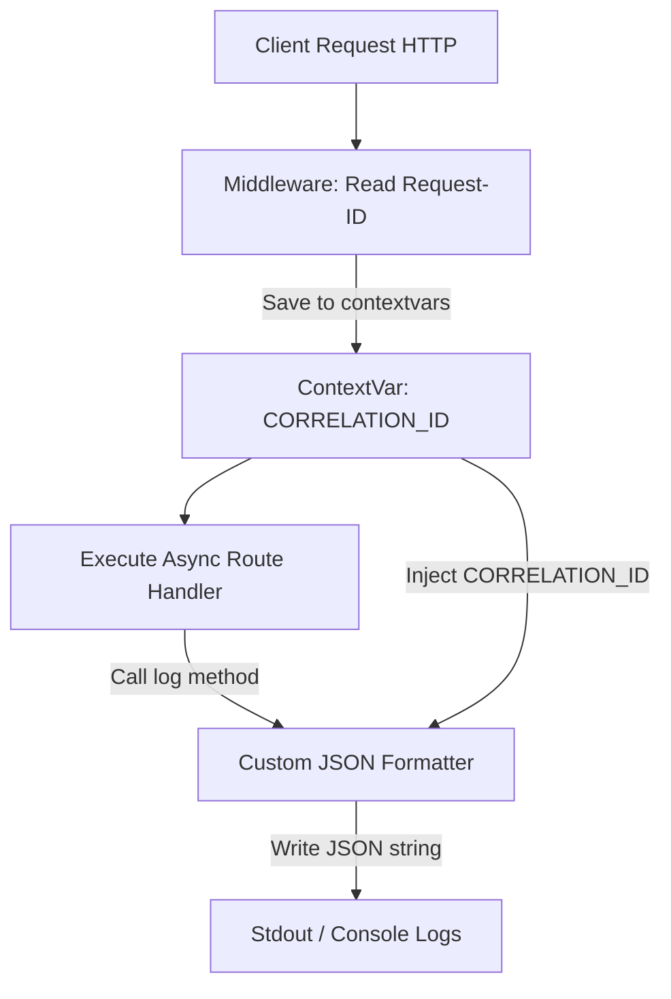

# Module 05: Structured Logging — JSON Formatter & Async Contexts

Welcome back, class. Today we analyze **Structured Logging (CS-521)**.

When debugging production clusters, text-based log files (e.g., `[INFO] User logged in`) are highly inefficient. Distributed log aggregators (like Elasticsearch, Datadog, or Grafana Loki) require structured formats to filter and query data. If your logs are written as standard console text, search filters cannot easily parse variables like usernames, execution duration, or request IDs.

Furthermore, because FastAPI runs asynchronously on a single event loop thread, standard thread-local variables cannot be used to track request correlation IDs. We must use **Context Variables (contextvars)**. Today, we will study structured JSON logging and write a custom log formatter in Python.

---

## 1. Academic Lecture: Machine-Readable Logs & Async Contexts

Logs are not for developers to read in real-time; they are data inputs for analytics tools.

### 1. Structured JSON Logging
Every log output must be a single, self-contained JSON object written on a single line:

```json
{
  "timestamp": "2026-06-12T13:25:00Z",
  "level": "WARNING",
  "logger": "app.auth",
  "message": "Failed login attempt",
  "user": "guest_user",
  "request_id": "8f8b89e2-9b2f-488f-b98a-ec8ff21a8d05"
}
```

This format allows your log search systems to instantly index and filter logs by `level`, `user`, or `request_id` without regex parsing.

### 2. Context Variables (`contextvars`) in Asynchronous Python
In synchronous Java (Spring Boot), engineers use ThreadLocal variables via MDC (Mapped Diagnostic Context) to store correlation IDs. Because every request runs on its own thread, MDC data remains isolated.
*   **The Async Challenge**: In FastAPI, multiple requests execute concurrently on the **same thread**. If you store a correlation ID in a thread-local variable, Request B will overwrite Request A's ID.
*   **The Async Solution**: Python's `contextvars` module provides context-local storage. It isolates variable states across asynchronous execution paths (coroutines), ensuring correlation IDs remain correct during async yields.



---

## 2. Theory vs. Production Trade-offs

### Raw Print Logs vs. Structured Log Handlers
*   **Standard Python Prints (`print()`)**:
    *   *Pro*: Easy to write during development.
    *   *Con*: High CPU performance penalty. Print functions block synchronous output channels. Furthermore, prints lack log levels (DEBUG/INFO/ERROR) and metadata headers.
*   **Structured JSON Logging**:
    *   *Pro*: Fully machine-readable, indexable, and supports log level thresholds.
    *   *Con*: Harder to read on a local developer terminal without log-pretty-printing tools.

---

## 3. How to Use: Structured JSON Logging in FastAPI

Let us write a compile-grade Python 3.11+ application that sets up structured JSON logging using `contextvars`.

### A. The Multi-Line Stack Trace Leak (Anti-Pattern)

Avoid logging raw exceptions or printing objects directly. This breaks JSON parsing streams:

```python
import logging
from fastapi import FastAPI

app = FastAPI()

@app.get("/error")
async def trigger_error():
    try:
        1 / 0
    except ZeroDivisionError as e:
        # DANGER: logging.exception prints multi-line stack traces directly to console.
        # Log aggregation parsers read each stack trace line as a separate log entry,
        # cluttering your metrics dashboards.
        logging.error("Failed calculation", exc_info=True)
        return {"error": "division by zero"}
```

### B. The Hardened JSON Logging Architecture (Production Pattern)

Here is the hardened pattern. We create a custom JSON Formatter class, set up a middleware to track request correlation IDs in a `ContextVar`, and format exception traces into a single JSON line.

First, define the Logging configuration:

```python
import json
import logging
import sys
from datetime import datetime, timezone
from contextvars import ContextVar
from fastapi import FastAPI, Request

# Create a Context Variable to store the request correlation ID across async coroutines
CORRELATION_ID: ContextVar[str] = ContextVar("correlation_id", default="SYSTEM")

class JsonLogFormatter(logging.Formatter):
    """
    Custom Logging Formatter outputting structured JSON logs.
    """
    def format(self, record: logging.LogRecord) -> str:
        # Retrieve correlation ID from async context
        request_id = CORRELATION_ID.get()

        log_payload = {
            "timestamp": datetime.now(timezone.utc).isoformat(),
            "level": record.levelname,
            "logger": record.name,
            "message": record.getMessage(),
            "correlation_id": request_id,
            "filename": record.filename,
            "lineno": record.lineno
        }

        # If exception details are present, format them into a single string field
        if record.exc_info:
            log_payload["exception"] = self.formatException(record.exc_info)

        return json.dumps(log_payload)

# Configure the root logger
root_logger = logging.getLogger()
root_logger.setLevel(logging.INFO)

# Create stream handler targeting stdout
stdout_handler = logging.StreamHandler(sys.stdout)
stdout_handler.setFormatter(JsonLogFormatter())
root_logger.addHandler(stdout_handler)

# Get application specific logger
logger = logging.getLogger("app.service")
```

Next, implement the Correlation ID Middleware:

```python
app = FastAPI()

@app.middleware("http")
async def correlation_id_logging_middleware(request: Request, call_next):
    # Extract request ID or generate a new one
    request_id = request.headers.get("X-Request-ID", str(uuid.uuid4()) if 'uuid' in globals() else "gen-id")
    
    # SECURE: Set the ContextVar value. This value remains isolated for this async request thread
    token = CORRELATION_ID.set(request_id)
    
    try:
        response = await call_next(request)
        return response
    finally:
        # Reset the ContextVar value after request completion
        CORRELATION_ID.reset(token)
```

Now, map the routes with Logging:

```python
@app.get("/perform-action")
async def perform_action():
    # Logging messages automatically include the correlation ID from contextvars
    logger.info("Executing user profile validation checks.")
    return {"status": "success"}

@app.get("/error-safe")
async def trigger_error_safe():
    try:
        1 / 0
    except ZeroDivisionError:
        # SECURE: Exception stack trace is formatted into a single JSON line
        logger.error("Failed to execute calculations.", exc_info=True)
        return {"error": "Internal computation error."}
```

---

## 4. Common Errors & Pitfalls

### Pitfall 1: Mixing JSON and text logs in the same output stdout channel
Leaving third-party libraries (like Uvicorn's default access logger) configured to print raw text, while your application logs JSON.
*   **Why it fails**: When Logstash or Fluentd attempt to parse the log stream as JSON, they will crash or flag parsing errors on the text lines.
*   **Mitigation**: Suppress or override Uvicorn default log formats, or configure a JSON formatter for Uvicorn loggers too.

---

## 5. Socratic Review Questions

### Question 1
Explain why Python's standard `threading.local` variables are unsuitable for storing request correlation IDs in a FastAPI application.

#### Answer
`threading.local` variables store data relative to the current thread. In synchronous applications (where one request equals one thread), this works fine. 
However, FastAPI runs asynchronously on a single event loop thread. Multiple requests share the same thread, switching context at every `await` boundary. If you write a correlation ID to `threading.local`, concurrent requests will overwrite each other's IDs, causing log contamination.

### Question 2
What is the purpose of the `contextvars.Token` object returned by `CORRELATION_ID.set(val)`?

#### Answer
The `Token` object represents the state of the Context Variable before it was updated. 
Because async coroutines can yield and resume, we must reset the Context Variable back to its previous state (or default state) after our request completes. We do this by calling `CORRELATION_ID.reset(token)` inside a `finally` block.

---

## 6. Hands-on Challenge: Building a Structured JSON Exception Logger

### The Challenge
In this challenge, you will implement a structured log formatter method.

Your task is to write the `format` method for the `SimpleJsonFormatter` class:
1.  Map the record's level, name, and message to a dictionary.
2.  Retrieve the value of the `CONTEXT_USER` ContextVar. If present, add it to the dictionary under the key `user`.
3.  Return the serialized JSON string of the dictionary.

Complete the implementation below:

```python
import json
import logging
from contextvars import ContextVar

CONTEXT_USER: ContextVar[str] = ContextVar("context_user", default="ANONYMOUS")

class SimpleJsonFormatter(logging.Formatter):

    def format(self, record: logging.LogRecord) -> str:
        # TODO: Complete this JSON formatter.
        # 1. Create a log payload dict.
        # 2. Add keys: "level" (record.levelname), "logger" (record.name), "message" (record.getMessage()).
        # 3. Retrieve CONTEXT_USER value: user = CONTEXT_USER.get().
        # 4. Add "user" key to payload.
        # 5. Return json.dumps(payload).
        
        return "{}"
```

Write the JSON formatting code. Save the completed file and explain the role of structured logging in microservice troubleshooting inside `modules/05-structured-logging.md`.
