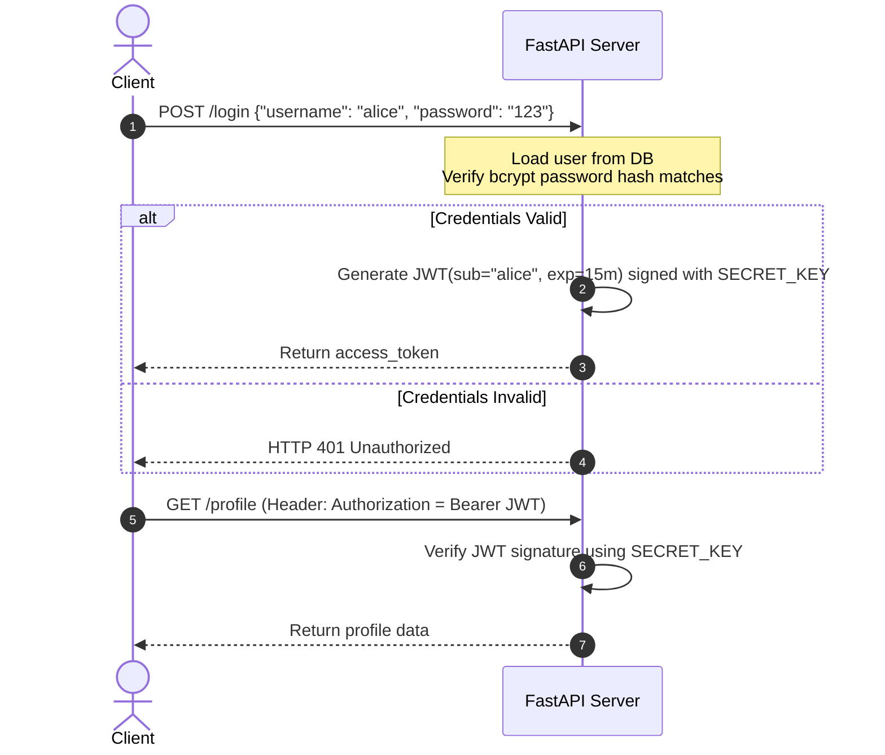

# Module 06: Authentication — Cryptographic Hashing & JWT Security

Welcome back, class. Today we analyze **Authentication (CS-521)**.

Authenticating users securely in a stateless API requires strict cryptographic standards. Many developers make fatal mistakes: storing passwords in plaintext, using weak legacy hashing algorithms (like MD5 or SHA1), or decoding JSON Web Tokens (JWT) without verifying their signatures. 

FastAPI provides built-in OAuth2 protocols to streamline stateless security. Today, we will study secure password hashing using **bcrypt**, learn how to generate and verify cryptographically signed **JWT tokens**, and implement secure authentication dependencies.

---

## 1. Academic Lecture: Hashing and Stateless Tokens

Authentication ensures a user's identity is verified before processing state-changing actions.

### 1. Cryptographic Password Hashing
Passwords must never be stored as plaintext. We use one-way hashing functions to secure them:
*   **The Invariant**: A secure hashing algorithm must be computationally expensive (slow) to prevent brute-force attacks. We use **bcrypt** or **Argon2id**.
*   **Salting**: A random string (salt) is appended to the password before hashing. This ensures that if two users share the same password, their database hashes are completely different, preventing **Rainbow Table** attacks.

### 2. JSON Web Tokens (JWT)
In stateless APIs, the server does not store user session states in memory. Instead, it issues a cryptographically signed token:
*   **Header**: Defines the algorithm (e.g., HS256) and type.
*   **Payload**: Contains claims—statements about the user (e.g., `sub` for username, `exp` for expiry timestamp, `scopes` for roles).
*   **Signature**: Created by signing the header and payload with a server-side **Secret Key**. 
*   **Verifying**: For every request, the server decodes the token and **verifies the signature** against the Secret Key. If the client attempts to modify their role (e.g. changing `"role": "user"` to `"role": "admin"`), the signature verification fails, and the request is rejected.



---

## 2. Theory vs. Production Trade-offs

### Symmetric (HS256) vs. Asymmetric (RS256) Token Signing
*   **Symmetric (HS256)**:
    *   *Pro*: Simple; uses a single secret key to both sign and verify tokens.
    *   *Con*: High risk. Every microservice that needs to validate tokens must have access to the secret key. If one microservice database is compromised, the attacker can forge tokens for the entire enterprise.
*   **Asymmetric (RS256)**:
    *   *Pro*: The identity server signs tokens using a **Private Key**. Other microservices validate signatures using a public **Public Key**. If a microservice is compromised, the attacker cannot forge tokens because they lack the private key.
*   **Production Rule**: Use **Symmetric (HS256)** for simple, single-service APIs. Use **Asymmetric (RS256)** for distributed microservice architectures.

---

## 3. How to Use: Secure Password Hashing & JWT Verification

Let us write a compile-grade Python 3.11+ implementation containing password hashing utilities and a JWT validation route dependency.

### A. The Unverified Signature Bypass (Anti-Pattern)

Avoid decoding JWT tokens without verifying the signature:

```python
import jwt # DANGER: PyJWT decoding without options check
from fastapi import FastAPI, HTTPException

app = FastAPI()

@app.get("/profile")
async def read_profile(token: str):
    # DANGER: Decoding the token without signature verification allows
    # attackers to modify token payloads in the browser and hijack user accounts.
    payload = jwt.decode(token, options={"verify_signature": False})
    return {"user": payload.get("sub")}
```

### B. The Hardened Cryptographic Security Setup (Production Pattern)

Here is the hardened pattern. We set up bcrypt password contexts, write secure token generation utilities, and build a JWT signature validation dependency.

```python
import sys
from datetime import datetime, timedelta, timezone
from fastapi import FastAPI, Depends, HTTPException, status
from fastapi.security import OAuth2PasswordBearer
from jose import JWTError, jwt
from passlib.context import CryptContext
from pydantic import BaseModel

app = FastAPI()

# 1. Configure Password Hashing Context
pwd_context = CryptContext(schemes=["bcrypt"], deprecated="auto")

# 2. Cryptographic Secret Keys (Keep these in environment variables in production!)
SECRET_KEY = "super-secret-production-encryption-signing-key"
ALGORITHM = "HS256"
ACCESS_TOKEN_EXPIRE_MINUTES = 15

# 3. OAuth2 scheme extraction helper (extracts Bearer token from headers)
oauth2_scheme = OAuth2PasswordBearer(tokenUrl="token")

class TokenData(BaseModel):
    username: str

def hash_password(password: str) -> str:
    # Encrypts the plaintext password using bcrypt
    return pwd_context.hash(password)

def verify_password(plain_password: str, hashed_password: str) -> bool:
    # Verifies a plaintext password matches the stored bcrypt hash
    return pwd_context.verify(plain_password, hashed_password)

def create_access_token(data: dict) -> str:
    # Generates a signed JWT access token with an expiry claim
    to_encode = data.copy()
    expire = datetime.now(timezone.utc) + timedelta(minutes=ACCESS_TOKEN_EXPIRE_MINUTES)
    to_encode.update({"exp": int(expire.timestamp())})
    
    # Sign token cryptographically using HS256 and the SECRET_KEY
    return jwt.encode(to_encode, SECRET_KEY, algorithm=ALGORITHM)

# SECURE: Inbound authentication validator dependency
async def get_current_user(token: str = Depends(oauth2_scheme)) -> str:
    credentials_exception = HTTPException(
        status_code=status.HTTP_401_UNAUTHORIZED,
        detail="Could not validate credentials.",
        headers={"WWW-Authenticate": "Bearer"},
    )
    try:
        # SECURE: Explicitly decode and verify the signature using the SECRET_KEY
        payload = jwt.decode(token, SECRET_KEY, algorithms=[ALGORITHM])
        username: str = payload.get("sub")
        if username is None:
            raise credentials_exception
    except JWTError:
        raise credentials_exception
        
    return username

@app.get("/users/me")
async def read_users_me(current_user: str = Depends(get_current_user)):
    return {"authenticated_user": current_user}
```

---

## 4. Common Errors & Pitfalls

### Pitfall 1: Hardcoding Secret Keys in Source Code
Leaving keys like `SECRET_KEY = "mysecret"` written in repository code files.
*   **Why it fails**: If the repository is pushed to Git or visible to unauthorized personnel, the secret is leaked, enabling anyone to forge admin tokens.
*   **Mitigation**: Always load cryptographic keys from environment variables:
    ```python
    import os
    SECRET_KEY = os.environ["API_SECRET_KEY"]
    ```

---

## 5. Socratic Review Questions

### Question 1
Why does bcrypt incorporate a "work factor" (round count), and how does it protect databases during offline brute-force attacks?

#### Answer
The work factor determines the number of hashing rounds executed. It is designed to make the hashing process slow (e.g. taking 100-200ms per password check). 
If an attacker steals your database hashes, they will attempt to brute-force match them using offline machines. Because bcrypt is slow, calculating millions of hashes per second is computationally impossible, rendering brute-force attacks ineffective.

### Question 2
What is the purpose of the `exp` (Expiration Time) claim in a JWT? Why should access tokens have a short lifespan?

#### Answer
The `exp` claim defines the Unix epoch timestamp after which the token is rejected by the server. 
Access tokens are sent over the network with every API request. If an attacker intercepts a token, they can impersonate the user. A short lifespan (e.g., 15 minutes) limits the **exposure window**, ensuring that even if a token is stolen, it automatically expires quickly, reducing the impact of the leak.

---

## 6. Hands-on Challenge: Generating a Signed JWT

### The Challenge
In this challenge, you will implement the access token creation utility.

Your task is to complete the `generate_jwt` method:
1.  Configure the payload containing the user subject claim `sub`.
2.  Set the token expiration timestamp using `datetime.now(timezone.utc) + timedelta(minutes=10)`.
3.  Sign the token using `jwt.encode` with the algorithm `HS256`.

Complete the implementation below:

```python
from datetime import datetime, timedelta, timezone
from jose import jwt

SECRET_KEY_CHALLENGE = "challenge-secret-key-signing-verification"
ALGORITHM = "HS256"

def generate_jwt(username: str) -> str:
    # TODO: Complete this token generator.
    # 1. Create a copy of the claims payload dict.
    # 2. Add "sub" claim set to the username.
    # 3. Add "exp" claim set to the integer epoch timestamp of 10 minutes in the future.
    # 4. Sign and return the token using jwt.encode().
    
    return ""
```

Write the token generation parameters. Save the completed file and explain why signature verification is the primary defense against client payload modifications inside `modules/06-authentication.md`.
