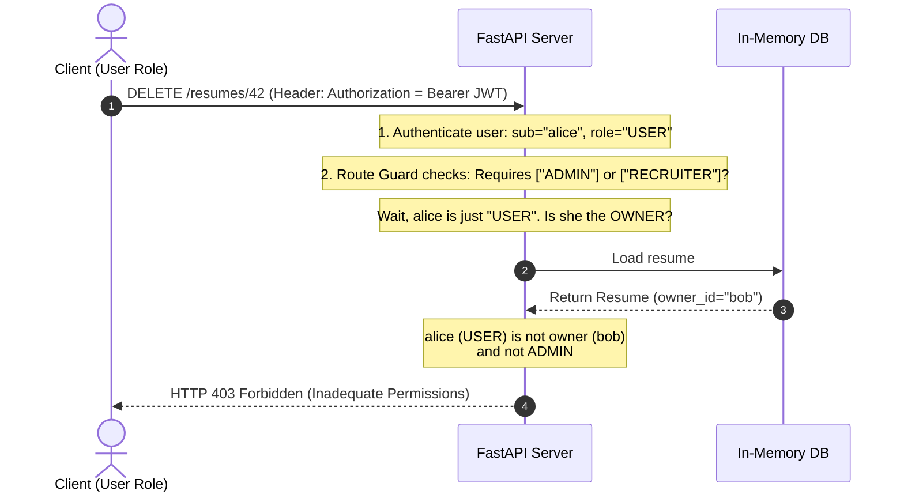

# Module 07: Role-Based Authorization — Security Scopes & Route Guards

Welcome back, class. Today we analyze **Role-Based Authorization (CS-521)**.

Authenticating a user is only half the battle. Once we know *who* a user is (authentication), we must determine *what* they are allowed to do (authorization). Many systems suffer from critical security bugs due to broken object-level authorization (BOLA) or privilege escalation, where a standard user can access administrative actions simply by guessing an endpoint path or modifying a request parameter.

FastAPI provides an elegant integration with OAuth2 scopes via `SecurityScopes`. Today, we will study **Role-Based Access Control (RBAC)**, design reusable route guards, and implement hierarchical resource validation.

---

## 1. Academic Lecture: RBAC, Scopes, and Resource Ownership

Authorization models define access control rules. In enterprise APIs, two patterns predominate:

### 1. Role-Based Access Control (RBAC)
Users are assigned one or more roles (e.g., `USER`, `RECRUITER`, `ADMIN`). Each role has set privileges.
*   **The Invariant**: Instead of assigning specific permissions directly to users, we assign permissions to *roles*, and then assign *roles* to users.
*   **Hierarchies**: Roles often form a hierarchy. An `ADMIN` role implicitly inherits all permissions of a `RECRUITER`, which inherits all permissions of a standard `USER`.

### 2. OAuth2 Scopes
Scopes are a mechanism in OAuth2 to limit an application's access to a user's account.
*   **Client vs. User**: Authentication verifies the user's identity. Scopes authorize the client application to perform actions *on behalf of* the user. For instance, a mobile app might have the `read:profile` scope, but lack the `write:settings` scope.
*   **FastAPI Integration**: FastAPI uses the `Security` dependency injection wrapper along with `SecurityScopes` to check that the client's token contains all required scopes before invoking the path handler.

### 3. Resource Ownership Validation (Object-Level Authorization)
Even if a user is authorized to perform an action (e.g., `write:resume`), they must not be allowed to modify *another* user's resource unless they have administrative overrides. This requires checking resource metadata against the authenticated user ID in real-time.



---

## 2. Theory vs. Production Trade-offs

### Stateless Scope Verification vs. Database RBAC Queries
*   **Stateless JWT-Embedded Roles**:
    *   *Pro*: Extremely fast. The user's role and scopes are signed inside the JWT payload. The API validates the signature and reads the claims without making a database query.
    *   *Con*: High latency for revoking roles. If an admin revokes a user's permissions, the user remains authorized until their JWT expires (e.g. in 15 minutes).
*   **Stateful Database RBAC Queries**:
    *   *Pro*: Real-time revocation. Any change in permissions is applied instantly on the next API call.
    *   *Con*: High database overhead. Every single protected endpoint requires a database query to look up user roles and permissions.
*   **Production Rule**: In high-scale applications, use **Stateless JWT-Embedded Roles** with a short expiration duration (10-15 minutes). For critical, high-risk systems, implement a hybrid approach where a cache (like Redis) stores a blocklist of revoked sessions.

---

## 3. How to Use: Reusable Dependency guards and Role-Based Access Control

Let us write a compile-grade Python 3.11+ application demonstrating standard FastAPI role validation.

### A. The Business Logic Role Leak (Anti-Pattern)

Avoid performing role checks manually inside each path function:

```python
from fastapi import FastAPI, Depends, HTTPException, status

app = FastAPI()

# Hypothetical auth dependency
async def get_current_user(token: str):
    # Extracts username and role from a dummy token
    return {"username": "alice", "role": "USER"}

@app.delete("/admin/purge-cache")
async def purge_cache(current_user: dict = Depends(get_current_user)):
    # DANGER: Manually checking roles inside endpoint business logic
    # is error-prone. If an engineer forgets this line of code in a new endpoint,
    # it becomes wide open to any authenticated user.
    if current_user["role"] != "ADMIN":
        raise HTTPException(
            status_code=status.HTTP_403_FORBIDDEN,
            detail="Admin privileges required."
        )
    return {"status": "Cache purged."}
```

### B. Reusable Dependency Scope Guards (Production Pattern)

Here is the hardened pattern. We define roles using an `Enum`, implement a callable dependency class `RoleChecker` that parses JWT scopes, and enforce authorization at the route definition layer.

```python
from enum import Enum
from typing import List
from fastapi import FastAPI, Depends, HTTPException, status, Security
from fastapi.security import OAuth2PasswordBearer, SecurityScopes
from jose import JWTError, jwt
from pydantic import BaseModel

app = FastAPI()

# 1. Define Supported User Roles
class UserRole(str, Enum):
    USER = "USER"
    RECRUITER = "RECRUITER"
    ADMIN = "ADMIN"

class UserSchema(BaseModel):
    username: str
    role: UserRole

SECRET_KEY = "authorization-secret-signing-key"
ALGORITHM = "HS256"
oauth2_scheme = OAuth2PasswordBearer(tokenUrl="token")

# 2. Authenticate and Parse User Payload
async def get_current_user(token: str = Depends(oauth2_scheme)) -> UserSchema:
    credentials_exception = HTTPException(
        status_code=status.HTTP_401_UNAUTHORIZED,
        detail="Could not validate credentials.",
        headers={"WWW-Authenticate": "Bearer"},
    )
    try:
        payload = jwt.decode(token, SECRET_KEY, algorithms=[ALGORITHM])
        username: str = payload.get("sub")
        role_str: str = payload.get("role")
        if username is None or role_str is None:
            raise credentials_exception
        return UserSchema(username=username, role=UserRole(role_str))
    except (JWTError, ValueError):
        raise credentials_exception

# 3. SECURE: Reusable Role-Based Dependency Guard
class RoleChecker:
    def __init__(self, allowed_roles: List[UserRole]):
        self.allowed_roles = allowed_roles

    def __call__(self, current_user: UserSchema = Depends(get_current_user)) -> UserSchema:
        # Check if the user's role matches any of the allowed roles
        if current_user.role not in self.allowed_roles:
            raise HTTPException(
                status_code=status.HTTP_403_FORBIDDEN,
                detail=f"Access denied. Required roles: {[r.value for r in self.allowed_roles]}",
            )
        return current_user

# 4. SECURE: Reusable Security Scope Guard
async def verify_scopes(security_scopes: SecurityScopes, current_user: UserSchema = Depends(get_current_user)):
    # If the endpoint defines specific security scopes, ensure they are met
    if security_scopes.scopes:
        # In a real app, you might map user roles to scopes, or check scopes in the token
        # For simplicity, we check if the user role allows them to perform the scopes
        if current_user.role == UserRole.USER and any(s.startswith("admin:") for s in security_scopes.scopes):
            raise HTTPException(
                status_code=status.HTTP_403_FORBIDDEN,
                detail="Not enough permissions. Missing required scopes.",
            )
    return current_user

# 5. Guard Route via Security Dependency
@app.delete("/system/config", dependencies=[Depends(RoleChecker([UserRole.ADMIN]))])
async def delete_config():
    return {"message": "Config deleted successfully."}

@app.get("/recruiter/candidates")
async def view_candidates(
    # Route guards using OAuth2 Scopes
    current_user: UserSchema = Security(verify_scopes, scopes=["recruiter:read", "admin:write"])
):
    return {"candidates": ["Candidate A", "Candidate B"], "accessed_by": current_user.username}
```

---

## 4. Common Errors & Pitfalls

### Pitfall 1: Failing to Validate Ownership alongside Role Checks
Allowing any authenticated user with a `USER` role to edit/delete any other user's resource.
*   **Why it fails**: A user with ID `42` submits a request to `PUT /users/99/profile` with their valid `USER` JWT token. Because they have a valid `USER` role, the role check passes, but they hijack another user's profile database entry.
*   **Mitigation**: Always verify that the resource's `owner_id` matches the authenticated `user_id` from the JWT token, or allow bypass only if the user has an `ADMIN` role:
    ```python
    if resource.owner_id != current_user.id and current_user.role != UserRole.ADMIN:
        raise HTTPException(status_code=403, detail="Not the owner of this resource.")
    ```

---

## 5. Socratic Review Questions

### Question 1
What is the difference between Role-Based Access Control (RBAC) and Attribute-Based Access Control (ABAC)?

#### Answer
*   **RBAC** assigns permissions to predefined static roles (e.g. ADMIN, USER). Decisions are binary based on whether the user's role is in the authorized roles list.
*   **ABAC** evaluates dynamic policies based on attributes of the user (e.g. department, age), attributes of the resource (e.g. security level, owner), and environmental factors (e.g. time of day, IP address). ABAC is much more flexible but has higher computation costs.

### Question 2
Why does FastAPI use `Security` instead of `Depends` when matching OAuth2 security scopes?

#### Answer
`Security` is a subclass of `Depends` that takes an additional `scopes` argument. It allows the route to declare what security scopes are required for access (e.g. `scopes=["read:users"]`). 
FastAPI automatically parses these requirements and makes them available to the dependency via the `SecurityScopes` parameter, enabling dynamic, scope-aware authorization checks.

---

## 6. Hands-on Challenge: Implementing Role-Based Endpoint Access

### The Challenge
In this challenge, you will implement a callable route guard class `ScopeGuard` that matches standard OAuth2 scopes.

Your task is to complete the `__call__` method:
1.  Parse the `security_scopes.scopes` requested by the endpoint.
2.  Retrieve the token's scope string claim (usually space-separated) from `current_user.scopes`.
3.  Ensure that all requested scopes are present in the user's scopes. If any requested scope is missing, raise an `HTTPException` with status code `403 Forbidden`.

Complete the implementation below:

```python
from typing import List
from fastapi import Depends, HTTPException, status
from fastapi.security import SecurityScopes
from pydantic import BaseModel

class UserAuth(BaseModel):
    username: str
    scopes: List[str]  # e.g., ["read:audio", "write:audio"]

# Simulated Authenticated User Dependency
async def get_mock_user() -> UserAuth:
    return UserAuth(username="analyst_user", scopes=["read:audio"])

class ScopeGuard:
    async def __call__(
        self,
        security_scopes: SecurityScopes,
        user: UserAuth = Depends(get_mock_user)
    ) -> UserAuth:
        # TODO: Complete the guard check.
        # 1. Loop through each scope in security_scopes.scopes.
        # 2. Check if the scope is inside user.scopes.
        # 3. If any required scope is missing, raise HTTPException with status_code=403.
        # 4. Otherwise, return the user object.
        
        return user
```

Write the scope matching logic. Save the completed file and verify that users without the required scopes are correctly blocked with an HTTP 403 response inside `modules/07-authorization.md`.
