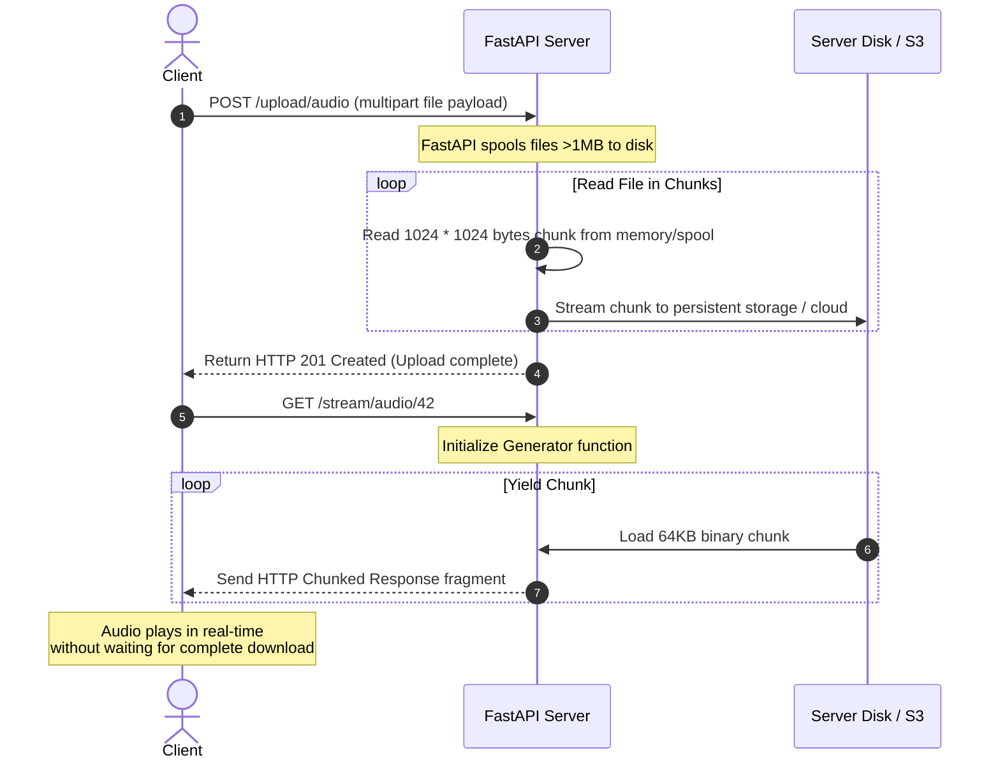

# Module 08: File Uploads & Streaming — Binary Buffers & Chunked Outputs

Welcome back, class. Today we analyze **File Uploads & Streaming (CS-521)**.

Modern web applications often process binary files, such as candidate resumes (PDFs) or interview audio recordings (MP3/WAV). Handling large binary payloads presents severe architectural challenges. If an API loads entire 500MB files into server RAM during upload or download, it will quickly exhaust resources and trigger Out-of-Memory (OOM) crashes.

FastAPI provides optimized abstractions for asynchronous multipart uploads and chunked streaming responses. Today, we will study **chunk-by-chunk file parsing**, implement security size limits, and build a high-performance **binary audio stream generator**.

---

## 1. Academic Lecture: RAM Safeguards & Chunked Streams

When a client uploads a file via an HTTP `multipart/form-data` request:

### 1. In-Memory Buffers vs. Spooled Temporary Files
*   **The Problem**: Reading a file directly as `bytes` forces the entire file into RAM. A concurrent surge of uploads can exhaust server memory.
*   **The Abstraction**: FastAPI's `UploadFile` solves this by using Python's `tempfile.SpooledTemporaryFile`.
    *   Files under **1 megabyte** are stored in RAM.
    *   Files exceeding **1 megabyte** are written (spooled) directly to a temporary file on the server's hard drive, keeping memory usage constant and low.

### 2. Chunk-Based Stream Processing
Whether you are writing an uploaded file to disk, uploading it to a cloud object store (like AWS S3), or streaming an audio response back to the client, you must process the data in small, fixed-size chunks:
*   **Chunk Iteration**: Read small blocks of data (e.g., 64KB or 1MB) from the stream, process them, and write them immediately, freeing the memory for the next block.

### 3. HTTP Streaming Responses
Instead of waiting for an entire file to be loaded from disk or a backend service before sending the response, the server sends a `Transfer-Encoding: chunked` header. It then streams pieces of data over the persistent TCP connection as they become available.



---

## 2. Theory vs. Production Trade-offs

### Sync Spooling vs. Async Cloud Pipelines
*   **Local Disk Spooling (`SpooledTemporaryFile`)**:
    *   *Pro*: Default FastAPI behavior; highly performant and requires zero configuration.
    *   *Con*: High disk I/O pressure on the local server. In a distributed multi-instance deployment, files stored on local temp drives are inaccessible to other instances.
*   **Direct Cloud Streaming (S3 Multipart Upload)**:
    *   *Pro*: Fully stateless. Files are streamed directly from client TCP sockets through the API and into cloud storage, keeping the server's disk usage at zero.
    *   *Con*: Complex to implement; requires handling asynchronous AWS SDK libraries (like `aioboto3`) and managing multipart upload token lifecycles.
*   **Production Rule**: For single-instance APIs or small uploads, local spooling is fine. For production-scale microservices, stream uploads directly to cloud storage or generate S3 Presigned Upload URLs so clients upload files directly to the cloud, bypassing the API entirely.

---

## 3. How to Use: Chunked Uploads and Streaming Responses

Let us write a compile-grade Python 3.11+ application that handles secure chunked uploads and returns a chunked audio stream.

### A. The Memory Exhaustion Vulnerability (Anti-Pattern)

Avoid reading raw file bytes directly into RAM:

```python
from fastapi import FastAPI, UploadFile, File

app = FastAPI()

@app.post("/upload-vulnerable")
async def upload_file_vulnerable(file: UploadFile = File(...)):
    # DANGER: Calling file.read() loads the entire file content into RAM.
    # An attacker uploading a 5GB zip file will crash the container instantly,
    # causing a complete service outage.
    contents = await file.read()
    
    # Simulate processing
    return {"filename": file.filename, "size": len(contents)}
```

### B. The Hardened Async Chunking Pipeline (Production Pattern)

Here is the hardened pattern. We validate the file size, read the incoming file in 1MB chunks, stream it safely, and expose a route that streams the audio file back using a generator.

```python
import os
from typing import Generator
from fastapi import FastAPI, UploadFile, File, HTTPException, status
from fastapi.responses import StreamingResponse

app = FastAPI()

MAX_FILE_SIZE = 10 * 1024 * 1024  # 10 Megabytes limit
CHUNK_SIZE = 1024 * 1024          # 1 Megabyte chunk size for processing

# 1. Chunked File Writer Helper
async def save_upload_file_safely(upload_file: UploadFile, destination_path: str):
    total_bytes_written = 0
    
    # SECURE: Open destination file in binary write mode
    with open(destination_path, "wb") as buffer:
        while True:
            # Read a chunk from the spooled upload file
            chunk = await upload_file.read(CHUNK_SIZE)
            if not chunk:
                break
            
            total_bytes_written += len(chunk)
            # SECURE: Check size boundary constraints
            if total_bytes_written > MAX_FILE_SIZE:
                # Clean up the partial file before raising exception
                buffer.close()
                os.remove(destination_path)
                raise HTTPException(
                    status_code=status.HTTP_413_REQUEST_ENTITY_TOO_LARGE,
                    detail=f"File exceeds maximum limit of {MAX_FILE_SIZE // (1024 * 1024)}MB."
                )
            
            buffer.write(chunk)

# 2. Secure Upload Route
@app.post("/upload/audio", status_code=status.HTTP_201_CREATED)
async def upload_audio(file: UploadFile = File(...)):
    # Validate file type extension
    if not file.filename.endswith((".mp3", ".wav", ".ogg")):
        raise HTTPException(
            status_code=status.HTTP_400_BAD_REQUEST,
            detail="Invalid file type. Only audio files (.mp3, .wav, .ogg) are allowed."
        )
        
    upload_dir = "./tmp_uploads"
    os.makedirs(upload_dir, exist_ok=True)
    destination_file = os.path.join(upload_dir, file.filename)
    
    # Process the file in chunks
    await save_upload_file_safely(file, destination_file)
    return {"message": "File uploaded successfully", "path": destination_file}

# 3. Binary Generator for Chunked Responses
def audio_stream_generator(file_path: str) -> Generator[bytes, None, None]:
    # Yields file chunks sequentially to conserve memory
    with open(file_path, "rb") as file_data:
        while True:
            chunk = file_data.read(64 * 1024)  # 64KB chunks
            if not chunk:
                break
            yield chunk

# 4. Secure Streaming Route
@app.get("/stream/audio")
async def stream_audio(filename: str):
    file_path = os.path.join("./tmp_uploads", filename)
    if not os.path.exists(file_path):
        raise HTTPException(
            status_code=status.HTTP_404_NOT_FOUND,
            detail="Requested audio file not found."
        )
        
    # SECURE: Return StreamingResponse wrapping the generator
    return StreamingResponse(
        audio_stream_generator(file_path),
        media_type="audio/mpeg",
        headers={"Content-Disposition": f"inline; filename={filename}"}
    )
```

---

## 4. Common Errors & Pitfalls

### Pitfall 1: Leaking File Handlers
Failing to close file buffers when operations fail midway.
*   **Why it fails**: If an exception occurs during the chunk loop, the system might keep the destination file handler open in memory. Over time, this causes a "Too many open files" OS system error, preventing any new connections or file writes.
*   **Mitigation**: Always wrap file writing in a standard python `with` block, or use a `try-finally` construct to ensure file resources are closed.

### Pitfall 2: Bypassing Spooled Temporary Files via `bytes` Types
Declaring a route parameter as `file: bytes = File(...)` instead of `file: UploadFile = File(...)`.
*   **Why it fails**: Declaring `bytes` bypasses FastAPI's spooled temporary files system entirely and forces the framework to load the entire uploaded file directly into memory before your endpoint logic is ever called.
*   **Mitigation**: Always use `UploadFile` for file parameters.

---

## 5. Socratic Review Questions

### Question 1
What is the purpose of `tempfile.SpooledTemporaryFile` in python, and how does FastAPI use it to prevent RAM resource exhaustion?

#### Answer
`SpooledTemporaryFile` acts as an in-memory file buffer up to a predefined limit (FastAPI defaults to 1MB). Once the file size exceeds this threshold, python automatically writes the remaining data to a secure temporary file on the local hard disk. This boundary limits application memory usage to a small, constant overhead regardless of whether the uploaded file is 5MB or 5GB.

### Question 2
What does the `Transfer-Encoding: chunked` response header signal to the client browser?

#### Answer
It signals that the response body is being sent in a series of chunks rather than as a single continuous block. The header allows the server to omit the `Content-Length` header, enabling the API to begin streaming chunks of audio, video, or data streams instantly before calculating the total size of the resource.

---

## 6. Hands-on Challenge: Building a Secure Chunked File Downloader

### The Challenge
In this challenge, you will implement a chunked stream downloader routing handler.

Your task is to:
1.  Complete the generator function `file_chunk_reader` to read file blocks in 32KB chunks.
2.  In the endpoint `/download`, wrap the generator in a `StreamingResponse` with the media type `application/octet-stream`.

Complete the implementation below:

```python
import os
from typing import Generator
from fastapi import FastAPI, HTTPException
from fastapi.responses import StreamingResponse

app = FastAPI()

def file_chunk_reader(filepath: str) -> Generator[bytes, None, None]:
    # TODO: Complete the chunk generator.
    # 1. Open the file at filepath in binary read mode ('rb').
    # 2. Run a loop to read the file in 32 * 1024 byte chunks.
    # 3. Yield each chunk.
    # 4. Exit the loop and close the file when no bytes remain.
    
    yield b""

@app.get("/download")
async def download_file(filename: str):
    safe_path = os.path.join("./downloads", filename)
    if not os.path.exists(safe_path):
        raise HTTPException(status_code=404, detail="File not found")
        
    # TODO: Complete the StreamingResponse return block.
    # Wrap the file_chunk_reader generator and specify application/octet-stream.
    
    return {"message": "Implement this response"}
```

Write the generator and routing logic. Save the completed file and verify that large files are read chunk-by-chunk without spikes in memory usage inside `modules/08-file-uploads-streaming.md`.
