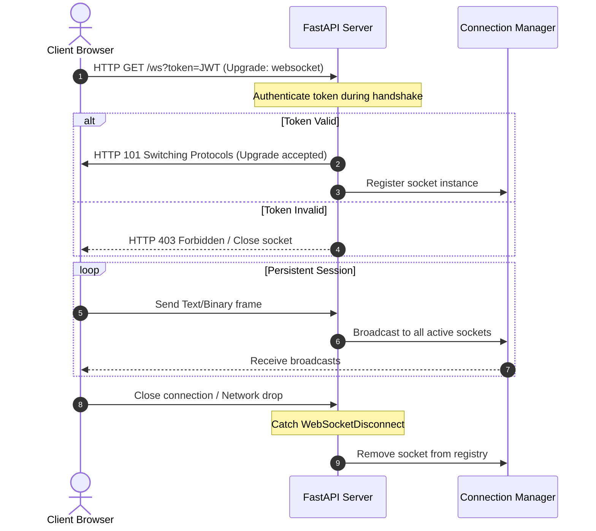

# Module 09: WebSockets — Bidirectional Streams & Connection registries

Welcome back, class. Today we analyze **WebSockets (CS-521)**.

Standard HTTP is a request-response protocol; the client queries the server, and the server returns a response. For real-time applications—such as live chat, interactive AI agents, or real-time progress bars—HTTP polling is extremely inefficient. WebSockets solve this by upgrading the initial HTTP handshake into a persistent, full-duplex TCP connection, allowing both parties to send data at any time.

However, managing WebSockets in production is challenging. Because connections are long-lived, we must handle sudden client disconnects, authenticate the connection handshake securely, and manage active connection registries without leaking memory. Today, we will study **WebSocket lifecycles in FastAPI**, build a robust **connection registry manager**, and secure the initial handshake.

---

## 1. Academic Lecture: Handshakes, Lifecycles, and ASGI Channels

WebSockets operate by transitioning an existing HTTP socket into a persistent stream:

### 1. The Protocol Upgrade Handshake
The client initiates a standard HTTP request with a `Connection: Upgrade` and `Upgrade: websocket` header. The server, if it supports WebSockets, responds with HTTP status `101 Switching Protocols`. Once upgraded, the HTTP protocol is discarded, and communication shifts to binary/text framing over the same TCP socket.

### 2. The Connection Registry Pattern
Because the server must track all active connections to broadcast events or route peer-to-peer messages, we use a central registry (the Connection Manager):
*   **Registration**: When a client completes the handshake, their socket instance (`WebSocket`) is added to an active list.
*   **De-registration**: If the connection drops, the client's socket must be immediately removed from the active list. If we fail to remove it, subsequent broadcast attempts will write to a closed socket, raising errors and leaking memory.

### 3. Handshake Authentication
Because WebSocket upgrades bypass standard HTTP middleware pathways in many ASGI servers after the handshake begins, we must authenticate the request *during* the initial handshake phase, typically using query parameters (e.g., `?token=JWT`) since standard browsers cannot easily send custom authorization headers in JavaScript `new WebSocket()` calls.



---

## 2. Theory vs. Production Trade-offs

### In-Memory Registries vs. Distributed Pub/Sub (Redis)
*   **In-Memory Connection Registry**:
    *   *Pro*: Easy to write; requires no external dependencies.
    *   *Con*: Not scalable. In a production cluster running 4 Uvicorn processes across 3 server instances, a user connected to Server A cannot receive broadcasts generated by a user on Server B, because they reside in different Python memory heaps.
*   **Redis Publish/Subscribe Broker**:
    *   *Pro*: Scalable and stateless. All API instances connect to a single Redis Pub/Sub channel. When Server B broadcasts a message, it publishes it to Redis, which forwards it to Servers A and C to deliver to their local active sockets.
    *   *Con*: Added infrastructure complexity and network latency.
*   **Production Rule**: Use **In-Memory** for simple chat applications or single-instance servers. Use **Redis Pub/Sub** for any horizontally scaled production cluster.

---

## 3. How to Use: Secure WebSockets in FastAPI

Let us write a compile-grade Python 3.11+ implementation containing a secure connection manager, handshake authentication, and disconnect handlers.

### A. The Orphaned Connection Memory Leak (Anti-Pattern)

Avoid ignoring connection lifecycle exceptions:

```python
from fastapi import FastAPI, WebSocket

app = FastAPI()

ACTIVE_SOCKETS = []

@app.websocket("/ws-vulnerable")
async def websocket_vulnerable(websocket: WebSocket):
    await websocket.accept()
    ACTIVE_SOCKETS.append(websocket)
    
    # DANGER: Loop reads messages but fails to handle disconnect exceptions.
    # When a user closes their tab, the socket is orphaned inside the
    # ACTIVE_SOCKETS registry. Writing to this stale list later will raise
    # crashes and leak memory.
    while True:
        data = await websocket.receive_text()
        for client in ACTIVE_SOCKETS:
            await client.send_text(f"Echo: {data}")
```

### B. The Hardened Active Connection Manager (Production Pattern)

Here is the hardened pattern. We write a thread-safe connection manager, secure the handshake via JWT extraction, and handle disconnects gracefully using a `try-except WebSocketDisconnect` loop.

```python
from typing import List
from fastapi import FastAPI, WebSocket, WebSocketDisconnect, Query, status
from jose import JWTError, jwt

app = FastAPI()
SECRET_KEY = "websocket-handshake-signing-key"
ALGORITHM = "HS256"

# 1. Thread-Safe Connection Registry Manager
class ConnectionManager:
    def __init__(self):
        # Stores all active websocket connections
        self.active_connections: List[WebSocket] = []

    async def connect(self, websocket: WebSocket):
        # Accept the incoming connection handshake
        await websocket.accept()
        self.active_connections.append(websocket)

    def disconnect(self, websocket: WebSocket):
        # Clean up and remove connection from registry to prevent leaks
        if websocket in self.active_connections:
            self.active_connections.remove(websocket)

    async def send_personal_message(self, message: str, websocket: WebSocket):
        await websocket.send_text(message)

    async def broadcast(self, message: str):
        # Broadcast text message to all registered active connections
        for connection in self.active_connections:
            try:
                await connection.send_text(message)
            except Exception:
                # Handle edge cases where socket is closed but not yet cleaned up
                self.disconnect(connection)

manager = ConnectionManager()

# 2. Handshake Authenticator Helper
async def authenticate_websocket(websocket: WebSocket, token: str) -> str | None:
    try:
        payload = jwt.decode(token, SECRET_KEY, algorithms=[ALGORITHM])
        username: str = payload.get("sub")
        return username
    except JWTError:
        return None

# 3. Secure WebSocket Route Handler
@app.websocket("/ws/events")
async def secure_websocket_endpoint(
    websocket: WebSocket,
    token: str = Query(...)  # JWT sent via query string parameter
):
    # SECURE: Authenticate token prior to registration
    username = await authenticate_websocket(websocket, token)
    if username is None:
        await websocket.close(code=status.WS_1008_POLICY_VIOLATION)
        return

    # Register authenticated connection
    await manager.connect(websocket)
    await manager.send_personal_message(f"Welcome, {username}!", websocket)
    await manager.broadcast(f"System: {username} has joined the stream.")

    try:
        # Message loop
        while True:
            # Wait for text payloads from the client
            data = await websocket.receive_text()
            await manager.broadcast(f"[{username}]: {data}")
            
    except WebSocketDisconnect:
        # SECURE: Always remove client from registry on disconnect
        manager.disconnect(websocket)
        await manager.broadcast(f"System: {username} has disconnected.")
```

---

## 4. Common Errors & Pitfalls

### Pitfall 1: Attempting to Read/Write to Closed Sockets
Sending or receiving payloads after the client has closed the socket triggers a `RuntimeError: Unexpected ASGI message 'websocket.send', expected 'websocket.connect'`.
*   **Why it fails**: When clients close their connections, the socket object becomes invalid. Writing to it causes runtime errors that can crash your route loop.
*   **Mitigation**: Always catch `WebSocketDisconnect` and stop writing to the socket.

### Pitfall 2: Mutating lists during iteration
Removing clients from `self.active_connections` during active broadcasts.
*   **Why it fails**: Python raises a `RuntimeError: dictionary/list changed size during iteration` if you modify a list while looping over it.
*   **Mitigation**: Iterate over a copy of the list (e.g., `self.active_connections[:]`) or gather exceptions and clean up after the broadcast loop completes.

---

## 5. Socratic Review Questions

### Question 1
Why are standard HTTP middleware paths (like gzip compression or CORS redirects) skipped or not execution-guaranteed for WebSocket connection routes post-upgrade?

#### Answer
Standard HTTP middlewares intercept request/response cycles. A WebSocket connection upgrades the HTTP protocol to TCP streaming. After the HTTP upgrade handshake completes (returning status `101`), subsequent data packages travel as WebSocket frames over TCP, which bypass the traditional HTTP middleware pipelines entirely.

### Question 2
Why must we authenticate WebSocket connections using query parameters or cookies, rather than HTTP `Authorization` headers?

#### Answer
The standard browser HTML5 WebSocket JavaScript API (`new WebSocket('ws://...')`) does not support adding custom HTTP headers during the instantiation call. Therefore, developers must transmit JWT tokens either via cookies or query string parameters (like `?token=JWT`) to authenticate the client handshake.

---

## 6. Hands-on Challenge: Broadcasting JSON Payloads securely

### The Challenge
In this challenge, you will write a WebSocket route handler that accepts client connections, verifies a mock token, and broadcasts incoming payloads as JSON objects.

Your task:
1.  Complete the secure loop in `/ws/chat`.
2.  If the query `token` is not `"valid-challenge-token"`, close the socket with code `1008`.
3.  Read the incoming data using `websocket.receive_json()`.
4.  Broadcast the parsed JSON to all connections using `manager.broadcast()`.

Complete the implementation below:

```python
from fastapi import FastAPI, WebSocket, WebSocketDisconnect, Query, status

app = FastAPI()

class SimpleManager:
    def __init__(self):
        self.connections: list[WebSocket] = []

    async def connect(self, ws: WebSocket):
        await ws.accept()
        self.connections.append(ws)

    def disconnect(self, ws: WebSocket):
        if ws in self.connections:
            self.connections.remove(ws)

    async def broadcast(self, payload: dict):
        for ws in self.connections:
            try:
                await ws.send_json(payload)
            except Exception:
                self.disconnect(ws)

manager = SimpleManager()

@app.websocket("/ws/chat")
async def secure_chat_websocket(
    websocket: WebSocket,
    token: str = Query(...)
):
    # TODO: Complete this endpoint.
    # 1. Verify if token == "valid-challenge-token". If not, close socket with code=1008 and return.
    # 2. Register socket: await manager.connect(websocket)
    # 3. Enter try block:
    #      while True:
    #        data = await websocket.receive_json()
    #        await manager.broadcast({"user": "anonymous", "data": data})
    # 4. Except WebSocketDisconnect:
    #      manager.disconnect(websocket)
    
    pass
```

Write the handshake verification and JSON loop. Save the completed file and verify that clients are disconnected upon invalid tokens inside `modules/09-websockets.md`.
