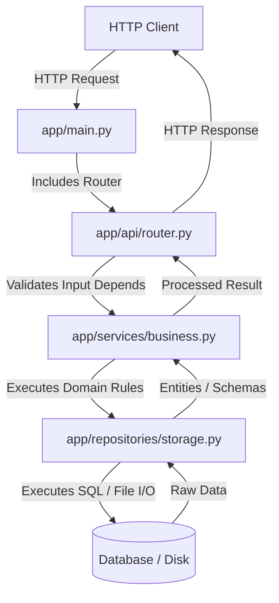

# Module 10: Modern Project Structure — Routers, Configuration & Repository Pattern

Welcome back, class. Today we analyze **Modern Project Structure (CS-521)**.

When starting a new FastAPI project, it is tempting to place all route handlers, configuration parameters, database schemas, and business logic inside a single `main.py` file. While this is acceptable for quick prototypes, it quickly becomes unmaintainable as the application grows. Large, monolithic files cause import loops, make unit testing extremely difficult, and increase cognitive load for engineers.

To scale APIs sustainably, we must separate concerns. Today, we will study **modular API design**, explore FastAPI's `APIRouter` system, configure production-grade settings using **Pydantic-Settings**, and implement the **Repository-Service Pattern** to decouple business logic from the transport and database layers.

---

## 1. Academic Lecture: Architectural Cleanliness and Separation of Concerns

An enterprise-ready FastAPI project divides the codebase into distinct layers, each with a single responsibility:

### 1. The Configuration Layer (`app/core/`)
Application settings and secrets must not be scattered throughout the codebase or loaded via raw `os.environ` strings. We use Pydantic's `BaseSettings` class (from the `pydantic-settings` library) to load, validate, and parse environment variables into typed Python variables at application startup. If a required environment variable is missing, the application fails fast during startup rather than crashing later at runtime.

### 2. The Router/API Layer (`app/api/`)
The Router layer handles HTTP concerns only. It handles:
*   Route path declarations and HTTP methods.
*   Request parsing and Pydantic validation checks.
*   Extracting headers, parameters, and credentials (JWTs).
*   Returning HTTP status codes and responses.
*   **Crucial Rule**: The Router layer must contain *no* business logic or database queries. It delegates these operations to the Service layer.

### 3. The Service Layer (`app/services/`)
The Service layer contains the core business logic of your application. It:
*   Processes business rules (e.g., calculating validation scores, orchestrating workflows).
*   Validates data boundaries.
*   Integrates multiple repositories or third-party client calls.
*   **Crucial Rule**: The Service layer is independent of HTTP or database-specific libraries. It does not know about FastAPI `Request` objects or raw database sessions.

### 4. The Repository Layer (`app/repositories/`)
The Repository layer isolates database/storage concerns:
*   Encapsulates raw database queries (SQL queries, ORM code).
*   Encapsulates file system writes or object storage client calls.
*   Maps raw database rows to domain models or schemas.



---

## 2. Theory vs. Production Trade-offs

### Flat Layered Architecture vs. Vertical Slicing
*   **Flat Layered Architecture (Folders by Technical Role)**:
    *   *Structure*: `routers/`, `services/`, `models/`, `repositories/`.
    *   *Pro*: Easy to find files of a similar type; fits standard MVC mental models.
    *   *Con*: High context-switching overhead. Adding a new candidate evaluation feature requires modifying files across four separate directories, increasing code coupling.
*   **Vertical Slicing (Folders by Business Domain / Feature)**:
    *   *Structure*: `auth/`, `candidates/`, `audio/`, each containing its own routers, services, and schemas.
    *   *Pro*: High cohesion. All code related to a single business feature is co-located. Deleting a feature is as simple as deleting its folder.
    *   *Con*: Harder to manage shared dependencies (e.g., global auth utilities or shared models).
*   **Production Rule**: For small-to-medium systems, a **Flat Layered Architecture** is clean and familiar. For large enterprise systems or microservice architectures, adopt **Vertical Slicing** to prevent cross-domain pollution.

---

## 3. How to Use: The Clean Layered Blueprint

Let us write a compile-grade Python 3.11+ implementation demonstrating a clean layered project structure.

### A. The Monolithic Script (Anti-Pattern)

Avoid combining configuration, queries, and business logic inside route functions:

```python
import os
from fastapi import FastAPI, HTTPException

app = FastAPI()

# DANGER: Global database connection string hardcoded, or loaded without validation
DB_CONNECTION_STRING = os.getenv("DATABASE_URL", "sqlite:///test.db")

@app.post("/candidates")
async def create_candidate(name: str, score: float):
    # DANGER: Business logic combined with database queries and HTTP responses
    if score < 0 or score > 100:
        raise HTTPException(status_code=400, detail="Score must be between 0 and 100")
        
    # Pretend we are inserting directly into DB
    # sql_execute("INSERT INTO candidates (name, score) VALUES (?, ?)", name, score)
    return {"message": "Candidate created", "id": 1}
```

### B. The Clean Modern Architecture (Production Pattern)

Here is the hardened structure. First, look at the directory structure:
```text
src/
├── app/
│   ├── __init__.py
│   ├── main.py
│   ├── core/
│   │   ├── __init__.py
│   │   └── config.py
│   ├── api/
│   │   ├── __init__.py
│   │   └── v1/
│   │       ├── __init__.py
│   │       └── candidates.py
│   ├── repositories/
│   │   ├── __init__.py
│   │   └── candidate_repo.py
│   └── services/
│       ├── __init__.py
│       └── candidate_service.py
```

Let us write the individual file contents.

#### 1. Core Configuration (`app/core/config.py`)
```python
from pydantic_settings import BaseSettings, SettingsConfigDict

class Settings(BaseSettings):
    # Enforce type definitions and validations
    API_TITLE: str = "Candidate Processing System"
    DATABASE_URL: str = "sqlite:///production.db"
    JWT_SECRET_KEY: str
    ACCESS_TOKEN_EXPIRE_MINUTES: int = 30

    # Load from a local .env file if available
    model_config = SettingsConfigDict(env_file=".env", env_file_encoding="utf-8")

# Singleton configuration instance
settings = Settings()
```

#### 2. Repository Layer (`app/repositories/candidate_repo.py`)
```python
from typing import Dict, Optional
from pydantic import BaseModel

class CandidateEntity(BaseModel):
    id: int
    name: str
    score: float

class CandidateRepository:
    def __init__(self):
        # Simulated database store
        self._db: Dict[int, CandidateEntity] = {}
        self._counter = 1

    async def get_by_id(self, candidate_id: int) -> Optional[CandidateEntity]:
        return self._db.get(candidate_id)

    async def save(self, name: str, score: float) -> CandidateEntity:
        new_id = self._counter
        entity = CandidateEntity(id=new_id, name=name, score=score)
        self._db[new_id] = entity
        self._counter += 1
        return entity
```

#### 3. Service Layer (`app/services/candidate_service.py`)
```python
from fastapi import HTTPException, status
from app.repositories.candidate_repo import CandidateRepository, CandidateEntity

class CandidateService:
    def __init__(self, repository: CandidateRepository):
        self.repository = repository

    async def register_candidate(self, name: str, score: float) -> CandidateEntity:
        # SECURE: Enforce business logic validation in the service layer
        if score < 0 or score > 100:
            raise HTTPException(
                status_code=status.HTTP_400_BAD_REQUEST,
                detail="Score must be between 0 and 100 points."
            )
        return await self.repository.save(name, score)
```

#### 4. Router API Layer (`app/api/v1/candidates.py`)
```python
from fastapi import APIRouter, Depends, status
from pydantic import BaseModel, Field
from app.repositories.candidate_repo import CandidateRepository, CandidateEntity
from app.services.candidate_service import CandidateService

# Create an APIRouter instance
router = APIRouter(prefix="/candidates", tags=["Candidates"])

class CreateCandidateRequest(BaseModel):
    name: str = Field(..., min_length=2)
    score: float = Field(..., ge=0, le=100)

# Dependency Providers
def get_candidate_repo() -> CandidateRepository:
    # In production, this can inject database sessions
    return CandidateRepository()

def get_candidate_service(
    repo: CandidateRepository = Depends(get_candidate_repo)
) -> CandidateService:
    return CandidateService(repo)

@router.post("", response_model=CandidateEntity, status_code=status.HTTP_201_CREATED)
async def create_candidate_endpoint(
    payload: CreateCandidateRequest,
    service: CandidateService = Depends(get_candidate_service)
):
    # SECURE: Router layer only handles request parsing and passes data to service
    return await service.register_candidate(payload.name, payload.score)
```

#### 5. Main Bootstrap Application (`app/main.py`)
```python
from fastapi import FastAPI
from app.core.config import settings
from app.api.v1.candidates import router as candidate_router

app = FastAPI(title=settings.API_TITLE)

# Register routers under a unified prefix
app.include_router(candidate_router, prefix="/api/v1")

@app.get("/health")
async def health_check():
    return {"status": "healthy", "app": settings.API_TITLE}
```

---

## 4. Common Errors & Pitfalls

### Pitfall 1: Circular Imports
Importing submodule dependencies in a circular pattern (e.g. importing `app.main` in a router file, while `app.main` imports that router).
*   **Why it fails**: Python raises `ImportError: cannot import name X from Y` during initialization because it cannot resolve the dependencies.
*   **Mitigation**: Always import classes or variables inside functions (local imports) if necessary, or design your project tree so that dependency imports only flow downward (e.g., Main -> Router -> Service -> Repository).

### Pitfall 2: Accessing Global Configurations Directly inside Services
Using `from app.core.config import settings` throughout all services and database components.
*   **Why it fails**: This hardcouples your code to the global settings instance, preventing you from overriding configuration properties during unit tests.
*   **Mitigation**: Pass settings as dependencies, or inject them into class initializers so they can be easily mocked during tests.

---

## 5. Socratic Review Questions

### Question 1
Why is it highly recommended to use `pydantic-settings` to parse configuration variables at application boot time rather than calling `os.getenv` lazily inside application functions?

#### Answer
`pydantic-settings` validates environment variables against declared schemas and types when the application first starts up (fail-fast principle). If a critical configuration is missing or holds an invalid type (e.g. `PORT="not-a-number"`), the process terminates immediately. Lazy calls to `os.getenv` hide configuration bugs until that specific line of code is executed at runtime under production load.

### Question 2
How does separating database queries into a Repository Layer simplify unit testing of the Service Layer?

#### Answer
If the Service Layer contains raw database connection calls, testing it requires a live running database. By isolating database operations behind a Repository interface, we can inject a mock or in-memory repository instance into the Service class during tests. This allows us to test the service business logic quickly without any actual database infrastructure.

---

## 6. Hands-on Challenge: Building a Modular Route Configurator

### The Challenge
In this challenge, you will implement the registration logic for an application with sub-routers and dynamic settings.

Your task:
1.  Complete the initialization of `AppConfig` using Pydantic `BaseSettings`.
2.  Register the mock router `/api/v1/status` in the `create_app` bootstrap function.
3.  Inject the settings as a dependency to retrieve the configuration state.

Complete the implementation below:

```python
from fastapi import FastAPI, APIRouter, Depends
from pydantic_settings import BaseSettings

class AppConfig(BaseSettings):
    # TODO: Define settings properties.
    # 1. Add API_NAME: str with a default value of "App Sandbox".
    # 2. Add DEBUG: bool with a default value of True.
    pass

router = APIRouter(prefix="/status")

# Simulated Config Injection Dependency
def get_config() -> AppConfig:
    return AppConfig()

@router.get("")
async def get_status(config: AppConfig = Depends(get_config)):
    # TODO: Return a dictionary containing the name and debug state from the config
    return {"name": "Replace Me", "debug": False}

def create_app() -> FastAPI:
    config = get_config()
    app = FastAPI(title=config.API_NAME)
    
    # TODO: Include the router instance here
    # Register under prefix "/api/v1"
    
    return app
```

Write the settings validation and APIRouter inclusion logic. Save the completed file and verify that the application boots up using configuration settings inside `modules/10-project-structure.md`.
