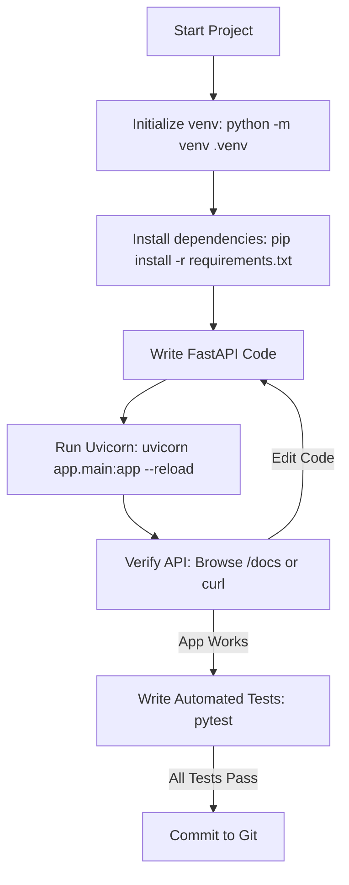

# Module 11: End-to-End Developer Workflow — Setup, Implementation & Verification

Welcome back, class. Today we analyze the **End-to-End Developer Workflow (CS-521)**.

A major source of software bugs is environmental drift—when an application behaves differently on a developer's machine compared to the production cluster. To prevent this, professional API developers adopt a rigorous "inner loop" workflow: isolating local environments, locking dependency configurations, running iterative code-reload verification cycles, and writing automated test assertions before committing code.

Today, we will study **reproducible local environments**, configure standard project startup templates, and establish a step-by-step verification process using FastAPI's Swagger UI and pytest.

---

## 1. Academic Lecture: The Professional Developer Inner Loop

The software engineering loop consists of three primary phases:

### 1. Environment Isolation (The Sandbox)
Python installs packages globally by default. If multiple projects share global space, package version conflicts are inevitable. We enforce sandbox isolation using **Virtual Environments (venv)**. A virtual environment isolates the Python executable and dependency directories (`site-packages`) to the local project folder.

### 2. Dependency Locking
To guarantee that deployments are reproducible, dependencies must be pinned to exact versions:
*   **Anemic dependency locking**: Specifying loose packages like `fastapi` or `uvicorn` in `requirements.txt`. A new installation will grab the latest release, potentially introducing breaking changes.
*   **Deterministic dependency locking**: Pinning exact semantic versions (e.g. `fastapi==0.109.0`) or using lockfiles (like Poetry's `poetry.lock` or Pipenv's `Pipfile.lock`) which record the cryptographic hashes of every package.

### 3. Iterative Verification Cycle
Instead of writing 500 lines of code and running the app for the first time, developers write code incrementally and utilize Uvicorn's **auto-reload** feature. When Uvicorn detects file edits, it automatically reloads the application. Developers verify routing behaviour immediately using cURL or the interactive OpenAPI docs (`/docs`).



---

## 2. Theory vs. Production Trade-offs

### pip requirements.txt vs. Poetry Dependency Managers
*   **Standard pip with requirements.txt**:
    *   *Pro*: Lightweight, built directly into Python, requires no extra tools.
    *   *Con*: Does not automatically resolve complex transitive dependency conflicts (e.g. if Package A requires Package C v1.0, and Package B requires Package C v2.0).
*   **Poetry Dependency Manager**:
    *   *Pro*: Provides a advanced dependency resolver, separates development-only dependencies (like pytest) from production packages, and generates secure lockfiles automatically.
    *   *Con*: Requires installing external CLI tools on developer and CI machines; adds learning curve.
*   **Production Rule**: For small, fast projects, a strictly version-pinned `requirements.txt` is sufficient. For large team collaboration, use **Poetry** to enforce exact build-reproducibility across all developers.

---

## 3. How to Use: The Complete Bootstrap and Testing Cycle

Let us walk through the step-by-step implementation of an authenticated status API, starting from an empty folder.

### A. The ad-hoc Development Setup (Anti-Pattern)

Avoid installing packages globally and verifying routing parameters by hand-testing via browser clicks:

```bash
# DANGER: Installing packages globally without a virtual environment
pip install fastapi uvicorn

# Running the app without reload configurations
python -m uvicorn main:app
# DANGER: Developer has to manually stop (Ctrl+C) and restart the server
# for every minor edit, wasting hours of development time.
```

### B. The Hardened Step-by-Step Developer Setup (Production Pattern)

Follow this step-by-step sequence to configure, write, run, and test a modular status API.

#### Step 1: Environment Isolation & Setup
Run the following setup in your system terminal:
```bash
# 1. Create a dedicated sandboxed environment
python -m venv .venv

# 2. Activate the virtual environment (Windows PowerShell)
.venv\Scripts\Activate.ps1

# 3. Create requirements.txt and pin exact libraries
echo fastapi==0.109.0 > requirements.txt
echo uvicorn[standard]==0.27.0 >> requirements.txt
echo httpx==0.26.0 >> requirements.txt
echo pytest==8.0.0 >> requirements.txt

# 4. Install the pinned dependencies
pip install -r requirements.txt
```

#### Step 2: Implement the FastAPI Application (`main.py`)
Create the core file containing basic metadata and a simple status route:

```python
from fastapi import FastAPI, status
from pydantic import BaseModel

app = FastAPI(
    title="Core System API",
    version="1.0.0",
    docs_url="/docs"  # Enforces OpenAPI interactive docs route
)

class StatusResponse(BaseModel):
    status: str
    version: str
    environment: str

@app.get("/status", response_model=StatusResponse, status_code=status.HTTP_200_OK)
async def get_system_status():
    # Return structured metadata
    return {
        "status": "online",
        "version": "1.0.0",
        "environment": "development"
    }
```

#### Step 3: Run the Live Development Server
Execute the ASGI server in development auto-reload mode. We explicitly exclude the `.venv` and temporary folders to prevent Uvicorn from entering recursive reload loops:
```bash
uvicorn main:app --reload --reload-exclude "*.log" --reload-exclude ".venv/*"
```

#### Step 4: Verify via Swagger UI
Open your web browser and navigate to:
```text
http://127.0.0.1:8000/docs
```
You can interactively trigger the `/status` route, view response schemas, and download the raw OpenAPI specification.

Alternatively, verify using cURL:
```bash
curl -i http://127.0.0.1:8000/status
```

#### Step 5: Implement and Execute Integration Tests (`test_main.py`)
Write an automated script using HTTPX to assert status parameters:

```python
from fastapi.testclient import TestClient
from main import app

# TestClient acts as a mock client for routing requests
client = TestClient(app)

def test_system_status_endpoint():
    # Trigger request
    response = client.get("/status")
    
    # Assert conditions
    assert response.status_code == 200
    data = response.json()
    assert data["status"] == "online"
    assert data["version"] == "1.0.0"
    assert data["environment"] == "development"
```

To run your tests, execute pytest:
```bash
pytest test_main.py -v
```

---

## 4. Common Errors & Pitfalls

### Pitfall 1: Global Import Pollution
Forgetting to activate the virtual environment before installing libraries or running pytest.
*   **Why it fails**: The system will run using the global python binaries. You may get `ModuleNotFoundError` or version mismatch crashes because the dependencies installed in the virtual environment are ignored.
*   **Mitigation**: Always check that your terminal line displays the `(.venv)` prefix indicating active environment redirection.

### Pitfall 2: Infinite Reload Loops
Uvicorn restarting continuously because files are written in the monitoring path.
*   **Why it fails**: If your application writes JSON log files, databases (e.g. SQLite), or dynamic media files within the app folder, Uvicorn detects these files as modifications and restarts. This disrupts connections and slows down the CPU.
*   **Mitigation**: Pass `--reload-exclude` parameters to exclude logs, database files, or your virtual environment directory from the watcher.

---

## 5. Socratic Review Questions

### Question 1
Why should you version-pin packages using `==` rather than `>=` in a production environment?

#### Answer
Using `>=` (e.g. `fastapi>=0.100.0`) allows the installer to download any version that is greater than or equal to `0.100.0`. If the package author releases a new minor or patch version containing a bug or breaking change, your deployment server will download it on the next build, causing random failures. Pinning with `==` ensures that every server build uses the exact same validated code files.

### Question 2
How does Uvicorn detect code changes during development, and why is this mechanism a performance hazard in production?

#### Answer
Uvicorn uses directory monitoring APIs (like `inotify` on Linux or `ReadDirectoryChangesW` on Windows) to watch for file writes. This scanning adds CPU overhead. In production, code changes do not happen in real-time, and running directory listeners unnecessarily consumes CPU cycles that should be dedicated to routing requests. Therefore, auto-reload must be disabled in production.

---

## 6. Hands-on Challenge: Configuring a Local Project Scaffold

### The Challenge
In this challenge, you will implement a boot check verification script.

Your task:
1.  Complete the initialization method in the `BootConfig` class to verify if the `.venv` folder is present.
2.  If the virtual environment folder is missing, print a warning.
3.  Register a basic health route that confirms the environment is active.

Complete the implementation below:

```python
import os
from fastapi import FastAPI

class BootConfig:
    def __init__(self, root_dir: str = "."):
        self.root_dir = root_dir

    def is_venv_active(self) -> bool:
        # TODO: Implement the validation.
        # 1. Check if the directory ".venv" or "venv" exists in self.root_dir.
        # 2. Return True if it exists, False otherwise.
        
        return False

app = FastAPI()

@app.get("/health-check")
async def health():
    config = BootConfig()
    env_ok = config.is_venv_active()
    return {
        "status": "active" if env_ok else "warning",
        "venv_detected": env_ok
    }
```

Write the verification logic. Save the completed file and verify that the virtual environment scanner returns true when run locally inside `modules/11-developer-workflow.md`.
