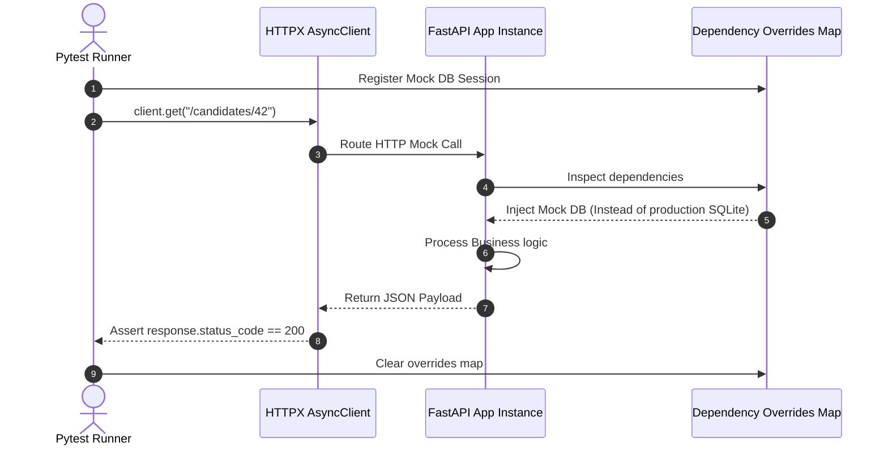

# Module 12: Testing Async APIs — pytest & AsyncClient Integrations

Welcome back, class. Today we analyze **Testing Async APIs (CS-521)**.

Automated testing is the primary defense against regressions in production code. However, testing asynchronous Python APIs introduces unique concurrency challenges. Standard synchronous test frameworks (like python's default `unittest`) cannot execute coroutines without custom event loop runners. Furthermore, testing database-backed routes without clean sandboxes will pollute production databases.

FastAPI provides seamless hooks to override dependencies during testing, and integrates perfectly with `pytest` and `HTTPX`. Today, we will study **async test fixtures**, learn how to use the HTTPX **`AsyncClient`**, and mock outbound databases and external API services using FastAPI's dependency overrides.

---

## 1. Academic Lecture: Async Event Loops in Test Contexts

Testing coroutines requires a runner to schedule tasks on an event loop:

### 1. Pytest-Asyncio Event Loops
*   **The Problem**: A standard test function cannot use the `await` keyword.
*   **The Solution**: We use the `pytest-asyncio` plugin. It allows us to decorate test cases with `@pytest.mark.anyio` or `@pytest.mark.asyncio`, telling the test runner to bootstrap an event loop, run the test coroutine, and shut down the loop when completed.

### 2. HTTPX `AsyncClient`
When making requests to our application under test:
*   **Synchronous Client (`TestClient`)**: FastAPI's default `TestClient` uses standard synchronous socket calls. Under the hood, it handles the event loop for you, which is sufficient for simple tests.
*   **Asynchronous Client (`AsyncClient`)**: If your endpoints require background task executions, WebSocket streaming, or if you write tests that concurrently call multiple endpoints using `asyncio.gather()`, you must use HTTPX `AsyncClient`. This client communicates asynchronously with the ASGI application on the same loop.

### 3. FastAPI Dependency Overrides
To isolate tests from databases, cache servers, or external REST endpoints, FastAPI exposes a mapping registry: `app.dependency_overrides`.
*   During a test build, we can register mock providers (e.g. replacing a live database session creator with a mock database yield session).
*   FastAPI looks up this dictionary before resolving dependencies. If an override exists, it injects the mock object instead, keeping test execution isolated.



---

## 2. Theory vs. Production Trade-offs

### Live In-Memory DB (SQLite) vs. Mocking Repository Classes
*   **Testing with Live In-Memory SQLite**:
    *   *Pro*: Realistic test environment. SQL queries, unique constraints, and schema validations are fully executed and validated.
    *   *Con*: Slower execution speed. Requires setting up migrations, seeding databases, and truncating tables before every test case to ensure test isolation.
*   **Mocking Repository Layers**:
    *   *Pro*: Blazing fast. Database reads/writes are replaced with instant python dictionary lookups or mock values.
    *   *Con*: High risk. If your raw SQL contains syntax errors, or if you make incorrect assumptions about database behaviors, tests will pass locally but crash in production.
*   **Production Rule**: Use **Mocking** for service layer unit tests. Use a **Live Test Database** (using containerized databases like Postgres via Docker or in-memory SQLite) for API-level integration tests to ensure query syntaxes are correct.

---

## 3. How to Use: Async Test Fixtures and Mocking

Let us write a compile-grade Python 3.11+ application and its corresponding pytest testing suite.

### A. The Shared State Pollution (Anti-Pattern)

Avoid writing tests that write directly to production databases without overrides or cleanup:

```python
# DANGER: Running tests that hit production databases without sandboxing
import pytest
from fastapi.testclient import TestClient
from main import app # Assuming main.py initializes database connections

client = TestClient(app)

def test_add_candidate_vulnerable():
    # DANGER: Calling this writes "John Doe" directly to the database.
    # If the test runs twice, it will fail due to duplicate constraint violations,
    # or contaminate actual production stats.
    response = client.post("/candidates", json={"name": "John Doe", "score": 90})
    assert response.status_code == 201
```

### B. The Hardened Async Integration Test Suite (Production Pattern)

Here is the hardened pattern. We write our service, mock database, and structure a clean testing file `test_api.py` that overrides dependencies and cleans up after each run.

#### 1. The Core Application Code (`main.py`)
```python
from fastapi import FastAPI, Depends, status
from pydantic import BaseModel

app = FastAPI()

# Database Connection Dependency (Simulating DB layer)
class DatabaseService:
    def save_to_db(self, data: str):
        # Pretend this writes to Postgres
        return f"RealDB: {data}"

def get_db_service() -> DatabaseService:
    return DatabaseService()

class ItemRequest(BaseModel):
    name: str

@app.post("/items", status_code=status.HTTP_201_CREATED)
async def create_item(payload: ItemRequest, db: DatabaseService = Depends(get_db_service)):
    result = db.save_to_db(payload.name)
    return {"message": "Success", "saved": result}
```

#### 2. The Test Suite (`test_api.py`)
```python
import pytest
from httpx import AsyncClient
from main import app, get_db_service, DatabaseService

# Mock Database service for isolated testing
class MockDatabaseService(DatabaseService):
    def save_to_db(self, data: str):
        return f"MockDB: {data}"

# 1. Configures pytest to use anyio or asyncio loop runners
@pytest.fixture
def anyio_backend():
    return "asyncio"

# 2. Configures Dependency Overrides as a fixture
@pytest.fixture(autouse=True)
def setup_dependency_overrides():
    # SECURE: Bind the dependency override before the test runs
    app.dependency_overrides[get_db_service] = lambda: MockDatabaseService()
    yield
    # SECURE: Clean up overrides immediately after test completion
    app.dependency_overrides.clear()

# 3. HTTPX AsyncClient Fixture
@pytest.fixture
async def async_client():
    # SECURE: Instantiate AsyncClient to communicate asynchronously with app
    async with AsyncClient(app=app, base_url="http://testserver") as client:
        yield client

# 4. Async Test Case using the fixture
@pytest.mark.anyio
async def test_create_item_mocked(async_client: AsyncClient):
    payload = {"name": "TestItem"}
    
    # Act
    response = await async_client.post("/items", json=payload)
    
    # Assert
    assert response.status_code == 201
    data = response.json()
    assert data["message"] == "Success"
    # Verify the route injected the Mock database rather than the real database
    assert data["saved"] == "MockDB: TestItem"
```

To run this test suite, execute the following command:
```bash
pytest test_api.py -v
```

---

## 4. Common Errors & Pitfalls

### Pitfall 1: Leaking Dependency Overrides
Failing to clear the `app.dependency_overrides` dictionary after tests complete.
*   **Why it fails**: If Test A overrides a service, and Test B expects the default behavior, Test B will execute with the mocked service, causing unpredictable test results.
*   **Mitigation**: Always clear overrides in a teardown hook or a `try-finally` block inside pytest fixtures.

### Pitfall 2: Async Event Loop Mismatch
Getting `RuntimeError: Task <Task pending> attached to a different loop` when sharing async resources.
*   **Why it fails**: Pytest creates a new event loop for each test function by default. If you create an async resource (e.g. database connections pool) in a session-scoped fixture, and then use it in function-scoped tests, they will operate on different loops.
*   **Mitigation**: Enforce the same loop lifetime, or redefine your fixtures to run on the default event loop scope.

---

## 5. Socratic Review Questions

### Question 1
Why is it critical to close the HTTPX `AsyncClient` instance via the `async with` block inside a fixture, rather than just returning the client object?

#### Answer
`AsyncClient` maintains persistent connections pool and ASGI lifecycle tasks. If you do not close the client, connection slots remain open, triggering resource exhaustion warnings or blocking pytest from exit because event loops have active pending tasks. The `async with` block guarantees the client closes when the fixture completes.

### Question 2
What is the difference between `@pytest.mark.anyio` and `@pytest.mark.asyncio`?

#### Answer
*   `@pytest.mark.asyncio` is specific to the standard library `asyncio` event loop runner.
*   `@pytest.mark.anyio` allows tests to run across multiple asynchronous backends, including both `asyncio` and `trio`. FastAPI uses `anyio` under the hood, making `@pytest.mark.anyio` the preferred runner decorator for testing FastAPI APIs.

---

## 6. Hands-on Challenge: Writing an Async Integration Test

### The Challenge
In this challenge, you will implement an integration test using pytest and HTTPX `AsyncClient` to verify a profile route.

Your task:
1.  Complete the test case `test_get_profile` to invoke `/profile`.
2.  Assert that the response status is 200.
3.  Assert that the JSON response matches `{"username": "challenger"}`.

Complete the implementation below:

```python
import pytest
from fastapi import FastAPI
from httpx import AsyncClient

app = FastAPI()

@app.get("/profile")
async def get_profile():
    return {"username": "challenger"}

@pytest.fixture
def anyio_backend():
    return "asyncio"

@pytest.mark.anyio
async def test_get_profile():
    # TODO: Complete the test code.
    # 1. Create an AsyncClient context manager: async with AsyncClient(app=app, base_url="http://test") as client:
    # 2. Invoke the route: response = await client.get("/profile")
    # 3. Assert status code is 200.
    # 4. Assert response.json() matches {"username": "challenger"}.
    
    pass
```

Write the test assertions. Save the completed file and run pytest to verify the assertions pass inside `modules/12-testing.md`.
