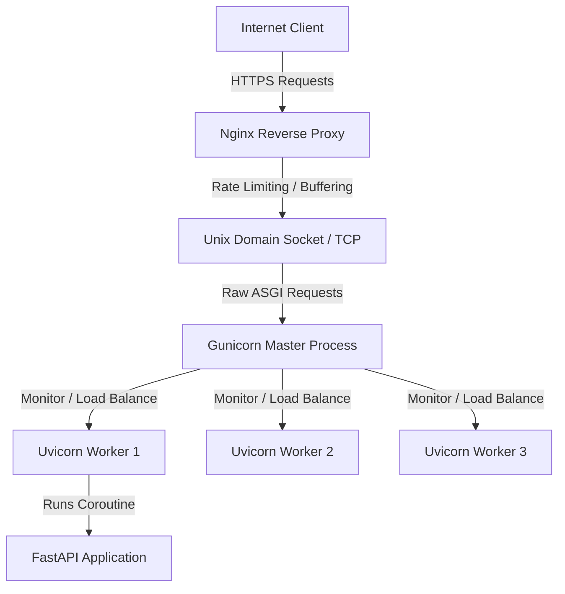

# Module 13: Uvicorn Production Deployments — Process Workers & Reverse Proxies

Welcome back, class. Today we analyze **Uvicorn Production Deployments (CS-521)**.

Running a local API using Uvicorn's reload CLI is easy. However, deploying an asynchronous API to production requires a completely different architectural setup. Exposing Uvicorn directly to the public internet, running processes as root, or using development config profiles leaves your server vulnerable to Denial of Service (DoS) attacks, resource starvation, and memory leaks.

To scale FastAPI in production, we run a process manager like **Gunicorn** to orchestrate multiple **Uvicorn workers** across CPU cores, and place the application behind a hardened reverse proxy like **Nginx**. Today, we will study **process scaling**, write a dynamic production configuration script, and configure a secure Nginx reverse proxy.

---

## 1. Academic Lecture: Multi-Process scaling and Edge Hardening

A production ASGI architecture secures and parallelizes traffic across multiple system layers:

### 1. Multi-Core Process Scaling
*   **The Single-Thread Limit**: Because FastAPI runs on a single event loop thread, it can only utilize a single CPU core. If your server has 8 CPU cores, 7 cores will sit idle while one core struggles under heavy request loads.
*   **The Multi-Process Solution**: We run multiple instances (workers) of our application. We use **Gunicorn (Green Unicorn)** as a master process controller. Gunicorn binds to the network port and handles process management, automatically spawning, monitoring, and restarting **Uvicorn Worker** processes.

### 2. Worker Count Heuristic
To maximize CPU throughput without causing thrashing (excessive context switching), we set the worker count according to the standard formula:
$$\text{Workers} = (2 \times \text{CPU Cores}) + 1$$
This formula guarantees that even if a worker blocks momentarily on disk I/O, other workers are ready to process incoming socket requests.

### 3. The Reverse Proxy (Nginx) Layer
An ASGI server should never face the public internet directly. We place **Nginx** at the boundary of our infrastructure. Nginx acts as a high-performance buffer:
*   **SSL Termination**: Nginx decrypts HTTPS requests, saving CPU cycles on the application server.
*   **Slow Client Protection**: An attacker can send request body bytes extremely slowly (a Slowloris attack). Nginx buffers incoming requests completely before forwarding them to Uvicorn, keeping the application worker loops free.
*   **Static Assets**: Nginx serves static assets (HTML, images, JS) directly from disk, bypassing the Python ASGI server.



---

## 2. Theory vs. Production Trade-offs

### Unix Sockets vs. TCP Port Bindings
*   **TCP Port Bindings (`127.0.0.1:8000`)**:
    *   *Pro*: Simple to configure; works across separate virtual machines.
    *   *Con*: High overhead. Incurs TCP handshake and packet routing latency even when Nginx and Uvicorn reside on the same operating system instance.
*   **Unix Domain Sockets (`/tmp/uvicorn.sock`)**:
    *   *Pro*: Highly performant. Bypasses the network stack entirely, allowing Nginx to communicate with Gunicorn via direct OS memory buffers, yielding up to a 20-30% throughput increase.
    *   *Con*: Requires Nginx and Gunicorn to run on the same physical host or share a volume in containerized pods.
*   **Production Rule**: If Nginx and Gunicorn run on the same server, always use **Unix Domain Sockets**. If they run in separate isolated containers, use **TCP Port Bindings**.

---

## 3. How to Use: Hardened Production Configurations

Let us write a compile-grade configuration setup for a production deployment.

### A. The Direct Exposures CLI (Anti-Pattern)

Avoid running Uvicorn directly on public ports as root with debug reload enabled:

```bash
# DANGER: Running with --reload in production wastes system memory,
# exposes detailed debug exception dumps to attackers, and risks file integrity.
# Additionally, binding directly to port 0.0.0.0 as root exposes the python process
# to root privilege escalation vulnerabilities.
sudo uvicorn main:app --host 0.0.0.0 --port 80 --reload
```

### B. The Hardened Process Manager Configuration (Production Pattern)

Here is the production architecture. We write a Gunicorn configuration file, map Uvicorn workers, and configure Nginx buffers.

#### 1. The Dynamic Gunicorn Configuration (`gunicorn_conf.py`)
This script calculates worker capacities dynamically based on CPU core counts:

```python
import os
import multiprocessing

# 1. Bind Address (Use a Unix socket if running on the same host as Nginx)
bind = os.getenv("BIND_ADDRESS", "127.0.0.1:8000")

# 2. Worker Scaling Calculations
cores = multiprocessing.cpu_count()
# SECURE: Limit the number of workers to prevent memory exhaustion
workers_per_core = 2
default_workers = (cores * workers_per_core) + 1
workers = int(os.getenv("WEB_CONCURRENCY", default_workers))

# 3. Secure ASGI Worker Hook
worker_class = "uvicorn.workers.UvicornWorker"

# 4. Process Lifespan & Timeouts
timeout = int(os.getenv("TIMEOUT", "30"))  # Terminate workers blocking longer than 30s
keepalive = 5  # Keeps connections open for 5 seconds for subsequent requests

# 5. Logging Configuration
accesslog = os.getenv("ACCESS_LOG_PATH", "-")  # '-' logs to stdout
errorlog = os.getenv("ERROR_LOG_PATH", "-")
loglevel = os.getenv("LOG_LEVEL", "info")
```

To run Gunicorn with this configuration, execute:
```bash
gunicorn main:app -c gunicorn_conf.py
```

#### 2. The Hardened Nginx Site Configuration (`nginx.conf`)
Save this configuration inside `/etc/nginx/sites-available/app`:

```nginx
# 1. Enforce rate limiting zone
limit_req_zone $binary_remote_addr zone=api_limit_zone:10m rate=10r/s;

server {
    listen 80;
    server_name api.candidatepipeline.com;

    # Redirect all HTTP requests to secure HTTPS
    return 301 https://$host$request_uri;
}

server {
    listen 443 ssl http2;
    server_name api.candidatepipeline.com;

    # Configure SSL Certificates
    ssl_certificate /etc/letsencrypt/live/api.candidatepipeline.com/fullchain.pem;
    ssl_certificate_key /etc/letsencrypt/live/api.candidatepipeline.com/privkey.pem;
    ssl_protocols TLSv1.2 TLSv1.3;
    ssl_ciphers HIGH:!aNULL:!MD5;

    # 2. Buffer configurations to protect against slow clients
    client_body_buffer_size 128k;
    client_max_body_size 10M; # Restrict uploads to 10MB
    client_header_buffer_size 1k;
    large_client_header_buffers 4 4k;

    location / {
        # Enforce rate limits
        limit_req zone=api_limit_zone burst=20 nodelay;

        # Forward headers for accurate downstream logging
        proxy_set_header Host $http_host;
        proxy_set_header X-Real-IP $remote_addr;
        proxy_set_header X-Forwarded-For $proxy_add_x_forwarded_for;
        proxy_set_header X-Forwarded-Proto $scheme;

        # SECURE: Reverse proxy target pointing to local Gunicorn TCP address
        proxy_pass http://127.0.0.1:8000;
        
        # Disable buffering for WebSockets if needed
        proxy_http_version 1.1;
        proxy_set_header Upgrade $http_upgrade;
        proxy_set_header Connection "upgrade";
    }
}
```

---

## 4. Common Errors & Pitfalls

### Pitfall 1: Blocking the Async Event Loop (Worker Starvation)
Running synchronous I/O operations (like database read queries or standard file writes) without the `await` keyword in `async def` routing endpoints.
*   **Why it fails**: When a worker blocks on synchronous execution, Uvicorn's event loop stops processing all other client connections. If all Gunicorn workers block on databases, the entire server becomes completely unresponsive, triggering timeouts at the Nginx layer.
*   **Mitigation**: Always execute blocking database or computation processes on thread pools using `anyio.to_thread` or define the route endpoint as a standard synchronous `def` function.

### Pitfall 2: Orphaning Zombie Gunicorn Workers
Forcefully terminating the Gunicorn master process with `kill -9` without notifying child workers.
*   **Why it fails**: The child Uvicorn processes remain running in the background as orphans (zombies), continuing to listen on ports and consume system memory.
*   **Mitigation**: Always stop Gunicorn using the standard TERM signal (`kill -15` or `gunicorn --stop`).

---

## 5. Socratic Review Questions

### Question 1
Why does setting the worker count significantly higher than the number of physical CPU cores (e.g. 50 workers on a 2-core CPU) degrade application performance?

#### Answer
A CPU can only run as many processes concurrently as it has physical cores. If we run 50 processes on 2 cores, the operating system is forced to continuously switch between processes (context switching). This context switching consumes massive CPU resources, increasing latency and reducing overall throughput.

### Question 2
How does placing Nginx as a reverse proxy protect the downstream FastAPI application from Slowloris Denial of Service (DoS) attacks?

#### Answer
A Slowloris attack sends request bytes extremely slowly over HTTP connections. Since Uvicorn allocates an active worker to read the incoming connection, a few slow connections can block all workers. Nginx mitigates this by buffering the request completely in its own layer. It only opens the connection to the backend Uvicorn application once the entire request payload is received, protecting the Python worker pools.

---

## 6. Hands-on Challenge: Dynamic Worker Estimator

### The Challenge
In this challenge, you will write a python script to dynamically validate environment properties and output configuration parameters for Gunicorn.

Your task:
1.  Complete the function `calculate_gunicorn_settings`.
2.  If the input `cores` is less than or equal to 0, raise a `ValueError`.
3.  Calculate the standard worker count using the formula `(cores * 2) + 1`.
4.  If the string `env` is `"production"`, return the worker count. If `env` is `"development"`, return `1` to conserve resources.

Complete the implementation below:

```python
import os

def calculate_gunicorn_settings(cores: int, env: str) -> dict:
    if cores <= 0:
        raise ValueError("CPU core count must be greater than zero")
        
    # TODO: Complete this calculation.
    # 1. Compute target_workers using formula: (cores * 2) + 1.
    # 2. If env == "development", override worker count to 1.
    # 3. Return a dictionary with keys: "workers" (int) and "bind" (str: "127.0.0.1:8000" if dev, "unix:/tmp/app.sock" if production).
    
    return {}
```

Write the settings calculator. Save the completed file and verify that the settings conform to production scaling rules inside `modules/13-uvicorn-production.md`.
