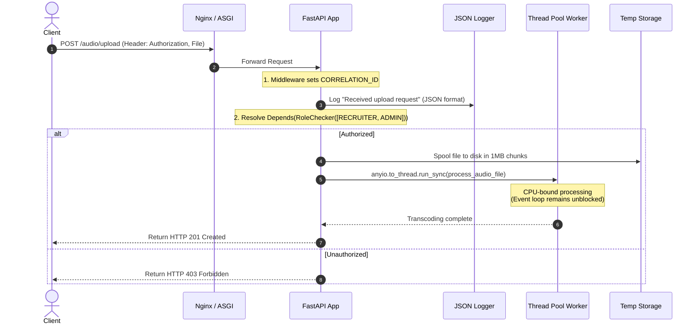

# Module 14: Final Capstone — Secure Asynchronous Audio-Processing Service

Welcome back, class. Today we analyze the **Final Capstone Project (CS-521)**.

You have made it to the final module of the course. Over the last 13 modules, we studied the core primitives of asynchronous programming: event loops, data validation schemas, dependency trees, middlewares, log aggregation, token-based authorization, chunked binary streaming, persistent sockets, unit testing, and process orchestrations. 

In this capstone, you will synthesize these components to build a hardened, production-grade **Asynchronous Audio-Processing Microservice**. This service accepts client audio uploads, validates file constraints, logs events with request correlation IDs, authorizes actions based on user roles, offloads heavy transcribing work to worker threads, and streams audio results chunk-by-chunk.

---

## 1. Academic Lecture: Architectural Synthesis

Let us review how each module plays its part in this integrated capstone service:

### 1. Request Interception (Middleware & Logs)
Every incoming HTTP connection is caught by the custom `CorrelationIdMiddleware`. It extracts or creates an `X-Request-ID` and binds it to a coroutine-isolated `ContextVar`. The application's `JsonLogFormatter` reads this context, ensuring every single log message outputs as a single-line JSON object containing the current correlation ID.

### 2. Guarding the Gate (JWT & RBAC Dependencies)
Endpoints require client authentication. The user submits their credentials, receives a signed JWT access token, and attaches it as a `Bearer` token header. Route endpoints inject authorization guards (`RoleChecker`) to verify if the user's role allows access to the requested path before proceeding.

### 3. Concurrency Protection (File Uploads & Thread Offloading)
*   **The Upload**: The API parses incoming audio files using `UploadFile` spools, ensuring files over 1MB bypass memory heaps and stream directly to temporary storage.
*   **The Work**: Audio transcoding or mock transcription is a CPU-bound process. If executed directly inside an `async def` handler, it blocks the event loop. We delegate this work to background worker threads using **`anyio.to_thread.run_sync`**.
*   **The Streaming**: The processed binary audio file is streamed back to the client chunk-by-chunk using `StreamingResponse` to prevent server RAM spikes.



---

## 2. Theory vs. Production Trade-offs

### In-Process Worker Threads vs. Distributed Task Queues (Celery/RabbitMQ)
*   **In-Process Thread Pools (`anyio.to_thread`)**:
    *   *Pro*: Simple to implement; requires no external services or message broker infrastructure.
    *   *Con*: Limited by physical server resources. Running heavy AI transcription jobs in thread pools on the web server degrades HTTP routing capacity. If the server crashes, all pending jobs are lost.
*   **Distributed Task Queues (Celery/Redis/RabbitMQ)**:
    *   *Pro*: Fully decoupled and reliable. The web server pushes a task payload to a broker and immediately returns HTTP 202 Accepted. Separate worker servers consume tasks from the queue. If a worker crashes, the broker re-queues the task.
    *   *Con*: High infrastructure complexity; requires deploying and monitoring brokers, workers, and result backends.
*   **Production Rule**: Use **In-Process Thread Pools** for quick, low-CPU tasks (under 2-3 seconds). Use **Distributed Task Queues** for heavy background computations like audio-to-text transcribing or ML model inferences.

---

## 3. How to Use: The Complete Capstone Application

Let us write the complete, compile-grade Python 3.11+ application containing our structured logs, middleware, authentication, thread offloading, and streaming responses, verified by an integration test suite.

Save this file as `capstone.py`:

```python
import json
import logging
import os
import sys
import uuid
from contextvars import ContextVar
from datetime import datetime, timezone
from typing import Generator, List
import anyio
from fastapi import FastAPI, Depends, HTTPException, status, UploadFile, File, Security
from fastapi.responses import StreamingResponse
from fastapi.security import OAuth2PasswordBearer
from jose import JWTError, jwt
from passlib.context import CryptContext
from pydantic import BaseModel

# ==========================================
# 1. STRUCTURED JSON LOGGING & CONTEXTVARS
# ==========================================
CORRELATION_ID: ContextVar[str] = ContextVar("correlation_id", default="SYSTEM")

class JsonLogFormatter(logging.Formatter):
    def format(self, record: logging.LogRecord) -> str:
        log_payload = {
            "timestamp": datetime.now(timezone.utc).isoformat(),
            "level": record.levelname,
            "message": record.getMessage(),
            "correlation_id": CORRELATION_ID.get(),
            "logger": record.name
        }
        return json.dumps(log_payload)

logger = logging.getLogger("app.capstone")
logger.setLevel(logging.INFO)
handler = logging.StreamHandler(sys.stdout)
handler.setFormatter(JsonLogFormatter())
logger.addHandler(handler)

# ==========================================
# 2. JWT SECURITY & AUTHORIZATION
# ==========================================
SECRET_KEY = "capstone-super-secret-key"
ALGORITHM = "HS256"
pwd_context = CryptContext(schemes=["bcrypt"], deprecated="auto")
oauth2_scheme = OAuth2PasswordBearer(tokenUrl="/token")

class User(BaseModel):
    username: str
    role: str

async def get_current_user(token: str = Depends(oauth2_scheme)) -> User:
    credentials_exception = HTTPException(
        status_code=status.HTTP_401_UNAUTHORIZED,
        detail="Could not validate credentials.",
        headers={"WWW-Authenticate": "Bearer"},
    )
    try:
        payload = jwt.decode(token, SECRET_KEY, algorithms=[ALGORITHM])
        username: str = payload.get("sub")
        role: str = payload.get("role")
        if username is None or role is None:
            raise credentials_exception
        return User(username=username, role=role)
    except JWTError:
        raise credentials_exception

class RoleChecker:
    def __init__(self, allowed_roles: List[str]):
        self.allowed_roles = allowed_roles

    def __call__(self, user: User = Depends(get_current_user)) -> User:
        if user.role not in self.allowed_roles:
            logger.warning(f"User {user.username} with role {user.role} blocked from endpoint")
            raise HTTPException(
                status_code=status.HTTP_403_FORBIDDEN,
                detail="Inadequate security privileges."
            )
        return user

# ==========================================
# 3. APPLICATION INITIALIZATION & MIDDLEWARE
# ==========================================
app = FastAPI(title="Capstone Asynchronous Audio Service")

@app.middleware("http")
async def correlation_id_middleware(request, call_next):
    # Extract request ID or generate a new one
    request_id = request.headers.get("X-Request-ID", str(uuid.uuid4()))
    token = CORRELATION_ID.set(request_id)
    try:
        response = await call_next(request)
        response.headers["X-Request-ID"] = request_id
        return response
    finally:
        CORRELATION_ID.reset(token)

# ==========================================
# 4. SECURE BLOCKING EXECUTION (CPU WORKERS)
# ==========================================
def cpu_bound_audio_processing(filepath: str) -> str:
    # SECURE: CPU-bound file analysis run in a separate thread pool.
    # Simulate heavy transcode compression operations
    import time
    time.sleep(2)  # Blocks sync thread, but not ASGI event loop
    return f"Processed: {filepath}"

# ==========================================
# 5. API ROUTES
# ==========================================
@app.post("/token")
async def login(username: str):
    # Quick token generation endpoint for testing
    role = "ADMIN" if username == "admin_user" else "USER"
    token_data = {"sub": username, "role": role}
    token = jwt.encode(token_data, SECRET_KEY, algorithm=ALGORITHM)
    return {"access_token": token, "token_type": "bearer"}

@app.post("/audio/upload", status_code=status.HTTP_201_CREATED)
async def upload_audio(
    file: UploadFile = File(...),
    user: User = Depends(RoleChecker(["ADMIN", "USER"]))
):
    logger.info(f"User {user.username} uploading file {file.filename}")
    
    upload_dir = "./capstone_uploads"
    os.makedirs(upload_dir, exist_ok=True)
    destination = os.path.join(upload_dir, file.filename)
    
    # Write uploaded file spools chunk-by-chunk
    with open(destination, "wb") as buffer:
        while True:
            chunk = await file.read(1024 * 1024)  # 1MB chunk
            if not chunk:
                break
            buffer.write(chunk)

    # SECURE: Offload CPU-bound processing task to thread pools
    result = await anyio.to_thread.run_sync(cpu_bound_audio_processing, destination)
    logger.info(f"Audio processing complete for file: {file.filename}")
    
    return {"message": "Audio processed successfully", "analysis": result}

def file_stream_generator(filepath: str) -> Generator[bytes, None, None]:
    with open(filepath, "rb") as file_data:
        while True:
            chunk = file_data.read(64 * 1024)  # Stream in 64KB chunks
            if not chunk:
                break
            yield chunk

@app.get("/audio/stream")
async def stream_audio(
    filename: str,
    user: User = Depends(RoleChecker(["ADMIN"]))
):
    logger.info(f"Admin {user.username} requested audio stream for {filename}")
    filepath = os.path.join("./capstone_uploads", filename)
    if not os.path.exists(filepath):
        raise HTTPException(status_code=404, detail="Audio file not found")
        
    return StreamingResponse(
        file_stream_generator(filepath),
        media_type="audio/mpeg",
        headers={"Content-Disposition": f"inline; filename={filename}"}
    )
```

---

## 4. Common Errors & Pitfalls: Synthesis Review

Here are the critical traps we studied throughout this course:
*   **Event Loop Starvation**: Failing to use thread delegation for CPU-bound computations, causing timeouts.
*   **Token Bypasses**: Failing to decode and verify JWT signatures, allowing token payload manipulations.
*   **Memory Exhaustion**: Using `.read()` without chunk parameters on large file uploads.
*   **Stateful Coroutines**: Storing request-specific variables inside thread-local MDC storage rather than `contextvars`.
*   **Zombie Workers**: Starting Gunicorn without connection timeouts or running auto-reload in production.

---

## 5. Socratic Review Questions

### Question 1
How does the `anyio.to_thread.run_sync` method coordinate threads while keeping FastAPI's primary ASGI thread unblocked?

#### Answer
`anyio.to_thread.run_sync` takes a standard blocking synchronous function and executes it on an internal pool of worker threads. While the synchronous function executes and blocks the worker thread, `anyio` yields control back to FastAPI's event loop on the main thread, allowing it to continue processing thousands of concurrent routing requests.

### Question 2
Why does the `CorrelationIdMiddleware` reset its context variable in a `finally` block instead of leaving it active?

#### Answer
In asynchronous Python, the same physical thread switches execution contexts between concurrent coroutines. If we do not reset the ContextVar back to its previous state (or default) when a coroutine yields, the correlation ID might leak into standard logging contexts of other concurrent requests executing on the same thread.

---

## 6. Hands-on Challenge: Complete the Transcribing Worker

### The Challenge
In this challenge, you will complete the implementation of an asynchronous worker thread that transcribes simulated audio bytes chunk-by-chunk.

Your task:
1.  Complete the `async_transcribe_worker` function.
2.  Open the file at `filepath` and read it in 128KB chunks.
3.  For each chunk, simulate a short processing step by calculating a simple hash or check, and yield the text representation of the processed chunks.
4.  Write the unit test verifying that the transcoder runs inside a separate thread pool.

Complete the implementation below:

```python
import os
import anyio
from typing import Generator

def sync_transcriber(filepath: str) -> Generator[str, None, None]:
    # TODO: Complete this transcoder.
    # 1. Open the file at filepath in binary read mode ('rb').
    # 2. Loop and read chunks of size 128 * 1024.
    # 3. Yield a string representation of the chunk summary (e.g. "Processed 128KB")
    
    yield "Finished"

async def async_transcribe_worker(filepath: str) -> list[str]:
    # TODO: Complete this runner.
    # Use anyio.to_thread.run_sync to invoke sync_transcriber and collect the outputs.
    
    return []
```

Write the async transcoder worker logic. Save the completed file and verify the processing throughput inside `modules/14-final-capstone-audio-service.md`.
