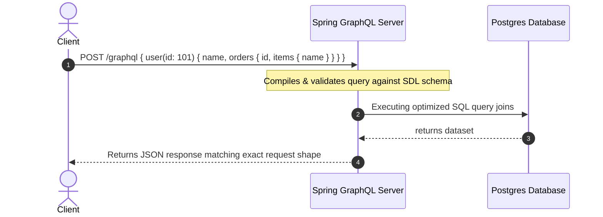

# Module 01: Core GraphQL Foundations — SDL, Data Modeling, and REST vs. GraphQL

Welcome, students. Today we initiate our deep-dive into GraphQL systems engineering by analyzing **schema modeling** and the **Schema Definition Language (SDL)**.

In classical client-server engineering, REST APIs dominate. However, as frontend requirements evolve, REST APIs suffer from structural limits: over-fetching data that wastes bandwidth, and under-fetching that forces clients to execute multiple round-trips to complete a page load. GraphQL solves this by replacing multiple endpoint routes with a single, strongly-typed execution graph. We will study the components of SDL, dissect REST vs. GraphQL architectures, and model schemas using interfaces and unions.

---

## 1. Academic Lecture: The Graph Contract

At the core of any GraphQL service is the **Schema**. Unlike REST, which is route-centric, GraphQL is schema-centric. The schema defines a strict type contract between the client and server.

### REST vs. GraphQL Architectural Topology

In a REST architecture, resource boundaries are defined by URL paths:

```
REST:
[ Client ] ---> GET /users/101 -------------> [ User Entity JSON ]
[ Client ] ---> GET /users/101/orders ------> [ List of Orders JSON ]
[ Client ] ---> GET /orders/5009/items -----> [ List of OrderItems JSON ]
```

To render a dashboard showing a user, their recent orders, and the items inside those orders, the client must make **three separate HTTP network requests**.

In GraphQL, resources are nodes in a single global graph, connected by fields:



The client requests the exact shape of data it needs in a single POST request payload. The execution engine traverses the graph, executing resolvers for each field, and returns a single unified JSON response.

### The Anatomy of GraphQL Schema Definition Language (SDL)

The SDL allows us to define the structural contract of our graph. Let's study the primary type structures:

#### 1. Object Types and Fields
An object type represents a domain entity containing typed fields:
```graphql
type User {
  id: ID!
  username: String!
  email: String
  role: UserRole!
}
```
*   `ID` is a built-in scalar representing a unique identifier.
*   `String` is a text scalar.
*   The exclamation mark (`!`) represents a **Non-Nullable** field. If the server returns `null` for `username`, the engine triggers a schema validation error.

#### 2. Enums
Restrict field values to a predefined list:
```graphql
enum UserRole {
  ADMIN
  CUSTOMER
  SUPPORT
}
```

#### 3. Interfaces and Unions
GraphQL supports polymorphic types to represent complex inheritance structures:
*   **Interface**: An abstract type that defines a set of fields that implementing types must include.
```graphql
interface PaymentMethod {
  id: ID!
  provider: String!
}

type CreditCard implements PaymentMethod {
  id: ID!
  provider: String!
  cardNumberMasked: String!
  expiryDate: String!
}

type BankAccount implements PaymentMethod {
  id: ID!
  provider: String!
  accountNumberMasked: String!
  routingNumber: String!
}
```

*   **Union**: A type representing an object that can be one of a list of specified types, without sharing common fields.
```graphql
union SearchResult = User | CreditCard | BankAccount
```

---

## 2. Theory vs. Production Trade-offs

### 1. CDN Caching Limits
*   **REST**: Because REST resources are fetched via distinct GET requests on unique URLs (e.g., `/users/101`), HTTP proxy gateways (like Varnish, Cloudflare, or Nginx) can cache responses easily using the URL path as the cache key.
*   **GraphQL**: GraphQL queries are executed via HTTP POST requests directed to a single endpoint (e.g., `/graphql`). Because the request shape is in the POST body, HTTP gateways cannot cache the responses natively.
*   **Production Solution**: To enable caching, systems use **Persisted Queries**. The client registers its query string with the server, obtaining a SHA-256 hash. The client then issues a GET request: `/graphql?extensions={"persistedQuery":{"sha256Hash":"hash"}}`. Gateways can now cache responses based on the query hash parameter.

### 2. Over-fetching at the Database Layer
While GraphQL prevents over-fetching across the network (only sending requested fields to the client), a naive resolver implementation will still over-fetch from the database (querying all database columns even if the client only requested `name`).
*   **Production Solution**: Resolvers should analyze the `DataFetchingEnvironment` selection set to dynamically construct SQL projection clauses, only selecting columns requested by the client.

---

## 3. How to Use: Defining a GraphQL API in Spring Boot

Let's build a clean, compile-grade catalog schema in Spring Boot 3.x using Java 21 records and Spring GraphQL controllers.

First, create the schema file `src/main/resources/graphql/schema.graphqls`:

```graphql
type Query {
  product(id: ID!): Product
  search(query: String!): [SearchResult!]!
}

type Mutation {
  createProduct(input: CreateProductInput!): Product!
}

type Product {
  id: ID!
  title: String!
  price: Float!
  category: Category!
}

enum Category {
  ELECTRONICS
  APPAREL
  HOME
}

union SearchResult = Product

input CreateProductInput {
  title: String!
  price: Float!
  category: Category!
}
```

Now, let's write the corresponding Java 21 domain record representations:

```java
package com.capstone.graphql.foundations;

public record Product(
    String id,
    String title,
    double price,
    Category category
) {}
```

```java
package com.capstone.graphql.foundations;

public enum Category {
    ELECTRONICS,
    APPAREL,
    HOME
}
```

```java
package com.capstone.graphql.foundations;

public record CreateProductInput(
    String title,
    double price,
    Category category
) {}
```

Now let us implement the Spring Controller using Spring GraphQL annotations:

```java
package com.capstone.graphql.foundations;

import org.springframework.graphql.data.method.annotation.Argument;
import org.springframework.graphql.data.method.annotation.MutationMapping;
import org.springframework.graphql.data.method.annotation.QueryMapping;
import org.springframework.stereotype.Controller;

import java.util.*;
import java.util.concurrent.ConcurrentHashMap;

@Controller
public class ProductCatalogController {

    private final Map<String, Product> productDb = new ConcurrentHashMap<>();

    public ProductCatalogController() {
        productDb.put("1", new Product("1", "Logitech MX Master 3S", 99.99, Category.ELECTRONICS));
        productDb.put("2", new Product("2", "Patagonia Torrentshell 3L", 149.00, Category.APPAREL));
    }

    /**
     * Resolves the 'product(id: ID!)' query.
     * Maps automatically to the Query.product field in the SDL schema.
     */
    @QueryMapping
    public Optional<Product> product(@Argument String id) {
        Objects.requireNonNull(id, "Product ID cannot be null");
        return Optional.ofNullable(productDb.get(id));
    }

    /**
     * Resolves the 'search(query: String!)' union query.
     */
    @QueryMapping
    public List<Object> search(@Argument String query) {
        Objects.requireNonNull(query, "Search query string cannot be null");
        List<Object> results = new ArrayList<>();
        productDb.values().forEach(product -> {
            if (product.title().toLowerCase().contains(query.toLowerCase())) {
                results.add(product);
            }
        });
        return results;
    }

    /**
     * Resolves the 'createProduct(input: CreateProductInput!)' mutation.
     */
    @MutationMapping
    public Product createProduct(@Argument CreateProductInput input) {
        Objects.requireNonNull(input, "CreateProductInput cannot be null");
        String id = UUID.randomUUID().toString();
        Product product = new Product(id, input.title(), input.price(), input.category());
        productDb.put(id, product);
        return product;
    }
}
```

---

## 4. Common Errors & Pitfalls

### Pitfall 1: Nullability Propagation Catastrophe
If you mark a field as Non-Nullable (`!`), and its resolver returns `null` (e.g., due to a database exception or connection error), GraphQL's nullability propagation rules mandate that the null value propagates upward to the first nullable ancestor.
*   **Symptom**: If the schema is:
    ```graphql
    type User {
      id: ID!
      profile: Profile! # Non-nullable profile reference
    }
    ```
    If fetching `profile` throws an error, the entire `User` object is nullified, even if the user ID and name were fetched successfully.
*   **Mitigation**: Design fields as nullable unless you are absolutely certain they can never be null under any system failure.

### Pitfall 2: The "JSON Scalar" Anti-pattern
To bypass schema design, developers define a schema containing a single generic JSON field:
```graphql
type Metadata {
  details: String! # Storing serialised JSON
}
```
*   **Why it fails**: This defeats the benefits of GraphQL. Clients cannot query sub-fields or leverage validation, and code-generation tools fail to parse the inner properties.
*   **Mitigation**: Design fine-grained object types matching domain entities.

---

## 5. Socratic Review Questions

### Question 1
Explain the difference between an **Interface** and a **Union** in GraphQL SDL. When should you use one over the other?

#### Answer
*   **Interface**: An abstract type that defines a common set of fields. Any object type implementing the interface must define these fields.
    *   *Usage*: Use an interface when your polymorphic types share a common schema signature (e.g., `Product` interface sharing `id`, `price`, `title` across `BookProduct` and `ToyProduct`). This allows clients to write query selections on the common fields without utilizing fragments.
*   **Union**: Defines a type that can be one of a list of specified object types, but these types do not need to share any fields.
    *   *Usage*: Use a union when the polymorphic types are completely distinct (e.g., a search endpoint returning `User | Organization | Article`). The client must use inline fragments (`... on User`) to select specific fields depending on the returned concrete type.

### Question 2
How does GraphQL handle query syntax validation during execution, and why is this step missing in standard REST controller mappings?

#### Answer
When a GraphQL query is received, the engine executes three steps before executing resolvers:
1.  **Parsing**: Converts the raw query string into an Abstract Syntax Tree (AST).
2.  **Validation**: Validates the AST against the schema definitions, ensuring that all requested fields exist, parameters match scalar types, and variables are declared correctly.
This step is missing in REST because REST endpoints are mapped to static controller methods. Type validation in REST relies on mapping parsers (like Jackson JSON deserialization) executing *during* payload execution, whereas GraphQL validates the structural query shape prior to running any service logic.

---

## 6. Hands-on Challenge: Modeling a Library System

### The Challenge
In this exercise, you must write a valid GraphQL SDL file containing:
1.  An interface named `Media` with common fields `id: ID!`, `title: String!`, and `publisher: String!`.
2.  Two types implementing `Media`: `Book` (adding `author: String!`) and `Movie` (adding `director: String!`).
3.  A Query endpoint `searchMedia(query: String!): [Media!]!`.

Complete the verification test template below to read and validate your schema:

```java
package com.capstone.graphql.foundations.challenge;

import graphql.schema.GraphQLSchema;
import graphql.schema.idl.RuntimeWiring;
import graphql.schema.idl.SchemaGenerator;
import graphql.schema.idl.SchemaParser;
import graphql.schema.idl.TypeDefinitionRegistry;

import java.io.File;

public class SchemaValidator {

    /**
     * Reads your schema from a file and returns true if it compiles and validates successfully.
     */
    public boolean validateSchemaFile(String filePath) {
        try {
            File schemaFile = new File(filePath);
            SchemaParser parser = new SchemaParser();
            TypeDefinitionRegistry registry = parser.parse(schemaFile);
            
            SchemaGenerator generator = new SchemaGenerator();
            // Generate schema with empty wiring configurations
            GraphQLSchema schema = generator.makeExecutableSchema(registry, RuntimeWiring.newRuntimeWiring().build());
            
            // Verify our types exist in the compiled schema
            return schema.getType("Media") != null && 
                   schema.getType("Book") != null && 
                   schema.getType("Movie") != null;
        } catch (Exception e) {
            System.err.println("Schema validation failed: " + e.getMessage());
            return false;
        }
    }
}
```

Implement your SDL schema file, save it to `src/main/resources/graphql/library.graphqls`, and verify it parses successfully. Save your solution notes inside `modules/01-graphql-core-foundations.md`.
