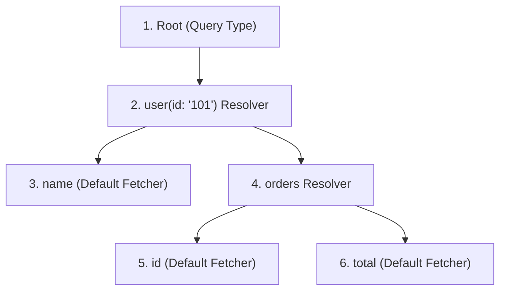

# Module 02: Execution Lifecycle and Resolvers — Deep-Dive Resolver Mapping

Welcome back, students. Today we analyze the engine room of GraphQL: the **Query Execution Pipeline** and the mapping of **Field-Level Resolvers**.

In REST, a route directly executes a controller method that returns a database entity. In GraphQL, queries represent dynamic nested paths. The engine must compile this query, validate its structure, and execute a tree traversal where each node invokes a distinct resolver. We will study the three phases of the execution lifecycle, explore selection sets, and implement field-level resolvers in Spring GraphQL using `@SchemaMapping`.

---

## 1. Academic Lecture: The Execution Pipeline

When a client sends a GraphQL query payload, the server does not execute it immediately. It processes the query through a three-phase pipeline:

```
[ Query Payload ] ---> 1. Parsing (Lexes into AST) ---> 2. Validation (AST vs Schema)
                                                                 |
[ Client Response ] <--- 4. Serialization <--- 3. Execution (Resolver Tree Traversal)
```

1.  **Parsing**: The engine converts the query string into an **Abstract Syntax Tree (AST)**. This is a structured object model representing the query nodes (fields, directives, arguments).
2.  **Validation**: The engine validates the AST against the schema definitions. It checks that all fields are valid, argument types match, and rules (like non-null parameters) are satisfied. If validation fails, the request is aborted and returns validation errors immediately.
3.  **Execution**: The engine executes the query by traversing the AST nodes. It starts at the root operation type (Query, Mutation, or Subscription). For each field, the engine invokes its registered `DataFetcher` (commonly called a **Resolver**).
4.  **Serialization**: The resolved values are formatted into a JSON structure matching the shape of the client's query.

### The Resolver Tree Traversal Mechanics

Consider this query:
```graphql
query {
  user(id: "101") {
    name
    orders {
      id
      total
    }
  }
}
```

To resolve this, the engine traverses the nodes depth-first:



1.  The engine calls the resolver for `Query.user`. This resolver queries the database and returns a `User` Java object.
2.  The engine inspects the child selection set (`name`, `orders`).
3.  For `name`, the engine uses a default `PropertyDataFetcher` which extracts the `name` field from the `User` object using reflection.
4.  For `orders`, the engine detects a custom resolver mapping. It invokes the resolver for `User.orders`, passing the `User` object as the **source** context. This resolver queries the orders database and returns a list of `Order` objects.
5.  For each `Order` object, the default fetcher resolves `id` and `total`.

---

## 2. Theory vs. Production Trade-offs

### 1. Default Fetchers vs. Explicit Schema Mappings
By default, the `graphql-java` engine uses `PropertyDataFetcher` to resolve fields on returned objects.
*   **Pros**: No code to write. If your database record or POJO matches the schema names, it maps automatically.
*   **Cons**: Default fetchers rely heavily on Java **reflection** to call getters or read fields. In high-scale servers processing millions of fields per second, reflection creates CPU overhead.
*   **Production Solution**: For hot paths, register explicit Lambda-based `DataFetcher` mappings to bypass reflection.

### 2. JPA Lazy Initialization and the Session Boundary
In a Spring Data JPA architecture, a `User` entity might have a lazy-loaded relationship `@OneToMany List<Order> orders`.
*   **Production Problem**: When the `Query.user` controller method returns the `User` entity, the JPA Transaction boundary closes. When the execution engine posteriormente traverses down the tree and calls the default fetcher on `User.orders`, Hibernate attempts to load the list. Since the transaction session is closed, it throws a `LazyInitializationException`.
*   **Production Solution**: Never expose lazy JPA entities directly to the GraphQL engine. Either use explicit `@SchemaMapping` methods that query the database via a repository, or project database models into immutable Java `record` DTOs.

---

## 3. How to Use: Schema Mapping in Spring GraphQL

Let's implement a complete, compile-grade example demonstrating:
1.  A parent query resolver mapping (`@QueryMapping`).
2.  An explicit child field resolver mapping (`@SchemaMapping`) that fetches data only if requested.

First, let's write our SDL schema file:

```graphql
type Query {
  customer(id: ID!): Customer
}

type Customer {
  id: ID!
  name: String!
  orders: [CustomerOrder!]!
}

type CustomerOrder {
  id: ID!
  totalAmount: Float!
}
```

Now let's write our DTO record structures:

```java
package com.capstone.graphql.resolvers;

/**
 * Core Customer record. Notice it does NOT contain the 'orders' list field.
 * This ensures the orders are only fetched if requested in the query.
 */
public record Customer(
    String id,
    String name
) {}
```

```java
package com.capstone.graphql.resolvers;

public record CustomerOrder(
    String id,
    String customerId,
    double totalAmount
) {}
```

Now let us write the Spring controller coordinating the resolution:

```java
package com.capstone.graphql.resolvers;

import org.springframework.graphql.data.method.annotation.Argument;
import org.springframework.graphql.data.method.annotation.QueryMapping;
import org.springframework.graphql.data.method.annotation.SchemaMapping;
import org.springframework.stereotype.Controller;

import java.util.*;
import java.util.concurrent.ConcurrentHashMap;
import java.util.logging.Logger;

@Controller
public class CustomerResolverController {
    private static final Logger LOGGER = Logger.getLogger(CustomerResolverController.class.getName());

    private final Map<String, Customer> customerDb = new ConcurrentHashMap<>();
    private final List<CustomerOrder> orderDb = new ArrayList<>();

    public CustomerResolverController() {
        customerDb.put("101", new Customer("101", "Alice Vance"));
        customerDb.put("102", new Customer("102", "Bob Vance"));

        orderDb.add(new CustomerOrder("9001", "101", 250.50));
        orderDb.add(new CustomerOrder("9002", "101", 89.90));
        orderDb.add(new CustomerOrder("9003", "102", 1020.00));
    }

    /**
     * Resolves Query.customer.
     */
    @QueryMapping
    public Optional<Customer> customer(@Argument String id) {
        LOGGER.info("Fetching customer with ID: " + id);
        return Optional.ofNullable(customerDb.get(id));
    }

    /**
     * Resolves Customer.orders field.
     * The parameter 'Customer customer' is automatically bound to the parent 
     * node returned by the parent resolver.
     */
    @SchemaMapping(typeName = "Customer", field = "orders")
    public List<CustomerOrder> getOrdersForCustomer(Customer customer) {
        Objects.requireNonNull(customer, "Parent customer source cannot be null");
        LOGGER.info("Fetching orders for customer: " + customer.id());

        // Perform target query filtered by customer ID
        List<CustomerOrder> results = new ArrayList<>();
        for (CustomerOrder order : orderDb) {
            if (order.customerId().equals(customer.id())) {
                results.add(order);
            }
        }
        return results;
    }
}
```

---

## 4. Common Errors & Pitfalls

### Pitfall 1: TypeName Mismatch in `@SchemaMapping`
Omitting the `typeName` property or getting the casing wrong (e.g., `@SchemaMapping(typeName = "customer", field = "orders")` instead of `"Customer"`).
*   **Symptom**: Spring fails to bind the resolver to the schema node during boot startup, resulting in the field returning `null` or triggering default reflection failures.
*   **Mitigation**: If your method signature matches the schema naming (e.g., matching parameter types), you can use shorthand annotations like `@SchemaMapping` on the class or structure.

### Pitfall 2: Infinite Selection Set Traversal
If your schema contains cyclic references (e.g., `User` has `friends: [User]`), a malicious client can construct a deeply nested query:
```graphql
query {
  user(id: "1") {
    friends {
      friends {
        friends {
          name
        }
      }
    }
  }
}
```
*   **Why it fails**: The engine will execute the child resolvers recursively, spawning thousands of database queries and depleting thread resources.
*   **Mitigation**: Always configure a query depth limiter interceptor (studied in Module 7).

---

## 5. Socratic Review Questions

### Question 1
Why does a field resolver annotation like `@SchemaMapping(typeName = "Customer", field = "orders")` receive the parent `Customer` object as its first argument? What is this parameter called in the raw `graphql-java` spec?

#### Answer
In GraphQL's execution model, execution begins at the root query node and flows downward to child fields. When the engine executes a child resolver, it requires context from the parent node to know which subset of records to fetch. 

In this scenario, to retrieve the correct orders, the resolver needs the parent customer's unique identifier. The engine passes the parent node's resolved output object (the `Customer` instance) to the child resolver. 

In the low-level `graphql-java` specification, this source parameter is retrieved via `DataFetchingEnvironment.getSource()`. Spring GraphQL abstracts this parameter mapping by parsing the method signature: if you declare a parameter matching the parent's return type, Spring injects the source context automatically.

### Question 2
What occurs in the validation phase if a client query includes a field that exists in the database table but is not declared in the SDL schema file?

#### Answer
The validation phase checks the query AST exclusively against the compiled SDL schema. It does not inspect database metadata or backend Java classes. 

If a field exists in the database but is absent from the SDL schema, the validation engine will reject the query immediately, throwing a query validation error (e.g., `Field 'X' on type 'Y' is undefined`). The request is aborted before executing any database connections, protecting the application layer from executing arbitrary queries.

---

## 6. Hands-on Challenge: Dynamic Field Resolver Optimization

### The Challenge
In this challenge, you will implement a resolver optimization that checks the query **Selection Set** dynamically using `DataFetchingEnvironment`. 

If the user requests the `CustomerOrder` total, but does not ask for child fields or database-intensive metadata, your database query must skip loading them to optimize network and database load.

Complete the controller resolver mapping logic below:

```java
package com.capstone.graphql.resolvers.challenge;

import com.capstone.graphql.resolvers.CustomerOrder;
import graphql.schema.DataFetchingEnvironment;
import org.springframework.graphql.data.method.annotation.SchemaMapping;
import java.util.List;

public class OptimizedOrderResolver {

    /**
     * Resolves the orders field.
     * Verify the Selection Set to see if "totalAmount" was requested.
     * If yes, fetch values from database. If no, return stub records with 0.0 values.
     */
    @SchemaMapping(typeName = "Customer", field = "orders")
    public List<CustomerOrder> getOrders(Object customer, DataFetchingEnvironment dfe) {
        boolean requestedTotal = dfe.getSelectionSet().contains("totalAmount");
        
        // TODO: Complete this implementation.
        // If requestedTotal is true, return simulated records containing correct totals.
        // If false, return records with total = 0.0.
        return List.of();
    }
}
```

Write your code and verify the selector behavior. Save your solution notes inside `modules/02-execution-lifecycle-resolvers.md`.
