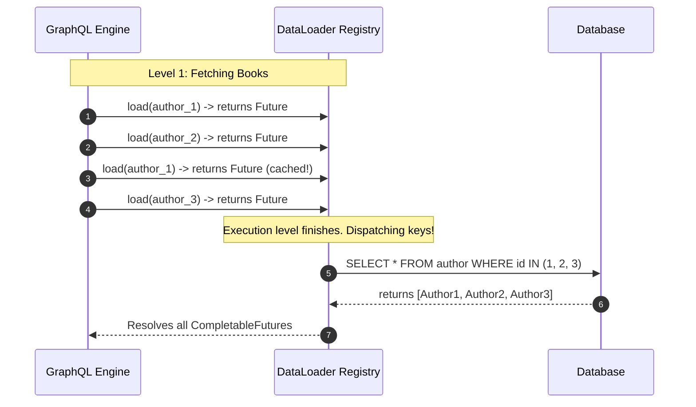

# Module 03: The N+1 Query Problem & DataLoader — Batching and Caching

Welcome back, students. Today we address the most significant performance bottleneck in graph APIs: the **N+1 Query Problem**.

Because GraphQL queries can navigate relationships dynamically, a naive resolver design will execute an excessive number of database queries. If a client requests 100 books and their respective authors, the server will execute 1 query to fetch the books, and then 100 separate queries to fetch the author for each book—resulting in 101 database round-trips. We will study the mechanics of **Batch Loading**, master the **DataLoader** pattern, and implement batch mapping solutions in Spring GraphQL.

---

## 1. Academic Lecture: The N+1 Crisis

In REST, endpoints are static and optimized. If an endpoint requires book and author data, the developer writes a single SQL query containing a join: `SELECT * FROM book b JOIN author a ON b.author_id = a.id`.

In GraphQL, resolvers are decoupled. The book query resolver only knows how to fetch `Book` objects. The author field resolver only knows how to fetch an `Author` given a book's `authorId`. 

### The N+1 Execution Loop

When a query requests nested relations, the execution engine traverses the nodes depth-first, executing child field resolvers sequentially:

```
N+1 Query Execution Path:
1. Client Query -> GET books
2. Server Database -> SELECT * FROM book; (Returns N books)
3. For each book:
   Server Database -> SELECT * FROM author WHERE id = ?; (Executed N times!)
```

This leads to severe network latency and database thread depletion.

### The DataLoader Solution: Deferral and Batching

The **DataLoader** is a design pattern developed by Facebook to solve the N+1 problem. It acts as a queueing mechanism. 

Instead of executing a database query immediately when a child field is resolved, the resolver registers the resource key with the DataLoader and returns a `CompletableFuture`. The DataLoader collects the keys across the execution level. 

Once the engine finishes traversing the current level of the tree, the DataLoader fires a single batch function (e.g., `SELECT * FROM author WHERE id IN (?, ?, ?, ...)`), resolving all pending futures.



#### Key Capabilities of DataLoader:
1.  **Batching**: Grouping multiple individual resource lookups into a single batch database fetch.
2.  **Caching**: Caching resolved values within the scope of a single request. If multiple child nodes reference the same author ID (e.g., Book A and Book B are written by the same author), the DataLoader returns the cached future, reducing query keys.

---

## 2. Theory vs. Production Trade-offs

### Request-Scoped Caching vs. Global Caching
A common mistake is using the DataLoader cache as a global, application-wide cache.
*   **Safety Hazard**: If DataLoader caches are global, Data fetched by User A (which might contain sensitive profile properties) could be returned to User B if they query the same entity ID. This bypasses security permissions.
*   **Production Standard**: DataLoaders must be **request-scoped**. They are instantiated at the start of an HTTP request and destroyed at the end of the request, serving exclusively as a deduplication buffer during that single query execution.

---

## 3. How to Use: Batching in Spring GraphQL

Spring GraphQL simplifies the DataLoader pattern by providing the `@BatchMapping` annotation. It automatically registers the batch loader and wires it to the schema.

Let's write a complete, compile-grade example demonstrating:
1.  Standard child resolvers causing N+1 queries.
2.  Refactoring to `@BatchMapping` to resolve relations in a single database query.

First, let's write our schema:

```graphql
type Query {
  books: [Book!]!
}

type Book {
  id: ID!
  title: String!
  author: Author!
}

type Author {
  id: ID!
  name: String!
}
```

Now let's write our DTO record types:

```java
package com.capstone.graphql.batching;

public record Book(
    String id,
    String title,
    String authorId
) {}
```

```java
package com.capstone.graphql.batching;

public record Author(
    String id,
    String name
) {}
```

Now let us implement the Controller demonstrating Spring's `@BatchMapping` solution:

```java
package com.capstone.graphql.batching;

import org.springframework.graphql.data.method.annotation.BatchMapping;
import org.springframework.graphql.data.method.annotation.QueryMapping;
import org.springframework.stereotype.Controller;

import java.util.*;
import java.util.concurrent.ConcurrentHashMap;
import java.util.logging.Logger;

@Controller
public class BookBatchController {
    private static final Logger LOGGER = Logger.getLogger(BookBatchController.class.getName());

    private final List<Book> bookDb = new ArrayList<>();
    private final Map<String, Author> authorDb = new ConcurrentHashMap<>();

    public BookBatchController() {
        bookDb.add(new Book("1", "Clean Architecture", "auth-1"));
        bookDb.add(new Book("2", "Test Driven Development", "auth-2"));
        bookDb.add(new Book("3", "Refactoring", "auth-1")); // Shares author-1

        authorDb.put("auth-1", new Author("auth-1", "Martin Fowler"));
        authorDb.put("auth-2", new Author("auth-2", "Kent Beck"));
    }

    @QueryMapping
    public List<Book> books() {
        LOGGER.info("Fetching all books...");
        return bookDb;
    }

    /**
     * Resolves the Author for a list of Books in a single batch call.
     * The method name must match the schema field ('author') on the Book type,
     * or be specified via the 'field' property of @BatchMapping.
     * 
     * @param books the list of source Book objects resolved at the parent level
     * @return a Map associating each Book to its respective Author.
     *         Crucial: The Map keys must match the inputs exactly.
     */
    @BatchMapping(typeName = "Book")
    public Map<Book, Author> author(List<Book> books) {
        LOGGER.info("Executing BatchMapping for " + books.size() + " books...");
        
        // Step 1: Collect unique author IDs from books
        Set<String> authorIds = new HashSet<>();
        for (Book book : books) {
            authorIds.add(book.authorId());
        }

        // Step 2: Simulate batch database fetch (SELECT * FROM author WHERE id IN (...))
        Map<String, Author> loadedAuthors = new HashMap<>();
        for (String id : authorIds) {
            Author author = authorDb.get(id);
            if (author != null) {
                loadedAuthors.put(id, author);
            }
        }

        // Step 3: Map each input Book to its corresponding Author
        Map<Book, Author> resultMap = new HashMap<>();
        for (Book book : books) {
            Author author = loadedAuthors.get(book.authorId());
            if (author != null) {
                resultMap.put(book, author);
            }
        }

        return resultMap;
    }
}
```

---

## 4. Common Errors & Pitfalls

### Pitfall 1: Mapped Keys/Values Ordering Mismatch
When writing a raw `BatchLoader` in Java, the return type is typically `CompletableFuture<List<V>>`. 
*   **Why it fails**: The GraphQL engine mandates that the returned List of resolved values **must have the exact same size and ordering** as the input list of keys. If Key at index 2 is resolved to Value at index 4, the engine will map values incorrectly, corrupting the response.
*   **Mitigation**: Use `BatchLoaderWithContext` returning a Map or ensure your database fetch output is sorted to match the input keys index-by-index.

### Pitfall 2: Disappearing Thread-Local Context
Since DataLoader dispatches executions asynchronously (often running on a custom Executor thread pool), any thread-local states (such as Spring Security's `SecurityContextHolder` or transaction scopes) are lost inside the batch loader.
*   **Symptom**: Security authentication checks fail or transactions throw exceptions inside the `@BatchMapping` method.
*   **Mitigation**: Register a custom Spring `ThreadLocalAccessor` to propagate security and transaction contexts across executor threads.

---

## 5. Socratic Review Questions

### Question 1
Explain the difference in signature and behavior between a `@SchemaMapping` and a `@BatchMapping` when resolving nested child fields.

#### Answer
*   **`@SchemaMapping`**:
    *   *Signature*: Invoked once for *each* parent node. If the query returns $N$ books, the resolver is called $N$ times.
    *   *Parameters*: Receives a single source object (e.g., `Book`).
    *   *Behavior*: Spawns individual database queries per item, causing the N+1 problem.
*   **`@BatchMapping`**:
    *   *Signature*: Invoked exactly *once* for the entire execution level.
    *   *Parameters*: Receives a `List<Source>` containing all parent nodes resolved in the level (e.g., `List<Book>`).
    *   *Behavior*: Collects keys and executes a single batch query, resolving all child relationships in a single round-trip.

### Question 2
Why must the Map returned by a `@BatchMapping` map the input parent objects as keys, rather than raw ID strings?

#### Answer
A query could request elements that contain duplicate reference values. For instance, if two books are written by the same author, the input list to the batch loader contains both `Book` objects. 

If we mapped by raw `authorId` strings, the execution engine would struggle to bind the correct results if custom parent object state is required during field mapping. Mapping by the parent object instance itself (`Book`) provides an unambiguous link, allowing Spring GraphQL to match the resolved entity to the exact query response path.

---

## 6. Hands-on Challenge: Implementing a Resilient Batch Mapper

### The Challenge
In this challenge, you will implement a batch resolver that handles missing keys safely. 

If a database query returns fewer results than requested (e.g., some author records have been deleted), your batch mapper must return `null` for those specific parent objects without failing the entire batch or shifting the response positions.

Complete the batch mapping implementation below:

```java
package com.capstone.graphql.batching.challenge;

import com.capstone.graphql.batching.Author;
import com.capstone.graphql.batching.Book;
import java.util.*;

public class ResilientBatchMapper {

    /**
     * Resolves Authors for the list of Books.
     * If an Author does not exist in the database, maps the Book to a null value.
     * 
     * @param books list of parent Book objects
     * @param databaseRecords map of active authors fetched from the DB (id -> Author)
     * @return Map where every input book is registered, even if its value is null.
     */
    public Map<Book, Author> buildResilientMap(List<Book> books, Map<String, Author> databaseRecords) {
        Map<Book, Author> resultMap = new HashMap<>();

        // TODO: Complete this implementation.
        // 1. Iterate over the input books.
        // 2. Query databaseRecords using book.authorId().
        // 3. Put the result (or null if missing) into resultMap.
        return resultMap;
    }
}
```

Write your code and verify that missing records map correctly to null values. Save your solution notes inside `modules/03-n-plus-one-dataloader.md`.
