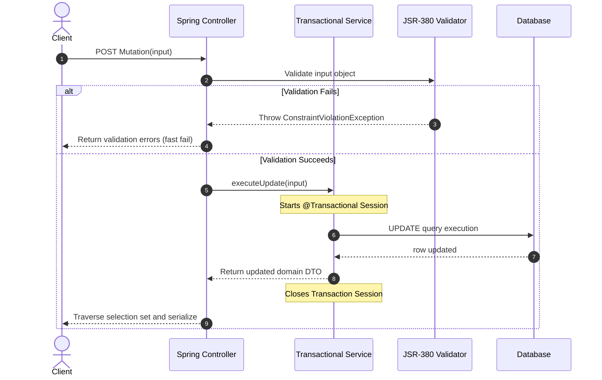

# Module 04: Mutations, Validation, and Transactions — Input Modeling and Reliability

Welcome back, students. Today we analyze how to write data safely using **GraphQL Mutations**.

In REST, mutations are executed via POST, PUT, PATCH, or DELETE requests. In GraphQL, write operations are explicitly categorized as **Mutations**. Defining mutations introduces challenges: designing input payloads that protect internal database entities, validating fields before database writes, and coordinating database transaction boundaries inside a multi-resolver execution tree. We will study validation mechanics, examine transaction isolation during writes, and build a custom exception mapping engine in Spring GraphQL.

---

## 1. Academic Lecture: Safe Write Pipelines

A mutation is a write operation followed by a query. The client sends update inputs, the server executes the write, and then traverses the returned object's selection set, returning exactly the fields requested by the client.

### Designing Input Payloads

A common anti-pattern is using the same object types for queries and mutations:
```graphql
# ANTI-PATTERN: Reusing Query Type for Input
type Mutation {
  updateUser(input: User!): User!
}
```
If you reuse the `User` object, you force the client to provide fields it shouldn't edit (like `createdAt` or `hashedPassword`). 

Instead, define distinct **Input Types** containing only modifiable fields:
```graphql
input UpdateUserInput {
  id: ID!
  email: String
  phoneNumber: String
}
```

### The Mutation execution Flow



### Transaction Boundaries in GraphQL

A GraphQL query execution runs multiple field-level resolvers. 

Wrapping the entire HTTP request in a single transaction (e.g., using Spring's Open Session in View or a global transaction filter) is a critical anti-pattern. If query compilation, validation, or slow child resolvers block execution, database connection sockets will remain open, starving the database pool.

Therefore, **transactions must be restricted to individual service boundary methods** invoked inside the resolver.

---

## 2. Theory vs. Production Trade-offs

### High-Throughput Write Queueing
If your mutation writes to a high-volume database (such as a telemetry logger or social feed):
*   *Synchronous Mutation*: Write directly to the database inside the resolver and return the entity. High consistency, but high latency.
*   *Asynchronous Mutation*: Publish the write payload to a message queue (e.g., Kafka) and return a status payload (`status: PENDING`, `jobId: "XYZ"`). The client polls or uses subscriptions to monitor progress. Low latency, high availability.

---

## 3. How to Use: Mutations and Exception Resolvers in Spring

Let's implement a complete, compile-grade example demonstrating:
1.  A mutation controller annotated with `@MutationMapping` using JSR-380 validation.
2.  A transactional service layer.
3.  A custom `DataFetcherExceptionResolverAdapter` that catches validation exceptions and maps them to clean user-visible GraphQL errors.

First, let's write our schema:

```graphql
type Query {
  user(id: ID!): User
}

type Mutation {
  registerUser(input: RegisterUserInput!): User!
}

type User {
  id: ID!
  username: String!
  email: String!
}

input RegisterUserInput {
  username: String!
  email: String!
}
```

Now let's write our Java domain models with JSR-380 annotations:

```java
package com.capstone.graphql.mutations;

import jakarta.validation.constraints.Email;
import jakarta.validation.constraints.NotBlank;
import jakarta.validation.constraints.Size;

public record RegisterUserInput(
    @NotBlank(message = "Username cannot be blank")
    @Size(min = 3, max = 20, message = "Username must be between 3 and 20 characters")
    String username,

    @NotBlank(message = "Email cannot be blank")
    @Email(message = "Invalid email format")
    String email
) {}
```

```java
package com.capstone.graphql.mutations;

public record User(
    String id,
    String username,
    String email
) {}
```

Now let us write the custom Exception Resolver to format input validation failures cleanly:

```java
package com.capstone.graphql.mutations;

import graphql.GraphQLError;
import graphql.GraphqlErrorBuilder;
import graphql.schema.DataFetchingEnvironment;
import jakarta.validation.ConstraintViolationException;
import org.springframework.graphql.execution.DataFetcherExceptionResolverAdapter;
import org.springframework.graphql.execution.ErrorType;
import org.springframework.stereotype.Component;

/**
 * Intercepts uncaught exceptions in resolvers and maps them to GraphQL errors.
 */
@Component
public class CustomGraphQlExceptionResolver extends DataFetcherExceptionResolverAdapter {

    @Override
    protected GraphQLError resolveToSingleError(Throwable ex, DataFetchingEnvironment env) {
        if (ex instanceof ConstraintViolationException constraintEx) {
            return GraphqlErrorBuilder.newError(env)
                    .errorType(ErrorType.BAD_REQUEST)
                    .message("Input validation failed: " + constraintEx.getMessage())
                    .build();
        }
        
        if (ex instanceof IllegalArgumentException illegalEx) {
            return GraphqlErrorBuilder.newError(env)
                    .errorType(ErrorType.BAD_REQUEST)
                    .message(illegalEx.getMessage())
                    .build();
        }

        // Return null to let other resolvers or default handlers process the exception
        return null;
    }
}
```

Now let us write the Spring Controller and Transactional Service:

```java
package com.capstone.graphql.mutations;

import jakarta.validation.Valid;
import org.springframework.graphql.data.method.annotation.Argument;
import org.springframework.graphql.data.method.annotation.MutationMapping;
import org.springframework.stereotype.Controller;
import org.springframework.validation.annotation.Validated;

import java.util.UUID;
import java.util.logging.Logger;

@Controller
@Validated
public class UserMutationController {
    private static final Logger LOGGER = Logger.getLogger(UserMutationController.class.getName());

    private final UserService userService;

    public UserMutationController(UserService userService) {
        this.userService = userService;
    }

    /**
     * Resolves Mutation.registerUser.
     * The @Valid annotation triggers JSR-380 evaluation on the input record.
     */
    @MutationMapping
    public User registerUser(@Argument @Valid RegisterUserInput input) {
        LOGGER.info("Registering user: " + input.username());
        return userService.createUser(input);
    }
}
```

```java
package com.capstone.graphql.mutations;

import org.springframework.stereotype.Service;
import org.springframework.transaction.annotation.Transactional;

import java.util.Map;
import java.util.UUID;
import java.util.concurrent.ConcurrentHashMap;

@Service
public class UserService {
    private final Map<String, User> userDb = new ConcurrentHashMap<>();

    /**
     * Confines transaction boundary strictly to this database mutation.
     */
    @Transactional
    public User createUser(RegisterUserInput input) {
        // Enforce business unique checks
        boolean emailExists = userDb.values().stream()
                .anyMatch(u -> u.email().equalsIgnoreCase(input.email()));
        if (emailExists) {
            throw new IllegalArgumentException("Email already registered: " + input.email());
        }

        String id = UUID.randomUUID().toString();
        User user = new User(id, input.username(), input.email());
        userDb.put(id, user);
        return user;
    }
}
```

---

## 4. Common Errors & Pitfalls

### Pitfall 1: Swallowing Validation Exceptions
If your Controller is not annotated with `@Validated` at the class level, Spring will skip validation on method parameters entirely, letting invalid data hit the database.
*   **Symptom**: Constraint annotations like `@Email` are ignored, allowing corrupt inputs to bypass verification.
*   **Mitigation**: Always ensure `@Validated` is present on the controller class, and `@Valid` is present on input arguments.

### Pitfall 2: Overlapping Mutative side-effects
If a mutation returns an object that triggers lazy fetching on a different database, you can encounter session closed errors outside the transactional scope.
*   **Mitigation**: Perform all database queries and DTO mappings *inside* the transactional service method. The controller should only return immutable objects to the resolver engine.

---

## 5. Socratic Review Questions

### Question 1
Why is wrapping the entire GraphQL servlet lifecycle (from POST intake to JSON serialization) inside a database transaction an anti-pattern?

#### Answer
A GraphQL query parsing, validation, and JSON serialization are CPU-bound actions that execute outside the database. If we wrap the entire servlet thread in a transaction, the database connection is acquired immediately and remains open while the engine compiles the query, validates field names, and formats the output JSON. 

If client traffic increases or the client requests fields that fetch slowly over the network, database connections are held open doing no active database work. This leads to database pool exhaustion and application latency spikes. Transactions must be confined strictly to the service methods that perform database operations.

### Question 2
Explain how the `DataFetcherExceptionResolverAdapter` class improves security for production GraphQL servers.

#### Answer
In Java, if an exception (like `SQLGrammarException` containing table names and column names) propagates uncaught out of a resolver, the default servlet container dumps the stack trace into the response body. 

Exposing stack traces violates security best practices, as it reveals internal database schemas and libraries to potential attackers. 

By implementing `DataFetcherExceptionResolverAdapter`, we intercept uncaught exceptions and map them. We can log the raw stack trace on the server for developers to analyze, while returning a sanitized, user-friendly error message (`ErrorType.INTERNAL_ERROR` or `BAD_REQUEST`) to the client, concealing internal infrastructure details.

---

## 6. Hands-on Challenge: Building a Secure Mutation Resolver

### The Challenge
In this challenge, you will implement the validation logic for a user update mutation. 

Given an `UpdateUserInput` payload, you must validate that if a password is provided, it is at least 8 characters long and contains at least one digit. If validation fails, you must throw an `IllegalArgumentException` which will be processed by the custom resolver.

Complete the validation checking logic inside the method below:

```java
package com.capstone.graphql.mutations.challenge;

public class MutationValidator {

    /**
     * Validates input rules for password updates.
     * Throws IllegalArgumentException with specific messages if validation fails.
     */
    public void validatePasswordUpdate(String username, String password) {
        // TODO: Complete this implementation.
        // 1. Verify username is not null and has size >= 3.
        // 2. Verify password is not null, size >= 8, and contains at least one digit.
        // 3. Throw IllegalArgumentException if validation checks fail.
    }
}
```

Write your code and verify the validation matches. Save your solution notes inside `modules/04-mutations-validation-transactions.md`.
