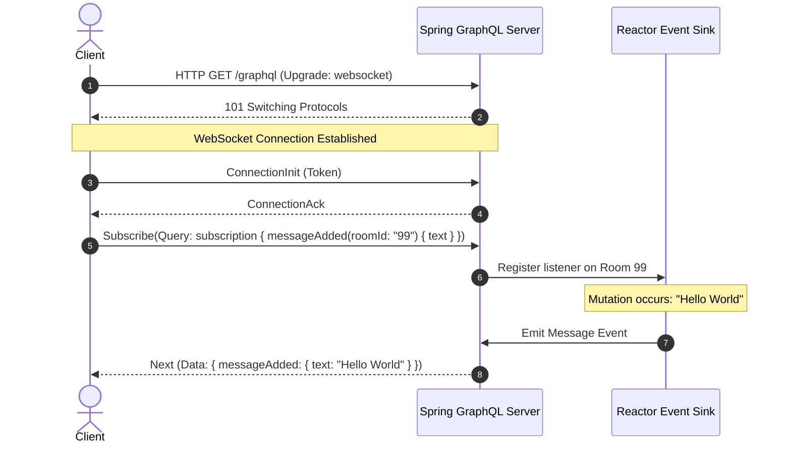

# Module 05: Real-time Subscriptions — WebSockets and Reactive Streams

Welcome back, students. Today we analyze how to build real-time, event-driven interfaces using **GraphQL Subscriptions**.

Queries and mutations follow a standard request-response model. However, some system states (such as live chats, stock tickers, or system alerts) require the server to push updates to clients as they occur. GraphQL Subscriptions define this stream protocol. We will study the underlying transport layers (**WebSockets** vs. **Server-Sent Events**), explore **Reactive Stream** design using Project Reactor, and implement subscription streams in Spring GraphQL.

---

## 1. Academic Lecture: Event-Driven Graphs

A GraphQL subscription is a long-lived connection. When a client executes a subscription query, the server validates it and opens a persistent push channel. Whenever a matching event is published on the server, the execution engine runs the selection set against the event data and pushes the serialized JSON frame down the connection socket.

### WebSocket (graphql-transport-ws) vs. Server-Sent Events (SSE)

We use two primary protocols to transport subscription streams:

#### 1. WebSocket Protocol
*   **How it works**: Upgrades a standard HTTP connection to a full-duplex TCP socket. Both client and server can send frames bi-directionally.
*   **Usage**: The industry standard for subscriptions, formalized by the `graphql-transport-ws` sub-protocol.
*   **Pros**: Full-duplex communication; supports connection initialization payloads (such as sending authentication tokens once during handshake).
*   **Cons**: Hard to load-balance; not compatible with standard HTTP/2 routing out-of-the-box.

#### 2. Server-Sent Events (SSE)
*   **How it works**: Uses a persistent, unidirectional HTTP connection (`text/event-stream`). The server pushes updates; the client cannot send frames back over the same socket.
*   **Pros**: Runs over standard HTTP/1.1 or HTTP/2; bypasses firewall WebSocket restrictions; simpler proxy routing.
*   **Cons**: Unidirectional; client cannot send updates; query parameters must be sent as HTTP header/query arguments during initialization.



---

## 2. Theory vs. Production Trade-offs

### Load Balancing and Connection State
Because WebSockets are stateful, load balancers must maintain persistent sticky connections.
*   **Production Problem**: If a server instance crashes, thousands of clients reconnect simultaneously. This creates a stampede of authentication queries.
*   **Mitigation**: Scale WebSocket servers independently from REST endpoints, and implement **Reconnection Jitter** (randomized wait times) on the client to spread out the connection load.

### Scaling beyond a Single Node (Pub/Sub Backplane)
If Client A connects to Server Instance 1, and Client B connects to Server Instance 2, and Client B sends a message:
*   *Without backplane*: Only Server 2 knows of the message. Client A receives nothing.
*   *With backplane*: Server 2 publishes the message to a central **Redis Pub/Sub** or **Kafka Topic**. Server 1 listens to the backplane, intercepts the event, and pushes it to Client A.

---

## 3. How to Use: Subscriptions in Spring GraphQL

Let's implement a complete, compile-grade example demonstrating:
1.  A subscription controller returning a Project Reactor `Flux<T>` stream.
2.  Publishing events to a reactive `Sink` when mutations occur.
3.  WebSocket endpoint configurations.

First, let's write our schema definition:

```graphql
type Query {
  messages(roomId: ID!): [Message!]!
}

type Mutation {
  sendMessage(roomId: ID!, text: String!): Message!
}

type Subscription {
  messageAdded(roomId: ID!): Message!
}

type Message {
  id: ID!
  roomId: ID!
  text: String!
}
```

Now let's write our message record class:

```java
package com.capstone.graphql.subscriptions;

public record Message(
    String id,
    String roomId,
    String text
) {}
```

Now let us write the Spring controller coordinating mutations and subscriptions:

```java
package com.capstone.graphql.subscriptions;

import org.springframework.graphql.data.method.annotation.Argument;
import org.springframework.graphql.data.method.annotation.MutationMapping;
import org.springframework.graphql.data.method.annotation.SubscriptionMapping;
import org.springframework.stereotype.Controller;
import reactor.core.publisher.Flux;
import reactor.core.publisher.Sinks;

import java.util.*;
import java.util.concurrent.ConcurrentHashMap;
import java.util.logging.Logger;

@Controller
public class ChatSubscriptionController {
    private static final Logger LOGGER = Logger.getLogger(ChatSubscriptionController.class.getName());

    // Reactor Sink acting as an in-memory event broker
    private final Sinks.Many<Message> chatSink = Sinks.many().multicast().onBackpressureBuffer();

    private final Map<String, List<Message>> messageDb = new ConcurrentHashMap<>();

    /**
     * Mutation that saves a message and publishes it to the reactive sink.
     */
    @MutationMapping
    public Message sendMessage(@Argument String roomId, @Argument String text) {
        Objects.requireNonNull(roomId, "Room ID cannot be null");
        Objects.requireNonNull(text, "Text cannot be null");

        String id = UUID.randomUUID().toString();
        Message message = new Message(id, roomId, text);
        
        // Persist locally
        messageDb.computeIfAbsent(roomId, k -> Collections.synchronizedList(new ArrayList<>())).add(message);
        
        // Emit the event to the reactive stream sink
        Sinks.EmitResult result = chatSink.tryEmitNext(message);
        if (result.isFailure()) {
            LOGGER.severe("Failed to emit message event: " + result.name());
        }

        return message;
    }

    /**
     * Subscription that returns a continuous stream of Messages matching the roomId.
     * Spring automatically converts this Project Reactor Flux into WebSocket data frames.
     */
    @SubscriptionMapping
    public Flux<Message> messageAdded(@Argument String roomId) {
        Objects.requireNonNull(roomId, "Room ID cannot be null");
        LOGGER.info("Client subscribed to messageAdded stream for room: " + roomId);

        return chatSink.asFlux()
                .filter(message -> message.roomId().equals(roomId))
                .doOnCancel(() -> LOGGER.info("Client disconnected from room subscription: " + roomId));
    }
}
```

Now, let's write the Java configuration class required to enable WebSocket routing in your Spring Boot application:

```java
package com.capstone.graphql.subscriptions;

import org.springframework.context.annotation.Configuration;
import org.springframework.web.servlet.config.annotation.CorsRegistry;
import org.springframework.web.servlet.config.annotation.WebMvcConfigurer;

@Configuration
public class GraphQlWebConfig implements WebMvcConfigurer {
    // Spring Boot automatically handles WebSocket handlers 
    // when 'spring.graphql.websocket.path' is configured in application.properties
}
```

---

## 4. Common Errors & Pitfalls

### Pitfall 1: Executing Blocking Database Calls inside Reactor Streams
If you fetch database relations inside a `Flux.map` using standard blocking JDBC drivers:
```java
// ANTI-PATTERN: Blocking Inside Reactor Event Loop
return chatSink.asFlux()
    .map(message -> {
        User user = userRepository.findById(message.userId()); // BLOCKS THREAD!
        return new MessageDto(message, user);
    });
```
*   **Why it fails**: Reactor streams execute on a limited number of non-blocking event loop threads. Blocking a single thread stalls all active streams, causing connection drops across the server.
*   **Mitigation**: Offload blocking lookups to an isolated execution thread pool using `.publishOn(Schedulers.boundedElastic())`.

### Pitfall 2: Missing Heartbeat Pings
If a client goes idle and no messages are sent for minutes, cloud gateways (such as AWS ALB or Cloudflare proxies) will terminate the TCP socket due to inactivity timeouts.
*   **Symptom**: Unexplained stream disconnects after 60 seconds of silence.
*   **Mitigation**: Enforce ping/pong frames at the application configuration layer:
    ```properties
    spring.graphql.websocket.connection-idle-timeout=60s
    ```

---

## 5. Socratic Review Questions

### Question 1
Why does a subscription method inside a Spring controller return a `Flux<T>` rather than a standard Java `Stream<T>` or `List<T>`?

#### Answer
*   **`List<T>`**: Represents a static collection of data already resolved in memory, which is incompatible with real-time push streams.
*   **`Stream<T>`**: While a Java `Stream` represents a sequence of elements, it is designed for synchronous, pull-based iteration on a single thread. It blocks the execution thread if data is not immediately available.
*   **`Flux<T>`**: A Project Reactor `Flux` is an asynchronous, push-based reactive stream publisher. It complies with the Reactive Streams specification, allowing the application to propagate events asynchronously without blocking threads. The Spring execution framework registers a subscriber on the `Flux`. When the `Flux` emits an event, the framework packages it as a GraphQL WebSocket message, providing backpressure support to prevent memory overflows.

### Question 2
Explain how a redis Pub/Sub backplane allows you to scale GraphQL subscriptions across multiple container instances.

#### Answer
In a scaled cluster, clients are distributed across multiple server instances behind a load balancer. If Client A is connected to Instance 1, and Client B is connected to Instance 2, any mutation executed on Instance 2 only updates Instance 2's local memory sink. Instance 1 remains unaware, and Client A receives no events.

A Redis Pub/Sub backplane resolves this:
1.  When a mutation occurs on *any* server instance, the controller publishes the event to Redis under a shared channel (e.g., `redis.publish("chat-events", event)`).
2.  Every running server instance registers a listener on the Redis channel during boot startup.
3.  When Redis broadcasts the event, every instance receives it.
4.  Each instance checks if it has active client subscriptions matching that event. If yes, it pushes the event down the local WebSocket socket, ensuring global consistency across nodes.

---

## 6. Hands-on Challenge: Building a Filtered Event Stream

### The Challenge
In this challenge, you will implement a filtered subscription resolver. 

Given a stream of security events, you must filter the stream so that a client only receives alerts whose severity level is greater than or equal to their subscription request argument.

Complete the filtering logic inside the method below:

```java
package com.capstone.graphql.subscriptions.challenge;

import reactor.core.publisher.Flux;

public class SecurityEventFilter {

    public record SecurityAlert(String id, String message, int severity) {}

    /**
     * Filters the raw alert stream based on the client's minimum severity threshold.
     */
    public Flux<SecurityAlert> filterAlerts(Flux<SecurityAlert> rawStream, int minSeverity) {
        // TODO: Complete this implementation.
        // Filter elements where alert.severity() >= minSeverity.
        return null;
    }
}
```

Write your code and verify that alerts below the threshold are correctly ignored by the stream. Save your solution notes inside `modules/05-realtime-subscriptions.md`.
