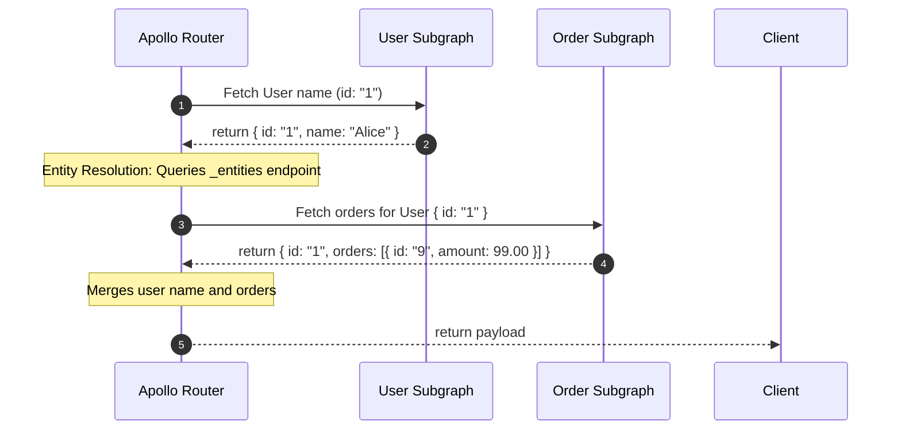

# Module 06: Schema Stitching vs. Apollo Federation — Distributed Graph Architectures

Welcome back, students. Today we explore how to scale GraphQL schema designs across large organizations by building **Distributed Graphs**.

In a microservices architecture, forcing all engineering teams to write code within a single monolithic GraphQL server creates coordination bottlenecks and deployments dependencies. To decouple teams, we must distribute our graph. We will compare **Schema Stitching** and **Apollo Federation**, master federated directives (`@key`, `@extends`, `@external`), analyze **Gateway Query Planning**, and construct a federated subgraph in Spring GraphQL.

---

## 1. Academic Lecture: Distributed Graph Topologies

When partitioning a GraphQL API across multiple microservices, we have two primary architectural choices:

### Schema Stitching (Imperative Orchestration)
In Schema Stitching, a central gateway server queries the schemas of all downstream subservices. The gateway then stitches these schemas together using custom imperative configuration code.
*   **Drawback**: The gateway team must write integration code to merge overlapping types. If a downstream service schema changes, the gateway configuration must be updated and redeployed.

### Apollo Federation (Declarative Composition)
Federation replaces imperative gateway mapping with declarative subgraph metadata. Each microservice publishes its own schema as an independent **Subgraph**. 

The subgraphs use custom directives to declare how types overlap. A lightweight **Gateway Router** (such as the Apollo Router) reads the subgraph schemas, automatically composes them into a single unified supergraph, and routes queries dynamically.

```
                      [ Client Query ]
                             |
                             v
                    [ Apollo Router ] (Gateway)
                     /              \
         (User Subquery)          (Order Subquery)
                   v                  v
         [ User Subgraph ]      [ Order Subgraph ]
         (User Service)         (Order Service)
```

### Federated Directives and Type Extension

To allow a subgraph to extend a type defined in another subgraph, Apollo Federation introduces custom directives:

1.  **`@key(fields: "id")`**: Declares the primary identifier for an entity. This allows other subgraphs to reference or extend this entity.
2.  **`@extends`**: Indicates that an object type is defined in another subgraph and is being extended here.
3.  **`@external`**: Marks a field as belonging to another subgraph, indicating this subgraph does not resolve it.

Consider a system split into a **User Subgraph** and an **Order Subgraph**:

```graphql
# User Subgraph Schema
type User @key(fields: "id") {
  id: ID!
  name: String!
}
```

```graphql
# Order Subgraph Schema
type Order {
  id: ID!
  amount: Float!
  user: User!
}

# Extend the User entity to add orders in this subgraph
type User @key(fields: "id") @extends {
  id: ID! @external
  orders: [Order!]!
}
```

### The Gateway Query Plan

When a client queries the gateway:
```graphql
query {
  user(id: "1") {
    name
    orders {
      id
      amount
    }
  }
}
```

The Gateway Router decomposes this query into a **Query Plan**:



1.  Query the User Subgraph to fetch `name` for user ID `"1"`.
2.  Using the returned user ID, query the Order Subgraph's `_entities` endpoint, passing `representation` hashes (`{ __typename: "User", id: "1" }`) to resolve the nested `orders` field.
3.  Merge the responses and return a single JSON payload to the client.

---

## 2. Theory vs. Production Trade-offs

### Network hop Overhead vs. Monolithic Simplicity
Federation adds a network hop to every query. If a query requests fields across 4 subgraphs, the router must execute multiple sequential or parallel HTTP calls to resolve the query plan.
*   **Production Standard**: Implement distributed tracing (such as OpenTelemetry) across the router and subgraphs to monitor transaction spans, and execute subquery lookups in parallel.

---

## 3. How to Use: Federated Subgraph in Spring GraphQL

Spring GraphQL supports Apollo Federation via configuration libraries. 

To configure a Spring Boot application as a federated subgraph, add the `graphql-java-federation` dependency.

Let's write a complete, compile-grade example demonstrating:
1.  An entity resolver that maps requests directed to the `_entities` endpoint.
2.  Configuring the schema wiring to register the federation resolver.

First, let's write our schema:

```graphql
# Subgraph schema definition
type Query {
  reviewsForProduct(productId: ID!): [Review!]!
}

type Review {
  id: ID!
  productId: ID!
  text: String!
}

# Extending Product entity defined in Catalog Subgraph
type Product @key(fields: "id") @extends {
  id: ID! @external
  reviews: [Review!]!
}
```

Now let's write our Review records:

```java
package com.capstone.graphql.federation;

public record Review(
    String id,
    String productId,
    String text
) {}
```

```java
package com.capstone.graphql.federation;

import java.util.List;

public record Product(
    String id,
    List<Review> reviews
) {}
```

Now let us write the Controller registering the entity resolver mapping:

```java
package com.capstone.graphql.federation;

import org.springframework.graphql.data.method.annotation.QueryMapping;
import org.springframework.graphql.data.method.annotation.SchemaMapping;
import org.springframework.stereotype.Controller;

import java.util.*;
import java.util.logging.Logger;

@Controller
public class ReviewSubgraphController {
    private static final Logger LOGGER = Logger.getLogger(ReviewSubgraphController.class.getName());

    private final List<Review> reviewDb = new ArrayList<>();

    public ReviewSubgraphController() {
        reviewDb.add(new Review("rev-1", "prod-101", "Excellent build quality!"));
        reviewDb.add(new Review("rev-2", "prod-101", "Highly recommended."));
        reviewDb.add(new Review("rev-3", "prod-102", "Decent, but slightly overpriced."));
    }

    @QueryMapping
    public List<Review> reviewsForProduct(String productId) {
        LOGGER.info("Fetching reviews for product ID: " + productId);
        return getReviews(productId);
    }

    /**
     * Resolves the 'reviews' field on the extended Product entity.
     * The gateway queries this field when executing query plans.
     */
    @SchemaMapping(typeName = "Product", field = "reviews")
    public List<Review> reviews(Product product) {
        Objects.requireNonNull(product, "Parent Product reference cannot be null");
        LOGGER.info("Resolving reviews for federated product: " + product.id());
        return getReviews(product.id());
    }

    private List<Review> getReviews(String productId) {
        List<Review> results = new ArrayList<>();
        for (Review r : reviewDb) {
            if (r.productId().equals(productId)) {
                results.add(r);
            }
        }
        return results;
    }
}
```

Next, to bind this controller to the Apollo Federation engine in Spring GraphQL:

```java
package com.capstone.graphql.federation;

import com.apollographql.federation.graphqljava.Federation;
import com.apollographql.federation.graphqljava.tracing.FederatedTracingInstrumentation;
import org.springframework.boot.autoconfigure.graphql.GraphQlSourceBuilderCustomizer;
import org.springframework.context.annotation.Bean;
import org.springframework.context.annotation.Configuration;

import java.util.Map;

@Configuration
public class FederationConfig {

    /**
     * Customizer to compile our schema using Apollo Federation wiring.
     * Registers the '_entities' and '_service' fields automatically.
     */
    @Bean
    public GraphQlSourceBuilderCustomizer federationCustomizer() {
        return builder -> builder.schemaFactory((typeRegistry, wiring) -> 
            Federation.transform(typeRegistry, wiring)
                .resolveEntityType(env -> {
                    // Inspect representation properties to map incoming entity requests
                    Map<String, Object> representation = env.getObject();
                    String typename = (String) representation.get("__typename");
                    
                    if ("Product".equals(typename)) {
                        String id = (String) representation.get("id");
                        return new Product(id, List.of());
                    }
                    return null;
                })
                .build()
        );
    }

    /**
     * Registers tracing metrics support for query planner analytics.
     */
    @Bean
    public FederatedTracingInstrumentation federatedTracing() {
        return new FederatedTracingInstrumentation();
    }
}
```

---

## 4. Common Errors & Pitfalls

### Pitfall 1: Representation Typename mismatch
When the Gateway routes entity requests, it sends a payload containing `{ __typename: "Product", id: "prod-101" }`. 
*   **Symptom**: If your `resolveEntityType` method maps `"product"` instead of `"Product"`, the mapper returns `null`, causing the Gateway query plan to fail with an error `Cannot resolve entity Product`.
*   **Mitigation**: Typenames are case-sensitive and must match the SDL Object Type name exactly.

### Pitfall 2: Key reference omission
Forgetting to declare the `@external` directive on key fields in the extending subgraph schema.
*   **Symptom**: Composition validation errors on the Apollo Router during boot.
*   **Mitigation**: Check schema definitions using CLI tools like `rover subgraph introspect` before registering subgraphs with the router.

---

## 5. Socratic Review Questions

### Question 1
Explain the role of the `_entities` query field in a federated subgraph schema. Who executes this query?

#### Answer
The `_entities` field is a special query endpoint generated automatically by the Apollo Federation transformation libraries. It is not exposed to client users directly. 

Instead, the **Apollo Router (Gateway)** executes queries against the `_entities` field during the query plan execution phase. 

When a query requests fields spanned across subgraphs (e.g., fetching product reviews), the gateway first fetches the primary product info from the Catalog subgraph. It then queries the Review Subgraph's `_entities` endpoint, passing a hash parameter containing the product's type name and key ID. This query resolves the extended entity fields and joins the subgraphs dynamically.

### Question 2
What is the difference between `@provides` and `@requires` directives in Apollo Federation?

#### Answer
*   **`@requires`**: Declares that a subgraph needs specific fields from another subgraph to resolve its own fields. For instance, a Shipping subgraph might require a product's `@external weight` in order to calculate shipping costs.
*   **`@provides`**: Used on a field definition in a subgraph to indicate that this subgraph can resolve specific sub-fields of a returned entity, preventing the router from executing an additional network hop to the source subgraph to fetch them.

---

## 6. Hands-on Challenge: Building a Federated Entity Resolver

### The Challenge
In this challenge, you will implement the representation mapping logic for a federated `User` entity. 

Given an incoming map representation sent by the gateway, you must parse the map to verify the type name is `"User"`, extract the key `"id"`, and return the instantiated `User` object.

Complete the entity resolution parsing logic below:

```java
package com.capstone.graphql.federation.challenge;

import java.util.Map;

public class FederatedUserResolver {

    public record User(String id) {}

    /**
     * Resolves the User entity representation.
     * Returns null if representation is invalid or does not represent a User typename.
     */
    public User resolveUserRepresentation(Map<String, Object> representation) {
        // TODO: Complete this implementation.
        // 1. Verify "__typename" key equals "User".
        // 2. Extract the "id" value as String.
        // 3. Return a new User(id).
        return null;
    }
}
```

Write your code and verify the representation matching. Save your solution notes inside `modules/06-federation-schema-stitching.md`.
