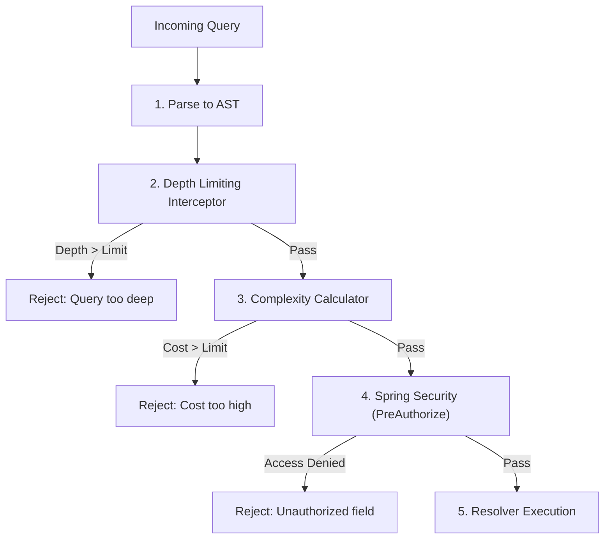

# Module 07: Securing GraphQL APIs — Threat Containment and Access Control

Welcome back, students. Today we analyze how to defend our GraphQL APIs against execution-level attacks and authorization bypasses.

In REST, securing endpoints is straightforward: you protect paths (such as `/admin/*`) using standard HTTP filters. In GraphQL, because all client queries route through a single `/graphql` POST endpoint, path-based filters are insufficient. A user with basic query permissions can construct recursive loops that exhaust CPU resources, calculate expensive fields to launch Denial-of-Service attacks, or traverse relationships to read sensitive fields. We will study **Query Depth Limiting**, **Query Complexity Analysis**, **Field-Level Authorization**, and build a security filter in Spring GraphQL.

---

## 1. Academic Lecture: GraphQL Security Vectors

GraphQL's flexibility is its greatest security vulnerability. Let's analyze the core attack vectors:

### 1. Recursive Depth Attack (DoS)
A client can request nested relations indefinitely:
```graphql
# DOS Vector: Query Depth = 100+
query {
  user(id: "1") {
    friends {
      friends {
        friends {
          friends { ... }
        }
      }
    }
  }
}
```
If the execution engine attempts to traverse this tree, it will spawn thousands of child queries, exhaust memory buffers, and crash the container.

### 2. Query Complexity Attack
Even if the query depth is low, a query can request multiple list fields that trigger heavy database joins:
```graphql
# High Complexity Vector
query {
  largeListA(first: 1000) {
    largeListB(first: 1000) {
      largeListC(first: 1000) {
        title
      }
    }
  }
}
```
This requests $1,000 \times 1,000 \times 1,000 = 1,000,000,000$ (one billion) node evaluations.

### The Defense Chain

To contain these threats, we build a security pipeline:



#### Query Depth Limiting
Before execution, we traverse the query AST to find the maximum depth. If it exceeds a configured threshold (e.g., 5 levels), we reject the query immediately.

#### Query Complexity/Cost Analysis
We assign a numeric "cost" to each field in the schema:
*   Base scalar fields (like `name`): Cost = 1.
*   Relationship fields requiring database fetches: Cost = 5.
*   List fields: Cost = 10.
The engine calculates the cumulative cost of the query AST. If the total cost exceeds a limit (e.g., 100), the query is blocked.

#### Field-Level Authorization
Instead of securing the entry query, we secure individual fields. For example, if a client queries `User.email`, the resolver verifies the active security token has the `ROLE_USER` or `ROLE_ADMIN` authority.

---

## 2. Theory vs. Production Trade-offs

### Introspection Control
By default, GraphQL servers enable **Introspection**, allowing clients to query `__schema` to discover types and fields. This drives development tools like GraphiQL.
*   **Safety Hazard**: In production, leaving introspection enabled allows attackers to map your entire business model, discover hidden APIs, and pinpoint vulnerabilities.
*   **Production Standard**: Disable introspection in production configurations, and rely on schema registries to share API contracts with authorized clients.

---

## 3. How to Use: GraphQl Interceptors and Spring Security

Let's implement a complete, compile-grade example demonstrating:
1.  A custom `WebGraphQlInterceptor` in Spring GraphQL that parses query strings to enforce a Query Depth limit.
2.  Field-level role-based authorization using Spring Security `@PreAuthorize` on resolver mappings.

First, let's write our schema definition:

```graphql
type Query {
  adminReport: AdminStats
  currentUser: UserProfile
}

type AdminStats {
  totalRevenue: Float!
  activeUsers: Int!
}

type UserProfile {
  username: String!
  billingDetails: String # Restricted field
}
```

Now let's write our domain DTO records:

```java
package com.capstone.graphql.security;

public record UserProfile(
    String username,
    String billingDetails
) {}
```

```java
package com.capstone.graphql.security;

public record AdminStats(
    double totalRevenue,
    int activeUsers
) {}
```

Now let's write the Controller enforcing security policies:

```java
package com.capstone.graphql.security;

import org.springframework.graphql.data.method.annotation.QueryMapping;
import org.springframework.graphql.data.method.annotation.SchemaMapping;
import org.springframework.security.access.prepost.PreAuthorize;
import org.springframework.stereotype.Controller;

import java.util.logging.Logger;

@Controller
public class SecureUserController {
    private static final Logger LOGGER = Logger.getLogger(SecureUserController.class.getName());

    @QueryMapping
    public UserProfile currentUser() {
        return new UserProfile("johndoe", "Visa ending in 4242");
    }

    /**
     * Secures a specific query path.
     * Only users with the 'ROLE_ADMIN' authority can invoke this resolver.
     */
    @QueryMapping
    @PreAuthorize("hasRole('ADMIN')")
    public AdminStats adminReport() {
        LOGGER.info("Generating secure admin stats report...");
        return new AdminStats(150230.90, 8900);
    }

    /**
     * Enforces field-level security.
     * Even if a general user can fetch the UserProfile, they cannot query 
     * the 'billingDetails' field unless they have the 'ROLE_BILLING_OWNER' role.
     */
    @SchemaMapping(typeName = "UserProfile", field = "billingDetails")
    @PreAuthorize("hasRole('BILLING_OWNER') or hasRole('ADMIN')")
    public String billingDetails(UserProfile profile) {
        return profile.billingDetails();
    }
}
```

Now let us implement the custom `WebGraphQlInterceptor` that intercepts GraphQL requests prior to execution to enforce a **Query Depth Limit**:

```java
package com.capstone.graphql.security;

import org.springframework.graphql.server.WebGraphQlHandler;
import org.springframework.graphql.server.WebGraphQlInterceptor;
import org.springframework.graphql.server.WebGraphQlRequest;
import org.springframework.graphql.server.WebGraphQlResponse;
import org.springframework.stereotype.Component;
import reactor.core.publisher.Mono;

import java.util.Collections;
import java.util.Map;

/**
 * Interceptor validating query depth constraints prior to query execution.
 */
@Component
public class QueryDepthInterceptor implements WebGraphQlInterceptor {

    private static final int MAX_DEPTH_LIMIT = 4;

    @Override
    public Mono<WebGraphQlResponse> intercept(WebGraphQlRequest request, WebGraphQlHandler next) {
        String document = request.getDocument();
        
        // Compute structural depth of the query document string
        int queryDepth = calculateStringDepth(document);
        
        if (queryDepth > MAX_DEPTH_LIMIT) {
            // Reject request immediately by returning an error payload
            return Mono.error(new IllegalArgumentException("Query depth (" + queryDepth 
                    + ") exceeds maximum permitted limit (" + MAX_DEPTH_LIMIT + ")"));
        }

        return next.handle(request);
    }

    /**
     * Basic brackets count utility to estimate query nesting depth.
     */
    private int calculateStringDepth(String document) {
        if (document == null || document.isEmpty()) {
            return 0;
        }
        int maxDepth = 0;
        int currentDepth = 0;
        for (char ch : document.toCharArray()) {
            if (ch == '{') {
                currentDepth++;
                maxDepth = Math.max(maxDepth, currentDepth);
            } else if (ch == '}') {
                currentDepth = Math.max(0, currentDepth - 1);
            }
        }
        // Deduct 1 because the root query wrapper 'query { ... }' counts as 1 level
        return Math.max(0, maxDepth - 1);
    }
}
```

---

## 4. Common Errors & Pitfalls

### Pitfall 1: Omit security on Nested Schema Paths
Securing the query root `Query.user` but forgetting to secure `User.billingDetails`.
*   **Why it fails**: If another query returns user profiles (e.g., `Query.searchUsers`), an unauthorized client can query `searchUsers { billingDetails }`, bypassing the security check at `Query.user`.
*   **Mitigation**: Always apply `@PreAuthorize` directly to the field resolvers that fetch sensitive data, rather than relying on query entry points.

### Pitfall 2: Confusing HTTP roles with GraphQL contexts
Using standard Spring Security HTTP filters `.requestMatchers("/graphql").hasRole("USER")`.
*   **Why it fails**: This secures the entire endpoint, forcing all queries to share the same permission boundary. It prevents public queries (like fetching product catalogs) from running alongside authenticated queries.
*   **Mitigation**: Enable Method Security using `@EnableMethodSecurity` and use field-level `@PreAuthorize` annotations in controllers.

---

## 5. Socratic Review Questions

### Question 1
Why is path-based authentication (such as URL matching in Spring Security) ineffective for securing individual operations in GraphQL APIs?

#### Answer
Path-based security matches the incoming HTTP request path (such as `/users/delete`) to user roles. 

In GraphQL, all client queries (fetching profiles, updating balances, running admin tasks) are routed to a **single endpoint URL** (such as POST `/graphql`). The specific fields and actions requested are contained entirely in the query payload body, which path-based filters do not inspect. 

Therefore, a path-based filter can only verify if a user has access to the *entire* GraphQL portal, but cannot authorize specific schema branches. Securing specific queries and mutations requires field-level method security or interceptors that parse the query AST during execution.

### Question 2
What occurs if a query cost threshold is set too low for a GraphQL server? What is the impact on client application development?

#### Answer
If a query cost threshold is configured too low, the server will block valid client requests that require complex nested views (such as dashboard widgets loading metrics, nested comments, and user profiles). 

Frontend engineers will be forced to split their queries into multiple smaller requests. This re-introduces the under-fetching and network round-trip overhead of REST, nullifying the benefits of GraphQL. 

Cost analysis limits must be calculated by profiling the database cost of fields, assigning realistic values, and setting thresholds that accommodate rich page structures while blocking malicious, unbounded recursion.

---

## 6. Hands-on Challenge: Building a Query Cost Interceptor

### The Challenge
In this challenge, you will implement a simplified Query Cost Interceptor helper class. 

Each field inside the query string has a default cost of 1. If the query requests a field containing `"reports"`, the cost of that field is 10. Your validator must parse the query string, compute the total estimated cost, and throw an `IllegalArgumentException` if the total cost exceeds 15.

Complete the cost estimation logic inside the validator class below:

```java
package com.capstone.graphql.security.challenge;

public class QueryCostInterceptor {

    private static final int MAX_COST_LIMIT = 15;

    /**
     * Calculates the estimated cost of a query based on curly braces and keyword counts.
     * Throws IllegalArgumentException if the cost exceeds MAX_COST_LIMIT.
     */
    public void validateQueryCost(String query) {
        if (query == null) return;
        
        int totalCost = 0;
        
        // TODO: Complete this implementation.
        // 1. Count each opening curly brace '{' as a base cost of 1.
        // 2. Count each occurrence of the substring "reports" as an additional cost of 10.
        // 3. If totalCost exceeds MAX_COST_LIMIT, throw new IllegalArgumentException("Query too expensive").
    }
}
```

Write your code and verify the cost boundary evaluations. Save your solution notes inside `modules/07-securing-graphql-apis.md`.
