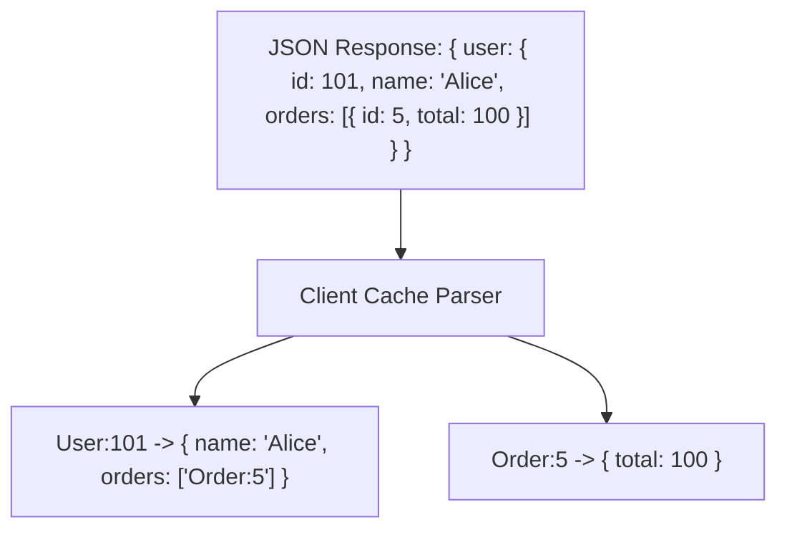

# Module 09: Client Development & Operations — Connections Pagination and GraphQL Clients

Welcome back, students. Today we analyze how to consume GraphQL APIs programmatically and optimize data transfers using **Client-Side Operations**.

Building client integrations requires understanding the client-side execution environment. We will study **Cursor-Based Pagination** via the Relay Connection Specification, explore **Client Cache Normalization** mechanics, analyze why query **Variables** are mandatory for production scale, and write a programmatic Java client using Spring's `HttpGraphQlClient`.

---

## 1. Academic Lecture: Efficient Client Pipelines

### Query Parameters and the Value of Variables

A common mistake in client development is interpolating parameters directly into the query string:
```java
// CRITICAL SECURITY & PERFORMANCE ANOMALY
String query = "query { user(id: \"" + userId + "\") { name } }";
```
This query pattern has two severe bugs:
1.  **Vulnerable to Injection**: If `userId` contains user-controlled strings with quotes, it can break the query AST or hijack fields.
2.  **Defeats AST Caching**: The server compiles and validates query documents. If the query string changes for every user ID, the server must repeatedly parse the AST, degrading performance.

The production standard is separating the static query structure from the parameters using **Variables**:
```graphql
query GetUser($id: ID!) {
  user(id: $id) {
    name
  }
}
```
The client sends the static query string alongside a separate JSON variables map: `{ "id": "101" }`. The server compiles the query once and caches the AST, fetching variable values dynamically during execution.

### Relay Connection Specification (Cursor Pagination)

For large datasets, offset-based pagination (e.g., `LIMIT 10 OFFSET 50`) is inefficient because SQL databases must scan all preceding rows to compute the offset. 

GraphQL standardizes pagination using the **Relay Connection Spec** (Cursor-Based Pagination). Instead of offsets, queries use a string **Cursor** pointing to a specific record:

```graphql
type Query {
  users(first: Int, after: String): UserConnection!
}

type UserConnection {
  edges: [UserEdge!]!
  pageInfo: PageInfo!
}

type UserEdge {
  cursor: String!
  node: User!
}

type PageInfo {
  hasNextPage: Boolean!
  endCursor: String
}
```

```
Database Cursor Traversal:
[ User 1 (Cursor: A) ] ---> [ User 2 (Cursor: B) ] ---> [ User 3 (Cursor: C) ]
                                                        ^
                                          Client asks for: (first: 10, after: "B")
                                          SQL: SELECT * FROM user WHERE id > "B" LIMIT 10;
```

---

## 2. Theory vs. Production Trade-offs: Cache Normalization

Modern GraphQL clients (like Apollo Client) do not store query responses as raw JSON trees. They decompose the responses into a **Normalized Cache**.



When a query response arrives, the cache extractor splits it by `__typename` and `id` keys. If User 101's name is updated in a mutation, the cache updates the record `User:101` in the flat cache registry. Every component displaying User 101 automatically updates, ensuring UI consistency without refetching pages.

*   *Trade-off*: Normalization requires clients to query the `id` and `__typename` for every object. Omitting the ID breaks normalization, leading to stale views.

---

## 3. How to Use: HttpGraphQlClient in Java 21

Let's write a complete, compile-grade example demonstrating how to execute queries programmatically in Java using Spring's `HttpGraphQlClient`.

First, let's write our local DTO records matching the client return expectations:

```java
package com.capstone.graphql.client;

public record UserProfile(
    String id,
    String username,
    String email
) {}
```

Now let us write the programmatic Client execution engine:

```java
package com.capstone.graphql.client;

import org.springframework.graphql.client.HttpGraphQlClient;
import org.springframework.web.reactive.function.client.WebClient;
import reactor.core.publisher.Mono;

import java.util.Map;
import java.util.Objects;
import java.util.logging.Logger;

/**
 * Programmatic Java Client invoking GraphQL endpoints using HttpGraphQlClient.
 */
public class GraphQlServiceClient {
    private static final Logger LOGGER = Logger.getLogger(GraphQlServiceClient.class.getName());

    private final HttpGraphQlClient graphQlClient;

    public GraphQlServiceClient(String endpointUrl) {
        Objects.requireNonNull(endpointUrl, "Endpoint URL cannot be null");
        
        // Instantiate the underlying Spring WebClient
        WebClient webClient = WebClient.builder()
                .baseUrl(endpointUrl)
                .defaultHeader("Content-Type", "application/json")
                .build();

        this.graphQlClient = HttpGraphQlClient.builder(webClient).build();
    }

    /**
     * Executes the GetUser query using variables and maps the output to a UserProfile DTO.
     */
    public Mono<UserProfile> fetchUserProfile(String userId) {
        Objects.requireNonNull(userId, "UserId cannot be null");
        LOGGER.info("Executing fetchUserProfile request for ID: " + userId);

        // Define the static query document
        String document = """
            query GetUserProfile($id: ID!) {
              user(id: $id) {
                id
                username
                email
              }
            }
            """;

        // Execute query and extract mapping
        return graphQlClient.document(document)
                .variable("id", userId)
                .retrieve("user")
                .toEntity(UserProfile.class)
                .doOnError(e -> LOGGER.severe("GraphQL Client query execution failed: " + e.getMessage()));
    }
}
```

---

## 4. Common Errors & Pitfalls

### Pitfall 1: Query string Interpolation (Injection Risk)
Using string concatenation to pass query parameters.
*   **Why it fails**: Bypasses the query AST parser cache on the server, causing performance degradation, and creates query injection vulnerabilities.
*   **Mitigation**: Always pass query arguments as variables map bindings.

### Pitfall 2: Omit Typename fields in Polymorphic Queries
When querying Union or Interface types, forgetting to request the `__typename` metadata field.
*   **Symptom**: Client-side normalization engines cannot categorize the flat records, resulting in caching failures or lookup mismatches.
*   **Mitigation**: Include `__typename` in selections when querying abstract polymorphic models.

---

## 5. Socratic Review Questions

### Question 1
Explain why Cursor-Based Pagination scales better for infinite scroll feeds containing high write activity than Offset-Based Pagination.

#### Answer
In **Offset-Based Pagination** (`limit 10 offset 50`), if a user is scrolling and a new item is inserted at the top of the feed (index 0), all subsequent items are shifted down by 1 position. When the user requests the next page (`limit 10 offset 60`), the item at the boundary is duplicated on their screen because it shifted into the next offset window. Furthermore, SQL database engines must read and discard all rows up to the offset value, causing high disk IO load at high offset levels.

**Cursor-Based Pagination** resolves this. The client requests items `after` a specific record identifier (the Cursor, representing a unique timestamp or ID). The database executes:
`SELECT * FROM feed WHERE created_at < :cursor ORDER BY created_at DESC LIMIT 10`
Because it utilizes a indexed constraint, the database jumps directly to the cursor index without scanning preceding rows. If new items are inserted at index 0, they have timestamps greater than the cursor and are naturally ignored by the query, preventing item duplication.

### Question 2
What is Cache Normalization, and why does it require every returned object to expose a unique ID?

#### Answer
Cache Normalization is a client-side optimization process. Instead of storing query results as raw, isolated JSON trees (which leads to duplicate data and stale views), the client framework flattens the tree into a key-value store. The key is constructed by combining the object's type name and ID (e.g., `User:101`).

If an object lacks a unique ID, the cache normalization engine cannot generate a stable cache key. It is forced to store the nested object as an embedded literal value under the parent node. If that object is modified in another query, the normalized cache cannot link them, leaving parts of the UI displaying outdated state.

---

## 6. Hands-on Challenge: Programmatic Variable Validator

### The Challenge
In this challenge, you will implement a client-side wrapper class that verifies if variables map parameters are populated correctly before transmitting a query to the server, checking for empty strings or null values.

Complete the checking logic inside the class below:

```java
package com.capstone.graphql.client.challenge;

import java.util.Map;

public class ClientVariableValidator {

    /**
     * Inspects the variables map.
     * Throws IllegalArgumentException if the requiredKey is missing,
     * is null, or is an empty string.
     */
    public void validateRequiredVariable(Map<String, Object> variables, String requiredKey) {
        // TODO: Complete this implementation.
        // 1. Verify variables map contains requiredKey.
        // 2. Verify variables.get(requiredKey) is not null.
        // 3. If value is a String, verify it is not empty/blank.
    }
}
```

Write your code and verify the validation mapping. Save your solution notes inside `modules/09-client-development-operations.md`.
