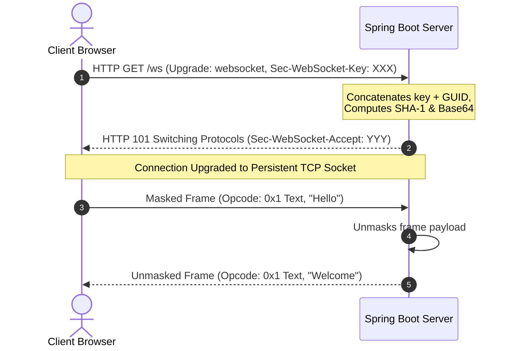

# Module 01: Protocol Foundations — RFC 6455 & HTTP Connection Upgrades

Welcome, class. Today we initiate our study of **WebSocket Mastery (CS-520)**.

To understand WebSockets, we must first analyze the limitations of HTTP. Traditional HTTP is a request-response, half-duplex protocol. Every interaction must be initiated by the client. The server cannot push data to the client asynchronously. While hacks like Long Polling or Server-Sent Events (SSE) exist, they are inefficient, allocate excessive thread resources, and introduce high latency.

The **WebSocket Protocol (RFC 6455)** solves this. It provides a full-duplex, persistent TCP connection over a single socket. Today, we will study the mechanics of the **WebSocket Handshake**, analyze **Frame Masking**, and write a low-level handshake parser in Java.

---

## 1. Academic Lecture: The Handshake and Framing Model

WebSockets operate in two distinct phases: the **HTTP Handshake** and the **TCP Data Framing** phase.

### 1. The HTTP Upgrade Handshake
A WebSocket connection begins as a standard HTTP/1.1 request. The client asks the server to upgrade the connection to a full-duplex tunnel by sending specific headers:

```http
GET /chat HTTP/1.1
Host: server.example.com
Upgrade: websocket
Connection: Upgrade
Sec-WebSocket-Key: dGhlIHNhbXBsZSBub25jZQ==
Sec-WebSocket-Version: 13
```

*   `Upgrade: websocket` and `Connection: Upgrade`: Instruct intermediate routers and the server to switch protocols.
*   `Sec-WebSocket-Key`: A random, Base64-encoded 16-byte value generated by the client.
*   `Sec-WebSocket-Accept`: The server must verify this key by:
    1.  Concatenating the key with the RFC-defined GUID: `258EAFA5-E914-47DA-95CA-C5AB0DC85B11`.
    2.  Computing the SHA-1 hash of the concatenated string.
    3.  Base64-encoding the SHA-1 digest.
    4.  Returning the result in the HTTP `101 Switching Protocols` response:

```http
HTTP/1.1 101 Switching Protocols
Upgrade: websocket
Connection: Upgrade
Sec-WebSocket-Accept: s3pPLMBiTxaQ9kYGzzhZRbK+xOo=
```

### 2. WebSocket Data Framing
Once the handshake completes, the HTTP layer is discarded, and communication shifts to binary TCP framing:

```
                  WebSocket Frame Structure
                  
  0                   1                   2                   3
  0 1 2 3 4 5 6 7 8 9 0 1 2 3 4 5 6 7 8 9 0 1 2 3 4 5 6 7 8 9 0 1
 +-+-+-+-+-------+-+-------------+-------------------------------+
 |F|R|R|R| opcode|M| Payload len |    Extended payload length    |
 |I|S|S|S|  (4)  |A|     (7)     |             (16/64)           |
 |N|V|V|V|       |S|             |   (if payload len==126/127)   |
 | |1|2|3|       |K|             |                               |
 +-+-+-+-+-------+-+-------------+ - - - - - - - - - - - - - - - +
 |     Masking-key (32 bits, if MASK set to 1)                   |
 +-------------------------------+-------------------------------+
 | Payload Data (masked if MASK set to 1)                        |
 +---------------------------------------------------------------+
```

*   **FIN (1 bit)**: Indicates if this frame is the final fragment of a message.
*   **Opcode (4 bits)**: Defines the frame type:
    *   `0x1`: Text message.
    *   `0x2`: Binary data.
    *   `0x8`: Connection Close.
    *   `0x9`: Ping frame.
    *   `0xA`: Pong frame.
*   **Mask (1 bit) and Masking Key (32 bits)**:
    *   **Crucial Security Rule**: The client **MUST** mask all frames sent to the server using a random 4-byte key. The server must reject any unmasked frame. The server must **NEVER** mask frames sent back to the client.
    *   *Why Masking is Required*: Masking prevents intermediate proxies from caching WebSocket frames or executing cache poisoning attacks.



---

## 2. Theory vs. Production Trade-offs

### WebSockets vs. Server-Sent Events (SSE)
*   **Server-Sent Events (SSE)**:
    *   *Pro*: Simple, runs over standard HTTP/2, built-in reconnection handlers, and bypasses proxy blocking.
    *   *Con*: One-way communication only (server to client). The client must make separate HTTP requests to send data back.
*   **WebSockets**:
    *   *Pro*: True full-duplex communication. Low overhead; no HTTP headers are sent after the initial handshake.
    *   *Con*: High resource usage. Every client keeps a TCP connection open, consuming server memory. It also requires configuring load balancers to support HTTP upgrades.

---

## 3. How to Use: Raw WebSocket Handshake Generator

Let us implement a compile-grade Java 21 helper class that calculates the validation string for the `Sec-WebSocket-Accept` header.

### A. The Insecure Concatenation (Anti-Pattern)

Avoid using weak hashing algorithms or manual string operations that ignore charset mappings:

```java
package com.capstone.security.ws.vulnerable;

import java.security.MessageDigest;

public class VulnerableHandshake {
    public static String calculateAccept(String key) throws Exception {
        // DANGER: No charset mapping specified; system default encoding will be used,
        // which can lead to calculation failures on non-UTF-8 servers.
        String guid = "258EAFA5-E914-47DA-95CA-C5AB0DC85B11";
        MessageDigest md = MessageDigest.getInstance("MD5"); // DANGER: MD5 is not SHA-1
        md.update((key + guid).getBytes());
        return new String(md.digest());
    }
}
```

### B. The Hardened Handshake Resolver (Production Pattern)

Here is the hardened Java implementation using the SHA-1 algorithm and standard Base64 encoding.

```java
package com.capstone.security.ws.secure;

import java.nio.charset.StandardCharsets;
import java.security.MessageDigest;
import java.security.NoSuchAlgorithmException;
import java.util.Base64;

/**
 * Hardened resolver to process WebSocket handshakes according to RFC 6455.
 */
public final class WebSocketHandshakeAcceptor {

    private static final String WEBSOCKET_GUID = "258EAFA5-E914-47DA-95CA-C5AB0DC85B11";

    /**
     * Calculates the Sec-WebSocket-Accept header value from a given Sec-WebSocket-Key.
     * 
     * @param clientKey The Base64 encoded key provided by the client.
     * @return The validation response string.
     */
    public static String calculateAcceptKey(String clientKey) {
        if (clientKey == null || clientKey.isBlank()) {
            throw new IllegalArgumentException("Client handshake key cannot be null or blank.");
        }

        try {
            // 1. Concatenate key with RFC GUID
            String concatenatedInput = clientKey.trim() + WEBSOCKET_GUID;

            // 2. Compute the SHA-1 hash using UTF-8 charset explicitly
            MessageDigest digest = MessageDigest.getInstance("SHA-1");
            byte[] sha1Hash = digest.digest(concatenatedInput.getBytes(StandardCharsets.UTF_8));

            // 3. Encode the hash to Base64
            return Base64.getEncoder().encodeToString(sha1Hash);

        } catch (NoSuchAlgorithmException e) {
            throw new IllegalStateException("Failed to calculate accept key: SHA-1 algorithm not available.", e);
        }
    }
}
```

---

## 4. Common Errors & Pitfalls

### Pitfall 1: Bypassing client frame masking validation
If you write a custom low-level TCP socket handler for WebSockets, failing to reject unmasked client frames allows attackers to hijack intermediate proxies.
*   **Why it fails**: Section 5.1 of RFC 6455 states that a server MUST close the connection immediately (with protocol error code `1002`) if it receives an unmasked frame from a client.
*   **Mitigation**: Always verify the Mask bit is set to `1` on incoming client bytes.

---

## 5. Socratic Review Questions

### Question 1
Explain the purpose of the 32-bit random masking key in client-to-server frames. Why are server-to-client response frames not masked?

#### Answer
The masking key is a security control designed to prevent **Cache Poisoning** and **Request Smuggling** in intermediate HTTP proxies. 
If client frames were not masked, a malicious script in the browser could send a payload that looks like a valid HTTP request over the WebSocket tunnel. An intermediate proxy might parse this as a pipelined HTTP request and cache the response, leading to cache contamination. Server-to-client frames are not masked because the browser does not cache outgoing responses.

### Question 2
What is the difference between Control Frames and Data Frames in WebSockets? Give examples of both.

#### Answer
*   **Data Frames**: Contain the application payload. Opcodes are `0x1` (Text) and `0x2` (Binary).
*   **Control Frames**: Manage the state of the connection. Opcodes are `0x8` (Close), `0x9` (Ping), and `0xA` (Pong). Control frames have a maximum payload size of 125 bytes and cannot be fragmented (FIN bit must be 1).

---

## 6. Hands-on Challenge: Verifying the Handshake Key

### The Challenge
In this challenge, you will implement a validation test driver.

Your task is to write a verification method that takes a client's key, computes the expected response Accept key, and asserts it matches the expected test values:
*   Input Key: `x3JJHMbDL1EzLkh9GBhXDw==`
*   Expected Output: `HSmrc0sMlYUkAGmm5OP1w0XK9Uk=`

Complete the validation class below:

```java
package com.capstone.security.ws.challenge;

import java.nio.charset.StandardCharsets;
import java.security.MessageDigest;
import java.util.Base64;

public class HandshakeVerifier {

    private static final String GUID = "258EAFA5-E914-47DA-95CA-C5AB0DC85B11";

    /**
     * Verifies that the computed accept key matches the expected test target.
     * 
     * @param clientKey The raw key submitted by the client
     * @param expectedAccept The target validation string
     * @return true if matches, false otherwise.
     */
    public static boolean verifyKey(String clientKey, String expectedAccept) {
        // TODO: Complete this implementation.
        // 1. Concatenate clientKey + GUID.
        // 2. Compute SHA-1 hash using explicit UTF-8 encoding.
        // 3. Base64 encode the resulting digest bytes.
        // 4. Return whether the result matches expectedAccept.
        return false;
    }
}
```

Write the verification code. Save the completed class and explain why the GUID is a fixed constant inside `modules/01-protocol-foundations.md`.
