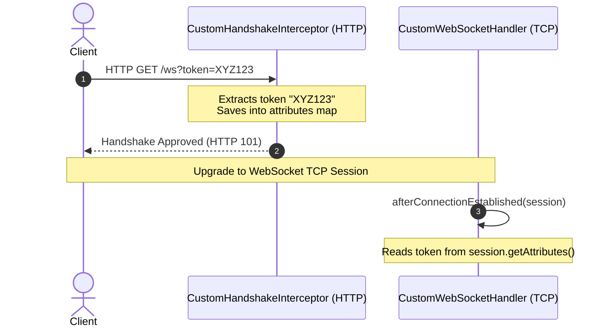

# Module 03: Spring WebSockets — Handlers & Handshake Interceptors

Welcome back, class. Today we analyze **Spring Boot WebSockets (CS-520)**.

While Jakarta JSR 356 endpoints are declarative, they are disconnected from Spring's application context, making dependency injection difficult. Spring Boot solves this by wrapping raw connection sockets in the `WebSocketHandler` interface, enabling handlers to be managed as standard Spring Beans.

Today, we will study Spring's low-level WebSocket abstraction, analyze how to extract and pass session attributes during handshakes using **HandshakeInterceptors**, and write a secure connection handler.

---

## 1. Academic Lecture: Handlers and Interceptor Bridges

In Spring, we separate network connection lifecycles from application logic.

### 1. Spring WebSocketHandler
Instead of annotations, Spring uses the `WebSocketHandler` interface. The most common implementations are `TextWebSocketHandler` (handles text-based UTF-8 frames) and `BinaryWebSocketHandler` (handles raw binary data).
*   `afterConnectionEstablished(WebSocketSession session)`: Invoked when a socket upgrades.
*   `handleTextMessage(WebSocketSession session, TextMessage message)`: Invoked when a new frame is received.
*   `afterConnectionClosed(WebSocketSession session, CloseStatus status)`: Invoked when a socket disconnects.

### 2. The Handshake Interceptor
Before upgrading the connection to a TCP socket, the request starts as a standard HTTP request. If you need to validate headers, authenticate users, or access HTTP Session variables, you cannot do it inside the WebSocket session directly, as HTTP headers do not exist after the handshake.
*   **The Solution**: Spring provides the `HandshakeInterceptor` interface. Its `beforeHandshake` method runs *during* the HTTP phase. We can extract query parameters or headers and copy them into the `attributes` map. Spring automatically copies this map into the `WebSocketSession.getAttributes()` context, making it accessible to the handler.



---

## 2. Theory vs. Production Trade-offs

### Low-Level Handlers vs. Sub-Protocol Routers (STOMP)
*   **Low-Level Handlers (`TextWebSocketHandler`)**:
    *   *Pro*: Full control over raw bytes and frames. Minimal memory overhead. Ideal for simple, single-purpose streams (like stock price feeds).
    *   *Con*: No built-in message routing. If your application needs to handle multiple message types (e.g., chat messages, notifications, status updates), you must write a custom message routing parser.
*   **Production Rule**: For complex real-time applications, prefer a sub-protocol like **STOMP** (studied in Module 4) to handle message routing. Use low-level handlers only when building high-performance, single-purpose pipelines.

---

## 3. How to Use: Spring WebSocket Handlers & Configurations

Let us write a compile-grade configuration that registers a text handler and implements a handshake interceptor.

### A. The Coupled HTTP Session Access (Anti-Pattern)

Avoid attempting to read HTTP details inside the WebSocket handler, as they are not available after the handshake:

```java
package com.capstone.security.ws.vulnerable;

import org.springframework.web.socket.handler.TextWebSocketHandler;
import org.springframework.web.socket.WebSocketSession;
import org.springframework.web.socket.TextMessage;

public class VulnerableChatHandler extends TextWebSocketHandler {
    @Override
    public void handleTextMessage(WebSocketSession session, TextMessage message) {
        // DANGER: Trying to read raw HTTP details. This will throw NullPointerException
        // because the HTTP request object is destroyed after upgrade.
        jakarta.servlet.http.HttpServletRequest req = (jakarta.servlet.http.HttpServletRequest) session.getAttributes().get("HTTP_REQ");
        String userAgent = req.getHeader("User-Agent");
    }
}
```

### B. The Hardened Handshake Interceptor and Handler (DDD Pattern)

Here is a hardened configuration. It extracts authentication attributes during the HTTP phase and registers the handler securely.

First, implement the `HandshakeInterceptor`:

```java
package com.capstone.security.ws.secure.interceptors;

import org.springframework.http.server.ServerHttpRequest;
import org.springframework.http.server.ServerHttpResponse;
import org.springframework.http.server.ServletServerHttpRequest;
import org.springframework.stereotype.Component;
import org.springframework.web.socket.WebSocketHandler;
import org.springframework.web.socket.server.HandshakeInterceptor;

import java.util.Map;
import jakarta.servlet.http.HttpServletRequest;

/**
 * Interceptor to extract HTTP attributes during the WebSocket upgrade handshake.
 */
@Component
public class AuthenticationHandshakeInterceptor implements HandshakeInterceptor {

    @Override
    public boolean beforeHandshake(ServerHttpRequest request, ServerHttpResponse response, 
                                   WebSocketHandler wsHandler, Map<String, Object> attributes) {
        
        if (request instanceof ServletServerHttpRequest servletRequest) {
            HttpServletRequest httpServletRequest = servletRequest.getServletRequest();
            
            // Extract the authorization token from the query parameter
            String authToken = httpServletRequest.getParameter("token");
            if (authToken == null || authToken.isBlank()) {
                // Reject handshake request
                return false; 
            }

            // SECURE: Store the validated token in the attributes map
            attributes.put("AUTH_TOKEN", authToken);
        }
        return true;
    }

    @Override
    public void afterHandshake(ServerHttpRequest request, ServerHttpResponse response, 
                               WebSocketHandler wsHandler, Exception exception) {}
}
```

Next, implement the Text Handler:

```java
package com.capstone.security.ws.secure.handlers;

import org.springframework.stereotype.Component;
import org.springframework.web.socket.TextMessage;
import org.springframework.web.socket.WebSocketSession;
import org.springframework.web.socket.handler.TextWebSocketHandler;

import java.util.logging.Logger;

@Component
public class SecureTextChatHandler extends TextWebSocketHandler {
    private static final Logger LOGGER = Logger.getLogger(SecureTextChatHandler.class.getName());

    @Override
    public void afterConnectionEstablished(WebSocketSession session) {
        // Retrieve the token extracted by the HandshakeInterceptor
        String token = (String) session.getAttributes().get("AUTH_TOKEN");
        LOGGER.info("Secure connection established for session " + session.getId() + " using token: " + token);
    }

    @Override
    protected void handleTextMessage(WebSocketSession session, TextMessage message) throws Exception {
        String payload = message.getPayload();
        LOGGER.info("Message received: " + payload);
        
        // Respond to the client
        session.sendMessage(new TextMessage("Received payload: " + payload));
    }
}
```

Finally, register the configurations in a `WebSocketConfigurer` bean:

```java
package com.capstone.security.ws.secure.config;

import com.capstone.security.ws.secure.handlers.SecureTextChatHandler;
import com.capstone.security.ws.secure.interceptors.AuthenticationHandshakeInterceptor;
import org.springframework.context.annotation.Configuration;
import org.springframework.web.socket.config.annotation.EnableWebSocket;
import org.springframework.web.socket.config.annotation.WebSocketConfigurer;
import org.springframework.web.socket.config.annotation.WebSocketHandlerRegistry;

@Configuration
@EnableWebSocket
public class WebSocketRegistrationConfig implements WebSocketConfigurer {

    private final SecureTextChatHandler chatHandler;
    private final AuthenticationHandshakeInterceptor handshakeInterceptor;

    public WebSocketRegistrationConfig(SecureTextChatHandler chatHandler, 
                                       AuthenticationHandshakeInterceptor handshakeInterceptor) {
        this.chatHandler = chatHandler;
        this.handshakeInterceptor = handshakeInterceptor;
    }

    @Override
    public void registerWebSocketHandlers(WebSocketHandlerRegistry registry) {
        registry.addHandler(chatHandler, "/ws/secure-chat")
                // Register our handshake interceptor
                .addInterceptors(handshakeInterceptor)
                // Restrict allowed origins to prevent Cross-Site WebSocket Hijacking
                .setAllowedOrigins("https://trusted-app.corp.com");
    }
}
```

---

## 4. Common Errors & Pitfalls

### Pitfall 1: Leaving Cross-Origin WebSockets unrestricted (`.setAllowedOrigins("*")`)
Leaving allowed origins unrestricted enables **Cross-Site WebSocket Hijacking (CSWSH)**.
*   **Why it fails**: Browsers automatically attach cookies (including session cookies) to WebSocket handshake requests. If `setAllowedOrigins("*")` is enabled, a malicious site can initiate a WebSocket connection to your server on behalf of the user and steal sensitive data.
*   **Mitigation**: Always specify a whitelist of trusted domains using `setAllowedOrigins(...)`.

---

## 5. Socratic Review Questions

### Question 1
Explain the relationship between the `HandshakeInterceptor`'s `attributes` map and the `WebSocketSession`'s `attributes` map.

#### Answer
The `HandshakeInterceptor` runs during the HTTP handshake phase. The `Map<String, Object> attributes` parameter in the `beforeHandshake` method is a temporary storage map provided by Spring. 
If the handshake is approved, Spring copies all keys and values from this map into the persistent `WebSocketSession` object. Once the connection upgrades to TCP, these attributes remain accessible to the WebSocket handler via `session.getAttributes()`.

### Question 2
Why is configuring `.setAllowedOrigins("*")` highly dangerous for WebSocket endpoints that authenticate users using HTTP cookies?

#### Answer
If your WebSocket endpoint uses HTTP cookies for authentication, a wildcard CORS policy allows **Cross-Site WebSocket Hijacking (CSWSH)**.
When a user visits a malicious website, the site's script can run `new WebSocket("ws://your-server/ws")`. The browser will automatically attach the user's session cookies to the handshake. If allowed origins are unrestricted, your server accepts the connection, giving the malicious site full access to the user's authenticated session.

---

## 6. Hands-on Challenge: Handshake Attribute Extraction

### The Challenge
In this challenge, you will implement a handshake interceptor.

Your task:
1.  Complete the `beforeHandshake` method to extract the query parameter named `client_id`.
2.  If the parameter is missing or empty, return `false` to reject the handshake.
3.  Otherwise, store the value in the `attributes` map under the key `CLIENT_ID` and return `true`.

Complete the interceptor implementation below:

```java
package com.capstone.security.ws.challenge;

import org.springframework.http.server.ServerHttpRequest;
import org.springframework.http.server.ServerHttpResponse;
import org.springframework.http.server.ServletServerHttpRequest;
import org.springframework.web.socket.WebSocketHandler;
import org.springframework.web.socket.server.HandshakeInterceptor;

import java.util.Map;
import jakarta.servlet.http.HttpServletRequest;

public class ClientIdHandshakeInterceptor implements HandshakeInterceptor {

    @Override
    public boolean beforeHandshake(ServerHttpRequest request, ServerHttpResponse response, 
                                   WebSocketHandler wsHandler, Map<String, Object> attributes) {
        
        if (request instanceof ServletServerHttpRequest servletRequest) {
            HttpServletRequest httpServletRequest = servletRequest.getServletRequest();
            
            // TODO: Complete the logic.
            // 1. Extract query parameter "client_id" using httpServletRequest.getParameter().
            // 2. Verify the value is not null and not blank. If invalid, return false.
            // 3. Save into attributes map under "CLIENT_ID".
            // 4. Return true.
        }
        
        return false;
    }

    @Override
    public void afterHandshake(ServerHttpRequest request, ServerHttpResponse response, 
                               WebSocketHandler wsHandler, Exception exception) {}
}
```

Write the parameter resolution checks. Save the completed class and explain why rejecting handshakes at the interceptor layer preserves CPU resources inside `modules/03-spring-websockets.md`.
