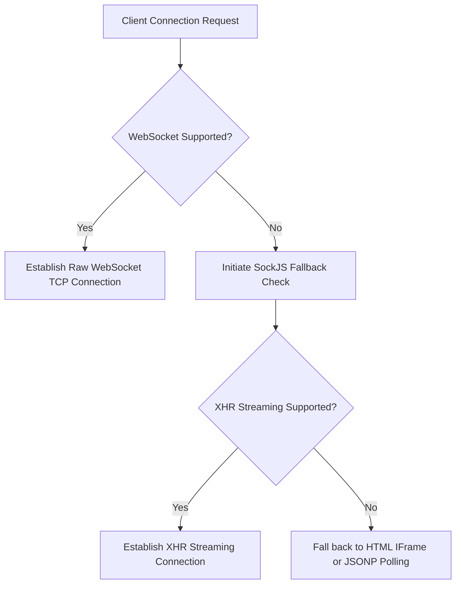

# Module 04: STOMP & SockJS — Sub-Protocol Routing & Fallback Transports

Welcome back, class. Today we analyze **STOMP and SockJS (CS-520)**.

In the previous module, we built a raw `WebSocketHandler`. While raw handler sockets are powerful, they present a major design challenge: they provide no built-in message routing or publish-subscribe structures. If you need to send messages to specific chat rooms or broadcast alerts to a subset of users, you must write a custom routing framework on top of raw text frames.

Spring Boot solves this using **STOMP (Simple Text Oriented Messaging Protocol)** as a sub-protocol, paired with **SockJS** to handle connection fallbacks. Today, we will study STOMP frame routing, configure a message broker, and write messaging controllers in Spring.

---

## 1. Academic Lecture: STOMP Messaging and SockJS Fallbacks

WebSockets provide a transport tunnel, but STOMP provides the routing language.

### 1. The STOMP Protocol
STOMP is a frame-based, text-oriented messaging protocol. A STOMP frame consists of a command, a set of headers, a blank line, and an optional body:

```http
SEND
destination:/app/chat.send
content-type:application/json

{"sender":"Alice","content":"Hello World"}
^@ (Null byte terminator)
```

*   **Commands**: `CONNECT`, `SUBSCRIBE`, `UNSUBSCRIBE`, `SEND`, `MESSAGE`, `DISCONNECT`.
*   **Routing Destinations**:
    *   `/app/*` (Application destination prefix): Message is routed to application controller handlers (e.g. `@MessageMapping`).
    *   `/topic/*` (Broadcast prefix): Message is routed directly to the broker for one-to-many pub-sub broadcasting.
    *   `/queue/*` (Point-to-point prefix): Message is routed for one-to-one direct messaging.

### 2. SockJS Fallback Transport
Not all networks or browsers support the WebSocket protocol. Corporate firewalls and reverse proxies often intercept and block HTTP Upgrade headers.
*   **SockJS Solution**: A client library and server protocol wrapper that attempts to connect via raw WebSockets first. If the connection fails, it falls back to HTTP-based transports (such as XHR Streaming, EventSource streaming, or JSONP polling) to simulate a persistent connection.



---

## 2. Theory vs. Production Trade-offs

### In-Memory Simple Broker vs. External Broker Relay (RabbitMQ)
*   **Simple Broker (In-Memory)**:
    *   *Pro*: Default configuration, requires no external infrastructure dependencies.
    *   *Con*: Not scalable. Because active connection states and message queues are stored in the JVM memory, you cannot scale the application horizontally across multiple server nodes.
*   **Production Rule**: Always use a dedicated external message broker (like RabbitMQ or ActiveMQ) configured as a **Broker Relay** in production clusters. This ensures messages are synchronized across all nodes. We will implement this in Module 6.

---

## 3. How to Use: Configuring STOMP & Message Controllers

Let us configure a STOMP broker in Spring Boot and write a controller to route messages.

### A. The Manually Parsed Routing Handler (Anti-Pattern)

Avoid parsing JSON strings and routing destinations manually inside low-level handlers:

```java
package com.capstone.security.ws.vulnerable;

import com.fasterxml.jackson.databind.ObjectMapper;
import org.springframework.web.socket.TextMessage;
import org.springframework.web.socket.WebSocketSession;
import org.springframework.web.socket.handler.TextWebSocketHandler;

public class VulnerableCustomRouter extends TextWebSocketHandler {
    private final ObjectMapper mapper = new ObjectMapper();

    @Override
    protected void handleTextMessage(WebSocketSession session, TextMessage message) throws Exception {
        String payload = message.getPayload();
        // DANGER: Hand-written routing logic. Fragile and hard to scale.
        if (payload.contains("\"destination\":\"/chat/room1\"")) {
            // Send to room 1...
        }
    }
}
```

### B. The Hardened STOMP Broker Configuration (Production Pattern)

Here is the hardened configuration class registering SockJS fallbacks and defining destination prefixes:

```java
package com.capstone.security.ws.secure.config;

import org.springframework.context.annotation.Configuration;
import org.springframework.messaging.simp.config.MessageBrokerRegistry;
import org.springframework.web.socket.config.annotation.EnableWebSocketMessageBroker;
import org.springframework.web.socket.config.annotation.StompEndpointRegistry;
import org.springframework.web.socket.config.annotation.WebSocketMessageBrokerConfigurer;

@Configuration
@EnableWebSocketMessageBroker
public class StompBrokerConfiguration implements WebSocketMessageBrokerConfigurer {

    @Override
    public void configureMessageBroker(MessageBrokerRegistry config) {
        // Enable a simple in-memory broker for public broadcasting and private messaging
        config.enableSimpleBroker("/topic", "/queue");
        
        // Define routing prefix for client-to-server mapped commands
        config.setApplicationDestinationPrefixes("/app");
        
        // Define routing prefix for user-specific direct messaging (one-to-one)
        config.setUserDestinationPrefix("/user");
    }

    @Override
    public void registerStompEndpoints(StompEndpointRegistry registry) {
        registry.addEndpoint("/ws-stomp")
                .setAllowedOrigins("https://trusted-app.corp.com")
                // SECURE: Enable SockJS fallback options for browser compatibility
                .withSockJS();
    }
}
```

### C. Implementing the STOMP Controller & Template

Next, implement the messaging controller using Spring's annotations:

```java
package com.capstone.security.ws.secure.controllers;

import org.springframework.messaging.handler.annotation.MessageMapping;
import org.springframework.messaging.handler.annotation.Payload;
import org.springframework.messaging.handler.annotation.SendTo;
import org.springframework.messaging.simp.SimpMessagingTemplate;
import org.springframework.stereotype.Controller;

import java.security.Principal;

@Controller
public class StompChatController {

    private final SimpMessagingTemplate messagingTemplate;

    public StompChatController(SimpMessagingTemplate messagingTemplate) {
        this.messagingTemplate = messagingTemplate;
    }

    /**
     * Maps to client sends targeting: /app/chat.sendMessage
     * Broadcasts output to: /topic/public
     */
    @MessageMapping("/chat.sendMessage")
    @SendTo("/topic/public")
    public ChatMessage sendMessage(@Payload ChatMessage chatMessage, Principal principal) {
        // Set user context from authenticated security principal
        chatMessage.setSender(principal.getName());
        return chatMessage;
    }

    /**
     * Programmatic transmission helper. Pushes an alert to a specific client.
     */
    public void sendSystemAlert(String userId, String alertText) {
        String destination = "/queue/alerts";
        // SECURE: Pushes a direct, private message to /user/{userId}/queue/alerts
        messagingTemplate.convertAndSendToUser(userId, destination, new AlertMessage(alertText));
    }
}
```

---

## 4. Common Errors & Pitfalls

### Pitfall 1: Bypassing controller validation annotations
Assuming that because WebSockets are stateful connections, payload attributes do not require standard validation annotations.
*   **Why it fails**: Attackers bypass frontend validations and submit empty fields or injection strings in the JSON payload body of STOMP SEND frames.
*   **Mitigation**: Enforce payload validation in your controller mapping methods using the Spring Validation framework (`@Payload @Valid ChatMessage message`).

---

## 5. Socratic Review Questions

### Question 1
Explain the routing flow of a message sent to the destination `/app/chat.register` vs. a message sent to `/topic/announcements`.

#### Answer
*   `/app/chat.register`: The prefix `/app` matches the application destination configuration. The message is routed to the application context, where Spring looks for a controller method annotated with `@MessageMapping("/chat.register")` to execute business logic.
*   `/topic/announcements`: The prefix `/topic` matches the broker configuration. The message bypasses the controller layer and goes directly to the message broker, which broadcasts it to all clients currently subscribed to `/topic/announcements`.

### Question 2
What is the role of `SimpMessagingTemplate`? Give a concrete example of when you would use it instead of `@SendTo`.

#### Answer
*   `@SendTo`: A declarative annotation that routes the return value of a controller method to a destination. It is request-response driven.
*   `SimpMessagingTemplate`: A template bean that allows you to push messages programmatically from anywhere in the application (such as scheduled tasks, background threads, or database transaction listeners). For example, a database trigger or batch job can use it to push system status updates to connected users.

---

## 6. Hands-on Challenge: Mapping STOMP Routes

### The Challenge
In this challenge, you will implement a STOMP controller endpoint.

Your task:
1.  Complete the controller method mapped to incoming client destinations `/app/notifications.dispatch`.
2.  Route the returned notification record to the public topic `/topic/updates`.
3.  Ensure the method parameters enforce payload validation checks.

Complete the controller class below:

```java
package com.capstone.security.ws.challenge;

import org.springframework.messaging.handler.annotation.MessageMapping;
import org.springframework.messaging.handler.annotation.Payload;
import org.springframework.messaging.handler.annotation.SendTo;
import org.springframework.stereotype.Controller;

public record NotificationPayload(String title, String content) {}

@Controller
public class StompNotificationController {

    // TODO: Annotate this method to map client destinations to "/notifications.dispatch"
    // TODO: Annotate this method to route the return payload to "/topic/updates"
    public NotificationPayload dispatchUpdate(NotificationPayload payload) {
        // TODO: Complete the logic.
        // 1. Verify payload is not null.
        // 2. Perform validations (e.g. log the payload title).
        // 3. Return the payload.
        return payload;
    }
}
```

Write the annotations and validation mappings. Save the completed class and explain why validation is required on STOMP controller mappings inside `modules/04-stomp-sockjs.md`.
