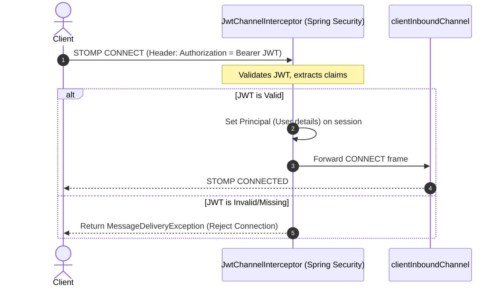

# Module 05: WebSocket Security — JWT Channel Interceptors

Welcome back, class. Today we analyze **WebSocket Security (CS-520)**.

Securing WebSocket connections presents unique challenges. Browsers do not support sending custom HTTP headers (such as `Authorization: Bearer <token>`) during the initial HTTP handshake. Developers often work around this by sending tokens in query parameters, which are captured in plain text by reverse proxy logs, or relying on cookies, which exposes the system to **Cross-Site WebSocket Hijacking (CSWSH)**.

Domain-Driven Design and Spring Security address this using **STOMP Channel Interceptors**. We allow the initial HTTP handshake to connect anonymously, but require JWT authentication in the STOMP `CONNECT` frame. Today, we will study these authentication paths and write a custom channel interceptor.

---

## 1. Academic Lecture: The Mechanics of WebSocket Authentication

To secure WebSockets, we must separate transport security from messaging authorization.

### 1. The Handshake Header Limitation
When a browser executes `new WebSocket(url)`, the Javascipt API does not allow you to specify custom request headers. If you use JWT authentication, you have three options:

1.  **Query Parameters (Vulnerable)**: `ws://server/ws?token=JWT`. 
    *   *Why it fails*: Proxy servers, load balancers, and browser history log the entire URL, exposing the security token.
2.  **Cookie-based Authentication**: Handshakes automatically transmit cookie headers associated with the domain.
    *   *Why it fails*: Vulnerable to CSRF/CSWSH unless strict Same-Origin policies are enforced.
3.  **STOMP CONNECT Headers (Secure)**: Establish the connection anonymously, then send the JWT token in the headers of the STOMP `CONNECT` frame:
    
```http
CONNECT
accept-version:1.1,1.0
heart-beat:10000,10000
Authorization:Bearer JWT_TOKEN
```

### 2. Channel Interceptors
In Spring, STOMP messages flow through message channels. The `clientInboundChannel` processes messages coming from the client.
*   **The Solution**: We implement the `ChannelInterceptor` interface. In its `preSend` method, we intercept the message, check if the STOMP command is `CONNECT`, extract the `Authorization` header, validate the JWT, and associate the authenticated user with the session context using `accessor.setUser(user)`.



---

## 2. Theory vs. Production Trade-offs

### Handshake Authentication vs. STOMP Channel Interception
*   **Handshake Authentication**:
    *   *Pro*: Blocks unauthorized connections early, before upgrading the TCP socket.
    *   *Con*: Difficult to use with JWTs because you must pass the token in query strings or establish cookie sharing.
*   **STOMP Channel Interception**:
    *   *Pro*: Highly secure. The JWT is transmitted inside the TCP stream headers, which are not captured in HTTP proxy logs.
    *   *Con*: The TCP connection is upgraded before authentication occurs. If an attacker floods the server with handshake requests, they can exhaust connection pool resources even without valid tokens.

---

## 3. How to Use: Hardening WebSockets with JWT Channel Interceptors

Let us implement a secure STOMP channel interceptor in Spring Security.

### A. The Insecure Global Endpoint Access (Anti-Pattern)

Avoid authenticating users on every frame or bypassing authentication checks on connection:

```java
package com.capstone.security.ws.vulnerable;

import org.springframework.messaging.simp.SimpMessageHeaderAccessor;
import org.springframework.stereotype.Controller;
import org.springframework.messaging.handler.annotation.MessageMapping;

@Controller
public class VulnerableChatController {

    @MessageMapping("/chat")
    public void handleChat(String message, SimpMessageHeaderAccessor accessor) {
        // DANGER: No authentication check performed on connection;
        // trying to retrieve user principal here will return null.
        String username = accessor.getUser().getName();
    }
}
```

### B. The Hardened JWT Channel Interceptor (Production Pattern)

Here is a hardened channel interceptor. It validates the token inside the STOMP `CONNECT` frame and sets the security principal.

First, implement the `ChannelInterceptor`:

```java
package com.capstone.security.ws.secure.interceptors;

import org.springframework.messaging.Message;
import org.springframework.messaging.MessageChannel;
import org.springframework.messaging.simp.stomp.StompCommand;
import org.springframework.messaging.simp.stomp.StompHeaderAccessor;
import org.springframework.messaging.support.ChannelInterceptor;
import org.springframework.messaging.support.MessageHeaderAccessor;
import org.springframework.security.authentication.UsernamePasswordAuthenticationToken;
import org.springframework.messaging.MessageDeliveryException;
import org.springframework.stereotype.Component;

import java.util.List;
import java.util.logging.Logger;

/**
 * Hardened inbound channel interceptor validating JWT tokens in STOMP CONNECT frames.
 */
@Component
public class JwtChannelInterceptor implements ChannelInterceptor {
    private static final Logger LOGGER = Logger.getLogger(JwtChannelInterceptor.class.getName());

    @Override
    public Message<?> preSend(Message<?> message, MessageChannel channel) {
        StompHeaderAccessor accessor = MessageHeaderAccessor.getAccessor(message, StompHeaderAccessor.class);

        if (accessor != null && StompCommand.CONNECT.equals(accessor.getCommand())) {
            // Extract the Authorization header list from the STOMP headers
            List<String> authorizationHeaders = accessor.getNativeHeader("Authorization");
            if (authorizationHeaders == null || authorizationHeaders.isEmpty()) {
                throw new MessageDeliveryException("Missing Authorization header in STOMP CONNECT frame.");
            }

            String authHeader = authorizationHeaders.get(0);
            if (!authHeader.startsWith("Bearer ")) {
                throw new MessageDeliveryException("Invalid Authorization format. Must use Bearer token.");
            }

            String token = authHeader.substring(7);

            // SECURE: Validate JWT and extract identity claims (Mock validation for compilation)
            String username = validateTokenAndGetUsername(token);
            if (username == null) {
                throw new MessageDeliveryException("JWT token validation failed. Connection rejected.");
            }

            LOGGER.info("Successfully authenticated user: " + username + " via STOMP CONNECT.");

            // Create security principal and assign to connection session context
            UsernamePasswordAuthenticationToken authentication = 
                new UsernamePasswordAuthenticationToken(username, null, List.of(() -> "ROLE_USER"));
            
            accessor.setUser(authentication);
        }

        return message;
    }

    private String validateTokenAndGetUsername(String token) {
        if ("invalid-token".equals(token)) {
            return null;
        }
        return "authenticated_user"; // Return username on success
    }
}
```

Next, register the interceptor in the WebSocket configuration class:

```java
package com.capstone.security.ws.secure.config;

import com.capstone.security.ws.secure.interceptors.JwtChannelInterceptor;
import org.springframework.context.annotation.Configuration;
import org.springframework.messaging.simp.config.ChannelRegistration;
import org.springframework.web.socket.config.annotation.EnableWebSocketMessageBroker;
import org.springframework.web.socket.config.annotation.WebSocketMessageBrokerConfigurer;

@Configuration
@EnableWebSocketMessageBroker
public class SecuredWebSocketBrokerConfig implements WebSocketMessageBrokerConfigurer {

    private final JwtChannelInterceptor jwtChannelInterceptor;

    public SecuredWebSocketBrokerConfig(JwtChannelInterceptor jwtChannelInterceptor) {
        this.jwtChannelInterceptor = jwtChannelInterceptor;
    }

    @Override
    public void configureClientInboundChannel(ChannelRegistration registration) {
        // Register the JWT validation channel interceptor
        registration.interceptors(jwtChannelInterceptor);
    }
}
```

---

## 4. Common Errors & Pitfalls

### Pitfall 1: Authenticating on every message type (SEND/SUBSCRIBE)
Running database queries or heavy cryptographic JWT token validations on every incoming STOMP message (like `SEND` or `SUBSCRIBE` frames).
*   **Why it fails**: When a user is typing in a chat room, they send dozens of messages per second. Validating the JWT signature on every message wastes CPU resources.
*   **Mitigation**: Perform token validation and assign the security principal *only* inside the `CONNECT` frame. Subsequent frames inherit the principal from the established session context automatically.

---

## 5. Socratic Review Questions

### Question 1
Why are standard Spring Security interceptors (like `FilterSecurityInterceptor`) unable to intercept individual WebSocket STOMP messages like `SUBSCRIBE`?

#### Answer
Spring Security filters operate at the HTTP layer, intercepting requests as they enter the servlet container. Once the connection upgrades to a persistent TCP socket, the HTTP request lifecycle ends. 
Subsequent STOMP messages (like `SUBSCRIBE` or `SEND`) travel as binary frames over the open TCP socket, bypassing HTTP filters. To intercept these frames, we must use a **Channel Interceptor** (`ChannelInterceptor`) which sits inside Spring's internal messaging pipeline.

### Question 2
Explain why throwing a standard `AuthenticationException` inside a `ChannelInterceptor` is insufficient, and why we must wrap it in a `MessageDeliveryException`.

#### Answer
Spring's messaging architecture expects inbound channel interceptors to throw exceptions that the messaging container understands. 
If an interceptor throws a standard `AuthenticationException`, the messaging framework might catch and log it but fail to close the client's connection. Throwing a `MessageDeliveryException` signals the channel runner to terminate message processing and close the connection immediately.

---

## 6. Hands-on Challenge: JWT Token Interception

### The Challenge
In this challenge, you will implement the validation block for a channel interceptor.

Your task:
1.  Complete the validation logic in `StompAuthInterceptor` to extract the `passcode` STOMP header.
2.  If the passcode is missing, throw a `MessageDeliveryException`.
3.  Assign a mock user principal to the session accessor using `accessor.setUser()`.

Complete the interceptor implementation below:

```java
package com.capstone.security.ws.challenge;

import org.springframework.messaging.Message;
import org.springframework.messaging.MessageChannel;
import org.springframework.messaging.MessageDeliveryException;
import org.springframework.messaging.simp.stomp.StompCommand;
import org.springframework.messaging.simp.stomp.StompHeaderAccessor;
import org.springframework.messaging.support.ChannelInterceptor;
import org.springframework.messaging.support.MessageHeaderAccessor;
import org.springframework.security.authentication.UsernamePasswordAuthenticationToken;

import java.util.List;

public class StompAuthInterceptor implements ChannelInterceptor {

    @Override
    public Message<?> preSend(Message<?> message, MessageChannel channel) {
        StompHeaderAccessor accessor = MessageHeaderAccessor.getAccessor(message, StompHeaderAccessor.class);

        if (accessor != null && StompCommand.CONNECT.equals(accessor.getCommand())) {
            // TODO: Complete the authentication logic.
            // 1. Retrieve the native header list for "passcode" using accessor.getNativeHeader().
            // 2. If the list is null or empty, throw new MessageDeliveryException("Missing passcode header");
            // 3. Extract the first string. If it is not equal to "super-secret-key", throw new MessageDeliveryException("Invalid credentials");
            // 4. Create a UsernamePasswordAuthenticationToken and call accessor.setUser(token).
        }

        return message;
    }
}
```

Write the validation logic. Save the completed class and explain why verifying tokens on the inbound channel protects downstream controllers from unauthorized access inside `modules/05-websocket-security.md`.
