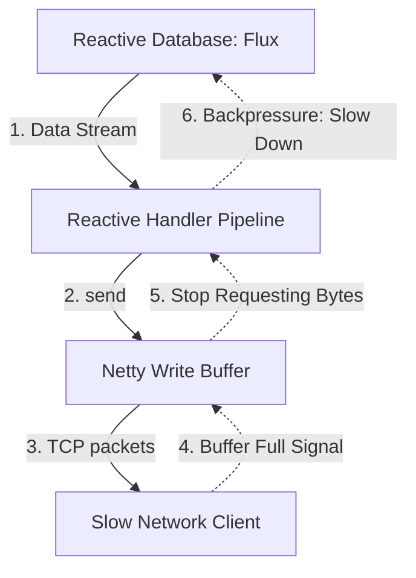

# Module 07: Reactive WebSockets — Non-Blocking Streaming in WebFlux

Welcome back, class. Today we analyze **Reactive WebSockets (CS-520)**.

In standard Spring MVC applications, the container uses a servlet thread-per-connection model. Under heavy load, keeping thousands of persistent, stateful WebSocket connections open requires allocating thousands of active threads, which quickly exhausts server memory. Furthermore, if your message processing blocks (e.g., waiting for slow database queries), you cause thread starvation and crash the server.

Spring WebFlux solves this. By running on a non-blocking **Netty event loop** architecture, WebFlux handles thousands of concurrent WebSocket connections using only a small, fixed pool of event loop threads. Today, we will study reactive streams, implement a non-blocking WebFlux handler, and learn how to handle backpressure.

---

## 1. Academic Lecture: Non-Blocking Event Loops & Backpressure

To understand WebFlux, we must shift from blocking thread models to event-driven pipelines.

### 1. The Reactive WebSocket Lifecycle
In Spring WebFlux, a WebSocket endpoint implements `org.springframework.web.reactivesocket.WebSocketHandler`. This interface contains a single method:

```java
Mono<Void> handle(WebSocketSession session);
```

*   The connection remains active as long as the returned `Mono<Void>` remains uncompleted. If the `Mono` completes or emits an error, the container terminates the session.
*   **Receiving Messages**: The incoming message stream is represented as a `Flux<WebSocketMessage>` via `session.receive()`.
*   **Sending Messages**: Outgoing messages are sent by passing a `Publisher<WebSocketMessage>` to `session.send()`.

### 2. Backpressure
If the server pushes messages to a client faster than the client's network can process them, a traditional server will queue messages in memory, risking an Out-Of-Memory (OOM) crash.
*   **Reactor Solution**: Project Reactor uses **Reactive Streams Backpressure**. The client’s socket buffer signals the Netty event loop when it is full. This signal flows upstream through the reactive pipeline, telling the data producer (e.g., a reactive database driver) to slow down, protecting the server's memory.



---

## 2. Theory vs. Production Trade-offs

### Spring MVC WebSockets vs. WebFlux WebSockets
*   **Spring MVC (Servlet Container)**:
    *   *Pro*: Full integration with STOMP, SockJS, and the Spring Security servlet architecture. Simple to write and debug.
    *   *Con*: High memory footprint. Every connection consumes thread resources.
*   **Spring WebFlux (Netty Event Loop)**:
    *   *Pro*: High throughput. Exceedingly low memory usage. Handles massive traffic loads on minimal hardware.
    *   *Con*: No out-of-the-box support for STOMP or SockJS fallbacks. You must write custom JSON message routers or use alternative sub-protocols (like RSockets).
*   **Production Rule**: Use **Spring MVC STOMP** for standard business applications that require complex routing, security, and fallback options. Use **Spring WebFlux WebSockets** for raw, high-throughput data streams (such as telemetry, location tracking, or real-time dashboards).

---

## 3. How to Use: Reactive Handlers in WebFlux

Let us implement a reactive WebSocket handler that consumes incoming client text, transforms it, and returns a stream of non-blocking data.

### A. The Blocking Database Query (Anti-Pattern)

Avoid executing blocking calls inside the Netty event loop thread:

```java
package com.capstone.security.ws.vulnerable;

import org.springframework.web.reactive.socket.WebSocketHandler;
import org.springframework.web.reactive.socket.WebSocketSession;
import reactor.core.publisher.Mono;

public class VulnerableReactiveHandler implements WebSocketHandler {
    @Override
    public Mono<Void> handle(WebSocketSession session) {
        return session.receive()
            .doOnNext(msg -> {
                try {
                    // DANGER: Thread.sleep blocks the Netty event loop thread!
                    // This halts message processing for all other users connected to this thread.
                    Thread.sleep(5000); 
                } catch (InterruptedException e) {
                    e.printStackTrace();
                }
            }).then();
    }
}
```

### B. The Hardened Non-Blocking Reactive Handler (Production Pattern)

Here is a hardened reactive handler. It uses non-blocking operators and maps outbound streams:

```java
package com.capstone.security.ws.secure.handlers;

import org.springframework.stereotype.Component;
import org.springframework.web.reactive.socket.WebSocketHandler;
import org.springframework.web.reactive.socket.WebSocketMessage;
import org.springframework.web.reactive.socket.WebSocketSession;
import reactor.core.publisher.Flux;
import reactor.core.publisher.Mono;

import java.time.Duration;
import java.util.logging.Logger;

/**
 * Hardened non-blocking Reactive WebSocket Handler.
 */
@Component
public class SecureReactiveWebSocketHandler implements WebSocketHandler {
    private static final Logger LOGGER = Logger.getLogger(SecureReactiveWebSocketHandler.class.getName());

    @Override
    public Mono<Void> handle(WebSocketSession session) {
        // 1. Process incoming messages asynchronously
        Mono<Void> inputPipeline = session.receive()
                .map(WebSocketMessage::getPayloadAsText)
                .doOnNext(payload -> LOGGER.info("Received reactive payload: " + payload))
                .doOnError(err -> LOGGER.severe("Error in incoming stream: " + err.getMessage()))
                .then(); // Converts to Mono<Void> to signal completion

        // 2. Generate outgoing message stream (simulate stock price feed)
        Flux<WebSocketMessage> outputFlux = Flux.interval(Duration.ofSeconds(1))
                .map(tick -> "Stock Tick #" + tick)
                .map(session::textMessage) // Wrap string in TextMessage
                .doOnCancel(() -> LOGGER.info("Client cancelled subscription. Stop streaming."))
                .log();

        // 3. Connect outbound publisher to session write channel
        Mono<Void> outputPipeline = session.send(outputFlux);

        // SECURE: Use Mono.zip to execute both pipelines concurrently.
        // The session closes only when both incoming and outgoing channels complete.
        return Mono.zip(inputPipeline, outputPipeline).then();
    }
}
```

Next, register the handler using `SimpleUrlHandlerMapping` in your WebFlux configuration class:

```java
package com.capstone.security.ws.secure.config;

import com.capstone.security.ws.secure.handlers.SecureReactiveWebSocketHandler;
import org.springframework.context.annotation.Bean;
import org.springframework.context.annotation.Configuration;
import org.springframework.web.reactive.HandlerMapping;
import org.springframework.web.reactive.handler.SimpleUrlHandlerMapping;
import org.springframework.web.reactive.socket.server.support.WebSocketHandlerAdapter;

import java.util.Map;

@Configuration
public class ReactiveWebSocketConfig {

    @Bean
    public HandlerMapping webFluxHandlerMapping(SecureReactiveWebSocketHandler handler) {
        // Map paths to WebFlux WebSocket handlers
        SimpleUrlHandlerMapping mapping = new SimpleUrlHandlerMapping();
        mapping.setUrlMap(Map.of("/ws/reactive-feed", handler));
        mapping.setOrder(1); // Set high priority
        return mapping;
    }

    @Bean
    public WebSocketHandlerAdapter handlerAdapter() {
        // Adapt WebFlux request lifecycle to handle websocket requests
        return new WebSocketHandlerAdapter();
    }
}
```

---

## 4. Common Errors & Pitfalls

### Pitfall 1: Calling `block()` or `blockFirst()` inside Reactor pipelines
Calling blocking extraction methods inside reactive handler chains:
```java
// DANGER: block() forces the thread to wait, neutralizing the benefits of WebFlux.
String payload = session.receive().blockFirst().getPayloadAsText(); 
```
*   **Mitigation**: Never use `block()` or `blockFirst()` in WebFlux. Let the reactive pipeline process events asynchronously, returning the uncompleted `Mono<Void>` to the container.

---

## 5. Socratic Review Questions

### Question 1
Why does blocking the Netty event loop thread impact the performance of other users connected to the server?

#### Answer
In standard Servlet containers, every user connection gets a dedicated thread. If one user blocks, only their thread is affected. 
In Netty, a single thread (event loop) handles connections and processing for hundreds of concurrent users. If you execute a blocking operation (like a slow JDBC query or `Thread.sleep`) on the event loop thread, you block that thread entirely. As a result, no other requests assigned to that thread can be processed, introducing massive latency across the system.

### Question 2
How does Reactor's `doOnCancel` hook prevent resource leaks when a WebSocket client abruptly disconnects?

#### Answer
If a client disconnects, the WebSocket session is closed. Reactor detects the closure of the downstream socket and propagates a cancellation signal upstream through the reactive pipeline. The `doOnCancel` hook captures this signal, allowing the server to clean up resources, close database cursors, and terminate data streams.

---

## 6. Hands-on Challenge: Reactive Message Uppercaser

### The Challenge
In this challenge, you will implement a reactive WebSocket handler.

Your task is to write the `handle` method for `ReactiveUppercaserHandler`:
1.  Receive incoming messages from `session.receive()`.
2.  Extract the payload text and convert it to uppercase.
3.  Wrap the uppercase text in a `session.textMessage` object.
4.  Send the stream back to the client using `session.send()`.

Complete the implementation below:

```java
package com.capstone.security.ws.challenge;

import org.springframework.web.reactive.socket.WebSocketHandler;
import org.springframework.web.reactive.socket.WebSocketMessage;
import org.springframework.web.reactive.socket.WebSocketSession;
import reactor.core.publisher.Flux;
import reactor.core.publisher.Mono;

public class ReactiveUppercaserHandler implements WebSocketHandler {

    @Override
    public Mono<Void> handle(WebSocketSession session) {
        // TODO: Complete the reactive pipeline.
        // 1. Receive incoming messages: session.receive().
        // 2. Map message payloads to uppercase: msg.getPayloadAsText().toUpperCase().
        // 3. Map the uppercase string to a text message: session.textMessage(uppercaseString).
        // 4. Send the outgoing Flux stream back to the client: session.send(outboundFlux).
        return Mono.empty();
    }
}
```

Write the reactive mapping pipeline. Save the completed class and explain the thread-efficiency advantages of non-blocking I/O inside `modules/07-reactive-websockets.md`.
