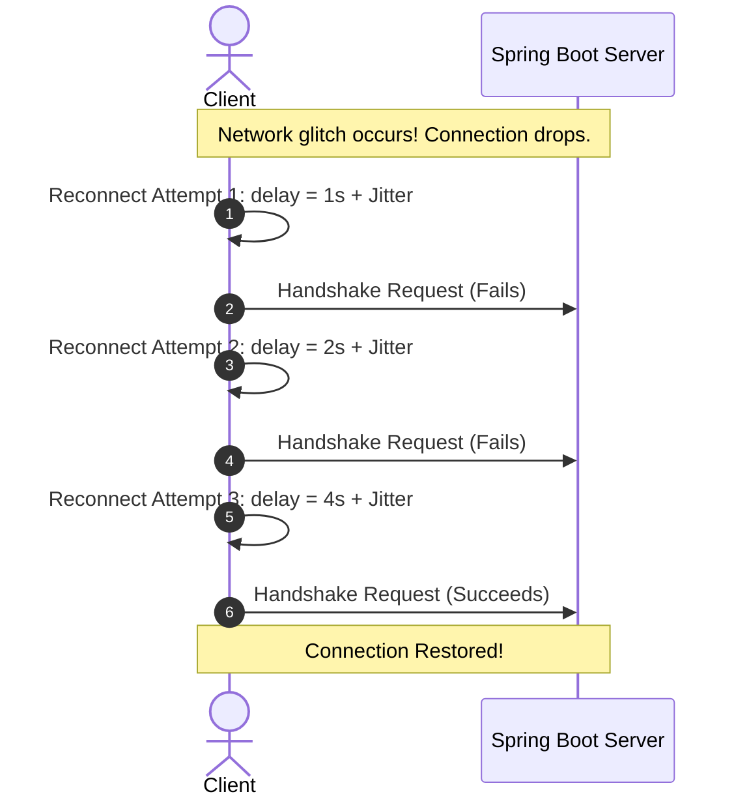

# Module 08: Reliability & Reconnections — Heartbeats & Thundering Herds

Welcome back, class. Today we analyze **Connection Reliability and Reconnections (CS-520)**.

A major production challenge with WebSockets is handling connection drops. Unlike HTTP requests which complete in milliseconds, WebSockets are designed to remain open for hours. During this time, users switch from Wi-Fi to cellular data, enter elevators, or pass through tunnels. 

These events cause the connection to drop without cleanly sending a TCP `FIN` packet. The server enters a **half-open state**: it believes the connection is active, keeping resources allocated and continuing to send messages, which are silently lost. Today, we will study **Ping/Pong Heartbeats** and implement client-side **Exponential Backoff** to prevent Thundering Herd problems during reconnects.

---

## 1. Academic Lecture: Half-Open Sockets and Heartbeats

To keep WebSocket clusters healthy, we must detect dead connections and reconnect cleanly.

### 1. The Half-Open Socket Problem
A TCP connection is considered "half-open" when one side has terminated or lost power without notifying the other. The side that remains open continues to allocate memory and file descriptors.
*   **The Mitigation**: **Heartbeats**. The server sends a Ping frame (opcode `0x9`) at a regular interval. The client must respond immediately with a Pong frame (opcode `0xA`). If the server does not receive a Pong frame within a specified timeout (typically 10-20 seconds), it assumes the connection is dead, terminates the socket, and frees connection resources.

```
       Half-Open Detection Flow
       
  Server ----------------------(Ping 0x9)---------------------> Client (Wi-Fi Lost!)
  Server [Waiting for Pong] ... Timeout (20s) Exceeded!
  Server -> Terminate Socket -> Free connection memory
```

### 2. The Thundering Herd Reconnection Problem
When a server node restarts or a network glitch disconnects thousands of clients, the clients will immediately attempt to reconnect.
*   **The Problem**: If 10,000 clients attempt to reconnect at the exact same millisecond, they will flood the server with upgrade handshakes, overloading the CPU and database pools, causing a Denial of Service (DoS).
*   **The Solution**: **Exponential Backoff with Jitter**. Clients must delay their reconnect attempts. The delay must grow exponentially with each failed attempt, and include a random "jitter" (noise) factor to spread the request load over time.



---

## 2. Theory vs. Production Trade-offs

### High Heartbeat Frequencies vs. Bandwidth Usage
*   **High Frequency Heartbeats (e.g., every 2 seconds)**:
    *   *Pro*: Instantly detects dead connections, freeing server memory immediately.
    *   *Con*: High battery drain on mobile devices and high bandwidth overhead.
*   **Production Rule**: Configure heartbeats to run every **10 to 25 seconds**. This is frequent enough to release server resources while keeping bandwidth and battery consumption low.

---

## 3. How to Use: Configuring Heartbeats in Spring Boot STOMP

Let us write a compile-grade configuration that registers a task scheduler to process STOMP heartbeats.

### A. The Silent Drop Endpoint (Anti-Pattern)

Avoid configuring brokers without a task scheduler. This disables heartbeats, allowing dead connections to persist:

```java
package com.capstone.security.ws.vulnerable;

import org.springframework.messaging.simp.config.MessageBrokerRegistry;
import org.springframework.web.socket.config.annotation.WebSocketMessageBrokerConfigurer;

public class VulnerableHeartbeatConfig implements WebSocketMessageBrokerConfigurer {
    @Override
    public void configureMessageBroker(MessageBrokerRegistry config) {
        // DANGER: Heartbeats are enabled conceptually, but because no TaskScheduler is registered,
        // Spring fails to send them. Dead connections will persist forever.
        config.enableSimpleBroker("/topic")
              .setHeartbeatValue(new long[]{10000, 10000}); 
    }
}
```

### B. The Hardened Heartbeat Broker Configuration (Production Pattern)

Here is the hardened configuration. It registers a `ThreadPoolTaskScheduler` to manage heartbeat sending and receiving.

First, implement the configuration class:

```java
package com.capstone.security.ws.secure.config;

import org.springframework.context.annotation.Configuration;
import org.springframework.messaging.simp.config.MessageBrokerRegistry;
import org.springframework.scheduling.concurrent.ThreadPoolTaskScheduler;
import org.springframework.web.socket.config.annotation.EnableWebSocketMessageBroker;
import org.springframework.web.socket.config.annotation.StompEndpointRegistry;
import org.springframework.web.socket.config.annotation.WebSocketMessageBrokerConfigurer;

@Configuration
@EnableWebSocketMessageBroker
public class ReliableHeartbeatBrokerConfig implements WebSocketMessageBrokerConfigurer {

    @Override
    public void configureMessageBroker(MessageBrokerRegistry config) {
        // Build a ThreadPoolTaskScheduler to manage heartbeats
        ThreadPoolTaskScheduler scheduler = new ThreadPoolTaskScheduler();
        scheduler.setPoolSize(2);
        scheduler.setThreadNamePrefix("ws-heartbeat-thread-");
        scheduler.initialize();

        config.enableSimpleBroker("/topic")
                // Register the task scheduler to process heartbeat pings
                .setTaskScheduler(scheduler)
                // Send heartbeat every 10 seconds, expect reply within 10 seconds
                .setHeartbeatValue(new long[]{10000, 10000});

        config.setApplicationDestinationPrefixes("/app");
    }

    @Override
    public void registerStompEndpoints(StompEndpointRegistry registry) {
        registry.addEndpoint("/ws-reliable")
                .setAllowedOrigins("https://trusted-app.corp.com")
                .withSockJS();
    }
}
```

Next, implement an Application Listener to clean up resources when a user disconnects:

```java
package com.capstone.security.ws.secure.listeners;

import org.springframework.context.ApplicationListener;
import org.springframework.messaging.simp.stomp.StompHeaderAccessor;
import org.springframework.stereotype.Component;
import org.springframework.web.socket.messaging.SessionDisconnectEvent;

import java.util.logging.Logger;

/**
 * Listener to intercept socket closure events and clean up resource allocations.
 */
@Component
public class ConnectionDisconnectListener implements ApplicationListener<SessionDisconnectEvent> {
    private static final Logger LOGGER = Logger.getLogger(ConnectionDisconnectListener.class.getName());

    @Override
    public void onApplicationEvent(SessionDisconnectEvent event) {
        StompHeaderAccessor accessor = StompHeaderAccessor.wrap(event.getMessage());
        String sessionId = event.getSessionId();
        
        String username = (accessor.getUser() != null) ? accessor.getUser().getName() : "Anonymous";
        
        LOGGER.info("Connection closed for session ID: " + sessionId + " (User: " + username + "). Close status: " + event.getCloseStatus());

        // SECURE: Perform database cleanup and notify other users about the disconnect
        cleanupSessionResources(sessionId);
    }

    private void cleanupSessionResources(String sessionId) {
        // Remove active state, clean locks...
    }
}
```

---

## 4. Common Errors & Pitfalls

### Pitfall 1: Client reconnecting instantly in an infinite loop
Writing client-side JS connection handlers like:
```javascript
// DANGER: Leads to CPU spikes and Server DoS on disconnect
socket.onclose = () => { connect(); }; 
```
*   **Mitigation**: Always implement an exponential backoff reconnect handler.

---

## 5. Socratic Review Questions

### Question 1
Explain the difference between TCP Keep-Alive and WebSocket-level Ping/Pong heartbeats. Why is TCP Keep-Alive insufficient for WebSockets?

#### Answer
*   **TCP Keep-Alive**: Operates at the transport layer (OS level). It sends empty packets to keep the connection open but cannot verify if the application layer (the JVM) is still responsive.
*   **WebSocket Ping/Pong**: Operates at the application layer. The Ping frame must process through the application's message loop, verifying that the JVM is responsive. If the JVM is locked due to thread exhaustion, the Pong frame is not returned, allowing the load balancer to close the connection.

### Question 2
How does adding a random "jitter" to the client's reconnection delay prevent the "Thundering Herd" problem?

#### Answer
If a server restarts, thousands of clients disconnect at the same time. If they all use a simple exponential backoff (e.g., waiting exactly 1s, then 2s, then 4s), they will continue to send their reconnect requests in synchronized waves. 
Adding "jitter" (a random variation, e.g. adding between -250ms and +250ms of random noise) breaks this synchronization, spreading the requests smoothly over time and allowing the server to process them without spiking CPU usage.

---

## 6. Hands-on Challenge: Exponential Backoff Calculation

### The Challenge
In this challenge, you will implement the client-side reconnection delay calculation.

Your task is to implement the delay calculation method in `ExponentialBackoffReconnector`:
1.  Compute the delay: $\text{delay} = \text{baseDelay} \times 2^{\text{attempt}}$.
2.  Cap the delay at the `MAX_DELAY` limit.
3.  Add a random jitter factor between `-300` and `+300` milliseconds.

Complete the calculation method below:

```java
package com.capstone.security.ws.challenge;

import java.util.Random;

public class ExponentialBackoffReconnector {

    private static final long BASE_DELAY_MS = 1000; // 1 second
    private static final long MAX_DELAY_MS = 30000; // 30 seconds
    private final Random random = new Random();

    /**
     * Calculates the next reconnection delay with exponential backoff and jitter.
     * 
     * @param attempt The current failed attempt index (starts at 0)
     * @return The next wait delay in milliseconds.
     */
    public long getNextReconnectDelay(int attempt) {
        // TODO: Complete the calculation.
        // 1. Calculate exponential delay: BASE_DELAY_MS * (2^attempt).
        //    (Use Math.min to cap the result at MAX_DELAY_MS)
        // 2. Generate a random jitter offset between -300 and +300 milliseconds.
        // 3. Add the jitter offset to the capped delay.
        // 4. Ensure the returned value is positive.
        return 0;
    }
}
```

Write the backoff and jitter calculation code. Save the completed class and explain why capping the maximum delay is necessary for user experience inside `modules/08-reliability-reconnections.md`.
