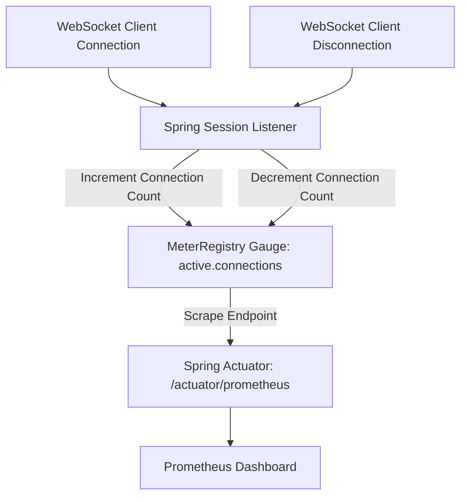

# Module 09: Testing & Monitoring — Integration Tests & Micrometer Metrics

Welcome back, class. Today we analyze **Testing and Monitoring WebSocket Architectures (CS-520)**.

Unlike REST endpoints that can be tested using mock MVC environments (`MockMvc`), WebSockets require a real, running servlet container to process the HTTP Upgrade handshake. Testing stateful connections, message routing, and exception handlers requires writing integration tests using **WebSocketStompClient**.

Furthermore, maintaining a healthy production cluster requires real-time observability. You must track active connection counts, message throughput, and connection error rates. Today, we will write integration tests and learn how to expose connection gauges using **Micrometer** and **Spring Boot Actuator**.

---

## 1. Academic Lecture: Observability & Test Environments

To verify and monitor stateful connections, we must run integration checks and bind metrics gauges.

### 1. Running Real Socket Integration Tests
Because WebSockets require upgrading a TCP connection, standard Spring MockMvc tests will bypass the handshake interceptor.
*   **The Solution**: We configure our test class with:
    
```java
@SpringBootTest(webEnvironment = SpringBootTest.WebEnvironment.RANDOM_PORT)
```
    
This runs a real embedded web server (Tomcat/Netty) on a random port. We then initialize a `WebSocketStompClient` using a standard JSR 356 client wrapper, connect to the port, and use `CompletableFuture` to block and verify message replies.

### 2. WebSocket Metrics and Micrometer Gauges
To monitor WebSockets in production, we track:
*   `websocket.active.connections`: A Gauge representing the number of currently open sockets.
*   `websocket.messages.received` & `websocket.messages.sent`: Counters representing message rate.

We bind these metrics to Micrometer's `MeterRegistry`. A Gauge is a metric that represents a single numerical value that can arbitrarily go up and down (like connection count), making it different from a Counter, which only increases.



---

## 2. Theory vs. Production Trade-offs

### Mock Tests vs. Real Server Integration Tests
*   **Mock Tests (using Mockito)**:
    *   *Pro*: Executed in milliseconds. Requires no servlet container.
    *   *Con*: Bypasses the handshake interceptors, network timeouts, and JSON serialization boundaries, which is where 90% of WebSocket bugs occur.
*   **Production Rule**: Always write at least one **Real Server Integration Test** that executes the handshake and sends messages over a real socket. Use mock tests only for internal message handler logic.

---

## 3. How to Use: Integration Tests and Micrometer Registries

Let us write a compile-grade integration test and a configuration class that binds active connections to a Micrometer Gauge.

### A. The Hardened Active Connection Registry Config

We bind a custom registry to a Micrometer Gauge using `MeterRegistry`.

```java
package com.capstone.security.ws.secure.monitoring;

import io.micrometer.core.instrument.Gauge;
import io.micrometer.core.instrument.MeterRegistry;
import org.springframework.context.annotation.Configuration;

import java.util.Map;
import java.util.concurrent.ConcurrentHashMap;

@Configuration
public class WebSocketMetricsConfiguration {

    // Registry tracking active sessions
    private final Map<String, String> activeConnections = new ConcurrentHashMap<>();

    public WebSocketMetricsConfiguration(MeterRegistry meterRegistry) {
        // SECURE: Bind the active connections map size to a Micrometer Gauge.
        // Prometheus will scrape this gauge value to plot active socket connections.
        Gauge.builder("websocket.active.connections", activeConnections, Map::size)
                .description("Number of active WebSocket connections")
                .tag("protocol", "STOMP")
                .register(meterRegistry);
    }

    public void registerSession(String sessionId, String username) {
        activeConnections.put(sessionId, username);
    }

    public void removeSession(String sessionId) {
        activeConnections.remove(sessionId);
    }
}
```

### B. The Hardened WebSocket Integration Test

Here is the integration test. It starts the server on a random port, establishes a connection, and waits for a message response using `CompletableFuture`.

```java
package com.capstone.security.ws.secure.tests;

import org.junit.jupiter.api.BeforeEach;
import org.junit.jupiter.api.Test;
import org.springframework.boot.test.context.SpringBootTest;
import org.springframework.boot.test.web.server.LocalServerPort;
import org.springframework.messaging.simp.stomp.StompFrameHandler;
import org.springframework.messaging.simp.stomp.StompHeaders;
import org.springframework.messaging.simp.stomp.StompSession;
import org.springframework.messaging.simp.stomp.StompSessionHandlerAdapter;
import org.springframework.web.socket.client.standard.StandardWebSocketClient;
import org.springframework.web.socket.messaging.WebSocketStompClient;

import java.lang.reflect.Type;
import java.util.concurrent.CompletableFuture;
import java.util.concurrent.TimeUnit;

import static org.junit.jupiter.api.Assertions.assertEquals;

@SpringBootTest(webEnvironment = SpringBootTest.WebEnvironment.RANDOM_PORT)
public class WebSocketRoutingIntegrationTest {

    @LocalServerPort
    private int port;

    private WebSocketStompClient stompClient;

    @BeforeEach
    public void setup() {
        // Initialize the STOMP client using standard JSR 356 socket client wrapper
        this.stompClient = new WebSocketStompClient(new StandardWebSocketClient());
    }

    @Test
    public void testSendMessageAndReceiveBroadcast() throws Exception {
        String wsUrl = "ws://localhost:" + port + "/ws-stomp";
        
        CompletableFuture<String> resultKeeper = new CompletableFuture<>();

        // Connect to the WebSocket server
        StompSession session = stompClient.connectAsync(wsUrl, new StompSessionHandlerAdapter() {})
                .get(5, TimeUnit.SECONDS);

        // Subscribe to target broadcast topic
        session.subscribe("/topic/public", new StompFrameHandler() {
            @Override
            public Type getPayloadType(StompHeaders headers) {
                return String.class; // Expected payload mapping
            }

            @Override
            public void handleFrame(StompHeaders headers, Object payload) {
                // Complete the future when a message frame is received
                resultKeeper.complete((String) payload);
            }
        });

        // Publish a test message to mapped controller path
        String testMessage = "{\"content\":\"Hello Integration Test\"}";
        session.send("/app/chat.sendMessage", testMessage);

        // SECURE: Wait for the async future response and assert correctness
        String receivedPayload = resultKeeper.get(5, TimeUnit.SECONDS);
        assertEquals(testMessage, receivedPayload);

        // Close the session
        session.disconnect();
    }
}
```

---

## 4. Common Errors & Pitfalls

### Pitfall 1: Bypassing the StompSessionHandler connection errors
Ignoring connection failure logs in StompSessionHandler callbacks when writing integration tests.
*   **Why it fails**: If the handshake fails (e.g. due to JWT rejection), the test throws a timeout exception on the `CompletableFuture.get()` method instead of reporting the actual handshake error.
*   **Mitigation**: Always implement the `handleTransportError` and `handleException` methods in your `StompSessionHandler` test classes to log connection failures immediately.

---

## 5. Socratic Review Questions

### Question 1
Why are Gauges preferred over Counters for tracking active WebSocket connection metrics in Prometheus?

#### Answer
*   **Counter**: A metric that only increases (e.g., total requests processed).
*   **Gauge**: A metric that represents a single numerical value that can arbitrarily go up and down.
Since WebSocket connections are stateful and users disconnect regularly, the number of active connections fluctuates constantly. A Counter would only tell us how many total connections have ever been opened, whereas a Gauge tells us the exact number of users online at any given second.

### Question 2
Explain why we use `CompletableFuture` in WebSocket integration tests.

#### Answer
WebSocket message transmission is asynchronous. The test thread executes `session.send(...)` and returns immediately. If the test thread continues running, it will complete the test before the server processes the message and returns the response. 
We use `CompletableFuture` to block the test thread, waiting until the asynchronously executed `handleFrame` callback receives the response and completes the future.

---

## 6. Hands-on Challenge: Writing a Stomp Test Client

### The Challenge
In this challenge, you will implement the connection handler for a STOMP integration test.

Your task is to write the `StompTestFrameHandler` implementation:
1.  Map the payload type to `String.class`.
2.  In the `handleFrame` method, cast the payload to String and complete the `CompletableFuture` future.

Complete the test handler below:

```java
package com.capstone.security.ws.challenge;

import org.springframework.messaging.simp.stomp.StompFrameHandler;
import org.springframework.messaging.simp.stomp.StompHeaders;

import java.lang.reflect.Type;
import java.util.concurrent.CompletableFuture;

public class StompTestFrameHandler implements StompFrameHandler {

    private final CompletableFuture<String> future;

    public StompTestFrameHandler(CompletableFuture<String> future) {
        this.future = future;
    }

    @Override
    public Type getPayloadType(StompHeaders headers) {
        // TODO: Complete this method to return the String class type.
        return null;
    }

    @Override
    public void handleFrame(StompHeaders headers, Object payload) {
        // TODO: Complete this method.
        // 1. Verify payload is not null.
        // 2. Cast the payload to a String.
        // 3. Call future.complete(payloadString) to unblock the test thread.
    }
}
```

Write the handler mappings. Save the completed class and explain why verifying payloads under real socket conditions prevents serialization failures in production inside `modules/09-testing-monitoring.md`.
