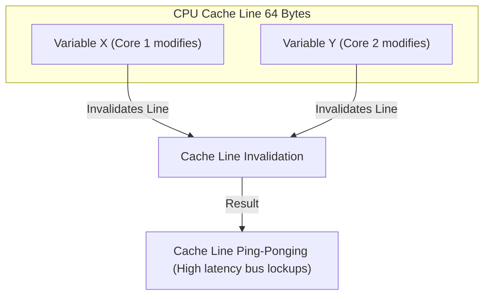

# Module 01: JVM Architecture & Memory Model — Hardware Realities and Memory Boundaries

Welcome, students. Today we analyze the physical execution boundaries of the Java Virtual Machine (JVM).

At senior engineering levels, performance optimization requires looking beyond the Java language specification and understanding how Java bytecode maps onto actual hardware. We will study the JVM runtime memory spaces (Metaspace, Heap, Thread Stacks, TLABs, and PLABs), dissect the **Java Memory Model (JMM)** happens-before guarantees, and analyze how CPU cache lines affect concurrent code performance through **False Sharing**.

---

## 1. Academic Lecture: The Physical Layout of JVM Memory

The JVM is an abstract stack-based execution engine. At runtime, the operating system allocates a single virtual process space to the JVM, which partitions it into distinct memory zones:

```
+-------------------------------------------------------------------------+
|                          JVM Process Space                              |
|                                                                         |
|  +--------------------+  +----------------------+  +-----------------+  |
|  |     Metaspace      |  |      Java Heap       |  |  Thread Stacks  |  |
|  |  (Class Metadata,  |  |  (Objects, TLABs,    |  |  (Frames, Local |  |
|  |   Method Cache)    |  |   Generational GCs)  |  |   Variables)    |  |
|  +--------------------+  +----------------------+  +-----------------+  |
|                                                                         |
|  +-------------------------------------------------------------------+  |
|  |                        Native Memory (Off-Heap)                   |  |
|  |                  (Direct ByteBuffers, JNI, Code Cache)            |  |
|  +-------------------------------------------------------------------+  |
+-------------------------------------------------------------------------+
```

### Heap Allocation Optimization: TLABs and PLABs

In multi-threaded Java applications, thousands of objects are allocated per second. If all threads allocated memory by querying a single global pointer on the heap, lock contention on the heap allocator would halt application performance.

To prevent this, the JVM uses:
*   **Thread-Local Allocation Buffers (TLABs)**: Each thread is pre-allocated a small, dedicated buffer inside the Heap's Young Generation (Eden space). When you call `new Object()`, the thread allocates the object inside its own TLAB without acquiring any global locks (a simple bump-the-pointer operation).
*   **Promotion-Local Allocation Buffers (PLABs)**: During garbage collection sweeps, when GC threads promote objects from the Young Generation to the Old Generation, they allocate memory using PLABs to prevent lock contention among parallel collector threads.

### The Java Memory Model (JMM) and Happens-Before

CPUs execute instructions out-of-order to maximize pipeline utilization, and write values to local registers or store buffers rather than writing immediately to main RAM. This means that without strict boundaries, Thread A can modify a variable, and Thread B may never see the update or see instructions executed in a different order.

The JMM defines the formal contract of visibility and instruction reordering through the **Happens-Before** relation:
*   **Volatile Variable Rule**: A write to a `volatile` variable happens-before any subsequent read of that same variable. Writing to a volatile variable flushes the CPU's local write buffers to main memory and invalidates the local caches of other CPU cores.
*   **Monitor Lock Rule**: An unlock on a monitor lock (exiting a `synchronized` block) happens-before any subsequent lock on that same monitor.
*   **Thread Start/Join Rules**: A call to `Thread.start()` happens-before any actions in the started thread. The termination of a thread happens-before a call to `Thread.join()` returns.

### Hardware Cache Lines and False Sharing

Modern CPUs read data from main RAM in chunks called **Cache Lines** (typically 64 bytes). 

If two variables, $X$ and $Y$, are stored next to each other in memory, they will reside on the same 64-byte cache line. If Thread A running on CPU Core 1 updates variable $X$, and Thread B running on CPU Core 2 updates variable $Y$ concurrently, the CPU hardware must invalidate the entire cache line across both cores to maintain cache coherency.



Even though the threads are modifying completely separate variables, they continuously lock and invalidate each other's local CPU caches. This performance-degrading anomaly is called **False Sharing**.

---

## 2. Theory vs. Production Trade-offs

### `@Contended` Padding vs. Memory Overhead
To prevent False Sharing, we can pad objects. In Java 8+, the JVM introduced the internal annotation `@jakarta.internal.vm.annotation.Contended` (or `@sun.misc.Contended` in older versions).
*   **How it works**: The JVM automatically adds 128 bytes of padding (empty bytes) around fields annotated with `@Contended`, ensuring they are isolated onto their own cache line.
*   **Trade-off**: Adding 128 bytes of padding to thousands of small objects increases memory consumption (Heap footprint) and reduces hardware L1/L2 cache utilization density, which can actually degrade performance if applied indiscriminately.

---

## 3. How to Use: Diagnosing False Sharing in Java 21

Let's write a complete, compile-grade Java 21 class that demonstrates the performance impact of False Sharing and how manual padding isolates cache lines.

```java
package com.capstone.jvm.memory;

import java.util.concurrent.CountDownLatch;
import java.util.logging.Logger;

/**
 * Benchmark class demonstrating False Sharing.
 * Compares unpadded variables on the same cache line against padded variables.
 */
public class FalseSharingBenchmark {
    private static final Logger LOGGER = Logger.getLogger(FalseSharingBenchmark.class.getName());
    private static final long ITERATIONS = 500_000_000L;

    // Unpadded structure: P1 and P2 will likely reside on the same 64-byte cache line
    public static final class UnpaddedData {
        public volatile long p1 = 0L;
        public volatile long p2 = 0L;
    }

    // Padded structure: Adds 15 long fields (120 bytes) to force p1 and p2 onto different cache lines
    public static final class PaddedData {
        public volatile long p1 = 0L;
        // 15 longs * 8 bytes = 120 bytes of padding. Ensures p2 sits on a distinct cache line.
        public long pad1, pad2, pad3, pad4, pad5, pad6, pad7, pad8, pad9, pad10, pad11, pad12, pad13, pad14, pad15;
        public volatile long p2 = 0L;
    }

    public static void main(String[] args) throws InterruptedException {
        LOGGER.info("Starting False Sharing Benchmark...");

        // Test Unpadded Data
        UnpaddedData unpadded = new UnpaddedData();
        long startUnpadded = System.currentTimeMillis();
        runThreads(() -> {
            for (long i = 0; i < ITERATIONS; i++) unpadded.p1++;
        }, () -> {
            for (long i = 0; i < ITERATIONS; i++) unpadded.p2++;
        });
        long durationUnpadded = System.currentTimeMillis() - startUnpadded;
        LOGGER.info("Unpadded Execution Time: " + durationUnpadded + " ms");

        // Test Padded Data
        PaddedData padded = new PaddedData();
        long startPadded = System.currentTimeMillis();
        runThreads(() -> {
            for (long i = 0; i < ITERATIONS; i++) padded.p1++;
        }, () -> {
            for (long i = 0; i < ITERATIONS; i++) padded.p2++;
        });
        long durationPadded = System.currentTimeMillis() - startPadded;
        LOGGER.info("Padded Execution Time: " + durationPadded + " ms");

        double speedup = (double) durationUnpadded / durationPadded;
        LOGGER.info(String.format("Isolated cache lines achieved a %.2fx performance speedup!", speedup));
    }

    private static void runThreads(Runnable r1, Runnable r2) throws InterruptedException {
        CountDownLatch latch = new CountDownLatch(2);
        
        Thread t1 = new Thread(() -> {
            r1.run();
            latch.countDown();
        });

        Thread t2 = new Thread(() -> {
            r2.run();
            latch.countDown();
        });

        t1.start();
        t2.start();
        latch.await();
    }
}
```

---

## 4. Common Errors & Pitfalls

### Pitfall 1: Assuming `volatile` guarantees Thread-Safety
A common mistake is believing `volatile` variables prevent race conditions on complex updates.
*   **Why it fails**: `volatile` only guarantees **visibility** and **ordering**, not **atomicity**. 
    Executing `counter++` on a volatile variable is compiled as three separate operations: read value, increment value, write value. If two threads execute this concurrently, updates will overwrite each other.
*   **Mitigation**: For atomic updates, use locks (`synchronized`) or atomic wrapper classes (`AtomicLong`, `VarHandle`).

### Pitfall 2: Memory leak inside ThreadLocal maps
Creating a `ThreadLocal` reference and failing to call `.remove()` before the worker thread finishes.
*   **Symptom**: Out-of-memory errors in Metaspace or Old Gen.
*   **Why**: The thread stores values in a thread-local map. If the thread is returned to a pool (e.g., Tomcat servlet threads), the map retains the reference to the ClassLoader of the application. This prevents the application context from being garbage collected when it is undeployed.

---

## 5. Socratic Review Questions

### Question 1
Explain why a CPU core must invalidate its local cache copy of a cache line when another CPU core writes to a variable on that same cache line. What hardware protocol manages this synchronization?

#### Answer
To prevent inconsistent state values across the CPU cores (e.g., Core 1 reading an old value of $X$ while Core 2 has modified it), hardware enforces **Cache Coherency**. 

This is typically managed using the **MESI** protocol (or extensions like MOESI). MESI classifies cache line states into four types:
*   **M (Modified)**: Core has updated the line; it is dirty and must be written back to RAM.
*   **E (Exclusive)**: Core has the line; it matches RAM.
*   **S (Shared)**: Multiple cores have read-only copies of the line.
*   **I (Invalid)**: The line contains invalid data.

When Core 2 writes to variable $Y$, it sends an invalidation broadcast over the CPU bus. Core 1 detects this broadcast. Because Core 1 contains the same cache line (due to variable $X$ sitting on it), Core 1 must immediately mark its entire local cache copy of the line as **Invalid (I)**. When Core 1 subsequently attempts to read or write to $X$, it suffers a cache miss and must fetch the line from Core 2's cache or main RAM, adding latency.

### Question 2
What is the difference between Young Gen **TLABs** and Old Gen **PLABs**? Why are they allocated in different regions of the Heap?

#### Answer
*   **TLABs (Thread-Local Allocation Buffers)** are allocated inside the Young Generation (specifically the Eden space) for application thread writes. They prevent allocation lock contention during standard execution when new objects are instantiated.
*   **PLABs (Promotion-Local Allocation Buffers)** are allocated inside the Old Generation for GC thread writes. During garbage collection sweeps, surviving objects from the Young Generation are promoted to the Old Generation. Because promotion is handled by multiple parallel GC worker threads, allocating promoted objects directly on the Old Gen heap would create thread contention. PLABs provide each GC thread with an isolated Old Gen buffer, keeping garbage collection sweeps fast and lock-free.

---

## 6. Hands-on Challenge: Implementing a Cache-Aligned Ring Buffer

### The Challenge
In high-frequency trading (HFT) architectures, ring buffers are used to pass messages between threads with microsecond latencies. To prevent write collisions, the read pointer (consumer index) and the write pointer (producer index) must be isolated onto separate cache lines.

Your task is to write a padded index holder class containing a producer index and a consumer index. The two indexes must be separated by at least 15 long variables (120 bytes) to guarantee they never share a cache line.

Complete the padded index container class below:

```java
package com.capstone.jvm.memory.challenge;

public class CacheAlignedRingBufferIndices {

    // TODO: Implement the class fields.
    // 1. Declare a volatile long field 'producerIndex'.
    // 2. Add 15 long padding fields (e.g. pad1, pad2, ..., pad15).
    // 3. Declare a volatile long field 'consumerIndex'.
    
    // Default constructor
    public CacheAlignedRingBufferIndices() {}

    /**
     * Updates the producer index.
     */
    public void incrementProducer() {
        // TODO: Increment producerIndex
    }

    /**
     * Updates the consumer index.
     */
    public void incrementConsumer() {
        // TODO: Increment consumerIndex
    }
}
```

Write your implementation and document the latency differences between padded indexes and unpadded indexes under multi-threaded contention. Save your solution notes inside `modules/01-jvm-architecture-memory-model.md`.
