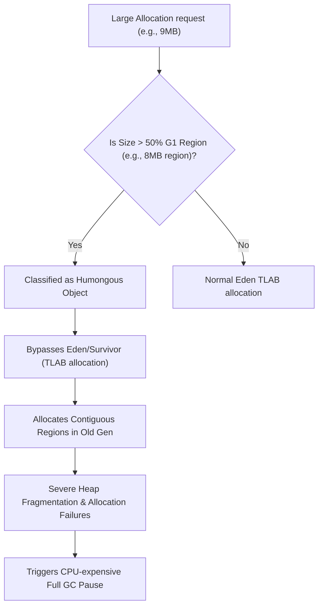

# Module 02: G1 GC Mechanics — Regional Garbage Collection and Humongous Allocations

Welcome back, students. Today we analyze the inner workings of the **Garbage-First (G1) Garbage Collector**.

Java developers rely on automatic memory management. However, at high throughput, garbage collection pauses can violate SLAs. To optimize collection, we must study the **Generational Hypothesis**, master G1's regional layout, explore **Remembered Sets (RSets)** and **Card Tables**, and understand how **Humongous Allocations** can fragment the heap and trigger expensive Full GC pauses.

---

## 1. Academic Lecture: The Mechanics of G1 GC

Garbage collection engines rely on the **Generational Hypothesis**: the mathematical observation that the majority of allocated objects in software have a very short lifespan (temporary variables, short-lived buffers) and die shortly after allocation. 

To exploit this, the JVM divides memory into the Young Generation (Eden, Survivor) and the Old Generation.

### The G1 Regional Layout

Unlike traditional collectors (like Parallel or CMS) which allocate memory in large, contiguous Young and Old Gen blocks, G1 partitions the heap into equal-sized logical regions (ranging from 1MB to 32MB depending on heap capacity, up to 2048 regions total).

```
+----+----+----+----+
| E  | O  | E  | S  |   E = Eden Region
+----+----+----+----+   S = Survivor Region
| S  | H  | O  | O  |   O = Old Gen Region
+----+----+----+----+   H = Humongous Region (Contiguous)
| E  | H  | S  | E  |
+----+----+----+----+
```

Each region is assigned a logical type dynamically: Eden, Survivor, or Old. When garbage collection runs, G1 targets regions with the highest amount of reclaimable garbage first—hence the name **Garbage-First**.

### Remembered Sets (RSets) and Card Tables

To collect a region in isolation, the GC must know if there are references pointing into that region from *other* regions. Scanning the entire heap to find these references would take too long.

G1 solves this using:
*   **Card Table**: A memory array where each byte (a "card") represents a 512-byte chunk of the heap. When a thread modifies an object reference, the JVM executes a **Write Barrier** that marks the card containing that object as "dirty."
*   **Remembered Set (RSet)**: Each region has its own RSet. A background thread pool (Concurrent Refinement Threads) processes dirty cards and updates the RSet of the target region, recording which external regions contain references pointing into it. During a Young GC, the collector only scans the target region's RSet, keeping pause times short.

### The Hazard of Humongous Allocations

An object is classified as **Humongous** if its size exceeds **50% of a G1 region size**.

When a humongous object (typically a large byte array or string) is allocated:
1.  It cannot be allocated inside a TLAB.
2.  It is allocated directly into the Old Generation.
3.  If it is larger than one region, it must be allocated in **contiguous Humongous Regions**.



#### The Performance Impact of Humongous Objects:
Because humongous objects require contiguous memory blocks, allocating many of them quickly fragments the heap. If G1 cannot find enough contiguous regions to satisfy a humongous request, it triggers an immediate **Full GC pause** (a single-threaded, Stop-The-World event that sweeps and compacts the entire heap), causing severe latency spikes.

---

## 2. Theory vs. Production Trade-offs

### Manually Setting Region Size
G1 calculates region sizes automatically based on heap size. However, you can tune it using:
`-XX:G1HeapRegionSize=16m` (Must be a power of 2, from 1MB to 32MB).
*   **Pros**: Increasing region size (e.g., from 4MB to 16MB) changes the humongous threshold (from 2MB to 8MB). Objects that were previously classified as humongous are now allocated inside standard Eden regions, eliminating contiguous Old Gen allocation bottlenecks.
*   **Cons**: Larger regions can reduce collection granularity. G1 has fewer regions to choose from, which can increase collection pause times because each region contains more objects to copy.

---

## 3. How to Use: Triggering Humongous Allocations in Java 21

Let's write a complete, compile-grade Java 21 class that programmatically triggers humongous allocations, showing how allocations bypass the Young generation.

```java
package com.capstone.jvm.gc;

import java.util.ArrayList;
import java.util.List;
import java.util.logging.Logger;

/**
 * Script simulating high-volume large buffer allocations.
 * To observe the humongous allocation warnings, run this JVM with:
 * -XX:+UseG1GC -XX:G1HeapRegionSize=2m -Xms64m -Xmx64m -Xlog:gc*=debug
 */
public class HumongousAllocationSimulator {
    private static final Logger LOGGER = Logger.getLogger(HumongousAllocationSimulator.class.getName());

    // Allocates chunks slightly larger than 50% of the G1 Region Size (2MB region size -> 1.1MB allocation)
    private static final int HUMONGOUS_ALLOCATION_SIZE = 1_150_000; 

    public static void main(String[] args) throws InterruptedException {
        LOGGER.info("Starting G1 GC Humongous Allocation Simulator...");
        LOGGER.info("JVM Region size should be set to 2MB for testing.");

        List<byte[]> allocationHolder = new ArrayList<>();

        try {
            for (int i = 1; i <= 30; i++) {
                LOGGER.info("Executing allocation iteration #" + i);
                
                // Allocate a byte array. This bypasses TLAB and goes straight to Old Gen
                byte[] largeBuffer = new byte[HUMONGOUS_ALLOCATION_SIZE];
                
                // Keep references to prevent immediate collection
                allocationHolder.add(largeBuffer);

                // Release older allocations periodically to create fragmentation gaps
                if (allocationHolder.size() > 5) {
                    allocationHolder.remove(0);
                }

                Thread.sleep(100); // Allow logs to compile
            }
        } catch (OutOfMemoryError oom) {
            LOGGER.severe("OutOfMemoryError triggered! Heap fragmented by humongous allocations.");
        }
    }
}
```

---

## 4. Common Errors & Pitfalls

### Pitfall 1: High Promotion Rates (Premature Promotion)
Allocating medium-lived objects that survive Young GC collections and get promoted to the Old Generation, only to die shortly after.
*   **Symptom**: Frequent mixed GC pauses or high heap utilization.
*   **Mitigation**: Increase Young Generation size using `-XX:G1NewSizePercent` or tune survivor ratios to keep objects in Young Gen longer.

### Pitfall 2: Too many Concurrent Refinement Threads
If card write barriers dirty cards faster than refinement threads can process them.
*   **Symptom**: Application threads block, waiting for card refinement to complete, degrading throughput.
*   **Mitigation**: Increase refinement threads manually using `-XX:G1ConcRefinementThreads`.

---

## 5. Socratic Review Questions

### Question 1
Explain the relationship between the **Card Table** and the **Remembered Set (RSet)** in G1 GC. How do they work together during write operations?

#### Answer
The Card Table is a global, flat byte array representing the entire heap in 512-byte segments ("cards"). 

When a thread executes a reference write (e.g., setting a field `obj.field = ref`), the JVM executes an JIT-injected **Write Barrier**. This write barrier marks the card containing `obj` as **dirty** (setting its value in the Card Table array to a dirty flag, typically `0x01`).

The **Remembered Set (RSet)** is a regional structure. G1 Concurrent Refinement Threads continuously scan the global Card Table for dirty cards. When they locate a dirty card, they check which objects reside on it and update the RSet of the region containing the referenced objects, recording the incoming pointer. This offloads pointer tracking to background threads, allowing G1 to scan only local RSets during Young GC sweeps.

### Question 2
Why are humongous objects allocated directly into the Old Generation, bypassing the Eden and Survivor spaces?

#### Answer
Humongous objects bypass the Young Generation because G1's Young Generation is collected using a **Copying algorithm**. During a Young GC, all surviving objects in Eden and Survivor are copied to a new Survivor or Old Gen region. 

If a humongous object (e.g., a 10MB byte array) were allocated in Eden, copying it during every Young GC would consume massive amounts of CPU cycles and memory bandwidth. By allocating it directly in the Old Generation, G1 avoids copying the object, managing it in place and reclaiming it asynchronously during concurrent mark phases.

---

## 6. Hands-on Challenge: G1 Region Size Evaluator

### The Challenge
In this challenge, you will implement the logic for a G1 allocation validator. 

Given the total Heap size and a manually configured Region size, you must determine:
1.  The actual G1 region size (defaulting to G1 calculation rules if no manual region size is set).
2.  Whether an incoming object allocation of a specified byte size will trigger a Humongous allocation.

Complete the checking logic inside the class below:

```java
package com.capstone.jvm.gc.challenge;

public class G1RegionSizeEvaluator {

    /**
     * Determines the G1 Region Size based on Heap size.
     * G1 Heap region size ranges from 1MB to 32MB (powers of 2) targeting 2048 regions.
     * 
     * @param heapSizeMaxBytes max heap size (Xmx)
     * @param manualRegionSizeOverrideBytes manual region size (0 if not set)
     * @return resolved G1 region size in bytes
     */
    public long resolveRegionSize(long heapSizeMaxBytes, long manualRegionSizeOverrideBytes) {
        if (manualRegionSizeOverrideBytes > 0) {
            return manualRegionSizeOverrideBytes;
        }

        // TODO: Complete this implementation.
        // Target 2048 regions by evaluating: heapSizeMaxBytes / 2048.
        // Round the result to the nearest power of 2 between 1MB (1,048,576) and 32MB (33,554,432).
        return 1_048_576L;
    }

    /**
     * Returns true if the allocation size is considered a Humongous allocation.
     */
    public boolean isHumongous(long allocationSizeBytes, long resolvedRegionSizeBytes) {
        // TODO: Complete this check.
        // Returns true if allocationSizeBytes > 50% of resolvedRegionSizeBytes.
        return false;
    }
}
```

Write your code and verify the humongous classification rules. Save your solution notes inside `modules/02-garbage-collection-foundations-g1.md`.
