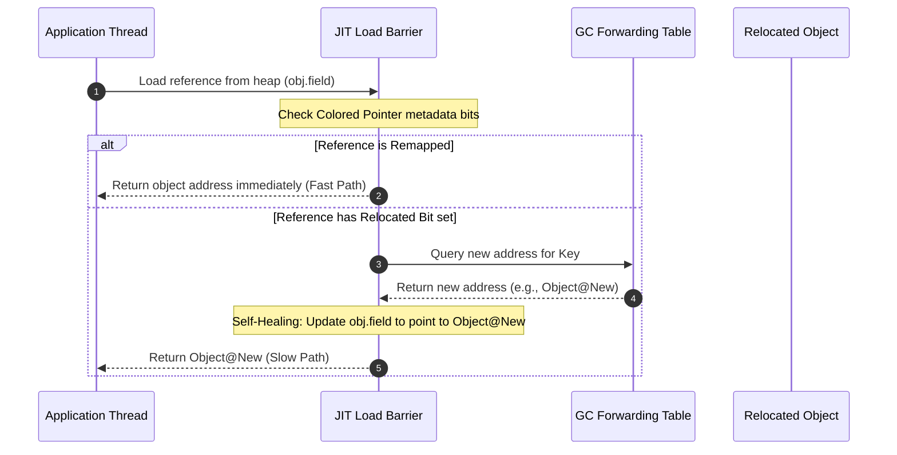

# Module 03: Modern Low-Latency GCs — ZGC, Shenandoah, and Concurrent Compaction

Welcome back, students. Today we analyze the cutting-edge of JVM garbage collection: **ZGC (Z Garbage Collector)** and **Shenandoah**.

In Module 2, we learned that G1 GC keeps pause times low by selecting specific regions to sweep. However, G1 still requires Stop-The-World (STW) pauses to copy and compact surviving objects. For large heap sizes (e.g., 64GB to 16TB), copying gigabytes of objects can pause the JVM for seconds. To break this limitation, modern JVMs utilize concurrent collectors designed to keep pauses **under 1 millisecond** regardless of heap size. We will study the mechanics of **Colored Pointers**, **Load Barriers**, **Concurrent Compaction**, and **Thread-Local Handshakes**.

---

## 1. Academic Lecture: How ZGC and Shenandoah Eliminate Pauses

Traditional collectors compact memory by stopping all application threads, moving objects to new addresses, and updating all references pointing to them. 

ZGC and Shenandoah achieve sub-millisecond pauses by executing **compaction concurrently**—moving objects while application threads are actively reading and writing to them.

### ZGC Colored Pointers

ZGC achieves concurrent compaction using **Colored Pointers**. On 64-bit systems, memory references are 64 bits wide. ZGC does not use the entire 64 bits for the object's physical address. Instead, it partitions the reference pointer:

```
+--------------------+-------------+---------------------------------------+
| 16 Bits (Unused)   | 4 Metadata  |         44 Bits (Object Address)      |
|                    |   Bits      |          (Up to 16 Terabytes)         |
+--------------------+-------------+---------------------------------------+
                       | | | |
                       | | | +-- Finalizable (Reference processed by finalizers)
                       | | +---- Remapped (Address points to the new location)
                       | +------ Marked1 (Object is alive)
                       +-------- Marked0 (Object is alive)
```

By encoding GC metadata inside the pointer, ZGC can check the state of an object reference directly from the reference address itself, without reading the object's header fields in memory.

### Load Barriers and Self-Healing References

If a GC thread moves an object concurrently, what happens if an application thread attempts to read it? 

To prevent the application from reading stale data, ZGC utilizes **Load Barriers**. A load barrier is a small sequence of assembly instructions injected by the JIT compiler whenever a reference is loaded from the heap (e.g., executing `obj.field`).



1.  The application thread loads a reference.
2.  The **Load Barrier** checks the colored pointer metadata. If the `Remapped` bit is set, the reference is safe (Fast Path - takes under 1 nanosecond).
3.  If the `Remapped` bit is clear, the load barrier executes its slow path. It queries the ZGC **Forwarding Table** to find the object's new address.
4.  The load barrier updates the reference field in the heap with the new address (an operation called **Self-Healing**).
5.  Subsequent loads of this field bypass the slow path, returning the remapped address immediately.

### Thread-Local Handshakes

To initiate GC phases (such as marking start), ZGC does not execute a global Stop-The-World pause. 

Instead, it uses **Thread-Local Handshakes**. The JVM executes callbacks on individual application threads one by one. While Thread 1 executes its handshake callback, Threads 2 and 3 continue running business logic, preventing cluster-wide pause spikes.

---

## 2. Theory vs. Production Trade-offs

### Throughput vs. Latency (ZGC vs. G1)
ZGC achieves sub-millisecond pauses, but it has a **throughput penalty**:
*   *Load Barrier overhead*: Every object reference load executes the JIT-injected check, consuming CPU cycles.
*   *Concurrent CPU usage*: GC threads run concurrently with application threads, consuming CPU cores that would otherwise process business queries.
If your application can tolerate 100ms pause times (G1), G1 GC will typically yield higher maximum write throughput than ZGC. If your SLA requires strict <10ms pauses (HFT, interactive games), ZGC is mandatory.

---

## 3. How to Use: Activating ZGC in Java 21

In Java 21, the default collector is still G1. To enable ZGC, you pass startup flags. 

In Java 21, ZGC was updated to support **Generational ZGC**, which divides the heap into young and old logical generation spaces concurrently, improving reclaim speed.

```bash
# Enable ZGC (Non-Generational)
java -XX:+UseZGC -Xms8g -Xmx8g -jar app.jar

# Enable Generational ZGC (Recommended for Java 21)
java -XX:+UseZGC -XX:+ZGenerational -Xms8g -Xmx8g -jar app.jar
```

### ZGC Tuning Flags
*   `-XX:ConcGCThreads=<N>`: Controls the number of concurrent GC worker threads. If GC thread CPU usage is too high, reduce this number (sacrificing reclaim speed).
*   `-XX:+SoftRefLRUPolicyMSPerMB`: Controls how quickly Soft References are garbage collected (useful for memory caches).

---

## 4. Common Errors & Pitfalls

### Pitfall 1: Allocation Stalls (Allocation Rate > Reclaim Rate)
If your application instantiates objects faster than ZGC's concurrent threads can sweep and reclaim memory.
*   **Symptom**: The application threads block completely (entering an **Allocation Stall**). Pause times spike from microseconds to seconds while the collector blocks allocation to catch up.
*   **Mitigation**: Increase heap size (`-Xmx`) or allocate more GC workers using `-XX:ConcGCThreads`.

### Pitfall 2: High Thread count CPU Starvation
Running ZGC on container environments with restricted CPU shares (e.g., 2 CPU limits in Kubernetes).
*   **Symptom**: Extremely high CPU usage and degraded query performance.
*   **Why**: ZGC spawn threads based on physical core counts. In restricted container environments, GC threads compete with application threads, causing context-switching thrashing.
*   **Mitigation**: Explicitly configure `-XX:ConcGCThreads` to match the container's allocated CPU shares.

---

## 5. Socratic Review Questions

### Question 1
Explain the concept of **Self-Healing** inside a ZGC Load Barrier. What occurs to the reference pointer in memory during a slow path execution?

#### Answer
Self-healing is a JIT compiler optimization that ensures that the performance penalty of resolving relocated objects is paid exactly **once** per reference field.

When an application thread loads a reference (e.g., `user.profile`) and the load barrier detects that the object has been moved by ZGC but the pointer still has stale metadata bits (the `Remapped` bit is 0), the load barrier enters its slow-path execution:
1.  It queries ZGC's global forwarding table using the stale address to locate the new physical memory address of the `Profile` object.
2.  It atomically updates the memory field of the parent `user` object (`user.profile`) to point directly to the new address.
3.  It sets the `Remapped` metadata bit of this new pointer to 1.
When this thread (or any other thread) subsequently executes `user.profile`, the load barrier checks the pointer, sees the `Remapped` bit is 1, and immediately returns the address without querying the forwarding table. The reference has "healed" itself in memory.

### Question 2
Why does ZGC not require Stop-The-World pauses to perform heap compaction, whereas G1 GC does?

#### Answer
G1 GC requires STW pauses during compaction because when it moves objects to new regions, it cannot allow application threads to access those objects until all references pointing to them are updated. If an application thread attempted to write to an object while a GC thread was copying it, the write could be lost or read stale state, violating safety.

ZGC eliminates this pause using the **Load Barrier** and **Forwarding Table**. When ZGC moves an object, it leaves a redirect entry in the forwarding table. Even if the application thread loads the old reference while compaction is running, the Load Barrier intercepts the read, redirects the thread to the new copy, and updates the reference dynamically. This ensures that the application always reads the consistent, up-to-date copy of the object, allowing compaction to run concurrently with business logic.

---

## 6. Hands-on Challenge: Simulating a Load Barrier

### The Challenge
In this challenge, you will implement the logic for a ZGC Load Barrier simulator. 

Given an object reference containing simulated metadata bits (represented as long flags) and a forwarding table map, you must:
1.  Evaluate the `Remapped` status bit of the pointer.
2.  If the pointer is not remapped, query the forwarding table to locate the new address, update the pointer's address, and set its remapped flag.

Complete the load barrier processing logic inside the class below:

```java
package com.capstone.jvm.gc.challenge;

import java.util.HashMap;
import java.util.Map;

public class LoadBarrierSimulator {

    public record SimulatedPointer(long address, boolean isRemapped) {}

    private final Map<Long, Long> forwardingTable = new HashMap<>();

    public LoadBarrierSimulator() {
        // Setup forwarding coordinates (oldAddress -> newAddress)
        forwardingTable.put(0x1000L, 0x5000L);
        forwardingTable.put(0x2000L, 0x6000L);
    }

    /**
     * Simulates the JIT-injected Load Barrier execution.
     * If the pointer is already remapped, returns it immediately (Fast Path).
     * If not remapped, performs self-healing by querying the forwardingTable,
     * updating the address, and marking it as remapped (Slow Path).
     * 
     * @param inputPointer the pointer loaded from memory
     * @return the healed and remapped pointer
     * @throws IllegalStateException if the old address cannot be found in the forwarding table
     */
    public SimulatedPointer resolveReference(SimulatedPointer inputPointer) {
        // TODO: Complete this implementation.
        // 1. Check if inputPointer.isRemapped() is true. Return if true.
        // 2. If false, query forwardingTable using inputPointer.address().
        // 3. If missing in forwarding table, throw IllegalStateException.
        // 4. Return a new SimulatedPointer containing the new address and isRemapped = true.
        return inputPointer;
    }
}
```

Write your code and verify the load barrier self-healing transitions. Save your solution notes inside `modules/03-modern-low-latency-gcs.md`.
