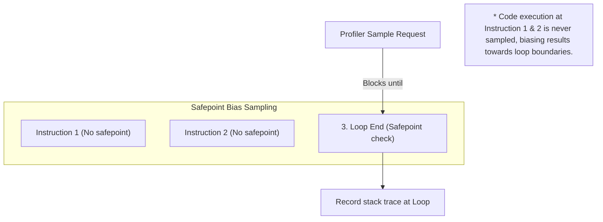

# Module 06: CPU Profiling & Execution Analysis — Flame Graphs and Safepoint Bias

Welcome back, students. Today we analyze **CPU Profiling** and **Execution Analytics**.

When a Java service consumes 100% CPU, or latency drops under load, you must isolate the hot execution paths. We will study the difference between **Sampling** and **Instrumentation** profiling, explore the structural problem of **Safepoint Bias**, analyze **Async Profiler** mechanics, learn how to read **Flame Graphs**, and write a Java program executing contrasting CPU-bound and lock-blocked tasks.

---

## 1. Academic Lecture: How Profilers See Your Code

To analyze where CPU cycles are consumed, profiling tools use two primary techniques:

### 1. Instrumentation Profiling
The profiler modifies the loaded class bytecode (either at compile time or dynamically during class loading via a Java Agent). It injects starting and stopping timer hooks at the entry and exit of every method.
*   **Pros**: 100% accurate call counts; registers every execution path.
*   **Cons**: Massive performance overhead. Invoking the system timer millions of times per second can slow down the application by 2x to 10x, distorting the very latency metrics you want to measure.

### 2. Sampling Profiling
The profiler periodically (e.g., every 10ms) polls the JVM to ask: "What stack trace is each active thread currently executing?"
*   **Pros**: Extremely low overhead (< 2% CPU impact); safe to run in production.
*   **Cons**: Statistical estimation; can miss brief method executions that occur between sampling ticks.

### The Problem of Safepoint Bias

Most traditional sampling profilers (such as VisualVM or standard JProfiler sampling) rely on the JVM API `Thread.getAllStackTraces()`. 

To return stack traces, the JVM forces a **Safepoint**—halting all application threads to ensure references do not move. However, the JVM can only halt a thread at specific safepoint checks injected by the JIT compiler (typically at loop boundaries or method exits). 



Consequently, the profiler only records stack traces when threads reach these safepoints, creating a distorted view that biases CPU hot spots toward loop exits and method boundaries.

### Async Profiler: Non-Safepoint Profiling

**Async Profiler** eliminates Safepoint Bias. It bypasses JVM safepoints by utilizing:
1.  **OS Kernel Timers**: Using Linux `perf_events` or hardware performance counters to intercept running instructions.
2.  **`AsyncGetCallTrace`**: An internal, non-safepoint JVM API that can read the execution stack of a running thread at any instruction boundary without halting other threads.

### Reading Flame Graphs

Async Profiler outputs results as **Flame Graphs**:

```
[  userService.processOrder (100% wide)  ]
[  orderRepository.save (60% wide)   ][ paymentClient.charge (40% wide) ]
[  jdbcConnection.execute (50% wide) ][ httpSocket.write (40% wide)      ]
```

*   **Width**: Represents the percentage of total CPU time spent executing that method (and its child calls).
*   **Stack Depth**: Represents the call stack depth (the root is at the bottom, leaf methods at the top).
*   **Color**: Commonly randomized or used to categorize class types (e.g., green for Java, yellow for C++, red for kernel).
*   *Crucial Rule*: The horizontal axis does **not** represent time flow or execution order. It is simply an alphabetical sorting of method names to maximize space.

---

## 2. Theory vs. Production Trade-offs

### Sampling Interval vs. Overhead
*   *Frequent Sampling* (e.g., interval = 1ms): High resolution, captures microsecond execution spikes, but increases CPU overhead.
*   *Standard Sampling* (e.g., interval = 10ms): Low resolution, but safe to run indefinitely in production.

---

## 3. How to Use: Executing Contrasting Workloads in Java 21

Let's write a complete, compile-grade Java 21 class that runs a CPU-intensive mathematical loop alongside a lock-blocked task. This allows you to profile the JVM and see how CPU profilers isolate actual execution cycles from sleep states.

```java
package com.capstone.jvm.profiling;

import java.security.MessageDigest;
import java.security.NoSuchAlgorithmException;
import java.util.concurrent.ExecutorService;
import java.util.concurrent.Executors;
import java.util.concurrent.locks.ReentrantLock;
import java.util.logging.Logger;

/**
 * Execution workloads designed for CPU and Thread profiling.
 * Profile this class using JProfiler or VisualVM to observe:
 * 1. CPU Hotspot: The MD5 hashing calculations.
 * 2. Thread Block: The locks contention queue.
 */
public class ProfilingTargetApp {
    private static final Logger LOGGER = Logger.getLogger(ProfilingTargetApp.class.getName());

    private final ReentrantLock sharedLock = new ReentrantLock();

    public static void main(String[] args) throws InterruptedException {
        LOGGER.info("Starting Profiling Target Application...");
        ProfilingTargetApp app = new ProfilingTargetApp();

        ExecutorService threadPool = Executors.newFixedThreadPool(4);

        // Submitting two contrasting tasks to the pool
        threadPool.submit(app::executeCpuHeavyTask);
        threadPool.submit(app::executeLockContestedTask);
        threadPool.submit(app::executeLockContestedTask);

        Thread.sleep(30_000); // Run for 30 seconds to allow profiling capture
        threadPool.shutdownNow();
        LOGGER.info("Application execution complete.");
    }

    /**
     * Task 1: Highly CPU-bound. Executes continuous mathematical hashing loops.
     */
    public void executeCpuHeavyTask() {
        LOGGER.info("CPU heavy task started on thread: " + Thread.currentThread().getName());
        try {
            MessageDigest md = MessageDigest.getInstance("MD5");
            long counter = 0;
            while (!Thread.currentThread().isInterrupted()) {
                String input = "DataHashTargetBlock-" + counter;
                md.update(input.getBytes());
                byte[] hash = md.digest();
                counter++;
            }
        } catch (NoSuchAlgorithmException e) {
            LOGGER.severe("Hashing algorithm not found");
        }
    }

    /**
     * Task 2: Highly lock-bound. Threads block waiting for a contested lock.
     * Consumes zero CPU while waiting, but shows up on thread dumps.
     */
    public void executeLockContestedTask() {
        LOGGER.info("Lock contested task started on thread: " + Thread.currentThread().getName());
        while (!Thread.currentThread().isInterrupted()) {
            sharedLock.lock();
            try {
                // Hold the lock for 200ms to block competing threads
                Thread.sleep(200);
            } catch (InterruptedException e) {
                Thread.currentThread().interrupt();
            } finally {
                sharedLock.unlock();
            }
            
            // Wait briefly before re-acquiring
            try {
                Thread.sleep(10);
            } catch (InterruptedException e) {
                Thread.currentThread().interrupt();
            }
        }
    }
}
```

---

## 4. Common Errors & Pitfalls

### Pitfall 1: Confusing Wall-Clock Time with CPU Time
Profiling using "Wall-Clock" mode when looking for CPU bottlenecks.
*   **Why it fails**: Wall-clock profiling measures total elapsed time, including time threads spend sleeping on locks, database sockets, or network IO. A database query method will appear wide on the flame graph, leading you to believe it is consuming CPU when it is actually idle waiting for the database response.
*   **Mitigation**: Use CPU time mode (only counting time threads spend in the `RUNNABLE` state on CPU cores) to locate calculation bottlenecks.

### Pitfall 2: Disregarding Inlining in CPU Traces
Assuming all executed methods will appear on the profiler call tree.
*   **Why**: The JIT compiler inline hot method calls (embedding child method instructions directly into the parent method). Inlined methods will disappear from the profiler stack, appearing as if the parent method is executing all instructions.
*   **Mitigation**: Compile with `-XX:-Inline` only during deep diagnostic stages to verify call chains.

---

## 5. Socratic Review Questions

### Question 1
Explain the concept of **Safepoint Bias** and why it invalidates results from traditional sampling profilers.

#### Answer
Safepoint Bias is a diagnostic error where a profiler only samples thread stacks at JVM **Safepoints**. 

When a profiler calls `Thread.getAllStackTraces()`, the JVM halts all threads. To do this safely, application threads must reach JIT-injected safepoint checks. 

The JIT compiler does not inject safepoint checks at every assembly instruction. It typically places them at the end of loops, before method returns, or during memory allocations. Instructions that execute between these checks (e.g., arithmetic operations or flat instructions) are never running when a safepoint occurs. Consequently, the profiler never samples threads executing these intermediate instructions, biasing results toward loops and allocations, and missing actual CPU hotspots.

### Question 2
In a CPU Flame Graph, what does a wide method block represent? Does it mean the method is slow?

#### Answer
A wide method block represents the **percentage of total CPU samples** that captured the thread executing that method (or its child calls) during the profiling run. 

It does not necessarily mean the method is "slow" or poorly written. A method can appear wide because:
1.  It is executed millions of times (high call volume).
2.  It executes a heavy mathematical loop (high CPU utilization).
3.  It calls down into slow, CPU-intensive child operations.
To determine if it is a bottleneck, you must analyze if the work performed matches business expectations, or if the method's width can be reduced by caching results or optimizing algorithms.

---

## 6. Hands-on Challenge: Flame Graph Parser

### The Challenge
In this challenge, you will implement a simplified Flame Graph data parser. 

Given a list of trace samples representing call paths and sample counts (in the standard collapsed format used by Async Profiler: `parent;child;leaf count`), you must write a method that calculates the percentage of total CPU samples spent on a specific target method leaf.

Complete the parsing calculation logic below:

```java
package com.capstone.jvm.profiling.challenge;

import java.util.List;

public class FlameGraphParser {

    /**
     * Calculates the CPU utilization percentage of a target method.
     * 
     * Input line format: "org.app.Service;org.app.Repo;dbQuery 120"
     * Where "120" represents the number of CPU samples containing this trace stack.
     * 
     * @param collapsedSamples list of collapsed trace string lines
     * @param targetMethod the method name to audit (e.g., "dbQuery")
     * @return utilization percentage (0.0 to 100.0)
     */
    public double calculateMethodCpuPercentage(List<String> collapsedSamples, String targetMethod) {
        long totalSamples = 0;
        long targetSamples = 0;

        // TODO: Complete this implementation.
        // 1. Iterate over collapsedSamples.
        // 2. Parse the sample count at the end of each line (split by space).
        // 3. Add to totalSamples.
        // 4. If the call stack contains targetMethod, add its sample count to targetSamples.
        // 5. Return (targetSamples / totalSamples) * 100.0.
        return 0.0;
    }
}
```

Write your code and verify the sample calculations. Save your solution notes inside `modules/06-cpu-profiling-execution-analysis.md`.
