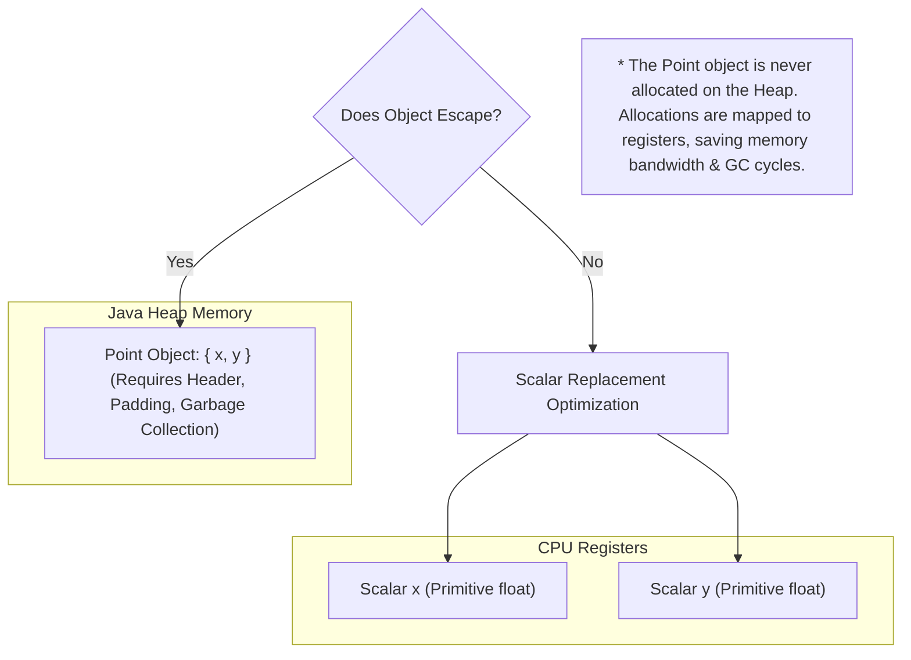

# Module 07: JIT Compilation & Code Cache — Tiered Compilation and Escape Analysis

Welcome back, students. Today we analyze the virtual compiler that turns Java bytecode into native machine code: the **Just-in-Time (JIT) Compiler**.

Many developers believe that Java is slow because it is "interpreted." In modern JVMs, this is false. The HotSpot engine continuously monitors execution paths. When a method becomes "hot," it compiles it directly into optimized native assembly instructions. We will study **Tiered Compilation (C1/C2)**, master **Method Inlining**, explore **Escape Analysis** and **Scalar Replacement**, and analyze a microbenchmark measuring JIT optimizations.

---

## 1. Academic Lecture: The Tiered Compiler Architecture

When the JVM boots, it starts in **Interpreted Mode** (Level 0). The JVM reads bytecode instruction-by-instruction and translates it to machine commands. 

As code runs, the JVM counts method invocations and loop backedges. When counts exceed thresholds, the JVM initiates **Tiered Compilation**, transitioning code through 5 compilation levels:

```
[ L0: Interpreted ] ---> [ L3: C1 Compiler (with Profiling) ] ---> [ L4: C2 Compiler (Full Optimization) ]
                                 |                                           |
                         (Deoptimization) <----------------------------------+
```

*   **Level 0 (Interpreted)**: Quick boot, slow execution.
*   **Level 1 (Simple C1)**: Compiles bytecode to machine code immediately without gathering profiling data.
*   **Level 2 (Limited C1)**: Compiles with basic profiling checks.
*   **Level 3 (Full C1)**: Compiles with detailed profiling instrumentation (tracking branch directions, object types).
*   **Level 4 (C2 Compiler)**: The Server compiler. It reads the profiling data collected by Level 3 and executes global optimization passes, producing native assembly.

### Method Inlining

Method inlining is the parent of all JIT optimizations. When a method is inlined, the C2 compiler replaces a method invocation call (which requires creating a stack frame, jumping instructions, and returning) with the actual bytecode of the target method.
*   **Thresholds**: G1/C2 compilers inline methods if their bytecode size is small.
    *   *Hot methods*: Inlined if size is less than 325 bytes (`-XX:MaxInlineLevel=9`).
    *   *Frequent methods*: Inlined if size is less than 35 bytes (`-XX:MaxInlineSize=35`).

### Escape Analysis and Scalar Replacement

**Escape Analysis** is a C2 compiler check to determine if an object allocation escapes the scope of the method that created it. 

An object **escapes** if it is:
1.  Returned from the method.
2.  Stored in a static field or instance field of another escaping object.
3.  Passed as an argument to another method that cannot be inlined.

If the C2 compiler determines that an object does **not** escape, it executes **Scalar Replacement**:



The C2 compiler decomposes the object into its primitive fields (scalars) and maps them directly to CPU registers or stack fields. **The object is never allocated on the heap.** This eliminates allocation latency and garbage collection workload.

---

## 2. Theory vs. Production Trade-offs

### The Warm-up Period vs. Startup Latency
JIT compilation takes time. When a Java container boots, its performance is initially poor (interpreted execution) and CPU usage spikes as compilation thread pools compile code.
*   **Production Challenge**: In Serverless (AWS Lambda) or micro-service auto-scaling environments, startup speed is critical. "Cold starts" degrade latency.
*   **Solution**: Tune Tiered Compilation flags or use **Ahead-of-Time (AOT) compilation** (such as GraalVM Native Image) to compile Java code to binary during build time, sacrificing runtime JIT dynamic optimization.

---

## 3. How to Use: Observing Escape Analysis in Java 21

Let's write a compile-grade Java 21 class that runs a tight loop allocating small objects. You will toggle Escape Analysis to observe the performance difference.

```java
package com.capstone.jvm.jit;

import java.util.logging.Logger;

/**
 * Microbenchmark demonstrating Escape Analysis and Scalar Replacement.
 * Compare performance and GC allocation spikes by running this JVM with:
 * 1. Escape Analysis ON (Default Java behaviour):
 *    java -XX:+DoEscapeAnalysis -Xms64m -Xmx64m -Xlog:gc -jar app.jar
 * 2. Escape Analysis OFF:
 *    java -XX:-DoEscapeAnalysis -Xms64m -Xmx64m -Xlog:gc -jar app.jar
 */
public class EscapeAnalysisBenchmark {
    private static final Logger LOGGER = Logger.getLogger(EscapeAnalysisBenchmark.class.getName());
    private static final int ITERATIONS = 100_000_000;

    // Simple container class
    static class Coordinate {
        int x;
        int y;

        Coordinate(int x, int y) {
            this.x = x;
            this.y = y;
        }
    }

    public static void main(String[] args) {
        LOGGER.info("Starting JIT Escape Analysis Benchmark...");

        long startTime = System.currentTimeMillis();
        long sum = 0;

        for (int i = 0; i < ITERATIONS; i++) {
            // Coordinate object is created locally and does NOT escape this loop block
            Coordinate coord = new Coordinate(i, i * 2);
            sum += coord.x + coord.y;
        }

        long duration = System.currentTimeMillis() - startTime;
        LOGGER.info("Sum: " + sum);
        LOGGER.info("Execution Time: " + duration + " ms");
    }
}
```

---

## 4. Common Errors & Pitfalls

### Pitfall 1: Megamorphic Call sites (Inlining Failure)
Exposing polymorphic interfaces with three or more concrete implementations.
*   **Why it fails**: When C2 compiles a call `interface.method()`, if it observes only one implementation (Monomorphic), it inline it. If it sees two implementations (Bimorphic), it compiles a conditional branch. If it sees three or more implementations (Megamorphic), it gives up and executes a slow virtual lookup tables index call.
*   **Mitigation**: Minimize polymorphic implementations on high-performance hot paths.

### Pitfall 2: Overly Large Methods
Writing long, monolithic methods containing thousands of lines.
*   **Symptom**: High CPU usage and slow execution times.
*   **Why**: The JIT compiler refuses to compile methods that exceed the size limit (typically 8000 bytes of code). The method remains interpreted forever.
*   **Mitigation**: Decompose code into small, focused helper methods that compile and inline easily.

---

## 5. Socratic Review Questions

### Question 1
Explain why an object that is passed to a method *outside* the allocating class can still benefit from Scalar Replacement. Under what condition is this possible?

#### Answer
An object passed to another method can still benefit from Scalar Replacement if the JVM compiler **inlines** the target method call.

If the receiving method is inlined, the target method's instructions are embedded directly into the caller. The compiler can now analyze the combined method boundary. If the object does not escape the boundary of the merged caller/callee context, the compiler declares it non-escaping. It bypasses the heap allocation and performs Scalar Replacement. If the target method cannot be inlined (e.g. it is too large or represents a megamorphic interface), the compiler must assume the object escapes, forcing a heap allocation.

### Question 2
What occurs during a **Deoptimization** event in Tiered Compilation? When does C2 deoptimize code?

#### Answer
Deoptimization is the process of reverting compiled native machine code (Level 4 C2) back to interpreted execution (Level 0) or low-level C1 compilation.

C2 performs optimizations based on optimistic assumptions from Level 3 profiling data. For instance, if profiling shows that a branch condition `if (errorState)` was never entered, C2 compiles the path assuming the branch is dead. 

If the application state changes and the branch is suddenly entered, the compiled machine code hits an invalid trap. The JVM immediately rolls back the execution frame, restores the local stack variables, drops the native code, and returns to interpreted mode. The compiler then recalculates compiling metrics and recompiles the code with the new branch data.

---

## 6. Hands-on Challenge: Escape Analysis Simulator

### The Challenge
In this challenge, you will implement the logic for a static escape analyzer simulator. 

Given an allocation statement, you must analyze a list of execution events to determine if the allocated object "escapes" the method scope.

The object escapes if:
1.  An event of type `"RETURN"` references the object.
2.  An event of type `"FIELD_ASSIGN"` assigns the object to a global target.
3.  An event of type `"METHOD_PASS"` passes the object to a non-inlined method.

Complete the analysis logic inside the class below:

```java
package com.capstone.jvm.jit.challenge;

import java.util.List;

public class EscapeAnalyzerSimulator {

    public record ExecutionEvent(String eventType, String targetId) {}

    /**
     * Determines if the allocated object escapes its local scope.
     * 
     * @param objectId the ID of the allocated object
     * @param events list of execution events inside the method
     * @return true if the object escapes, false if it is eligible for scalar replacement.
     */
    public boolean doesObjectEscape(String objectId, List<ExecutionEvent> events) {
        // TODO: Complete this implementation.
        // 1. Iterate over events.
        // 2. Check if eventType is "RETURN" and targetId equals objectId.
        // 3. Check if eventType is "FIELD_ASSIGN" and targetId equals objectId.
        // 4. Check if eventType is "METHOD_PASS" and targetId equals objectId.
        // If any of these match, the object escapes (returns true).
        return false;
    }
}
```

Write your code and verify the escape classification rules. Save your solution notes inside `modules/07-jit-compilation-code-cache.md`.
