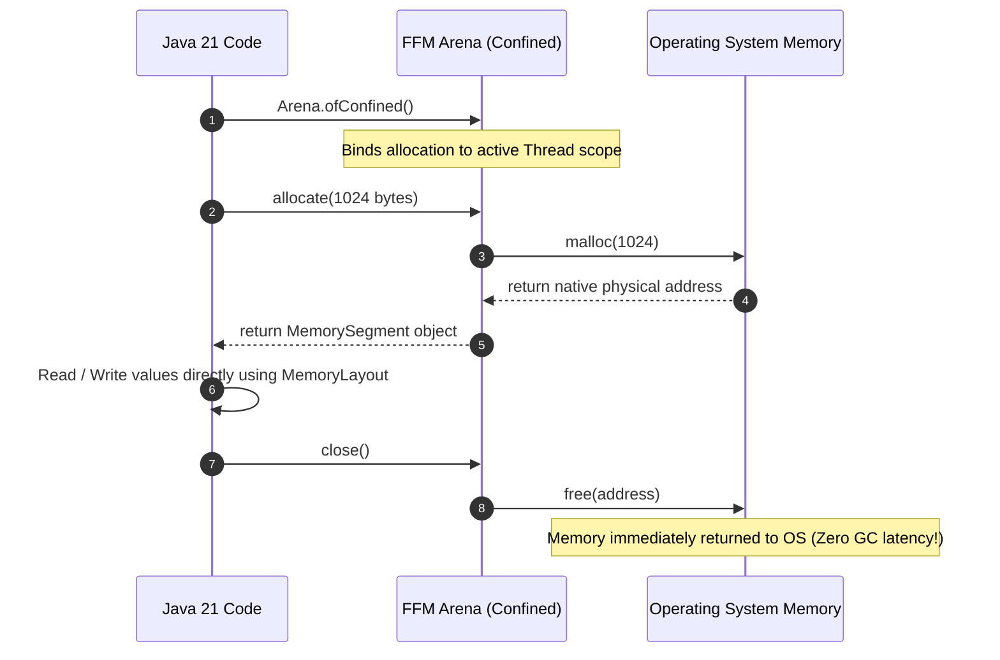

# Module 09: Off-Heap Memory & Native Tracking — Project Panama and Native Diagnostics

Welcome back, students. Today we step outside the boundaries of the Java Heap and analyze **Off-Heap Memory Management**.

By default, Java objects reside on the heap, managed by the Garbage Collector. However, for high-performance systems (such as databases, messaging brokers, or netty network servers), heap memory introduces constraints: GC pause overhead on massive datasets, and the need to copy memory buffers when writing to network sockets (adding double-buffer overhead). We will study **Direct ByteBuffers**, check the low-level `sun.misc.Unsafe` API, master Java 21's new **Foreign Function & Memory API (Project Panama)**, and diagnose off-heap memory using **Native Memory Tracking (NMT)**.

---

## 1. Academic Lecture: The Mechanics of Native Memory

Off-heap memory (or Native Memory) is memory allocated inside the JVM's process space but outside the boundaries of the managed Java Heap.

```
+-------------------------------------------------------------+
|                     JVM PROCESS SPACE                       |
|                                                             |
|  +---------------------------+  +------------------------+  |
|  |         Java Heap         |  |   Native Memory (OS)   |  |
|  |                           |  |                        |  |
|  |  [ Eden ] [ Surv ] [ Old ] |  |  [ Direct ByteBuffers] |  |
|  |  (Managed by GC)          |  |  [ Panama Arenas ]     |  |
|  +---------------------------+  +------------------------+  |
+-------------------------------------------------------------+
```

### Why Bother with Off-Heap Memory?

1.  **Zero-Copy I/O**: When writing data from the Java heap to a socket or disk channel, the OS cannot read directly from the heap because the GC might move the object mid-write. The JVM must first copy the data from the heap into a temporary native buffer, and then call the OS write command. By allocating data off-heap directly, we bypass this intermediate copy, executing **Zero-Copy** transfers.
2.  **GC Pause Avoidance**: Garbage collectors sweep objects on the heap. If you store 10GB of cache entries off-heap, the GC is completely unaware of them. It only scans the small on-heap references, keeping GC pause times low regardless of cache size.

### The Evolution of Java Off-Heap APIs

#### 1. Direct ByteBuffers
Allocated using `ByteBuffer.allocateDirect(size)`. 
*   **Limitation**: Cleaned up asynchronously by Java finalizers or phantom references (via `Cleaner`), which can be slow to run, leading to native memory starvation.

#### 2. `sun.misc.Unsafe`
Provides direct C-style memory functions: `unsafe.allocateMemory()`, `freeMemory()`, and direct address offsets pointer updates.
*   **Limitation**: Unsafe. Getting a memory address wrong can trigger a JVM segmentation fault, immediately crashing the process without throwing exceptions or generating stack traces.

#### 3. Foreign Function & Memory API (FFM / Project Panama)
Introduced in modern Java (formalized in Java 22, preview in Java 21). It replaces `Unsafe` with a type-safe, performant interface:
*   **`Arena`**: Manages the lifecycle of off-heap memory allocations.
*   **`MemorySegment`**: Represents a contiguous region of native memory.
*   **`SegmentAllocator`**: Coordinates memory allocations.



### Native Memory Tracking (NMT)

To track off-heap memory, standard JProfiler or visual JVM heaps graphs are useless because they only check the Java Heap. We must use **Native Memory Tracking (NMT)**.

To activate NMT, append this flag during startup:
```bash
-XX:NativeMemoryTracking=summary
```

You can then query the native memory breakdown using `jcmd`:
```bash
# Print summary of native allocations
jcmd <PID> VM.native_memory

# Establish a baseline and diff allocations to find memory leaks
jcmd <PID> VM.native_memory baseline
# (Wait for memory growth)
jcmd <PID> VM.native_memory detail.diff
```
NMT will display allocation breakdown categories: `Java Heap`, `Class` (Metaspace), `Thread` (Stacks), `Internal`, and `Symbol`.

---

## 2. Theory vs. Production Trade-offs

### JVM Memory Limits vs. OS OOM Killer
If you configure `-Xmx8g` on a server with 16GB of physical RAM, you assume the application cannot consume more than 8GB. 
*   **The OS Hazard**: If your code allocates 9GB of off-heap memory (via Direct ByteBuffers or JNI), the total process footprint will grow to $8\text{GB (Heap)} + 9\text{GB (Off-heap)} + 1\text{GB (Metaspace/Threads)} = 18\text{GB}$.
*   Because this exceeds the physical 16GB RAM limit, the Linux kernel's **OOM Killer** will immediately terminate the Java process. The JVM crashes without leaving any heap dumps or error logs, making troubleshooting difficult.

---

## 3. How to Use: Project Panama Off-Heap Allocator in Java 21

Let's write a complete, compile-grade Java 21 class that allocates native off-heap memory using the modern Foreign Function & Memory API, writes values, and releases the scope cleanly.

```java
package com.capstone.jvm.panama;

import java.lang.foreign.Arena;
import java.lang.foreign.MemorySegment;
import java.lang.foreign.ValueLayout;
import java.util.logging.Logger;

/**
 * Class demonstrating safe off-heap memory allocation using Java 21 FFM API.
 * Tracks allocations and handles releases cleanly using Arena closures.
 */
public class OffHeapPanamaManager {
    private static final Logger LOGGER = Logger.getLogger(OffHeapPanamaManager.class.getName());

    public static void main(String[] args) {
        LOGGER.info("Starting Project Panama Off-Heap Manager...");

        // Allocate memory inside a 'confined' Arena. 
        // Confined Arenas restrict access to the thread that created it.
        try (Arena arena = Arena.ofConfined()) {
            LOGGER.info("Allocating 1024 bytes of off-heap native memory...");
            
            // Allocate a contiguous memory segment of 1024 bytes
            MemorySegment segment = arena.allocate(1024);

            // Write primitive values directly to the native memory address using offsets
            long offset = 0;
            segment.setAtIndex(ValueLayout.JAVA_INT, offset, 42);          // Index 0 (Bytes 0-3)
            segment.setAtIndex(ValueLayout.JAVA_INT, offset + 1, 9901);    // Index 1 (Bytes 4-7)
            segment.setAtIndex(ValueLayout.JAVA_DOUBLE, 1, 230.90);        // Index 1 (Bytes 8-15)

            // Read the values back from native memory
            int val1 = segment.getAtIndex(ValueLayout.JAVA_INT, 0);
            int val2 = segment.getAtIndex(ValueLayout.JAVA_INT, 1);
            double val3 = segment.getAtIndex(ValueLayout.JAVA_DOUBLE, 1);

            LOGGER.info("Read Val1 (Int): " + val1);
            LOGGER.info("Read Val2 (Int): " + val2);
            LOGGER.info("Read Val3 (Double): " + val3);

            // Memory is automatically released here when the try-with-resources closes the Arena
            LOGGER.info("Closing Arena. Memory segment immediately freed from OS.");
        } catch (Exception e) {
            LOGGER.severe("Exception managing off-heap memory: " + e.getMessage());
        }
    }
}
```

---

## 4. Common Errors & Pitfalls

### Pitfall 1: Direct ByteBuffer Leak (System GC Dependency)
If you allocate Direct ByteBuffers, they are only garbage collected when the Java reference object is cleaned up.
*   **Why it fails**: If the heap is mostly empty, the JVM will not run garbage collection. However, the native off-heap memory can be full of un-cleared buffers.
*   **Mitigation**: Avoid relying on automatic collection of direct buffers. Use explicit `Arena` closures, or configure `-XX:MaxDirectMemorySize` to force GC sweeps when direct allocations hit limits.

### Pitfall 2: Segmentation Fault JVM Crashes
Using raw pointers (such as calling `Unsafe.freeMemory(address)` twice, or writing to an address that was already freed).
*   **Symptom**: The JVM crashes instantly, producing a `hs_err_pid.log` file containing native thread dumps.
*   **Mitigation**: Restrict native allocations to safe FFM `Arena` closures. Bypassing `Unsafe` is the modern standard for JVM performance diagnostics.

---

## 5. Socratic Review Questions

### Question 1
Why does a Direct ByteBuffer write execute faster during I/O operations than a standard Heap ByteBuffer write?

#### Answer
A standard Heap ByteBuffer resides on the JVM heap. During write operations (e.g., transmitting data over a socket), the operating system's kernel requires a stable, physical memory address. Because the Java Garbage Collector can move heap objects concurrently during GC sweeps, the JVM cannot trust heap addresses during asynchronous I/O writes.

Therefore, when you write a heap buffer:
1.  The JVM allocates a temporary native memory buffer off-heap.
2.  It copies the data from the heap buffer to the native buffer.
3.  It passes the native buffer address to the OS socket.
This copy operation consumes CPU cycles. By using a **Direct ByteBuffer**, the memory is allocated directly off-heap in native process space, enabling the JVM to pass the address directly to the OS write command without intermediate copying, achieving **Zero-Copy** performance.

### Question 2
Explain how Native Memory Tracking (NMT) differentiates class metadata allocations from standard heap allocations.

#### Answer
Native Memory Tracking (NMT) intercepts allocations by hooking into the JVM's internal allocation routines (`os::malloc`, `mmap`).

When NMT tracks process memory, it classifies allocations into logical categories based on internal tags:
*   **`Java Heap`**: Memory allocated for standard Java object instances.
*   **`Class`**: Memory allocated for loaded Java Class metadata, representing the **Metaspace**.
*   **`Thread`**: Memory consumed by thread stacks (each active thread stack consumes 1MB by default).
By inspecting the diff between NMT snapshots (`VM.native_memory detail.diff`), performance engineers can identify whether a memory leak is caused by class loading bloat (Metaspace leak) or native direct buffer expansion.

---

## 6. Hands-on Challenge: Off-Heap Buffer Leak Detector

### The Challenge
In this challenge, you will implement a simplified Off-Heap Allocation Tracker. 

To prevent native leaks, every allocation segment must be closed. You must write an allocator manager that tracks active segment IDs. If a segment is not closed and the allocator is shut down, you must generate a warning showing the leaked byte size.

Complete the tracking logic inside the class below:

```java
package com.capstone.jvm.panama.challenge;

import java.util.HashMap;
import java.util.Map;

public class NativeAllocationTracker {

    private final Map<String, Long> activeAllocations = new HashMap<>();
    private long totalLeakedBytes = 0L;

    /**
     * Registers an allocation in the tracker.
     */
    public synchronized void recordAllocation(String segmentId, long sizeBytes) {
        activeAllocations.put(segmentId, sizeBytes);
    }

    /**
     * Registers the release of an allocation.
     */
    public synchronized void recordRelease(String segmentId) {
        activeAllocations.remove(segmentId);
    }

    /**
     * Shuts down the tracker. Calculates total leaked bytes from activeAllocations
     * and returns true if a memory leak was detected.
     */
    public synchronized boolean shutdownAndCheckLeaks() {
        // TODO: Complete this implementation.
        // 1. Iterate over activeAllocations values.
        // 2. Sum the bytes of any un-released allocations.
        // 3. Set totalLeakedBytes to this sum.
        // 4. Return true if totalLeakedBytes > 0.
        return false;
    }

    public long getTotalLeakedBytes() {
        return totalLeakedBytes;
    }
}
```

Write your code and verify the native leak detection. Save your solution notes inside `modules/09-off-heap-memory-direct-buffers.md`.
