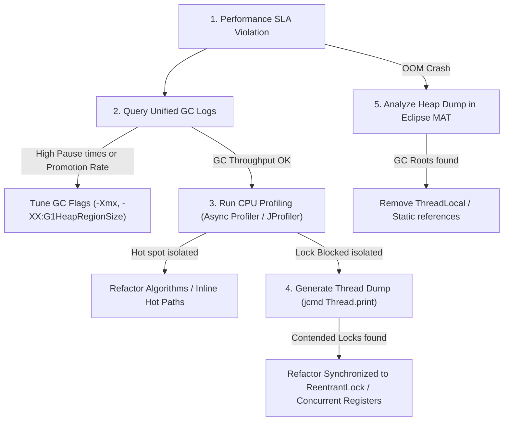

# Module 10: Final Capstone Project — Production Diagnostics and System Optimization

Welcome to the **Final Capstone Project** for CS-515.

Over the past nine modules, we have built the JVM systems engineering foundation, covering false sharing, G1 GC regional structures, low-latency collectors (ZGC), Unified Logging metrics, Eclipse MAT heap dump analysis, non-safepoint CPU profiling (Async Profiler), JIT compilation limits, thread synchronization dumps, and off-heap memory allocations (FFM API).

In this final capstone project, you will act as a **Lead Performance Architect** tasked with troubleshooting, profiling, and optimizing a high-latency, memory-leaking backend application.

---

## 1. Capstone Diagnostics Workflow

You are presented with a web server application that experiences progressive slowdowns, high CPU usage, and eventual crashes (`OutOfMemoryError`) under production traffic.

To resolve these bottlenecks, you will apply the performance pipeline:



1.  **Analyze GC Logs**: Audit `-Xlog:gc` to calculate throughput and check for humongous allocations.
2.  **Profile CPU Cycles**: Generate a Flame Graph using Async Profiler to identify execution hotspots.
3.  **Inspect Thread Dumps**: Query thread status to locate lock contention and carrier thread pinning.
4.  **Trace Memory Leaks**: Load the generated `.hprof` heap dump into Eclipse MAT to locate the leak suspects.

---

## 2. Capstone Implementation: Optimization Sandbox Server

Let's write the complete, compile-grade Java 21 class representing the **Performance Sandbox Server**. This class compiles all the CPU, Memory, and Locking bottlenecks we studied in previous modules, serving as a live practicing target.

```java
package com.capstone.jvm.capstone;

import java.util.*;
import java.util.concurrent.*;
import java.util.concurrent.locks.ReentrantLock;
import java.util.logging.Logger;

/**
 * Capstone Performance Sandbox Server containing multiple target bottlenecks:
 * 1. CPU Hotspot: Continual string allocations and hashing.
 * 2. Lock Contention: Contested synchronizations on a single global cache map.
 * 3. Memory Leak: A static queue that forgets to prune references.
 * 
 * Practice profiling and optimizing this application using VisualVM, MAT, and GC logs.
 */
public class PerformanceSandboxServer {
    private static final Logger LOGGER = Logger.getLogger(PerformanceSandboxServer.class.getName());

    private final Map<String, String> sessionCache = new ConcurrentHashMap<>();
    private final List<byte[]> memoryLeakQueue = new ArrayList<>();
    private final ReentrantLock cacheLock = new ReentrantLock();

    public static void main(String[] args) throws InterruptedException {
        LOGGER.info("Starting Capstone Performance Sandbox Server...");
        PerformanceSandboxServer server = new PerformanceSandboxServer();

        ExecutorService threadPool = Executors.newFixedThreadPool(8);

        // Task A: High CPU load
        threadPool.submit(server::executeCpuHeavyTask);

        // Task B: High Lock Contention
        for (int i = 0; i < 4; i++) {
            threadPool.submit(server::executeLockContendedTask);
        }

        // Task C: Progressive Memory Leak
        threadPool.submit(server::executeMemoryLeakTask);

        // Run sandbox for 1 minute before shutdown
        TimeUnit.MINUTES.sleep(1);
        threadPool.shutdownNow();
        LOGGER.info("Sandbox Server execution complete.");
    }

    /**
     * Simulation of a high CPU workload.
     */
    public void executeCpuHeavyTask() {
        long counter = 0;
        while (!Thread.currentThread().isInterrupted()) {
            // Hot allocation path. Incurs C1/C2 compiler JIT load
            String data = "UserSessionPayloadBlock-" + counter + "-" + UUID.randomUUID();
            int hash = data.hashCode();
            counter++;
            if (counter % 1_000_000 == 0) {
                LOGGER.fine("CPU Task running. Current count: " + counter);
            }
        }
    }

    /**
     * Simulation of high Lock Contention.
     */
    public void executeLockContendedTask() {
        while (!Thread.currentThread().isInterrupted()) {
            cacheLock.lock();
            try {
                // Contested critical section. Blocks competing threads.
                sessionCache.put(UUID.randomUUID().toString(), "CachedSessionMetadata");
                if (sessionCache.size() > 1000) {
                    sessionCache.clear();
                }
                Thread.sleep(10); // Hold lock to exacerbate contention
            } catch (InterruptedException e) {
                Thread.currentThread().interrupt();
            } finally {
                cacheLock.unlock();
            }
            
            // Wait briefly before re-acquiring
            try {
                Thread.sleep(2);
            } catch (InterruptedException e) {
                Thread.currentThread().interrupt();
            }
        }
    }

    /**
     * Simulation of a progressive memory leak.
     */
    public void executeMemoryLeakTask() {
        while (!Thread.currentThread().isInterrupted()) {
            try {
                // Allocate 200KB chunk
                byte[] leakChunk = new byte[200_000];
                
                // Add to static/instance collection without eviction (GC Root reference leak)
                synchronized (memoryLeakQueue) {
                    memoryLeakQueue.add(leakChunk);
                }

                TimeUnit.MILLISECONDS.sleep(100);
            } catch (InterruptedException e) {
                Thread.currentThread().interrupt();
            }
        }
    }
}
```

---

## 3. Common Errors & Pitfalls

### Pitfall 1: Fixing Symptoms instead of Roots
Increasing heap size (`-Xmx`) to resolve a memory leak.
*   **Why it fails**: If the application contains a reference leak (e.g., in a static collection), increasing heap size from 2GB to 8GB does not fix the bug; it only delays the crash. The JVM will still fail with OutOfMemoryError after a longer duration, and the resulting heap dump file will be 4x larger and harder to parse.
*   **Mitigation**: Always profile heap dumps in MAT to isolate the referencing classloader root before adjusting memory parameters.

### Pitfall 2: Over-tuning JVM compiler Flags
Using dozens of exotic C2 compiler optimizations flags in production scripts.
*   **Symptom**: Unstable runtime execution or JVM segmentation faults.
*   **Mitigation**: Rely on the default Tiered Compilation rules. Only override flags (like inlining levels) after verifying performance improvements using microbenchmarks under controlled staging.

---

## 4. Socratic Review Questions

### Question 1
In the Sandbox Server, Task B uses a `ReentrantLock` instead of a `synchronized` block. Why is this choice critical if this application is migrated to use Java 21 **Virtual Threads**?

#### Answer
If Task B utilized a `synchronized` block, calling `Thread.sleep(10)` while holding the lock would pin the Virtual Thread to its physical platform (Carrier) thread. 

Because the Carrier thread pool size is equal to the number of physical CPU cores (e.g., 8 cores = 8 threads), having 8 concurrent threads block inside synchronized locks would pin all Carrier threads. 

No other Virtual Threads could be scheduled, freezing the entire application. Replacing `synchronized` with `ReentrantLock` allows the Virtual Thread to unmount from the Carrier thread during the block, letting the Carrier thread process other Virtual Tasks, preventing pool starvation.

### Question 2
How do you distinguish between high CPU utilization caused by **Garbage Collection activity** and high CPU utilization caused by **Business Logic calculations** using Unified GC Logs and CPU Profilers?

#### Answer
1.  **Unified GC Logs**: Calculate the GC **Throughput** percentage. If throughput is low (e.g., 70%), it means the JVM spends 30% of its CPU cycles running garbage collection algorithms. This indicates a memory promotion or allocation rate bottleneck.
2.  **CPU Profiler (Flame Graphs)**: Inspect the leaf methods. If the wide blocks represent JVM functions like `G1ParScanThreadKeepAliveClosure` or `ZGC_Worker`, the CPU is consumed by garbage collection. If the wide blocks represent application methods (like `MessageDigest.update` or `UUID.randomUUID`), the CPU is consumed by business logic calculations.

---

## 5. Hands-on Challenge: Building a Memory Analyzer Suspect Locator

### The Challenge
In this challenge, you will implement the logic for a Heap Analyzer suspect matcher. 

Given a map of classes and their count of instantiated objects, you must calculate the total memory consumed by each class (using a weight mapping, e.g., `byte[]` object consumes 100 bytes on average, `String` consumes 24 bytes). If the total memory of a class exceeds 50% of the simulated heap boundary (e.g., 2000 bytes), you must return that class name as the primary Leak Suspect.

Complete the suspect identification logic inside the class below:

```java
package com.capstone.jvm.capstone.challenge;

import java.util.HashMap;
import java.util.Map;

public class LeakSuspectLocator {

    private final Map<String, Integer> classMemoryWeights = new HashMap<>();

    public LeakSuspectLocator() {
        // Size mapping in bytes per instance
        classMemoryWeights.put("byte[]", 1); // Exact count represents bytes
        classMemoryWeights.put("String", 24);
        classMemoryWeights.put("Coordinate", 32);
    }

    /**
     * Analyzes class counts and returns the class name representing the memory leak suspect.
     * Returns "HEALTHY" if no class exceeds 50% of the heap limit.
     */
    public String identifyLeakSuspect(Map<String, Integer> instanceCounts, long heapLimitBytes) {
        long limit = heapLimitBytes / 2;

        // TODO: Complete this implementation.
        // 1. Iterate over instanceCounts.
        // 2. Calculate memory for each class: count * classMemoryWeights.getOrDefault(className, 16).
        // 3. If memory > limit, return the className.
        // 4. If no class exceeds limit, return "HEALTHY".
        return "HEALTHY";
    }
}
```

Write your code and verify the leak classification rules. Save your solution notes inside `modules/10-final-capstone-performance-optimization.md`.
